\* Chapter 17: Creating The Profile Model
=========================================

1\. update

- Profile.js(models folder)

```js
//models/Profile.js

const mongoose = require('mongoose');
const Schema = mongoose.Schema;

//Create Schema
const ProfileSchema = new Schema({
    user:{
        /**this gonna associate the user by its ID */
        type: Schema.Types.ObjectId,
        /**we need to reference the collection that this refers to
         * because we can refer any collection
         * obviously the only other collection we have in our database is users
         * and that's what we wanna hear
         */
        ref: 'users'
    },
    handle: {
        type: String,
        /** The required prop can take a validation value, just like validations. 
         * This is to define what validation rule should define the input as required. 
         * By default that is required, required={true}
         * 
         * it's gonna be required even though we are doing our validation in our validation files
         * like we did here with the login.js and register.js 
         * so we will have one per profile as well
         * but we are still gonna mark it as required here*/
        required: true,
        /**max charactor is 40 */
        max: 40

        /**so we have kind of a double line of defense when it comes to validation 
         * we have validation we are gonna create in here and we have mongoose
         * but our validation(validation folder) will handle it much more elegantly 
         * and that's what we will use to basically send the errors to the front end and so on
        */
    },
    company: {
        type: String
    },
    website: {
        type: String
    },
    location: {
        type: String
    },
    status: {
        type: String,
        required: true
    },
    skills: {
        type: [String],
        required: true
    },
    bio: {
        type: String,
    },
    githubusername:{
        type: String,
    },
    experience: [
        {
            title: {
                type: String,
                required: true
            },
            company: {
                type: String,
                required: true
            },
            location: {
                type: String
            },
            from: {
                type: Date,
                required: true
            },
            to: {
                type: Date
                /**I'm not gonna make this 'required: true'
                 * because i want them to have a checkbox that says 'Current'
                 * it could be a job that they are still working at
                 * and in that case, on our profiles it's gonna say the from date dash now representing still working there
                 */
            },
            current: {
                type: Boolean,
                default: false
            },
            description:{
                type: String
            }
        }
    ],
    education: [
        {
            school: {
                type: String,
                required: true
            },
            degree: {
                type: String,
                required: true
            },
            fieldofstudy: {
                type: String,
                required: true
            },
            from: {
                type: Date,
                required: true
            },
            to: {
                type: Date
                /**I'm not gonna make this 'required: true'
                 * because i want them to have a checkbox that says 'Current'
                 * it could be a job that they are still working at
                 * and in that case, on our profiles it's gonna say the from date dash now representing still working there
                 */
            },
            current: {
                type: Boolean,
                default: false
            },
            description:{
                type: String
            }
        }
    ],
    social:{
        youtube: {
            type: String
        },
        twitter: {
            type: String
        },
        facebook: {
            type: String
        },
        linkedin: {
            type: String
        },
        instagram: {
            type: String
        }
    },
    date: {
        type: Date,
        /**Date.now will just automatically put in the current time stamp */
        default: Date.now 
    }
});

module.expors = Profile = mongoose.model('profile', ProfileSchema);

```

\* Chapter 18: Current User Profile Route
=========================================

1\. update

- profile.js(route/api folder)

2\. 

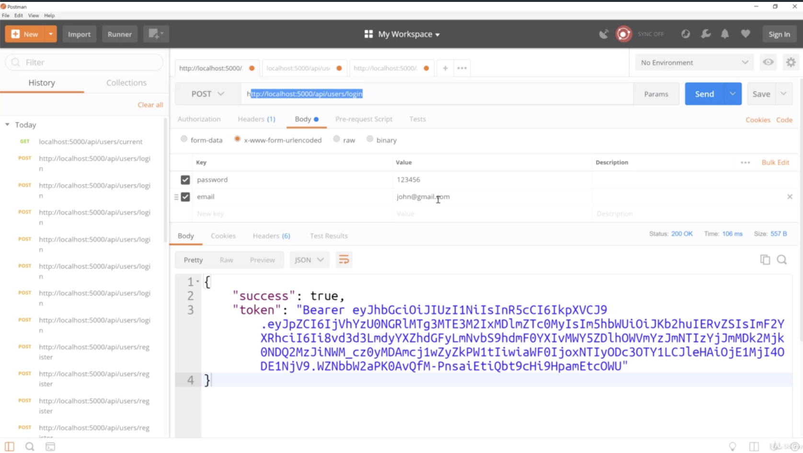

- if you don't have this tab, put in "http://localhost:5000/api/users/login"

- and then you can login someone that you registered

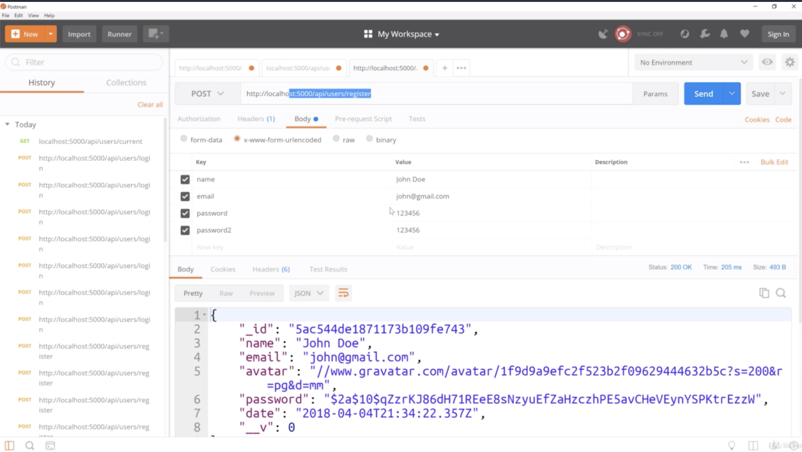

if you don't have user, then you go to "http://localhost:5000/api/users/register"

and then fill out name, email, password, password2

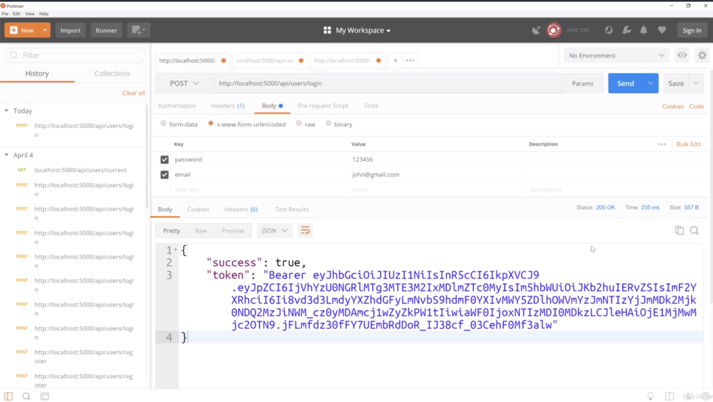

- picture 1 is already expired. So we click send and get a new token

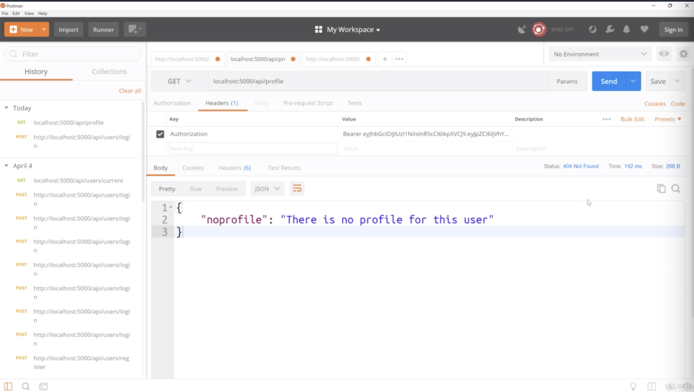

- and then grab that new token then go to "localhost:5000/api/profile"

- now this is what exactly we should be getting because we have not set up a profile 

- the way this app is gonna works is once you register, it will take you to your dashboard, but you are not gonna have profile yet

- what it will do is if you don't have a profile, if it gets this response which is 404, 

you are then gonna see a button or paragraph that says "you don't have a profile and then a button that says 'Create Profile'"

Then it will take you to the form

```js
//routes/api/profile.js

const express = require('express');
const router = express.Router();
const mongoose = require('mongoose');
/**it's gonna be a protected route that will get the current users profile
 * curren user meaning the user that's logged in at that time
 */
/**we are gonna use that for protected routes using passport */
const passport = require('passport');

/**Load Profile Model*/
const Profile = require('../../models/Profile');
/**Load User Profile */
const User = require('../../models/User');

/**you don't need to say '/api/profile/test'
 * because we already did in server.js 'app.use('/api/profile', profile);'
*/

/**res.json() is similar to res.send()
 * res.json() will automatically serve a status of 200 which means everything is OK
*/

/** @route             GET api/profile/test*/
/** @desc(description) Test profile route */
/** @access            Public */
router.get('/test', (req, res) => res.json({msg: "Profile Works"}));

/** @route             GET api/profile*/
/** @desc(description) Get current users profile */
/** @access            Private */

/**we just need only '/' because it's gonna be 'api/profile'
 * and since we are using the router, we are already linked 'api/profile' to this file
 */
/**it's gonna be a protected role.
 * we need to do passport.authenticate
 */
router.get('/', passport.authenticate('jwt', { session: false }), (req, res) => {
    /**we want to fetch the current user's profile
     * since we get this is protected, we are gonna get a token
     * that token is now gonna put the user in to req.user
    */
    /**findOne() is mongoose method */
    /** req.user.id is equal to Schema.Types.ObjectId
    * user:{
        type: Schema.Types.ObjectId,
        ref: 'users'
        },

    it depends on what users logged in to what ID is gonna be
    */

        /** initialize a variable called errors and set it to an empty object*/
        const errors = {};

        Profile.findOne({ user: req.user.id }).then(profile => {
            if(!profile){
                errors.noprofile = 'There is no profile for this user';
                return res.status(404).json(errors);
            }
            res.json(profile);
    }).catch(err => res.status(404).json(err));
});

module.exports = router;
```

\* Chapter 19: Create And Update Profile Routes
===============================================

1\. update

- profile.js(route/api folder)

```js
const express = require('express');
const router = express.Router();
const mongoose = require('mongoose');
/**it's gonna be a protected route that will get the current users profile
 * curren user meaning the user that's logged in at that time
 */
/**we are gonna use that for protected routes using passport */
const passport = require('passport');

/**Load Profile Model*/
const Profile = require('../../models/Profile');
/**Load User Profile */
const User = require('../../models/User');

/**you don't need to say '/api/profile/test'
 * because we already did in server.js 'app.use('/api/profile', profile);'
*/

/**res.json() is similar to res.send()
 * res.json() will automatically serve a status of 200 which means everything is OK
*/

/** @route             GET api/profile/test*/
/** @desc(description) Test profile route */
/** @access            Public */
router.get('/test', (req, res) => res.json({msg: "Profile Works"}));

/** @route             GET api/profile*/
/** @desc(description) Get current users profile */
/** @access            Private */

/**we just need only '/' because it's gonna be 'api/profile'
 * and since we are using the router, we are already linked 'api/profile' to this file
 */
/**it's gonna be a protected role.
 * we need to do passport.authenticate
 */
router.get('/', passport.authenticate('jwt', { session: false }), (req, res) => {
    /**we want to fetch the current user's profile
     * since we get this is protected, we are gonna get a token
     * that token is now gonna put the user in to req.user
    */
    /**findOne() is mongoose method */
    /** req.user.id is equal to Schema.Types.ObjectId
    * user:{
        type: Schema.Types.ObjectId,
        ref: 'users'
        },

    it depends on what users logged in to what ID is gonna be
    */

        /** initialize a variable called errors and set it to an empty object*/
        const errors = {};

        Profile.findOne({ user: req.user.id }).then(profile => {
            if(!profile){
                errors.noprofile = 'There is no profile for this user';
                return res.status(404).json(errors);
            }
            res.json(profile);
    }).catch(err => res.status(404).json(err));
    }
);

/** @route             POST api/profile*/
/** @desc(description) Create or Edit user profile */ //because this is also gonna be update route
/** @access            Private */

router.post('/', passport.authenticate('jwt', { session: false }),
(req, res) => {
    /**Get field */
    const profileFields = {};
    /**there's gonna be a couple of things that don't come from the form such as the user */
    profileFields.user = req.user.id;
    /**we are checking to see if the field that we are looking for has come in */
    if(req.body.handle) profileFields.handle = req.body.handle;
    if(req.body.company) profileFields.company = req.body.company;
    if(req.body.website) profileFields.website = req.body.website;
    if(req.body.location) profileFields.location = req.body.location;
    if(req.body.bio) profileFields.bio = req.body.bio;
    if(req.body.status) profileFields.status = req.body.status;
    if(req.body.githubusername) profileFields.githubusername = req.body.githubusername;
    /**Skills - Split into an array
     * because its coming as the comma separated values
     */
    if(typeof req.body.skills !== 'undefined'){
        /**that will now give us an array of skills to put into the database
         * as opposed to just the comma separated values
         */
        profileFields.skills = req.body.skills.split(',');
    }

    /** 'social' has its own object
    */
   /** we set this being empty
    * because if we try to add the profileFields.social without doing this,
    * it's gonna say profileFields.social doesn't exist
    */
    profileFields.social = {};
    if(req.body.youtube) profileFields.social.youtube = req.body.youtube;
    if(req.body.twitter) profileFields.social.twitter = req.body.twitter;
    if(req.body.facebook) profileFields.social.facebook = req.body.facebook;
    if(req.body.linkedin) profileFields.social.linkedin = req.body.linkedin;
    if(req.body.instagram) profileFields.social.instagram = req.body.instagram;
    /** req.user.id is 'logged in user' */
    Profile.findOne({ user: req.user.id })
        .then(profile => {
            if(profile) {
                /**update
                 * first parameter is gonna be who do we wanna update
                 * second parameter is gonna be
                */
                Profile.findOneAndUpdate(
                    { user: req.user.id },
                    { $set: profileFields },
                    { new: true }
                ).then(profile => res.json(profile));
            } else {
                /** Create */
                /** check to see if the handle exists
                 * because we don't want multiple handle
                 * handle is basically for SEO, it's to access the profile page and SEO friendly
                 */
                Profile.findOne({ handle: profileFields.handle })
                    .then(profile => {
                        if(profile){
                            errors.handle = 'That handle already exists';
                            res.status(400).json(errors);
                        }

                        /**Save Profile */
                        new Profile(profileFields).save().then(profile => res.json(profile));
                    })
            }
        })
});

module.exports = router;


```

\* Chapter 20: Profile Field Validations
========================================

1\. update

- profile.js(validation folder)

- profile.js(route/api folder)

2.

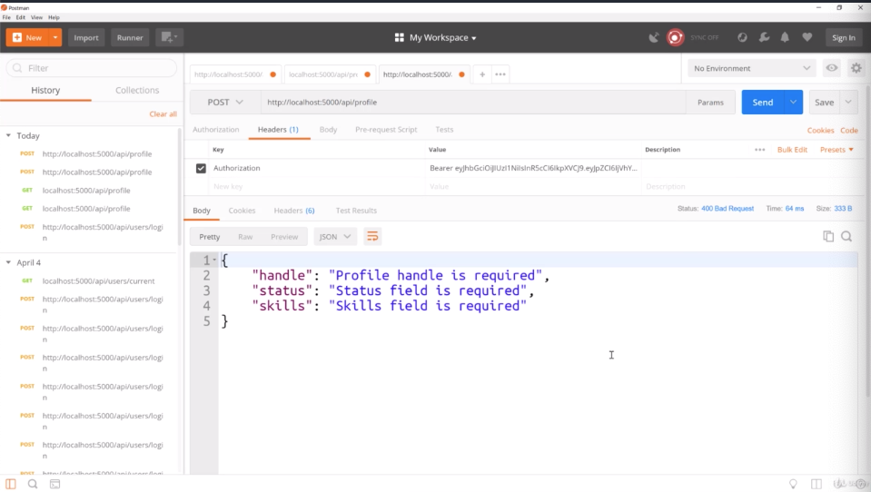

- that's the route to actually create a profile or update a profile

- this is happening because of that validation file we created

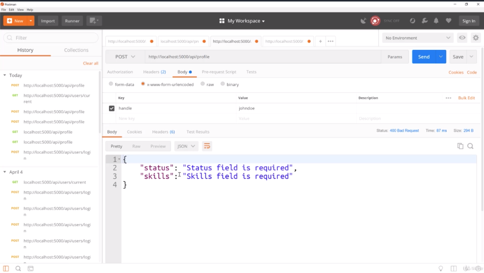

- we could just get the status and skills is required

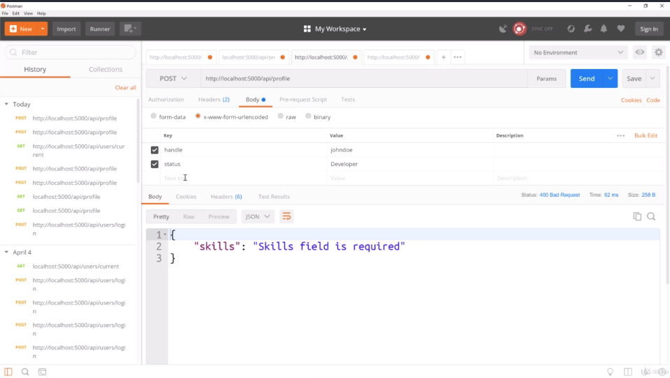

- we get that

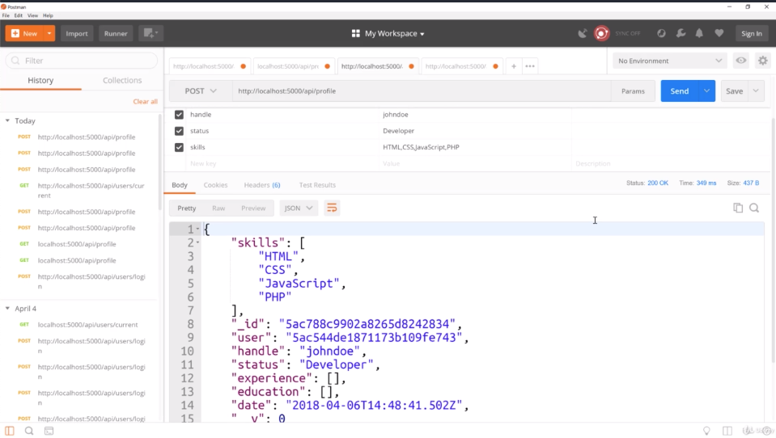

- we get profile back

- the stuff that we didn't include like bio, website, company is not here. it's not gonna be blank, it's not gonna be here

which is what we want because those are not required

- skills is now an array because of that logic that we added

- this same route, we can actually update our profile with. So i can just go ahead and add to this route

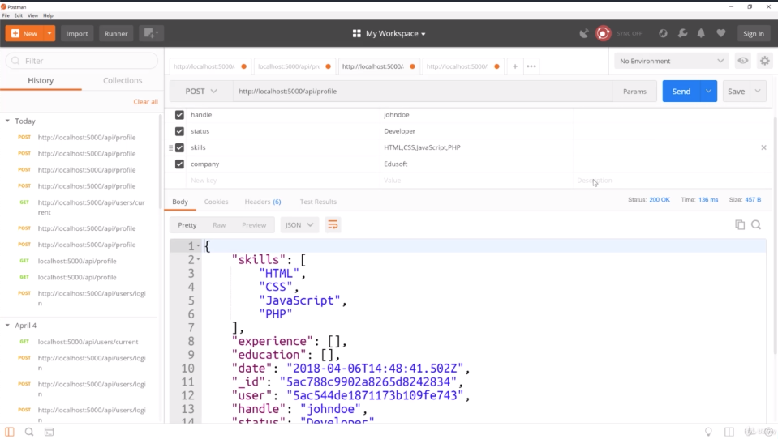

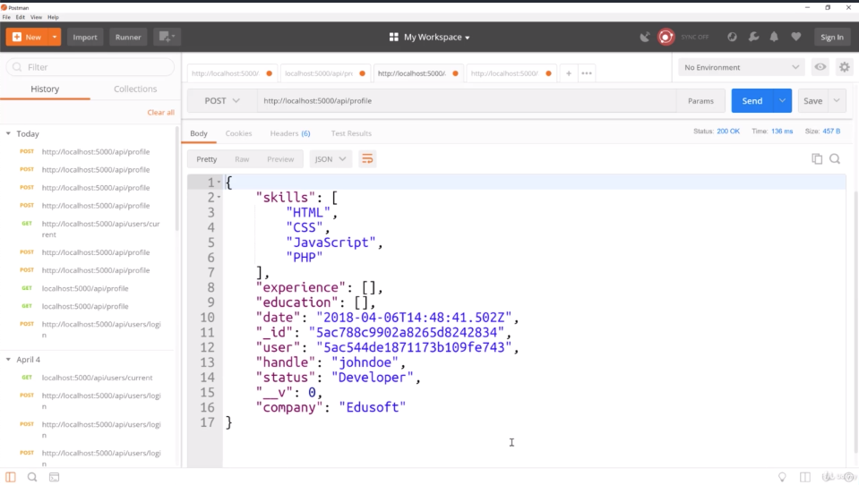

- we get company "Edusoft"

- So we can use this to create profiles and update if i wanted to add

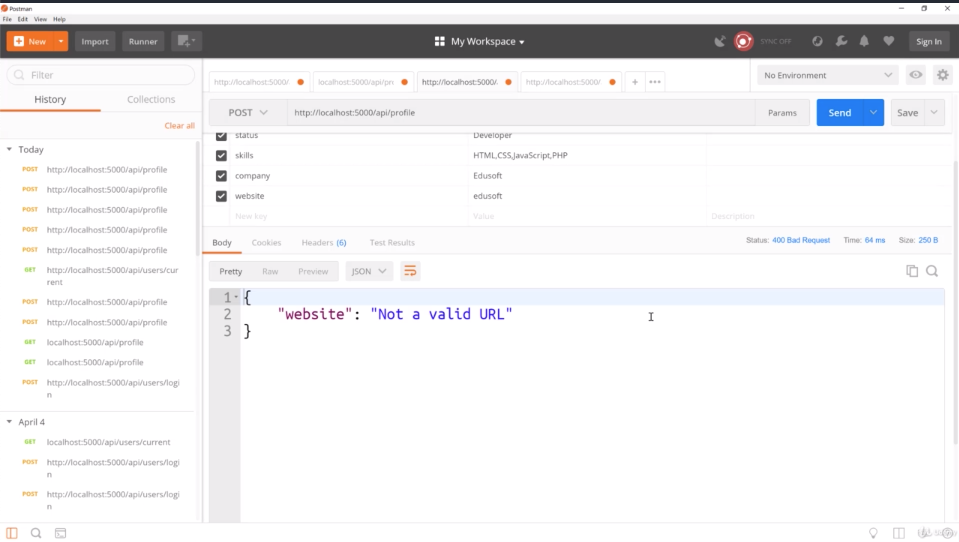

- this is where the error should come in if this isn't URL

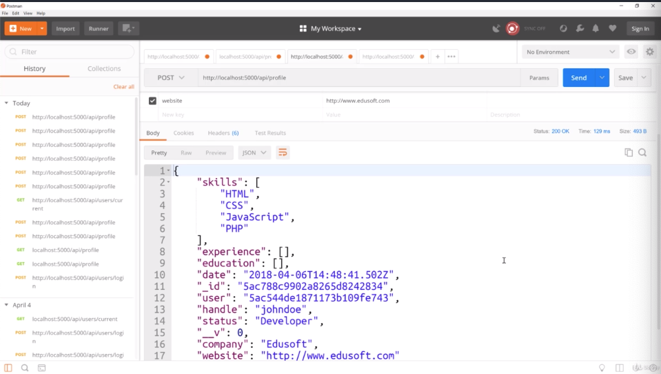

- there's no error if it is URL

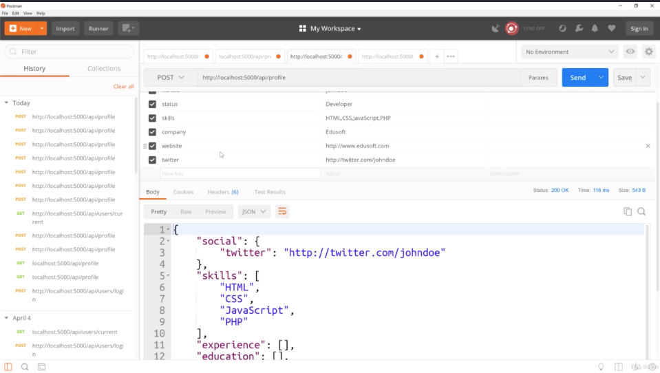

- it gets added to the social object

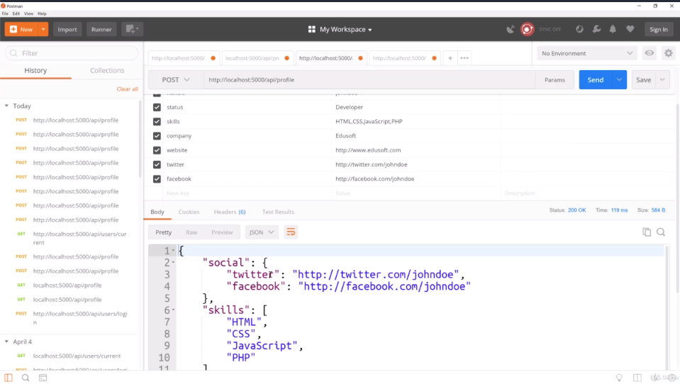

- facebook also put into the social object because that's how we constructed it in our model

------------------------------------------------------------------------------------------

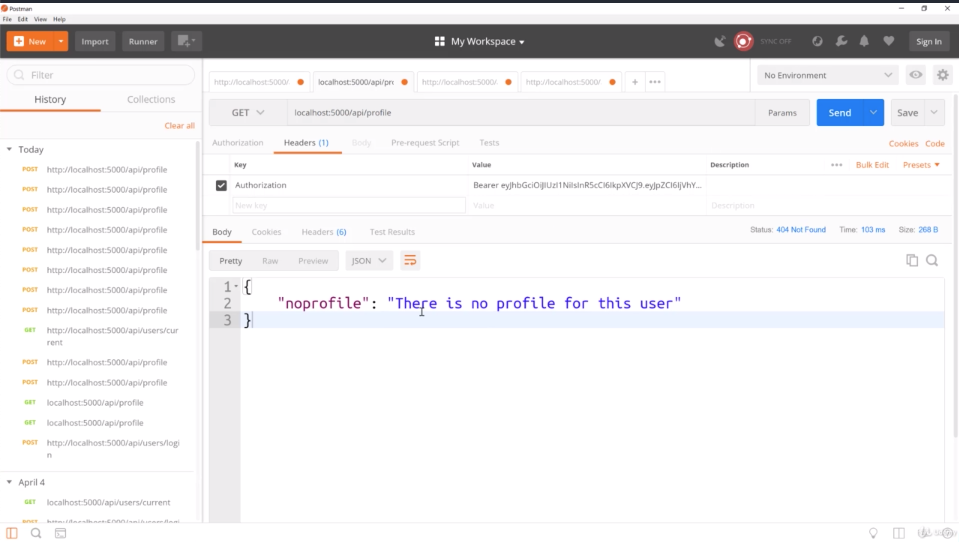

- if we have a checking to get our profile data because before we didn't have one 

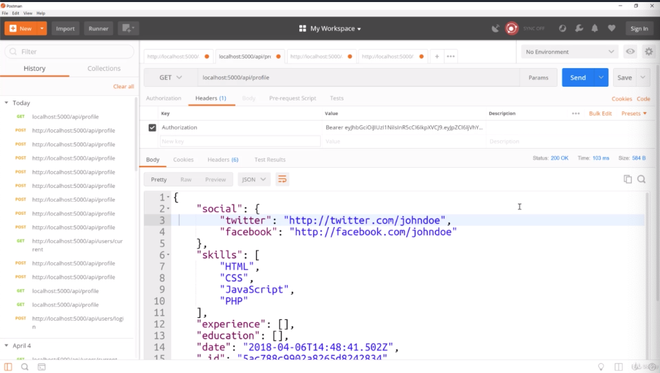

- if we send, we can get our profile

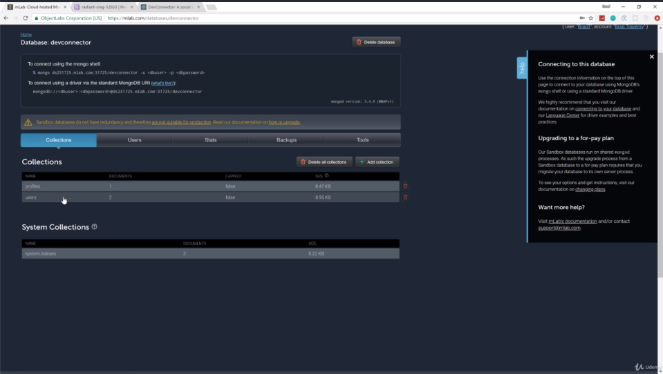

- if you wanna look at MongoDB, we have 2 collections now users and profiles

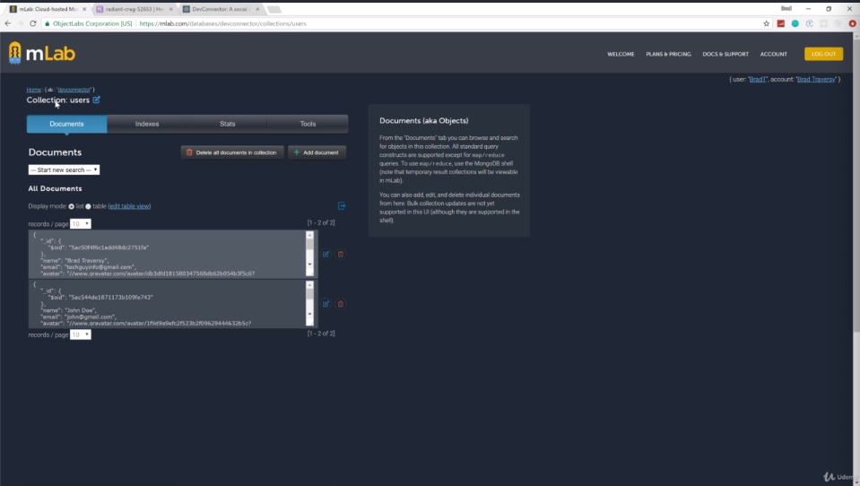

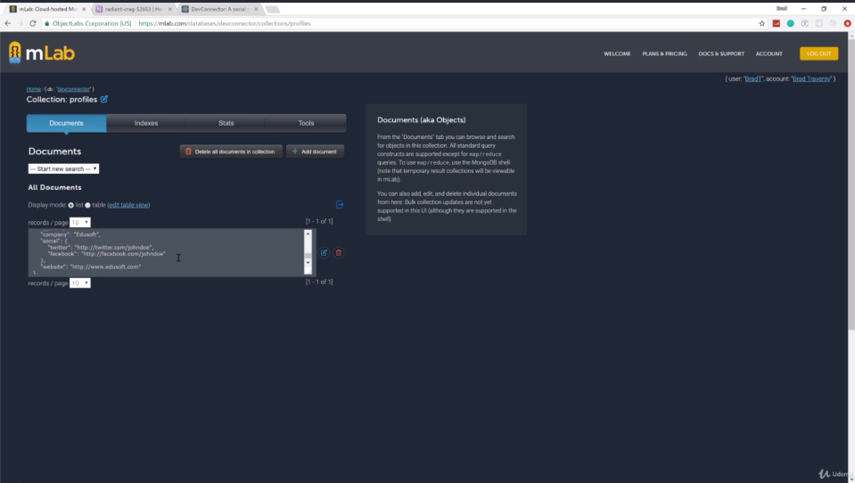

- now there' 2 users Brad and John Doe. we didn't create a profile for Brad so Brad doesn't have a profile

so if we look in profiles there's only one document of John Doe

------------------------------------------------------------------------------------------

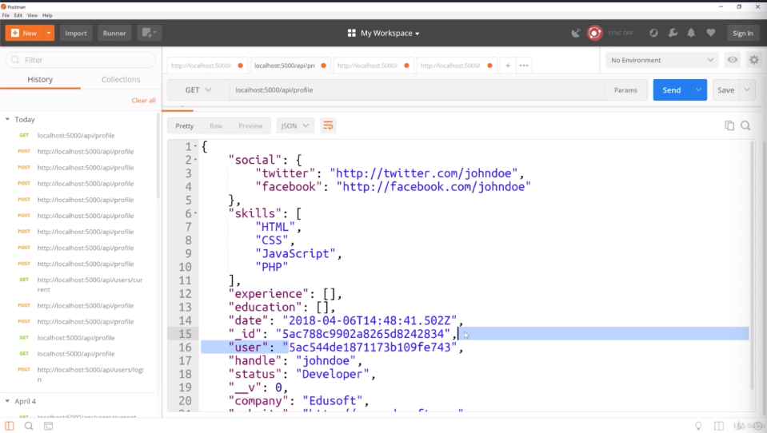

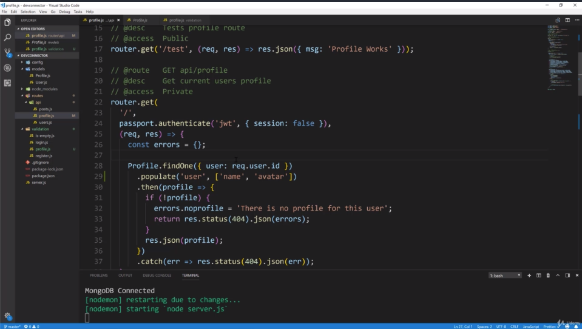

- we don't have avatar and you don't see the name or the e-mail. actually we don't want the e-mail to show on the profile because these are gonna be public. but we do want the avatar in the name

- so what we have to do is go to get route and findOne and use populate() method

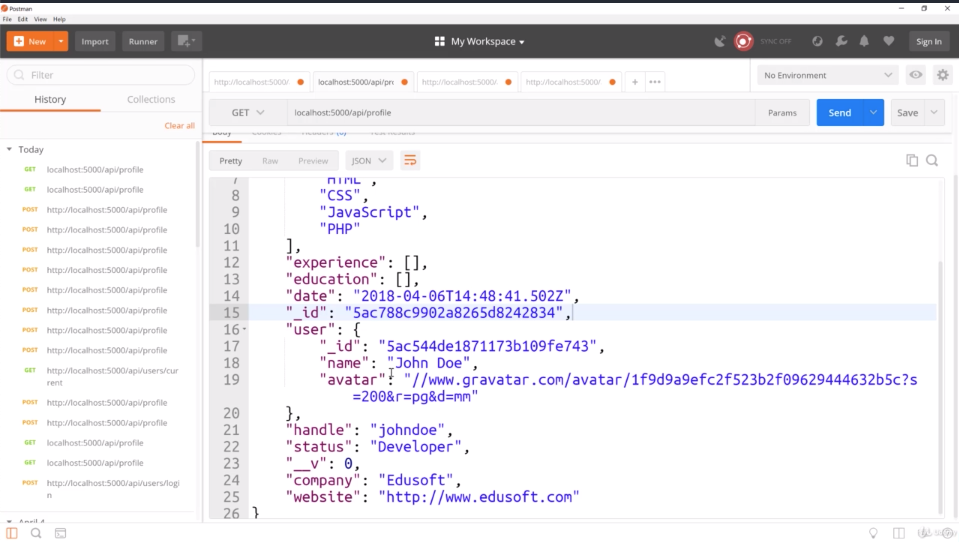

- if we re-fetch our profile, then we have name and avatar

```js
//validation/profile.js

/**it's gonna similar to these other ones in validation folder */
const Validator = require('validator');
const isEmpty = require('./is-empty');

module.exports = function validateProfileInput(data){

    let errors = {};
/**what this is doing is making sure that if it is null or undefined
 * then it's gonna get sent to an empty string
 * and then we can check it with the validator it is empty
 */
    data.handle = !isEmpty(data.handle) ? data.handle : '';
    data.status = !isEmpty(data.status) ? data.status : '';
    data.skills = !isEmpty(data.skills) ? data.skills : '';
/**----------------------------------------------------------------------- */

    if(!Validator.isLength(data.handle, { min: 2, max: 40 })){
        errors.handle = 'Handle needs to be between 2 and 40 characters';
    }

    if(Validator.isEmpty(data.handle)){
        errors.handle = 'Profile handle is required';
    }

    if(Validator.isEmpty(data.status)){
        errors.status = 'Status field is required';
    }

    if(Validator.isEmpty(data.skills)){
        errors.skills = 'Skills field is required';
    }

    /**we also have fields like website or all the social media
     * thoes aren't required but we want them to be formatted as URL
     * and we can do that with validator.URL
    */

    /**first we are gonna check to see if ti's not empty
     * because i don't want if we don't check to see if it's not empty,
     * it's gonna give us URL Error even if it's not there
     */

     if(!isEmpty(data.website)){
         if(!Validator.isURL(data.website)){
             errors.website = 'Not a valid URL'
         }
     }

     if(!isEmpty(data.youtube)){
        if(!Validator.isURL(data.youtube)){
            errors.youtube = 'Not a valid URL'
        }
    }

    if(!isEmpty(data.twitter)){
        if(!Validator.isURL(data.twitter)){
            errors.twitter = 'Not a valid URL'
        }
    }

    if(!isEmpty(data.facebook)){
        if(!Validator.isURL(data.facebook)){
            errors.facebook = 'Not a valid URL'
        }
    }

    if(!isEmpty(data.linkedin)){
        if(!Validator.isURL(data.linkedin)){
            errors.linkedin = 'Not a valid URL'
        }
    }

    if(!isEmpty(data.instagram)){
        if(!Validator.isURL(data.instagram)){
            errors.instagram = 'Not a valid URL'
        }
    }
/**----------------------------------------------------------------------- */
    return{
        errors,
        isValid: isEmpty(errors)
    }
}
```

```js
//routes/api/profile.js

const express = require('express');
const router = express.Router();
const mongoose = require('mongoose');
/**it's gonna be a protected route that will get the current users profile
 * curren user meaning the user that's logged in at that time
 */
/**we are gonna use that for protected routes using passport */
const passport = require('passport');

/**Load Validation */
const validateProfileInput = require('../../validation/profile');

/**Load Profile Model*/
const Profile = require('../../models/Profile');
/**Load User Profile */
const User = require('../../models/User');

/**=========================================================================================== */

/**you don't need to say '/api/profile/test'
 * because we already did in server.js 'app.use('/api/profile', profile);'
*/

/**res.json() is similar to res.send()
 * res.json() will automatically serve a status of 200 which means everything is OK
*/

/** @route             GET api/profile/test*/
/** @desc(description) Test profile route */
/** @access            Public */
router.get('/test', (req, res) => res.json({msg: "Profile Works"}));

/** @route             GET api/profile*/
/** @desc(description) Get current users profile */
/** @access            Private */

/**we just need only '/' because it's gonna be 'api/profile'
 * and since we are using the router, we are already linked 'api/profile' to this file
 */
/**it's gonna be a protected role.
 * we need to do passport.authenticate
 */
router.get('/', passport.authenticate('jwt', { session: false }), (req, res) => {
    /**we want to fetch the current user's profile
     * since we get this is protected, we are gonna get a token
     * that token is now gonna put the user in to req.user
    */
    /**findOne() is mongoose method */
    /** req.user.id is equal to Schema.Types.ObjectId
    * user:{
        type: Schema.Types.ObjectId,
        ref: 'users'
        },

    it depends on what users logged in to what ID is gonna be
    */

        /** initialize a variable called errors and set it to an empty object*/
        const errors = {};

        Profile.findOne({ user: req.user.id })
        /**so what we have to do is go to get route and findOne and use populate() method
         * because since we basically connected our user collection to the profile inside the model like in Profile.js
         * user:{
                type: Schema.Types.ObjectId,
                ref: 'users'
                },
         * we are able to populate fields from users into this their response
        */
            .populate('user', ['name', 'avatar'])
            .then(profile => {
            if(!profile){
                errors.noprofile = 'There is no profile for this user';
                return res.status(404).json(errors);
            }
            res.json(profile);
    }).catch(err => res.status(404).json(err));
    }
);

/**-------------------------------------------------------------------------------------------------------- */

/** @route             POST api/profile*/
/** @desc(description) Create or Edit user profile */ //because this is also gonna be update route
/** @access            Private */

router.post('/', passport.authenticate('jwt', { session: false }),
(req, res) => {

    /**all the form fields that are submitted
     * and then we just wanna check that validation
     *
     * basically we just need to do this at the beginning of anything
     * that we are trying to validate
     */
    const { errors, isValid } = validateProfileInput(req.body);

    /**Check Validation */
    if(!isValid){
        /**Return any errors with 400 status*/
        return res.status(400).json(errors);
    }

    /**Get field */
    const profileFields = {};
    /**there's gonna be a couple of things that don't come from the form such as the user */
    profileFields.user = req.user.id;
    /**we are checking to see if the field that we are looking for has come in */
    if(req.body.handle) profileFields.handle = req.body.handle;
    if(req.body.company) profileFields.company = req.body.company;
    if(req.body.website) profileFields.website = req.body.website;
    if(req.body.location) profileFields.location = req.body.location;
    if(req.body.bio) profileFields.bio = req.body.bio;
    if(req.body.status) profileFields.status = req.body.status;
    if(req.body.githubusername) profileFields.githubusername = req.body.githubusername;
    /**Skills - Split into an array
     * because its coming as the comma separated values
     */
    if(typeof req.body.skills !== 'undefined'){
        /**that will now give us an array of skills to put into the database
         * as opposed to just the comma separated values
         */
        profileFields.skills = req.body.skills.split(',');
    }

    /** 'social' has its own object
    */
   /** we set this being empty
    * because if we try to add the profileFields.social without doing this,
    * it's gonna say profileFields.social doesn't exist
    */
    profileFields.social = {};
    if(req.body.youtube) profileFields.social.youtube = req.body.youtube;
    if(req.body.twitter) profileFields.social.twitter = req.body.twitter;
    if(req.body.facebook) profileFields.social.facebook = req.body.facebook;
    if(req.body.linkedin) profileFields.social.linkedin = req.body.linkedin;
    if(req.body.instagram) profileFields.social.instagram = req.body.instagram;
    /** req.user.id is 'logged in user' */
    Profile.findOne({ user: req.user.id })
        .then(profile => {
            if(profile) {
                /**update
                 * first parameter is gonna be who do we wanna update
                 * second parameter is gonna be
                */
                Profile.findOneAndUpdate(
                    { user: req.user.id },
                    { $set: profileFields },
                    { new: true }
                ).then(profile => res.json(profile));
            } else {
                /** Create */
                /** check to see if the handle exists
                 * because we don't want multiple handle
                 * handle is basically for SEO, it's to access the profile page and SEO friendly
                 */
                Profile.findOne({ handle: profileFields.handle })
                    .then(profile => {
                        if(profile){
                            errors.handle = 'That handle already exists';
                            res.status(400).json(errors);
                        }

                        /**Save Profile */
                        new Profile(profileFields).save().then(profile => res.json(profile));
                    })
            }
        })
});

module.exports = router;


```

\* Chapter 21: More Profile API Routes
======================================

1\. update

- profile.js(route/api folder)

2.

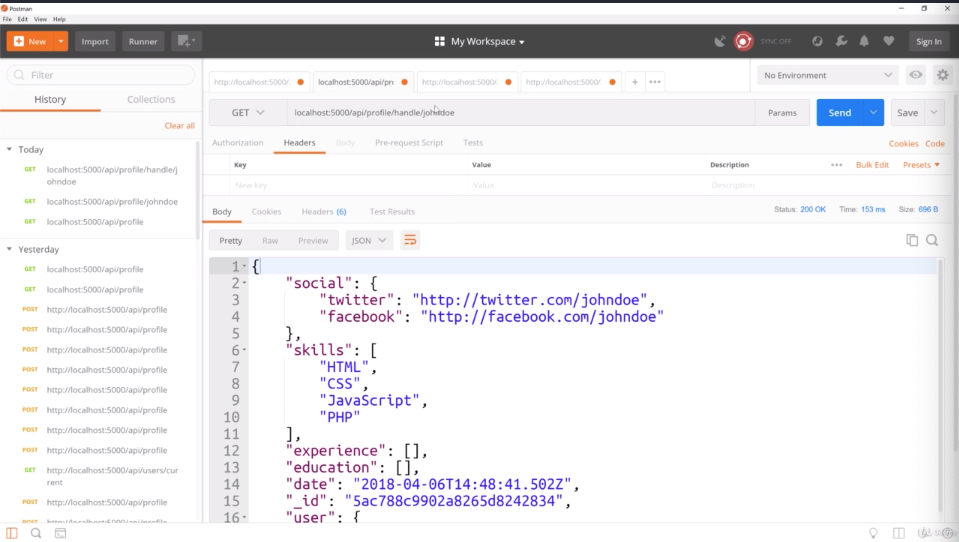

- we don't have key and we don't care whether key is expired or not because in "localhost:5000/api/profile/johndoe", we allow everyone to see the profile

- and now we have a public API route to get a profile by the handle

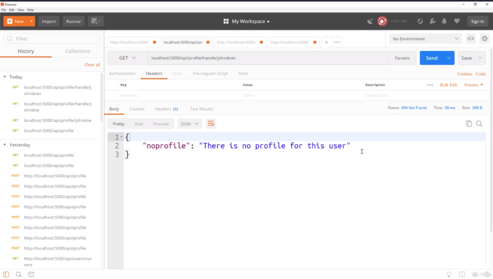

- if i put something that doesn't exist like johndoes, we get "There is no profile for this user"

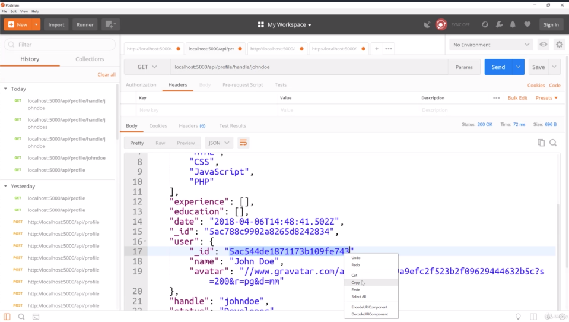

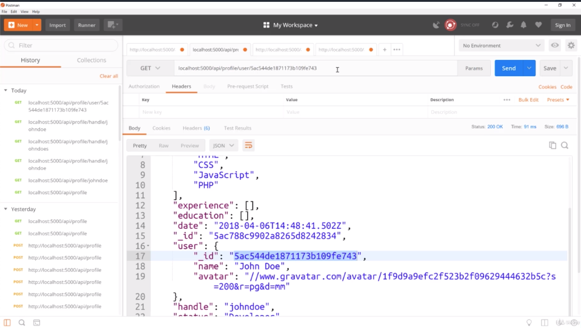

- we should be able to also get the profile by user\_id

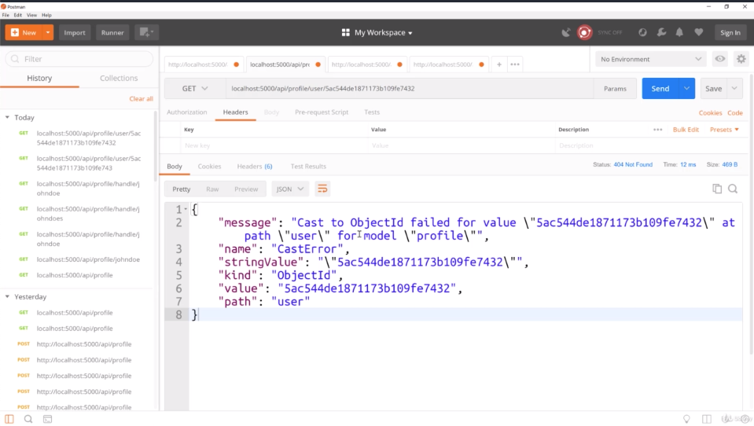

- if i add wrong things, then we get errors coming from the mongoose error

- i will just leave this as the error. we could put our custom error

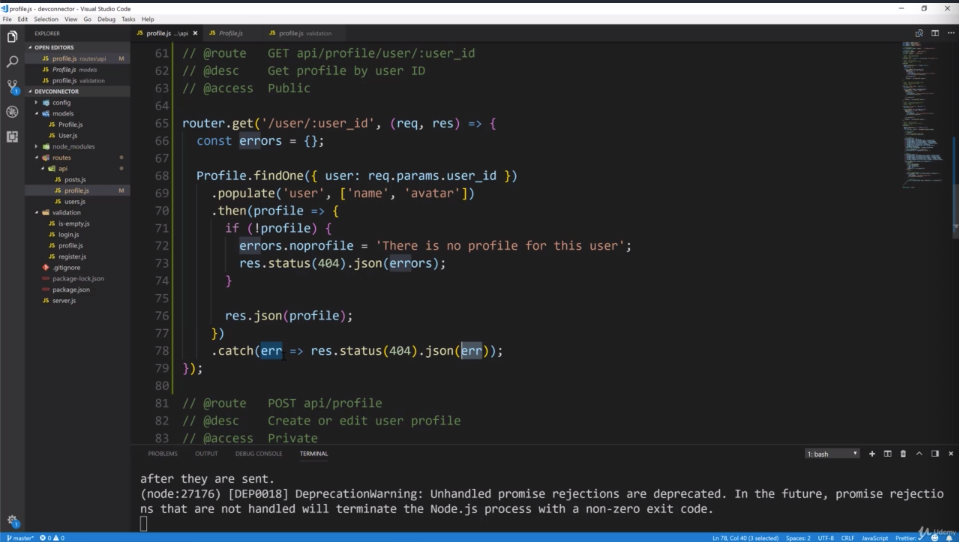

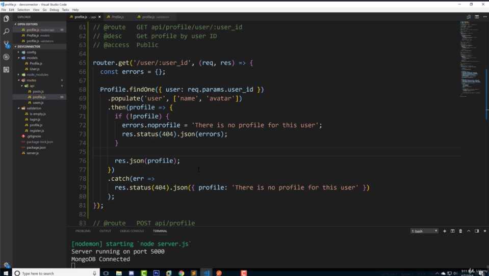

- mongoose error is coming from this 'err'.

- so what we could do is change 'err' like picture 7

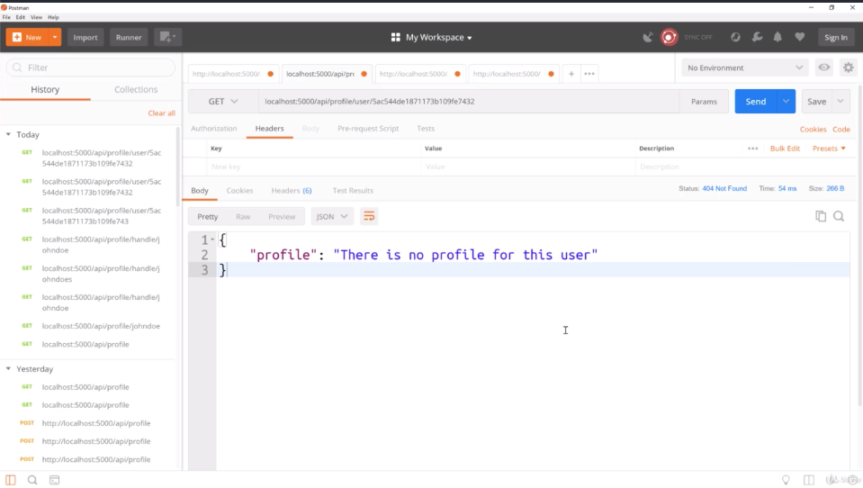

- the result is here

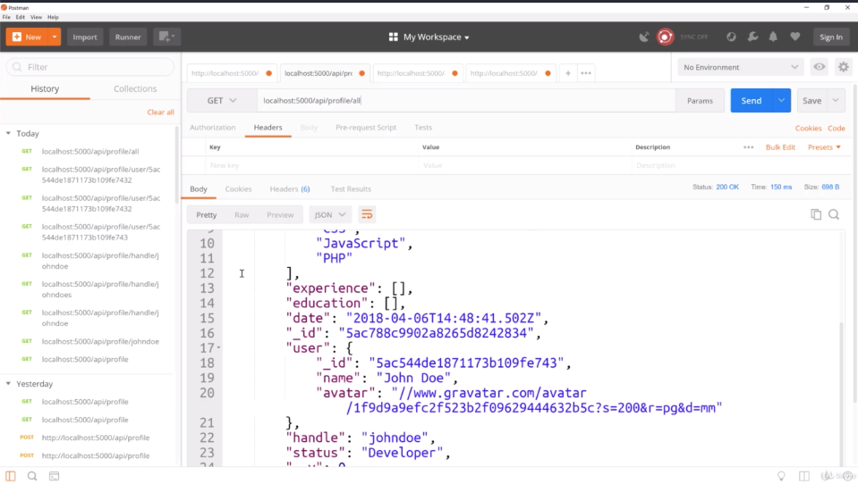

- now we have only have 1 profile. So if we want we do have 2 users, we have the Brad user, then we can create profile for him

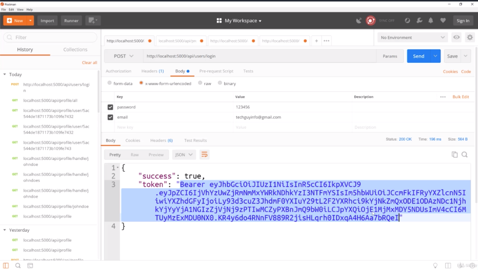

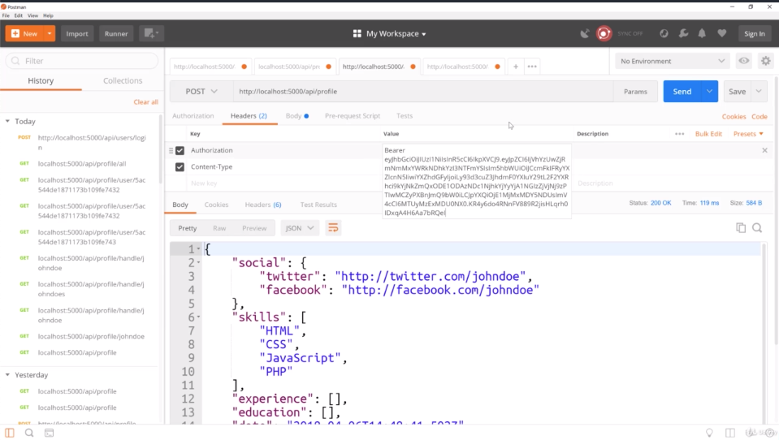

- we change old token to new token 

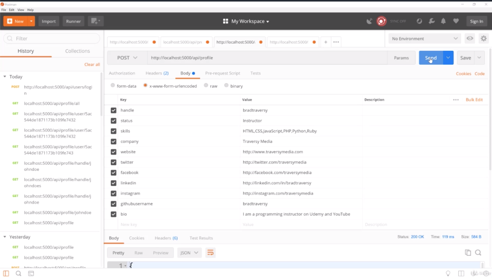

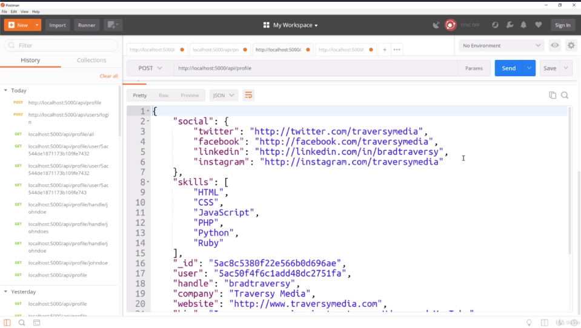

- and add more things. and you can see it includes everything i added including all the social object, skill, bio

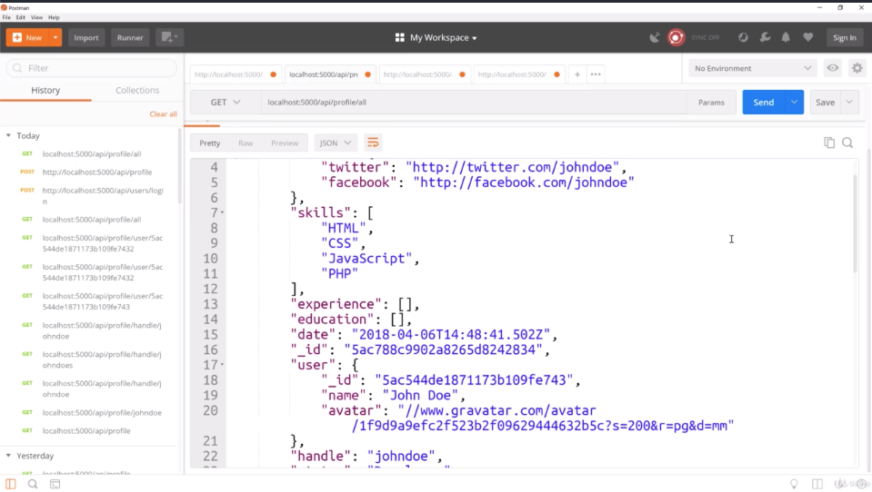

- now we have 2 profile

```js
//routes/api/profile.js

const express = require('express');
const router = express.Router();
const mongoose = require('mongoose');
/**it's gonna be a protected route that will get the current users profile
 * curren user meaning the user that's logged in at that time
 */
/**we are gonna use that for protected routes using passport */
const passport = require('passport');

/**Load Validation */
const validateProfileInput = require('../../validation/profile');

/**Load Profile Model*/
const Profile = require('../../models/Profile');
/**Load User Profile */
const User = require('../../models/User');

/**=========================================================================================== */

/**you don't need to say '/api/profile/test'
 * because we already did in server.js 'app.use('/api/profile', profile);'
*/

/**res.json() is similar to res.send()
 * res.json() will automatically serve a status of 200 which means everything is OK
*/

/** @route             GET api/profile/test*/
/** @desc(description) Test profile route */
/** @access            Public */
router.get('/test', (req, res) => res.json({msg: "Profile Works"}));

/** @route             GET api/profile*/
/** @desc(description) Get current users profile */
/** @access            Private */

/**we just need only '/' because it's gonna be 'api/profile'
 * and since we are using the router, we are already linked 'api/profile' to this file
 */
/**it's gonna be a protected role.
 * we need to do passport.authenticate
 */
router.get('/', passport.authenticate('jwt', { session: false }), (req, res) => {
    /**we want to fetch the current user's profile
     * since we get this is protected, we are gonna get a token
     * that token is now gonna put the user in to req.user
    */
    /**findOne() is mongoose method */
    /** req.user.id is equal to Schema.Types.ObjectId
    * user:{
        type: Schema.Types.ObjectId,
        ref: 'users'
        },

    it depends on what users logged in to what ID is gonna be
    */

        /** initialize a variable called errors and set it to an empty object*/
        const errors = {};

        Profile.findOne({ user: req.user.id })
        /**so what we have to do is go to get route and findOne and use populate() method
         * because since we basically connected our user collection to the profile inside the model like in Profile.js
         * user:{
                type: Schema.Types.ObjectId,
                ref: 'users'
                },
         * we are able to populate fields from users into this their response
        */
            .populate('user', ['name', 'avatar'])
            .then(profile => {
            if(!profile){
                errors.noprofile = 'There is no profile for this user';
                return res.status(404).json(errors);
            }
            res.json(profile);
    }).catch(err => res.status(404).json(err));
    }
);

/** @route             GET api/profile/all*/
/** @desc(description) Get all profiles
/** @access            Pubulic */

router.get('/all' ,(req, res) => {
    const errors = {};
    /**not 'findOne' but 'find' because we find not one but all */
    Profile.find()
        .populate('user', ['name', 'avatar'])
        .then(profiles => {
            if(!profiles){
                errors.noprofile = 'There is no profile for this user';
                return res.status(404).json(errors);
            }
            res.json(profiles);
        })
});

/** @route             GET api/profile/handle/:handle*/
    /**':handle' is the actual handle which is the backend API route.
     * the front end page will be '/profile/handle'
     * we are not acutally gonna have to put the word handle in the route in the browser
    */
/** @desc(description) Get profile by handle
/** @access            Pubulic */

router.get('/handle/:handle', (req, res) => {
    const errors = {};
    /**the way we can get the handle from the URL is by using req.params.handle
     * req.params.handle will match to the handle in the database
    */
    Profile.findOne({ handle: req.params.handle })
    .populate('user', ['name', 'avatar'])
    .then(profile => {
        if(!profile){
            errors.noprofile = 'There is no profile for this user';
            res.status(404).json(errors);
        }
        res.json(profile);
    })
    .catch(err => 
        res.status(404).json({ profile: 'There is no profiles'}));
});

/** @route             GET api/profile/user/:user_id*/
/** @desc(description) Get profile by user ID
/** @access            Pubulic */

router.get('/user/:user_id', (req, res) => {
    const errors = {};
    /**we are not gonna use 'req.userId'
     * because we don't want just the logged in user.
     * we want whatever user is passed in
     */
    Profile.findOne({ user: req.params.user_id })
    .populate('user', ['name', 'avatar'])
    .then(profile => {
        if(!profile){
            errors.noprofile = 'There is no profile for this user';
            res.status(404).json(errors);
        }
        res.json(profile);
    })
    .catch(err => 
        res.status(404).json({ profile: 'There is no profile for this user'}));
});

/**-------------------------------------------------------------------------------------------------------- */

/** @route             POST api/profile*/
/** @desc(description) Create or Edit user profile */ //because this is also gonna be update route
/** @access            Private */

router.post('/', passport.authenticate('jwt', { session: false }),
(req, res) => {

    /**all the form fields that are submitted
     * and then we just wanna check that validation
     *
     * basically we just need to do this at the beginning of anything
     * that we are trying to validate
     */
    const { errors, isValid } = validateProfileInput(req.body);

    /**Check Validation */
    if(!isValid){
        /**Return any errors with 400 status*/
        return res.status(400).json(errors);
    }

    /**Get field */
    const profileFields = {};
    /**there's gonna be a couple of things that don't come from the form such as the user */
    profileFields.user = req.user.id;
    /**we are checking to see if the field that we are looking for has come in */
    if(req.body.handle) profileFields.handle = req.body.handle;
    if(req.body.company) profileFields.company = req.body.company;
    if(req.body.website) profileFields.website = req.body.website;
    if(req.body.location) profileFields.location = req.body.location;
    if(req.body.bio) profileFields.bio = req.body.bio;
    if(req.body.status) profileFields.status = req.body.status;
    if(req.body.githubusername) profileFields.githubusername = req.body.githubusername;
    /**Skills - Split into an array
     * because its coming as the comma separated values
     */
    if(typeof req.body.skills !== 'undefined'){
        /**that will now give us an array of skills to put into the database
         * as opposed to just the comma separated values
         */
        profileFields.skills = req.body.skills.split(',');
    }

    /** 'social' has its own object
    */
   /** we set this being empty
    * because if we try to add the profileFields.social without doing this,
    * it's gonna say profileFields.social doesn't exist
    */
    profileFields.social = {};
    if(req.body.youtube) profileFields.social.youtube = req.body.youtube;
    if(req.body.twitter) profileFields.social.twitter = req.body.twitter;
    if(req.body.facebook) profileFields.social.facebook = req.body.facebook;
    if(req.body.linkedin) profileFields.social.linkedin = req.body.linkedin;
    if(req.body.instagram) profileFields.social.instagram = req.body.instagram;
    /** req.user.id is 'logged in user' */
    Profile.findOne({ user: req.user.id })
        .then(profile => {
            if(profile) {
                /**update
                 * first parameter is gonna be who do we wanna update
                 * second parameter is gonna be
                */
                Profile.findOneAndUpdate(
                    { user: req.user.id },
                    { $set: profileFields },
                    { new: true }
                ).then(profile => res.json(profile));
            } else {
                /** Create */
                /** check to see if the handle exists
                 * because we don't want multiple handle
                 * handle is basically for SEO, it's to access the profile page and SEO friendly
                 */
                Profile.findOne({ handle: profileFields.handle })
                    .then(profile => {
                        if(profile){
                            errors.handle = 'That handle already exists';
                            res.status(400).json(errors);
                        }

                        /**Save Profile */
                        new Profile(profileFields).save().then(profile => res.json(profile));
                    })
            }
        })
});

module.exports = router;


```

\* Chapter 22: Add Experience And Education Routes
==================================================

1\. update

- profile.js(routes/api folder)

- experience.js(validation folder)

- educations.js(validation folder)

2.

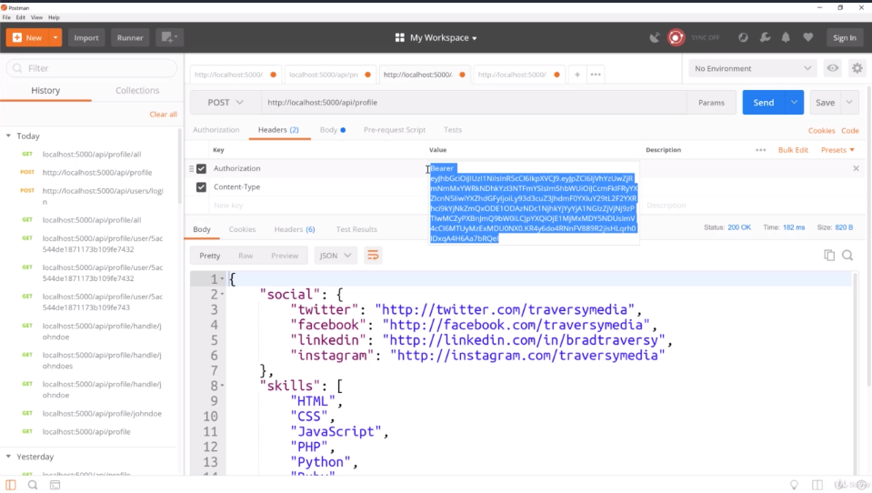

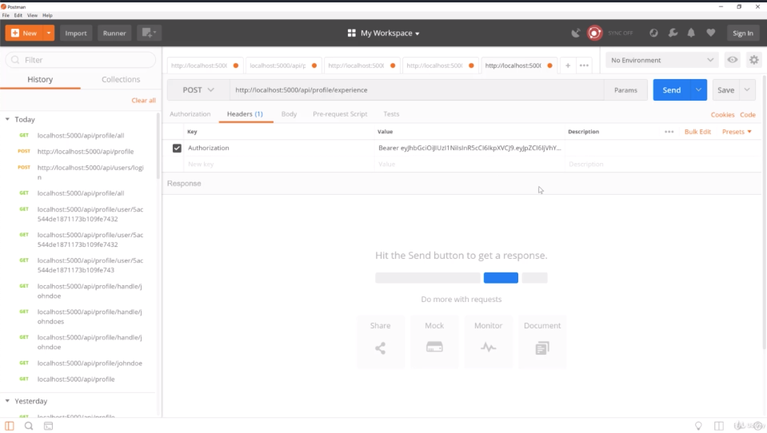

- we grab the authorization header and take token then we will go to new tab for "locahost:5000/api/profile/experience"


- and for the form-urlencoded of body, we get errors and these errors will show up in the front end when we buld our react application

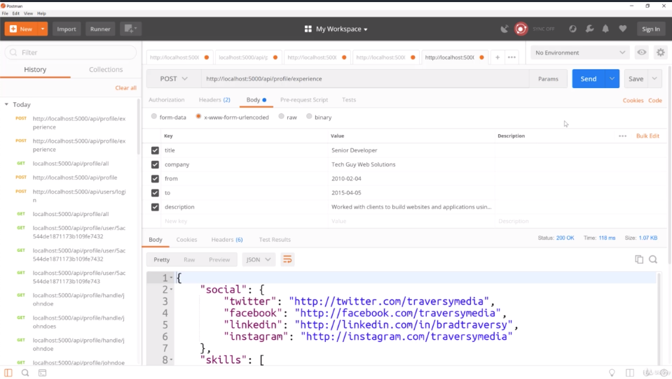

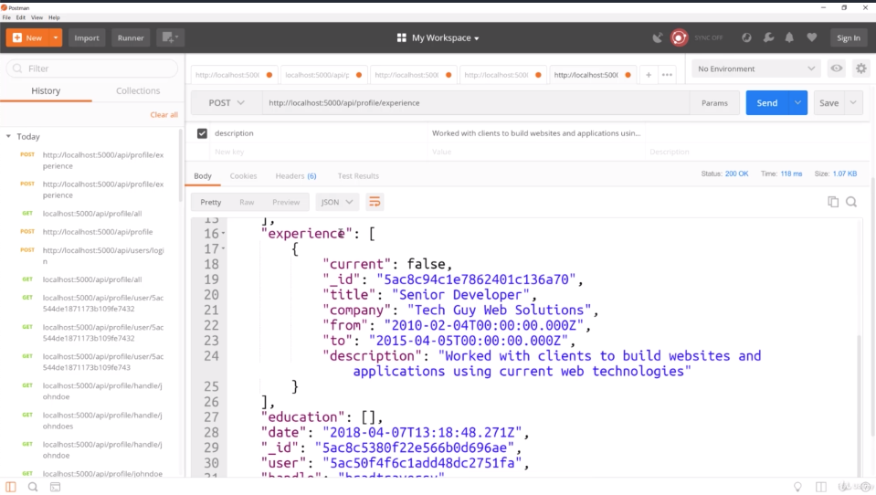

- it gives us our profile back and check that out in the experience array. current is false because we didn't set it current

- each experience has its own user\_id

-----------------------------------------------------------------------

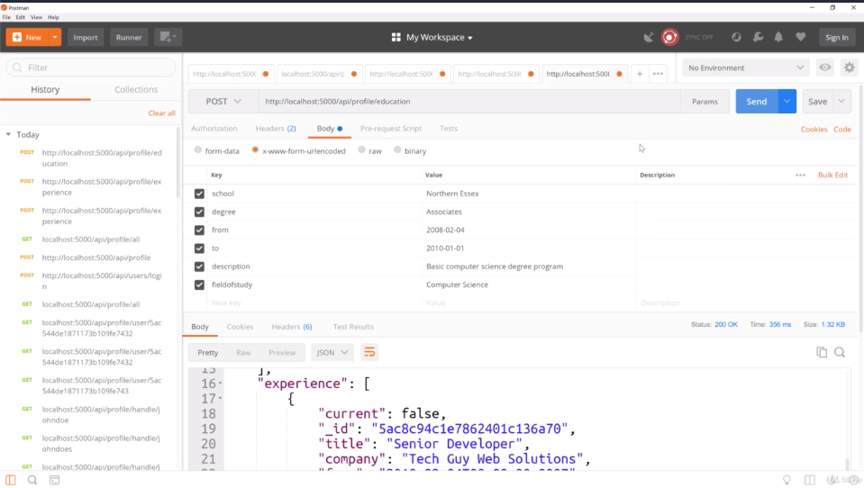

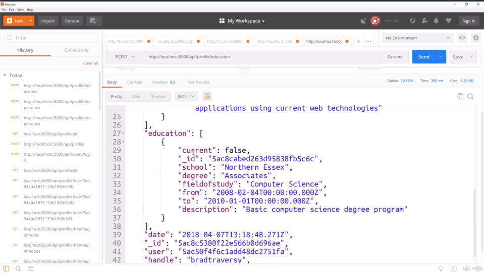

3.

i fixed the problem thanks to Christopher

i switched from 'techguyinfo@gmail.com' to 'john@gmail.com'

and then take new token and do 'POST' both(/experience, /education)

after that, i got results as the instructor had.

this is based on what i typed has no error

Christopher · 3달 전

Hi Guys, I had the same issue and it's a pretty simple solution. This is a Facepalm worthy one.

You have to login as a user that has a profile. If you're logged in as a user with no profile, profile returns NULL.

```js
//routes/api/profile.js

const express = require('express');
const router = express.Router();
const mongoose = require('mongoose');
/**it's gonna be a protected route that will get the current users profile
 * curren user meaning the user that's logged in at that time
 */
/**we are gonna use that for protected routes using passport */
const passport = require('passport');

/**Load Validation */
const validateProfileInput = require('../../validation/profile');
const validateExperienceInput = require('../../validation/experience');
const validateEducationInput = require('../../validation/education');


/**Load Profile Model*/
const Profile = require('../../models/Profile');
/**Load User Profile */
const User = require('../../models/User');

/**=========================================================================================== */

/**you don't need to say '/api/profile/test'
 * because we already did in server.js 'app.use('/api/profile', profile);'
*/

/**res.json() is similar to res.send()
 * res.json() will automatically serve a status of 200 which means everything is OK
*/

/** @route             GET api/profile/test*/
/** @desc(description) Test profile route */
/** @access            Public */
router.get('/test', (req, res) => res.json({msg: "Profile Works"}));

/** @route             GET api/profile*/
/** @desc(description) Get current users profile */
/** @access            Private */

/**we just need only '/' because it's gonna be 'api/profile'
 * and since we are using the router, we are already linked 'api/profile' to this file
 */
/**it's gonna be a protected role.
 * we need to do passport.authenticate
 */
router.get('/', passport.authenticate('jwt', { session: false }), (req, res) => {
    /**we want to fetch the current user's profile
     * since we get this is protected, we are gonna get a token
     * that token is now gonna put the user in to req.user
    */
    /**findOne() is mongoose method */
    /** req.user.id is equal to Schema.Types.ObjectId
    * user:{
        type: Schema.Types.ObjectId,
        ref: 'users'
        },

    it depends on what users logged in to what ID is gonna be
    */

        /** initialize a variable called errors and set it to an empty object*/
        const errors = {};

        Profile.findOne({ user: req.user.id })
        /**so what we have to do is go to get route and findOne and use populate() method
         * because since we basically connected our user collection to the profile inside the model like in Profile.js
         * user:{
                type: Schema.Types.ObjectId,
                ref: 'users'
                },
         * we are able to populate fields from users into this their response
        */
            .populate('user', ['name', 'avatar'])
            .then(profile => {
            if(!profile){
                errors.noprofile = 'There is no profile for this user';
                return res.status(404).json(errors);
            }
            res.json(profile);
    }).catch(err => res.status(404).json(err));
    }
);

/** @route             GET api/profile/all*/
/** @desc(description) Get all profiles
/** @access            Pubulic */

router.get('/all' ,(req, res) => {
    const errors = {};
    /**not 'findOne' but 'find' because we find not one but all */
    Profile.find()
        .populate('user', ['name', 'avatar'])
        .then(profiles => {
            if(!profiles){
                errors.noprofile = 'There is no profile for this user';
                return res.status(404).json(errors);
            }
            res.json(profiles);
        })
});

/** @route             GET api/profile/handle/:handle*/
    /**':handle' is the actual handle which is the backend API route.
     * the front end page will be '/profile/handle'
     * we are not acutally gonna have to put the word handle in the route in the browser
    */
/** @desc(description) Get profile by handle
/** @access            Pubulic */

router.get('/handle/:handle', (req, res) => {
    const errors = {};
    /**the way we can get the handle from the URL is by using req.params.handle
     * req.params.handle will match to the handle in the database
    */
    Profile.findOne({ handle: req.params.handle })
    .populate('user', ['name', 'avatar'])
    .then(profile => {
        if(!profile){
            errors.noprofile = 'There is no profile for this user';
            res.status(404).json(errors);
        }
        res.json(profile);
    })
    .catch(err =>
        res.status(404).json({ profile: 'There is no profiles'}));
});

/** @route             GET api/profile/user/:user_id*/
/** @desc(description) Get profile by user ID
/** @access            Pubulic */

router.get('/user/:user_id', (req, res) => {
    const errors = {};
    /**we are not gonna use 'req.user.id' which is comes from the token
     * because we don't want just the logged in user.
     * we want whatever user is passed in
     */
    Profile.findOne({ user: req.params.user_id })
    .populate('user', ['name', 'avatar'])
    .then(profile => {
        if(!profile){
            errors.noprofile = 'There is no profile for this user';
            res.status(404).json(errors);
        }
        res.json(profile);
    })
    .catch(err =>
        res.status(404).json({ profile: 'There is no profile for this user'}));
});

/**-------------------------------------------------------------------------------------------------------- */

/** @route             POST api/profile*/
/** @desc(description) Create or Edit user profile */ //because this is also gonna be update route
/** @access            Private */

router.post('/', passport.authenticate('jwt', { session: false }),
(req, res) => {

    /**all the form fields that are submitted
     * and then we just wanna check that validation
     *
     * basically we just need to do this at the beginning of anything
     * that we are trying to validate
     */
    const { errors, isValid } = validateProfileInput(req.body);

    /**Check Validation */
    if(!isValid){
        /**Return any errors with 400 status*/
        return res.status(400).json(errors);
    }

    /**Get field */
    const profileFields = {};
    /**there's gonna be a couple of things that don't come from the form such as the user */
    profileFields.user = req.user.id;
    /**we are checking to see if the field that we are looking for has come in */
    if(req.body.handle) profileFields.handle = req.body.handle;
    if(req.body.company) profileFields.company = req.body.company;
    if(req.body.website) profileFields.website = req.body.website;
    if(req.body.location) profileFields.location = req.body.location;
    if(req.body.bio) profileFields.bio = req.body.bio;
    if(req.body.status) profileFields.status = req.body.status;
    if(req.body.githubusername) profileFields.githubusername = req.body.githubusername;
    /**Skills - Split into an array
     * because its coming as the comma separated values
     */
    if(typeof req.body.skills !== 'undefined'){
        /**that will now give us an array of skills to put into the database
         * as opposed to just the comma separated values
         */
        profileFields.skills = req.body.skills.split(',');
    }

    /** 'social' has its own object
    */
   /** we set this being empty
    * because if we try to add the profileFields.social without doing this,
    * it's gonna say profileFields.social doesn't exist
    */
    profileFields.social = {};
    if(req.body.youtube) profileFields.social.youtube = req.body.youtube;
    if(req.body.twitter) profileFields.social.twitter = req.body.twitter;
    if(req.body.facebook) profileFields.social.facebook = req.body.facebook;
    if(req.body.linkedin) profileFields.social.linkedin = req.body.linkedin;
    if(req.body.instagram) profileFields.social.instagram = req.body.instagram;
    /** req.user.id is 'logged in user' */
    Profile.findOne({ user: req.user.id })
        .then(profile => {
            if(profile) {
                /**update
                 * first parameter is gonna be who do we wanna update
                 * second parameter is gonna be
                */
                Profile.findOneAndUpdate(
                    { user: req.user.id },
                    /**'$set' operator replaces the value of a field with the specified value */
                    { $set: profileFields },
                    { new: true }
                ).then(profile => res.json(profile));
            } else {
                /** Create */
                /** check to see if the handle exists
                 * because we don't want multiple handle
                 * handle is basically for SEO, it's to access the profile page and SEO friendly
                 */
                Profile.findOne({ handle: profileFields.handle })
                    .then(profile => {
                        if(profile){
                            errors.handle = 'That handle already exists';
                            res.status(400).json(errors);
                        }

                        /**Save Profile */
                        new Profile(profileFields).save().then(profile => res.json(profile));
                    })
            }
        })
});

/** @route             POST api/profile/experience*/
/** @desc(description) Add experience to profile
/** @access            Private */
    /**the reson of 'Private' is because we need the actual user that is submitting the form */

    router.post('/experience', passport.authenticate('jwt', { session: false }),
    (req, res) => {

    /**all the form fields that are submitted
     * and then we just wanna check that validation
     *
     * basically we just need to do this at the beginning of anything
     * that we are trying to validate
     */
    const { errors, isValid } = validateExperienceInput(req.body);

    /**Check Validation */
    if(!isValid){
        /**Return any errors with 400 status*/
        return res.status(400).json(errors);
    }

        /**req.user.id is coming from the token */
        Profile.findOne({ user: req.user.id }).then(profile => {
                const newExp = {
                    title: req.body.title,
                    company: req.body.company,
                    location: req.body.location,
                    from: req.body.from,
                    to: req.body.to,
                    current: req.body.current,
                    description: req.body.description
                }
                /**what we need to do is just add to the array of our profile
                 * we are not gonna use '.push()' because push will put it at the end
                 * we want add to the beginning
                */
                profile.experience.unshift(newExp);

                profile.save().then(profile => res.json(profile));
            })
    });

/** @route             POST api/profile/education*/
/** @desc(description) Add education to profile
/** @access            Private */
    /**the reson of 'Private' is because we need the actual user that is submitting the form */

router.post('/education',
    passport.authenticate('jwt', { session: false }),
    (req, res) => {

        /**all the form fields that are submitted
         * and then we just wanna check that validation
         *
         * basically we just need to do this at the beginning of anything
         * that we are trying to validate
         */
        const { errors, isValid } = validateEducationInput(req.body);

        /**Check Validation */
        if(!isValid){
            /**Return any errors with 400 status*/
            return res.status(400).json(errors);
        }

            /**req.user.id is coming from the token */
            Profile.findOne({ user: req.user.id }).then(profile => {
                    const newEdu = {
                        school: req.body.school,
                        degree: req.body.degree,
                        fieldofstudy: req.body.fieldofstudy,
                        from: req.body.from,
                        to: req.body.to,
                        current: req.body.current,
                        description: req.body.description
                    };
                    /**what we need to do is just add to the array of our profile
                     * we are not gonna use '.push()' because push will put it at the end
                     * we want add to the beginning
                    */
                    profile.education.unshift(newEdu);

                    profile.save().then(profile => res.json(profile));
                })
        }
    );


module.exports = router;


```

```js
//validation/experience.js

/**it has to be a string that you are validating
 * empty has to be a string
 */
const Validator = require('validator');
const isEmpty = require('./is-empty');

/**=========================================================================== */

/**we will be able to access this function from outside */
module.exports = function validateExperienceInput(data){
    /** we start off with an empty errors
     * and if everything passes it will still be empty at the end
     * and it will be valid
     * if not then "errors.name" will get filled and then it won't be empty
     * and it won't be valid
     * and
     * if(!isValid){ return res.status(400).json(errors); }
     * this will return all the errors
    */
    let errors = {};

    data.title = !isEmpty(data.title) ? data.title : '';
    data.company = !isEmpty(data.company) ? data.company : '';
    data.from = !isEmpty(data.from) ? data.from : '';

    /**the problem is if your request is sent and they don't send the name,
     * it's not gonna be a empty string
     * that's what it needs to be for this isEmpty to work 
     * because that's part of the validator
     * so this needs 'data.name = !isEmpty(data.name) ? data.name : '';'
     */

/**----------------------------------------------------------------------- */

    if(Validator.isEmpty(data.title)){
        errors.title = 'Job title field is required';
    }

    if(Validator.isEmpty(data.company)){
        errors.company = 'Company field is required';
    }

    if(Validator.isEmpty(data.from)){
        errors.from = 'From date field is required';
    }
/**----------------------------------------------------------------------- */
    return{
        errors,
        isValid: isEmpty(errors)
    };
};
```

```js
//validation/educations.js

/**it has to be a string that you are validating
 * empty has to be a string
 */
const Validator = require('validator');
const isEmpty = require('./is-empty');

/**=========================================================================== */

/**we will be able to access this function from outside */
module.exports = function validateEducationInput(data){
    /** we start off with an empty errors
     * and if everything passes it will still be empty at the end
     * and it will be valid
     * if not then "errors.name" will get filled and then it won't be empty
     * and it won't be valid
     * and
     * if(!isValid){ return res.status(400).json(errors); }
     * this will return all the errors
    */
    let errors = {};

    data.school = !isEmpty(data.school) ? data.school : '';
    data.degree = !isEmpty(data.degree) ? data.degree : '';
    data.fieldofstudy = !isEmpty(data.fieldofstudy) ? data.fieldofstudy : '';
    data.from = !isEmpty(data.from) ? data.from : '';

    /**the problem is if your request is sent and they don't send the name,
     * it's not gonna be a empty string
     * that's what it needs to be for this isEmpty to work 
     * because that's part of the validator
     * so this needs 'data.name = !isEmpty(data.name) ? data.name : '';'
     */

/**----------------------------------------------------------------------- */

    if(Validator.isEmpty(data.school)){
        errors.school = 'School field is required';
    }

    if(Validator.isEmpty(data.degree)){
        errors.degree = 'Degree field is required';
    }

    if(Validator.isEmpty(data.fieldofstudy)){
        errors.fieldofstudy = 'Field of study field is required';
    }

    if(Validator.isEmpty(data.from)){
        errors.from = 'From date field is required';
    }
/**----------------------------------------------------------------------- */
    return{
        errors,
        isValid: isEmpty(errors)
    };
};
```

\* Chapter 23: Delete Education And Experience Routes
=====================================================

1\. update

- profile.js(routes/api folder)

2.

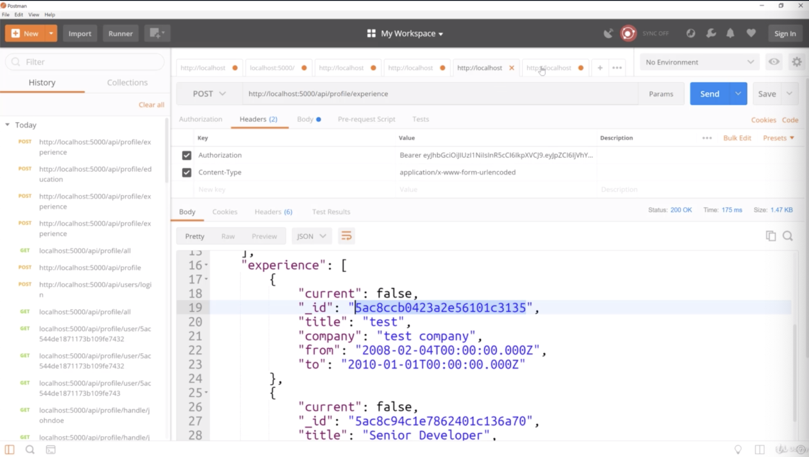

- grab id of profile/experience and copy and paste that in picture 3

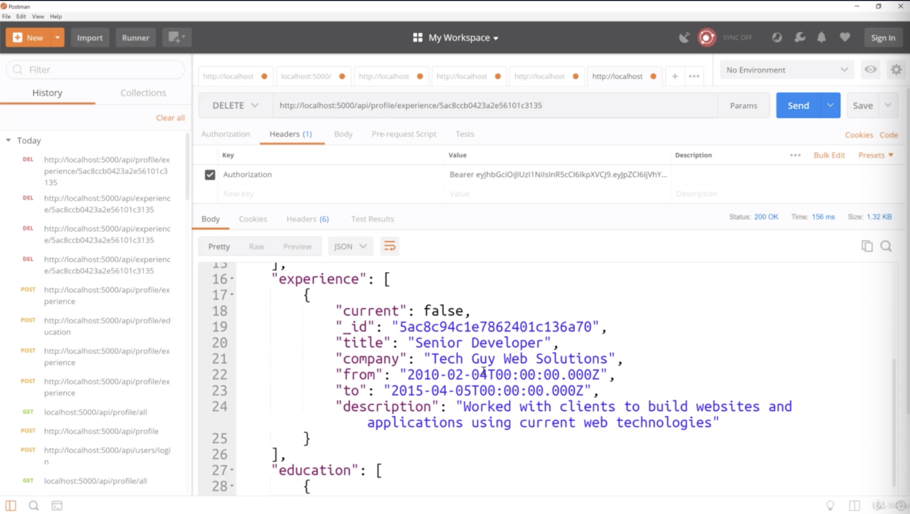

- as you can see, now the test is gone

------------------------------------------------------------------


- as the /profile/experience, we do copy id of profile/education and paste that like picture 4

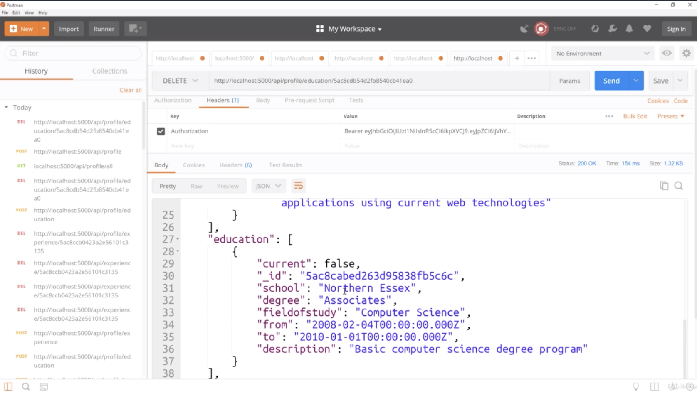

- now the test is gone

------------------------------------------------------------------

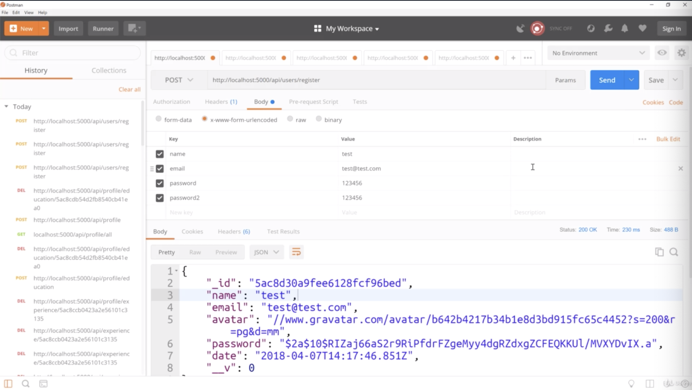

- we register new email 'test'

- and now we wanna add a profile for this user so we gonna have to log in to get the token

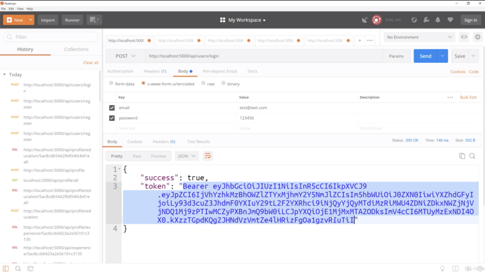

- we get the token and we wanna go to API profile

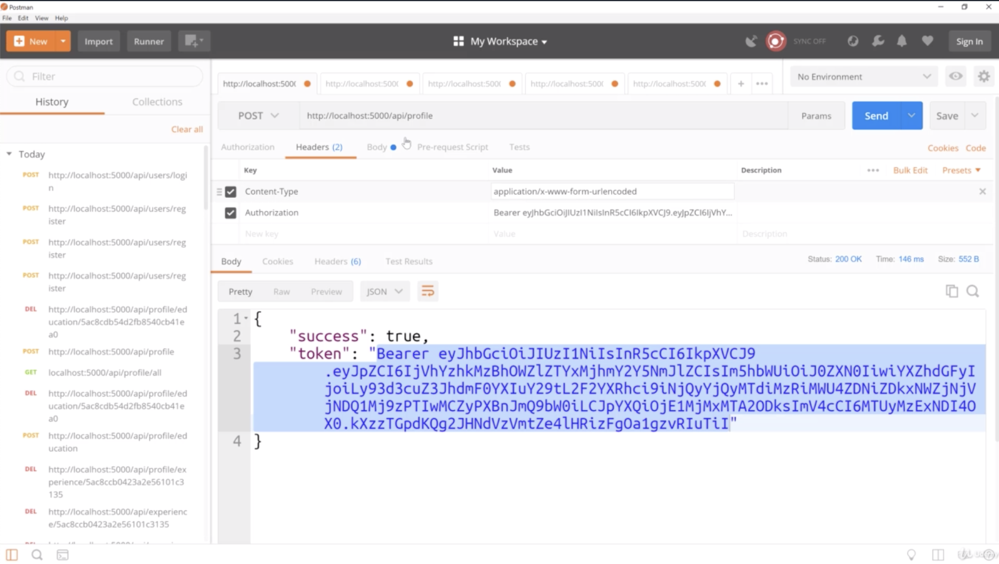

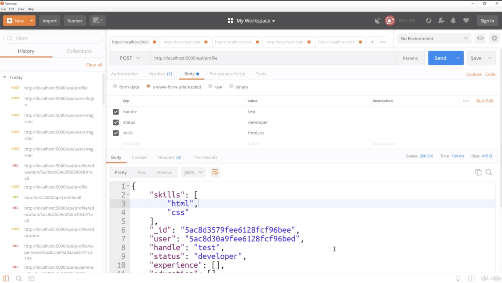

- fill out authorization and Body then we get result

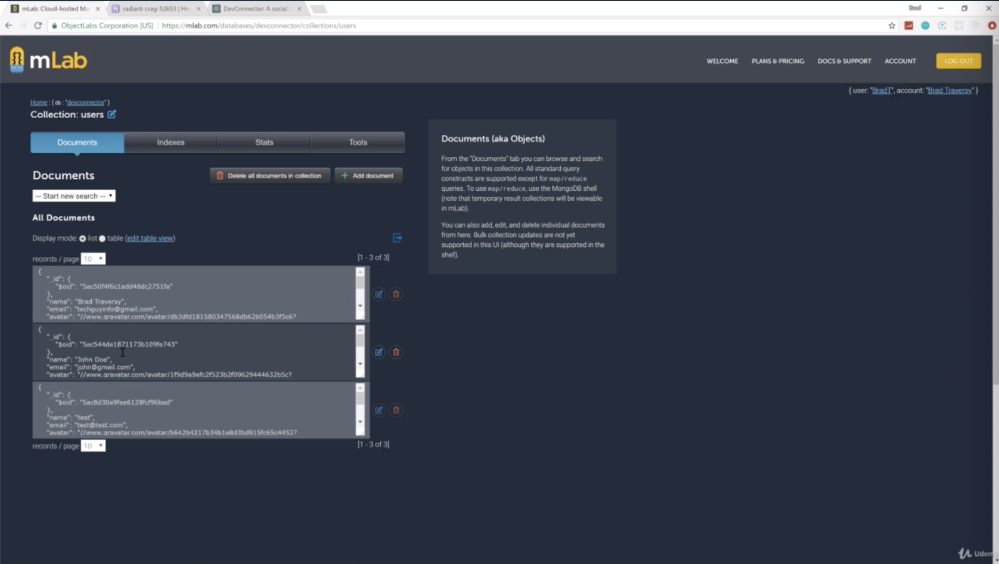

- in mongoDB, we have Brad, johndoe, test user

- so we want to delete the test user which should delete the user and the profile.

we can see we have his profile 

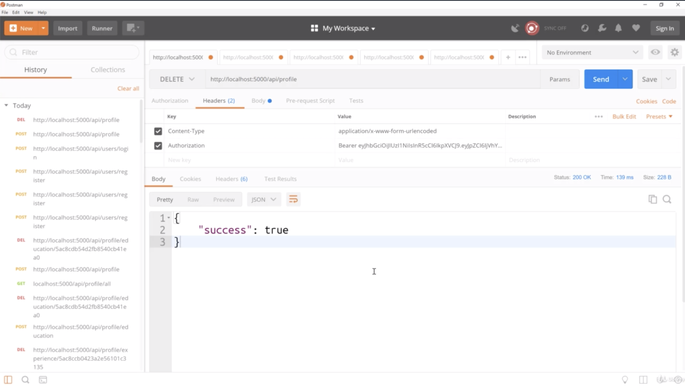

- so we want what we want to do is make sure we are logged in as the test user

- and we gonna make DELETE request to that API profile and that should delete both

- so we get "'success': true"

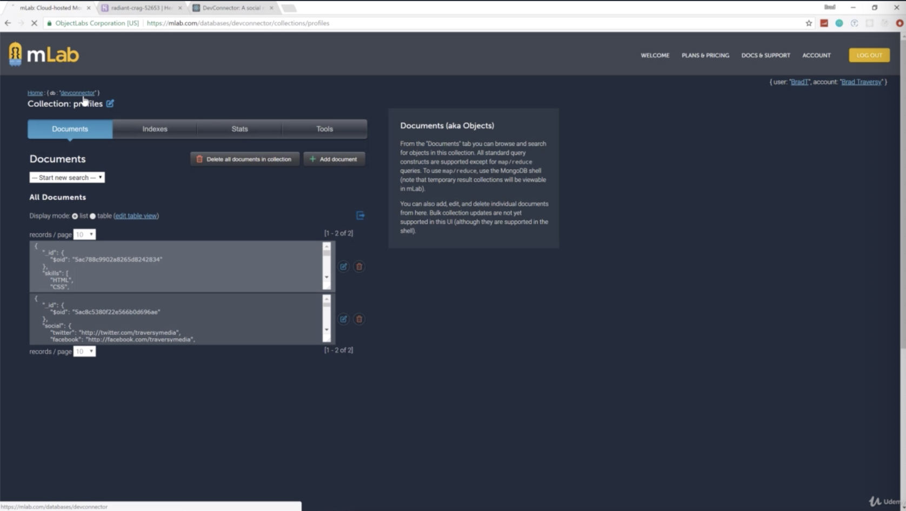

- The profile of test is now gone and users now only get 2 users

- this is now deleting this entire account the profile and the user

```js
//routes/api/profile.js

const express = require('express');
const router = express.Router();
const mongoose = require('mongoose');
/**it's gonna be a protected route that will get the current users profile
 * curren user meaning the user that's logged in at that time
 */
/**we are gonna use that for protected routes using passport */
const passport = require('passport');

/**Load Validation */
const validateProfileInput = require('../../validation/profile');
const validateExperienceInput = require('../../validation/experience');
const validateEducationInput = require('../../validation/education');


/**Load Profile Model*/
const Profile = require('../../models/Profile');
/**Load User Model */
const User = require('../../models/User');

/**=========================================================================================== */

/**you don't need to say '/api/profile/test'
 * because we already did in server.js 'app.use('/api/profile', profile);'
*/

/**res.json() is similar to res.send()
 * res.json() will automatically serve a status of 200 which means everything is OK
*/

/** @route             GET api/profile/test*/
/** @desc(description) Test profile route */
/** @access            Public */
router.get('/test', (req, res) => res.json({msg: "Profile Works"}));

/** @route             GET api/profile*/
/** @desc(description) Get current users profile */
/** @access            Private */

/**we just need only '/' because it's gonna be 'api/profile'
 * and since we are using the router, we are already linked 'api/profile' to this file
 */
/**it's gonna be a protected role.
 * we need to do passport.authenticate
 */
router.get('/', passport.authenticate('jwt', { session: false }), (req, res) => {
    /**we want to fetch the current user's profile
     * since we get this is protected, we are gonna get a token
     * that token is now gonna put the user in to req.user
    */
    /**findOne() is mongoose method */
    /** req.user.id is equal to Schema.Types.ObjectId
    * user:{
        type: Schema.Types.ObjectId,
        ref: 'users'
        },

    it depends on what users logged in to what ID is gonna be
    */

        /** initialize a variable called errors and set it to an empty object*/
        const errors = {};

        Profile.findOne({ user: req.user.id })
        /**so what we have to do is go to get route and findOne and use populate() method
         * because since we basically connected our user collection to the profile inside the model like in Profile.js
         * user:{
                type: Schema.Types.ObjectId,
                ref: 'users'
                },
         * we are able to populate fields from users into this their response
        */
            .populate('user', ['name', 'avatar'])
            .then(profile => {
            if(!profile){
                errors.noprofile = 'There is no profile for this user';
                return res.status(404).json(errors);
            }
            res.json(profile);
    }).catch(err => res.status(404).json(err));
    }
);

/** @route             GET api/profile/all*/
/** @desc(description) Get all profiles
/** @access            Pubulic */

router.get('/all' ,(req, res) => {
    const errors = {};
    /**not 'findOne' but 'find' because we find not one but all */
    Profile.find()
        .populate('user', ['name', 'avatar'])
        .then(profiles => {
            if(!profiles){
                errors.noprofile = 'There is no profile for this user';
                return res.status(404).json(errors);
            }
            res.json(profiles);
        })
});

/** @route             GET api/profile/handle/:handle*/
    /**':handle' is the actual handle which is the backend API route.
     * the front end page will be '/profile/handle'
     * we are not acutally gonna have to put the word handle in the route in the browser
    */
/** @desc(description) Get profile by handle
/** @access            Pubulic */

router.get('/handle/:handle', (req, res) => {
    const errors = {};
    /**the way we can get the handle from the URL is by using req.params.handle
     * req.params.handle will match to the handle in the database
    */
    Profile.findOne({ handle: req.params.handle })
    .populate('user', ['name', 'avatar'])
    .then(profile => {
        if(!profile){
            errors.noprofile = 'There is no profile for this user';
            res.status(404).json(errors);
        }
        res.json(profile);
    })
    .catch(err =>
        res.status(404).json({ profile: 'There is no profiles'}));
});

/** @route             GET api/profile/user/:user_id*/
/** @desc(description) Get profile by user ID
/** @access            Pubulic */

router.get('/user/:user_id', (req, res) => {
    const errors = {};
    /**we are not gonna use 'req.user.id' which is comes from the token
     * because we don't want just the logged in user.
     * we want whatever user is passed in
     */
    Profile.findOne({ user: req.params.user_id })
    .populate('user', ['name', 'avatar'])
    .then(profile => {
        if(!profile){
            errors.noprofile = 'There is no profile for this user';
            res.status(404).json(errors);
        }
        res.json(profile);
    })
    .catch(err =>
        res.status(404).json({ profile: 'There is no profile for this user'}));
});

/**-------------------------------------------------------------------------------------------------------- */

/** @route             POST api/profile*/
/** @desc(description) Create or Edit user profile */ //because this is also gonna be update route
/** @access            Private */

router.post('/', passport.authenticate('jwt', { session: false }),
(req, res) => {

    /**all the form fields that are submitted
     * and then we just wanna check that validation
     *
     * basically we just need to do this at the beginning of anything
     * that we are trying to validate
     */
    const { errors, isValid } = validateProfileInput(req.body);

    /**Check Validation */
    if(!isValid){
        /**Return any errors with 400 status*/
        return res.status(400).json(errors);
    }

    /**Get field */
    const profileFields = {};
    /**there's gonna be a couple of things that don't come from the form such as the user */
    profileFields.user = req.user.id;
    /**we are checking to see if the field that we are looking for has come in */
    if(req.body.handle) profileFields.handle = req.body.handle;
    if(req.body.company) profileFields.company = req.body.company;
    if(req.body.website) profileFields.website = req.body.website;
    if(req.body.location) profileFields.location = req.body.location;
    if(req.body.bio) profileFields.bio = req.body.bio;
    if(req.body.status) profileFields.status = req.body.status;
    if(req.body.githubusername) profileFields.githubusername = req.body.githubusername;
    /**Skills - Split into an array
     * because its coming as the comma separated values
     */
    if(typeof req.body.skills !== 'undefined'){
        /**that will now give us an array of skills to put into the database
         * as opposed to just the comma separated values
         */
        profileFields.skills = req.body.skills.split(',');
    }

    /** 'social' has its own object
    */
   /** we set this being empty
    * because if we try to add the profileFields.social without doing this,
    * it's gonna say profileFields.social doesn't exist
    */
    profileFields.social = {};
    if(req.body.youtube) profileFields.social.youtube = req.body.youtube;
    if(req.body.twitter) profileFields.social.twitter = req.body.twitter;
    if(req.body.facebook) profileFields.social.facebook = req.body.facebook;
    if(req.body.linkedin) profileFields.social.linkedin = req.body.linkedin;
    if(req.body.instagram) profileFields.social.instagram = req.body.instagram;
    /** req.user.id is 'logged in user' */
    Profile.findOne({ user: req.user.id })
        .then(profile => {
            if(profile) {
                /**update
                 * first parameter is gonna be who do we wanna update
                 * second parameter is gonna be
                */
                Profile.findOneAndUpdate(
                    { user: req.user.id },
                    /**'$set' operator replaces the value of a field with the specified value */
                    { $set: profileFields },
                    { new: true }
                ).then(profile => res.json(profile));
            } else {
                /** Create */
                /** check to see if the handle exists
                 * because we don't want multiple handle
                 * handle is basically for SEO, it's to access the profile page and SEO friendly
                 */
                Profile.findOne({ handle: profileFields.handle })
                    .then(profile => {
                        if(profile){
                            errors.handle = 'That handle already exists';
                            res.status(400).json(errors);
                        }

                        /**Save Profile */
                        new Profile(profileFields).save().then(profile => res.json(profile));
                    })
            }
        })
});

/** @route             POST api/profile/experience*/
/** @desc(description) Add experience to profile
/** @access            Private */
    /**the reson of 'Private' is because we need the actual user that is submitting the form */

    router.post('/experience', passport.authenticate('jwt', { session: false }),
    (req, res) => {

    /**all the form fields that are submitted
     * and then we just wanna check that validation
     *
     * basically we just need to do this at the beginning of anything
     * that we are trying to validate
     */
    const { errors, isValid } = validateExperienceInput(req.body);

    /**Check Validation */
    if(!isValid){
        /**Return any errors with 400 status*/
        return res.status(400).json(errors);
    }

        /**req.user.id is coming from the token */
        Profile.findOne({ user: req.user.id }).then(profile => {
                const newExp = {
                    title: req.body.title,
                    company: req.body.company,
                    location: req.body.location,
                    from: req.body.from,
                    to: req.body.to,
                    current: req.body.current,
                    description: req.body.description
                }
                /**what we need to do is just add to the array of our profile
                 * we are not gonna use '.push()' because push will put it at the end
                 * we want add to the beginning
                */
                profile.experience.unshift(newExp);

                profile.save().then(profile => res.json(profile));
            })
    });

/** @route             POST api/profile/education*/
/** @desc(description) Add education to profile
/** @access            Private */
    /**the reson of 'Private' is because we need the actual user that is submitting the form */

router.post('/education',
    passport.authenticate('jwt', { session: false }),
    (req, res) => {

        /**all the form fields that are submitted
         * and then we just wanna check that validation
         *
         * basically we just need to do this at the beginning of anything
         * that we are trying to validate
         */
        const { errors, isValid } = validateEducationInput(req.body);

        /**Check Validation */
        if(!isValid){
            /**Return any errors with 400 status*/
            return res.status(400).json(errors);
        }

            /**req.user.id is coming from the token */
            Profile.findOne({ user: req.user.id }).then(profile => {
                    const newEdu = {
                        school: req.body.school,
                        degree: req.body.degree,
                        fieldofstudy: req.body.fieldofstudy,
                        from: req.body.from,
                        to: req.body.to,
                        current: req.body.current,
                        description: req.body.description
                    };
                    /**what we need to do is just add to the array of our profile
                     * we are not gonna use '.push()' because push will put it at the end
                     * we want add to the beginning
                    */
                    profile.education.unshift(newEdu);

                    profile.save().then(profile => res.json(profile));
                })
        }
    );

/** @route             DELETE api/profile/experience/:exp_id*/
        /**it's gonna need the id of the experienced member.
         * we saw that when it's created it actually create id on its own
         */
/** @desc(description) Delete experience from profile
/** @access            Private */

router.delete('/experience/:exp_id',
passport.authenticate('jwt', { session: false }),
(req, res) => {

        /**req.user.id is coming from the token */
        Profile.findOne({ user: req.user.id }).then(profile => {
            /**we wanna basically find the experience that we wanna delete */
            /**Get remove index */

            /**we use map() which basically allows you to map an array to something else */
            const removeIndex = profile.experience.map(item => item.id)
            /**req.params.exp_id will get us the correct experience to delete
             * The indexOf() method returns the first index
             * at which a given element can be found in the array,
             * or -1 if it is not present.
            */
            .indexOf(req.params.exp_id);

            /**Splice out of array
             * The splice() method changes the contents of an array
             * by removing or replacing existing elements and/or adding new elements.
             * 
             * we know which one we wanna remove
             * and we wanna move just 1 from that index
            */
            profile.experience.splice(removeIndex, 1);

            /**Save */
            profile.save().then(profile => res.json(profile));
            }).catch(err => res.status(404).json(err));
    }
);

/** @route             DELETE api/profile/education/:edu_id*/
/** @desc(description) Delete education from profile
/** @access            Private */

router.delete('/education/:edu_id',
passport.authenticate('jwt', { session: false }),
(req, res) => {

        /**req.user.id is coming from the token */
        Profile.findOne({ user: req.user.id }).then(profile => {
            /**we wanna basically find the experience that we wanna delete */
            /**Get remove index */

            /**we use map() which basically allows you to map an array to something else */
            const removeIndex = profile.education.map(item => item.id)
            /**req.params.exp_id will get us the correct experience to delete
             * The indexOf() method returns the first index
             * at which a given element can be found in the array,
             * or -1 if it is not present.
            */
            .indexOf(req.params.edu_id);

            /**Splice out of array
             * The splice() method changes the contents of an array
             * by removing or replacing existing elements and/or adding new elements.
             * 
             * we know which one we wanna remove
             * and we wanna move just 1 from that index
            */
            profile.education.splice(removeIndex, 1);

            /**Save */
            profile.save().then(profile => res.json(profile));
            }).catch(err => res.status(404).json(err));
    }
);

/**@route    Delete api/profile */
/**@desc     Delete user and profile */
/**@access   Private */

router.delete('/',
passport.authenticate('jwt', { session: false }),
(req, res) => {
        Profile.findOneAndRemove({ user: req.user.id })
        .then(() => {
            /**This will delete the profile
             * but i'm gonna have it also delete the user
             * and if you wanna do it differently
             * where i would just delete the profile
             * but it keeps the user in the collection you could do that
             */

             /**since this is users collection,
              * we are not matching user
              * matching the ID itself which is _id
              */

              /**we wanna match that to req.user.id
               * and that will give us a promise
               */
            User.findOneAndRemove({ _id: req.user.id })
            /**obviously the profile is gone, the user is gone,
             * so i'm just gonna say success true and save
             */
            .then(() => res.json({ success: true }));
        });
    }
);

module.exports = router;
```