\* Chapter 24: Creating The Post Model
======================================

1\. update

- Post.js(models folder)

```js
//models/Post.js

const mongoose = require('mongoose');
const Schema = mongoose.Schema;

/**Create Schema */
const PostSchema = new Schema({
    /**we are gonna to connect each post to a user like we did with the profile*/
    user: {
        type: Schema.Types.ObjectId,
        ref: 'users'
    },
    text: {
        type: String,
        required: true
    },
    /** we could do what we did with the profile
     * and basically populated with the Avatar the name from the user
     * but i want to be separated because if the user decides to delete their account
     * i don't want their posts and their comments to be deleted as well
    */

    /**So each post is also gonna have name and Avatar
     * and they are not gonna have to fill this in 
     * when they create a post or comment all they are gonna have to put is the text 
     * the name, the avatar that will just fill in programmatically from what we are gonna do
     */
    name: {
        type: String,
    },
    avatar: {
        type: String
    },
    /**i want i don't want the user to be able to hit the like button more than once account 
     * so if they hit the like button, what will happen is their user id will go into this array
     * if they dislike the post, their user id will get removed from the array
    */
    likes: [
        {
            user: {
                type: Schema.Types.ObjectId,
                ref: 'users'
            }
        }
    ],
    /** comment also has user */
    comments: [
        {
            user: {
                type: Schema.Types.ObjectId,
                ref: 'users'
            },
            text: {
                type: String,
                required: true
            },
            name: {
                type: String,
            },
            avatar: {
                type: String
            },
            date: {
                type: Date,
                default: Date.now
            }
        }
    ],
    date: {
        type: Date,
        default: Date.now
    }
});

module.exports = Post = mongoose.model('post', PostSchema);


```

\* Chapter 25: Post Create Route
================================

1\. update

- posts.js (routes/api folder)

- post.js(validation folder)

2.

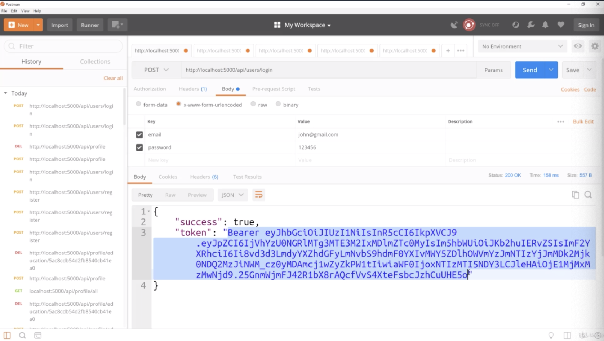

- past token would be expired. So get the new token like this.

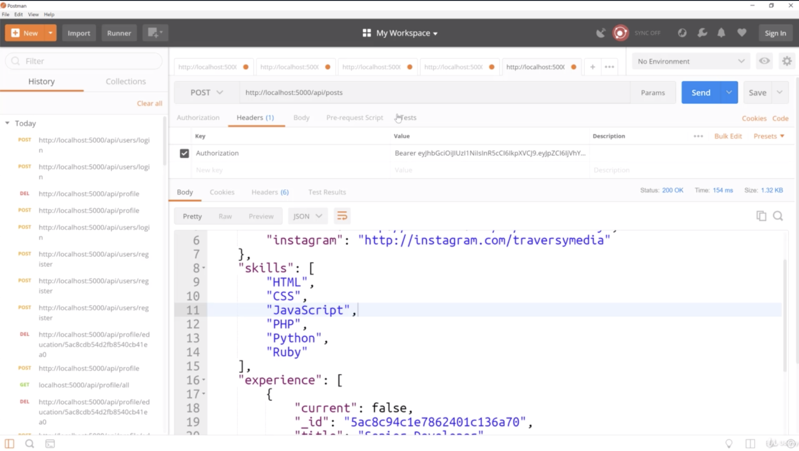

- once we get into our react application here, obviously we are not gonna have to manually add the token and stuff

we are gonna get it, it's gonna get stored in local storage and it will just sit there, it will be used as long as we are logged in

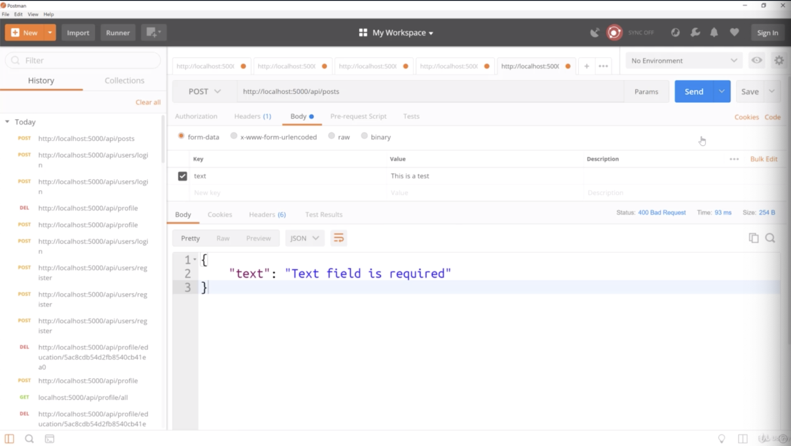

- we don't want this form-data, we want the stuff like picture 4

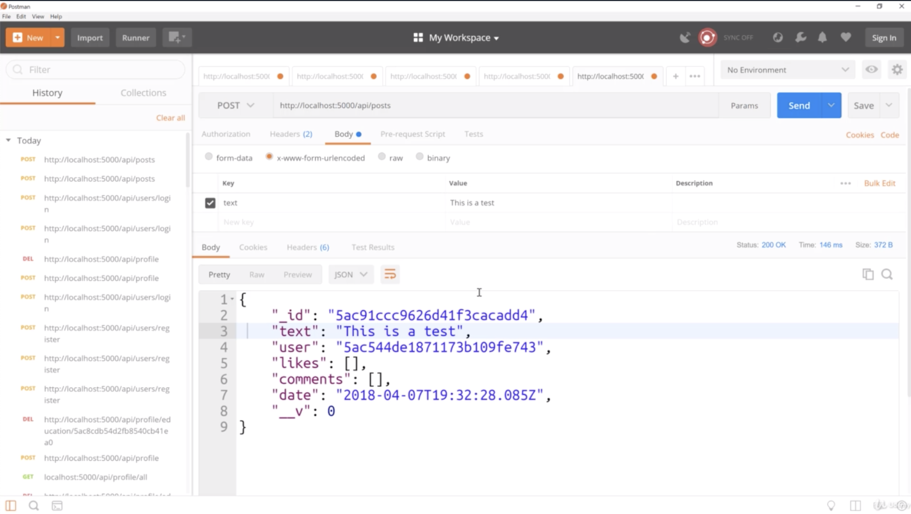

- it gets results

- we didn't add the avatar or name or anything like that. that's gonna come through our react application

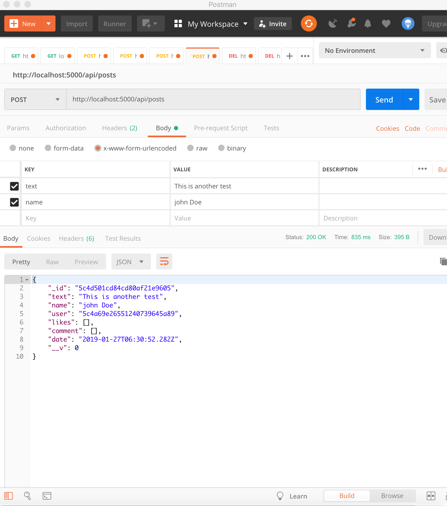

- but if we wanted to add another one, we can add it

```js
//routes/api/posts.js

const express = require('express');
const router = express.Router();
const mongoose = require('mongoose');
const passport = require('passport');

/**Post model */
const Post = require('../../models/Post');

/**Validation */
const validatePostInput = require('../../validation/post');
/**===================================================================== */

/**you don't need to say '/api/posts/test' 
 * because we already did in server.js 'app.use('/api/posts', posts);'
*/

/**res.json() is similar to res.send()
 * res.json() will automatically serve a status of 200 which means everything is OK
*/

/** @route             GET api/posts/test*/
/** @desc(description) Test posts route */
/** @access            Public */
router.get('/test', (req, res) => res.json({msg: "Posts Works"}));

/**-------------------------------------------------------------------- */

/** @route             POST api/posts*/
/** @desc              Create post */
/** @access            Private */

router.post('/', 
    passport.authenticate('jwt', { session: false }), 
    (req, res) => {
    /**initialize erros, isValid */

    const { errors, isValid } = validatePostInput(req.body);

    /**Check Validation */
    if(!isValid){
        /**If any errors, send 400 with errors object */
        return res.status(400).json(errors);
    }

    const newPost = new Post({
        /**even though it's comming from the body
         * the way that we are gonna do it and react is
         * we are gonna pull the name in the Avatar and the user from the user state
         * when the user is logged in,
         * redux is basically gonna keep that users information in the state
         * throughout the entire application as long as they are logged in
         * and we have access to it whenever we want
         * so when they submit a post, we are gonna pull it from redux,
         * they are not gonna type in their name and re-upload their avatar or anything like that
         */
        text: req.body.text,
        name: req.body.name,
        avatar: req.body.avatar,
        user: req.user.id
    });

    newPost.save().then(post => res.json(post));
});

module.exports = router;
```

```js
//validation/post.js

/**it has to be a string that you are validating
 * empty has to be a string
 */
const Validator = require('validator');
const isEmpty = require('./is-empty');

/**=========================================================================== */

/**we will be able to access this function from outside */
module.exports = function validatePostInput(data){
    /** we start off with an empty errors
     * and if everything passes it will still be empty at the end
     * and it will be valid
     * if not then "errors.name" will get filled and then it won't be empty
     * and it won't be valid
     * and
     * if(!isValid){ return res.status(400).json(errors); }
     * this will return all the errors
    */
    let errors = {};
    /**Nothing else is gonna be empty
     * because the avatar the name of that stuff that's comming in programatically
     * so it's not gonna be possible for it to be empty
     * so we don't have to check that so we check only text
     */
    data.text = !isEmpty(data.text) ? data.text : '';
/**----------------------------------------------------------------------- */

    if(!Validator.isLength(data.text, { min: 10, max: 300 })){
        errors.text = 'Post must be between 10 and 300 characters';
    }

    /**the problem is if your request is sent and they don't send the name,
     * it's not gonna be a empty string
     * that's what it needs to be for this isEmpty to work
     * because that's part of the validator
     * so this needs 'data.name = !isEmpty(data.name) ? data.name : '';'
     */

    if(Validator.isEmpty(data.text)){
        errors.text = 'Text field is invalid';
    }

/**----------------------------------------------------------------------- */
    return{
        errors,
        isValid: isEmpty(errors)
    }
}
```

\* Chapter 26: Get And Delete Post Routes
=========================================

1\. update

- posts.js(routes/api folder)

2.

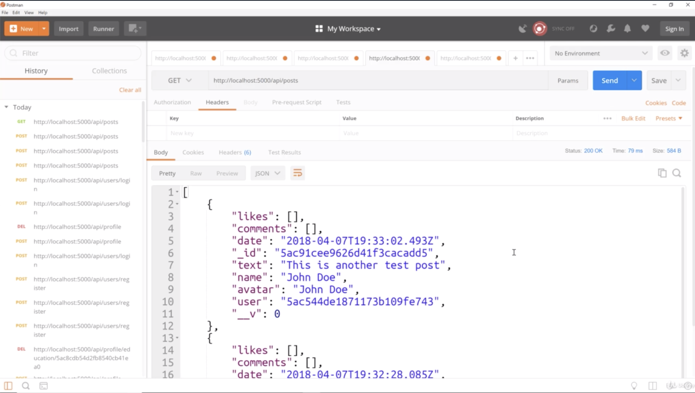

- we get an array of our 2 posts. so that works

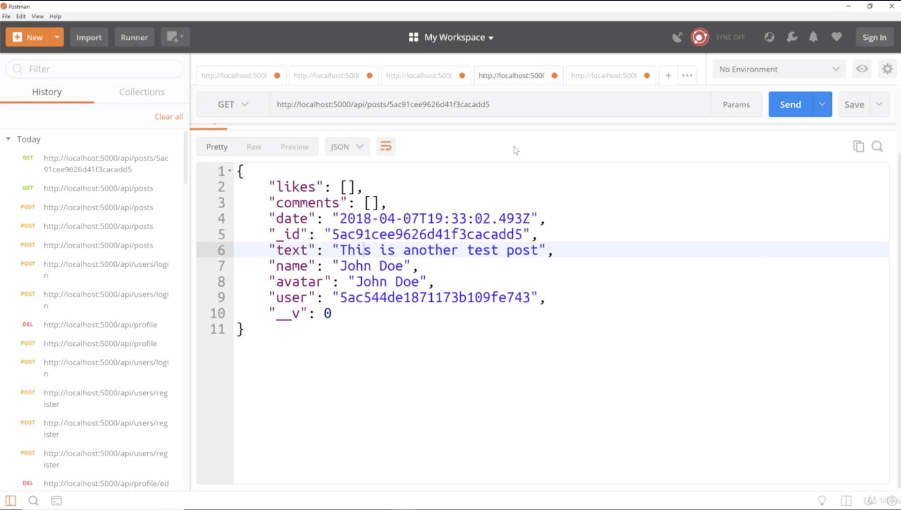

- if i copy \_id and past like "http://localhost:5000/api/posts/5c4d4febd84cd80af21e9604", then you can see as above

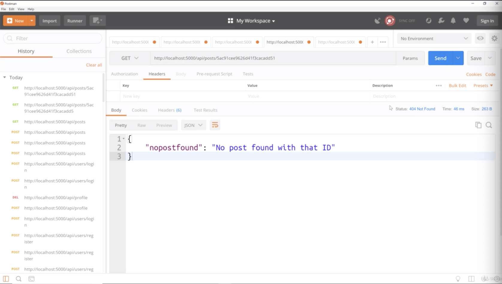

- if you type in \_id which doesn't exists like "http://localhost:5000/api/posts/5c4d4febd84cd80af21e9604s", then you can see as above

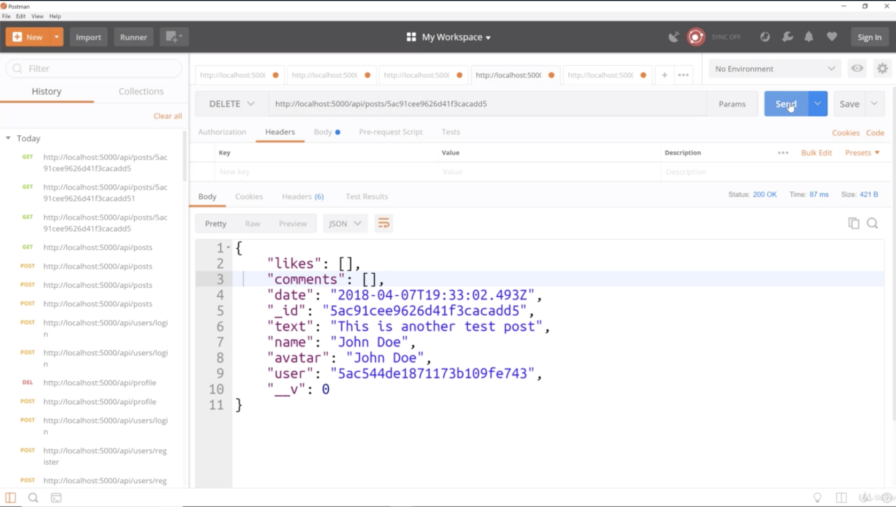

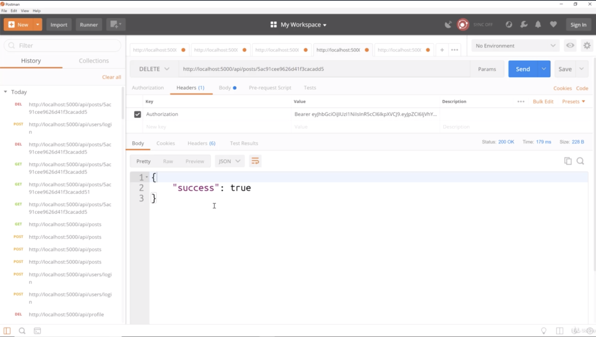

- that means that hopefully the post was deleted

```js
//routes/api/posts.js

const express = require('express');
const router = express.Router();
const mongoose = require('mongoose');
const passport = require('passport');

/**Post model */
const Post = require('../../models/Post');
/**Profile model */
const Profile = require('../../models/Profile');

/**Validation */
const validatePostInput = require('../../validation/post');
/**===================================================================== */

/**you don't need to say '/api/posts/test' 
 * because we already did in server.js 'app.use('/api/posts', posts);'
*/

/**res.json() is similar to res.send()
 * res.json() will automatically serve a status of 200 which means everything is OK
*/

/** @route             GET api/posts/test*/
/** @desc(description) Test posts route */
/** @access            Public */
router.get('/test', (req, res) => res.json({msg: "Posts Works"}));

/** @route             GET api/posts*/
/** @desc(description) Get posts */
/** @access            Public */
router.get('/', (req, res) => {
    Post.find()
    .sort({ date: -1 })
    .then(posts => res.json(posts))
    .catch(err => res.status(404).json({ nopostsfound: 'No posts found' }));
});

/** @route             GET api/posts/:id*/
/** @desc(description) Get posts by id */
/** @access            Public */
router.get('/:id', (req, res) => {
    Post.findById(req.params.id)
    .then(post => res.json(post))
    .catch(err => res.status(404).json({ nopostfound: 'No post found with that ID' }));
});

/**-------------------------------------------------------------------- */

/** @route             POST api/posts*/
/** @desc              Create post */
/** @access            Private */

router.post('/', 
    passport.authenticate('jwt', { session: false }), 
    (req, res) => {
    /**initialize erros, isValid */

    const { errors, isValid } = validatePostInput(req.body);

    /**Check Validation */
    if(!isValid){
        /**If any errors, send 400 with errors object */
        return res.status(400).json(errors);
    }

    const newPost = new Post({
        /**even though it's comming from the body
         * the way that we are gonna do it and react is
         * we are gonna pull the name in the Avatar and the user from the user state
         * when the user is logged in,
         * redux is basically gonna keep that users information in the state
         * throughout the entire application as long as they are logged in
         * and we have access to it whenever we want
         * so when they submit a post, we are gonna pull it from redux,
         * they are not gonna type in their name and re-upload their avatar or anything like that
         */
        text: req.body.text,
        name: req.body.name,
        avatar: req.body.avatar,
        user: req.user.id
    });

    newPost.save().then(post => res.json(post));
});

/** @route             DELETE api/posts/:id*/
/** @desc              Delete post*/
/** @access            Private */

router.delete('/:id', passport.authenticate('jwt', { session: false }), (req, res) => {
    /**this is the deleting which is owned by only user */
    Profile.findOne({ user: req.user.id })
    .then(profile => {
        Post.findById(req.params.id)
        .then(post => {
            /**Check for post owner */
            /**'post' has a user field but we want to compare this 
             * this is gonna be looked at as a string
            */
            if(post.user.toString() !== req.user.id){
                /**401 is authorization status or an unauthorized status */
                return res.status(401).json({ notauthorized: 'User not authorized' });
            }

            /**Delete */
            post.remove().then(() => res.json({ success: true }));
        }).catch(err => res.status(404).json({ postnotfound: 'No post found' }));
    })
});

module.exports = router;
```

\* Chapter 27: Post Like And Unlike Routes
==========================================

1\. update

- posts.js(routes/api folder)

2.

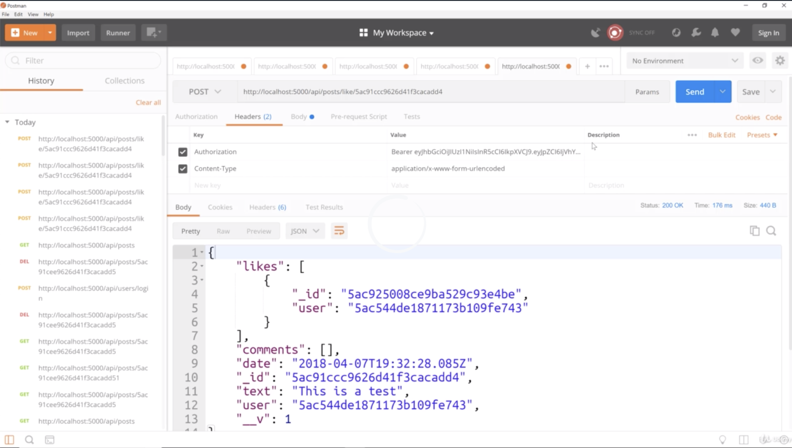

- we have likes array, we have an object with an ID each like will have its own ID and also has the user id

- the user's id which in this case is the creator of the post which is john doe's id and he just liked his own post

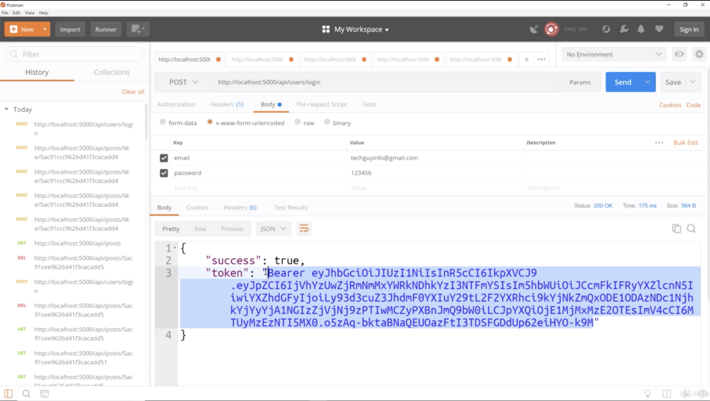

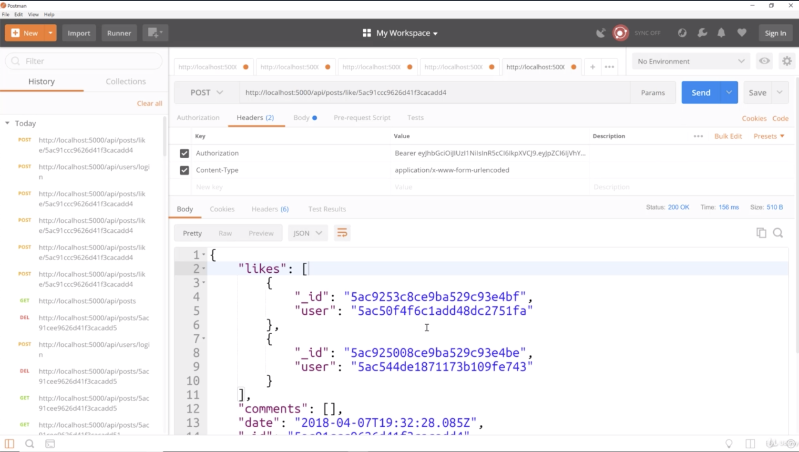

- if we like other user like Brad, new login and grab the new token

- and go to like route, change the token and we send

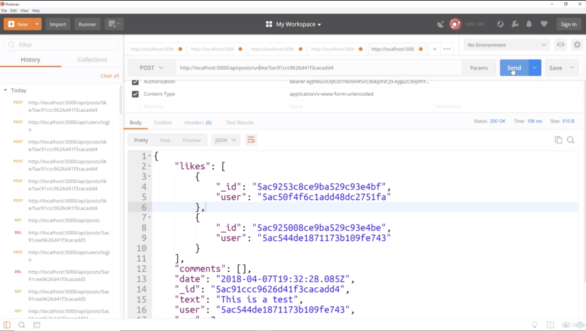

- you can see there's another like and the user is different. the user is brad's user or the techguyinfo

- So this post now has 2 likes which is pretty cool

-------------------------------------------------------------------------------------------


- now you can see that Brad's like has been removed

```js
//routes/api/posts.js

const express = require('express');
const router = express.Router();
const mongoose = require('mongoose');
const passport = require('passport');

/**Post model */
const Post = require('../../models/Post');
/**Profile model */
const Profile = require('../../models/Profile');

/**Validation */
const validatePostInput = require('../../validation/post');
/**===================================================================== */

/**you don't need to say '/api/posts/test' 
 * because we already did in server.js 'app.use('/api/posts', posts);'
*/

/**res.json() is similar to res.send()
 * res.json() will automatically serve a status of 200 which means everything is OK
*/

/** @route             GET api/posts/test*/
/** @desc(description) Test posts route */
/** @access            Public */
router.get('/test', (req, res) => res.json({msg: "Posts Works"}));

/** @route             GET api/posts*/
/** @desc(description) Get posts */
/** @access            Public */
router.get('/', (req, res) => {
    Post.find()
    .sort({ date: -1 })
    .then(posts => res.json(posts))
    .catch(err => res.status(404).json({ nopostsfound: 'No posts found' }));
});

/** @route             GET api/posts/:id*/
/** @desc(description) Get posts by id */
/** @access            Public */
router.get('/:id', (req, res) => {
    Post.findById(req.params.id)
    .then(post => res.json(post))
    .catch(err => res.status(404).json({ nopostfound: 'No post found with that ID' }));
});

/**-------------------------------------------------------------------- */

/** @route             POST api/posts*/
/** @desc              Create post */
/** @access            Private */

router.post('/', 
    passport.authenticate('jwt', { session: false }), 
    (req, res) => {
    /**initialize erros, isValid */

    const { errors, isValid } = validatePostInput(req.body);

    /**Check Validation */
    if(!isValid){
        /**If any errors, send 400 with errors object */
        return res.status(400).json(errors);
    }

    const newPost = new Post({
        /**even though it's comming from the body
         * the way that we are gonna do it and react is
         * we are gonna pull the name in the Avatar and the user from the user state
         * when the user is logged in,
         * redux is basically gonna keep that users information in the state
         * throughout the entire application as long as they are logged in
         * and we have access to it whenever we want
         * so when they submit a post, we are gonna pull it from redux,
         * they are not gonna type in their name and re-upload their avatar or anything like that
         */
        text: req.body.text,
        name: req.body.name,
        avatar: req.body.avatar,
        user: req.user.id
    });

    newPost.save().then(post => res.json(post));
});

/** @route             POST api/posts/like/:id*/
/** @desc              Like post*/
/** @access            Private */

router.post('/like/:id', passport.authenticate('jwt', { session: false }), (req, res) => {
    /**this is the deleting which is owned by only user */
    Profile.findOne({ user: req.user.id })
    .then(profile => {
        Post.findById(req.params.id)
        .then(post => {
            /**we need to check to see if the user has already liked this post */
            /**
             * what this means is that the user has already liked it
             * because it's already there his ID already in this array(post.likes)
             */
            if(post.likes.filter(like => like.user.toString() === req.user.id).length > 0){
                return res.status(400).json( {alreadyliked: 'User already liked this post'} );
            }

            /**Add user Id to likes array */
            post.likes.unshift({ user: req.user.id });

            post.save().then(post => res.json(post));
        }).catch(err => res.status(404).json({ postnotfound: 'No post found' }));
    })
});

/** @route             POST api/posts/unlike/:id*/
/** @desc              unlike post*/
/** @access            Private */

router.post('/unlike/:id', passport.authenticate('jwt', { session: false }), (req, res) => {
    /**this is the deleting which is owned by only user */
    Profile.findOne({ user: req.user.id })
    .then(profile => {
        Post.findById(req.params.id)
        .then(post => {
            /** ' === 0 ' means if it equals zero then that means they are not there 
             * if they are not there, then we wanna basically say an error that says you have not yet liked this post
            */
            if(post.likes.filter(like => like.user.toString() === req.user.id).length === 0){
                return res.status(400).json( {notliked: 'you have not yet liked this post'} );
            }

            /*Get remove index */
            const removeIndex = post.likes
                .map(item => item.user.toString())
                .indexOf(req.user.id)

            /** Splice out of array 
             * wa want to remove 1 from removeIndex
            */
            post.likes.splice(removeIndex, 1);

            /** Save */
            post.save().then(post => res.json(post))

            post.save().then(post => res.json(post));
        }).catch(err => res.status(404).json({ postnotfound: 'No post found' }));
    })
});

/**------------------------------------------------------------------------------------------------ */

/** @route             DELETE api/posts/:id*/
/** @desc              Delete post*/
/** @access            Private */

router.delete('/:id', passport.authenticate('jwt', { session: false }), (req, res) => {
    /**this is the deleting which is owned by only user */
    Profile.findOne({ user: req.user.id })
    .then(profile => {
        Post.findById(req.params.id)
        .then(post => {
            /**Check for post owner */
            /**'post' has a user field but we want to compare this 
             * this is gonna be looked at as a string
            */
            if(post.user.toString() !== req.user.id){
                /**401 is authorization status or an unauthorized status */
                return res.status(401).json({ notauthorized: 'User not authorized' });
            }

            /**Delete */
            post.remove().then(() => res.json({ success: true }));
        }).catch(err => res.status(404).json({ postnotfound: 'No post found' }));
    })
});


module.exports = router;
```

\* Chapter 28: Add And Remove Comment Routes
============================================

1\. update

- posts.js(routes/api folder)

2.

\*\*you need to be care about what user or id you are logging in. this cause errors in postman

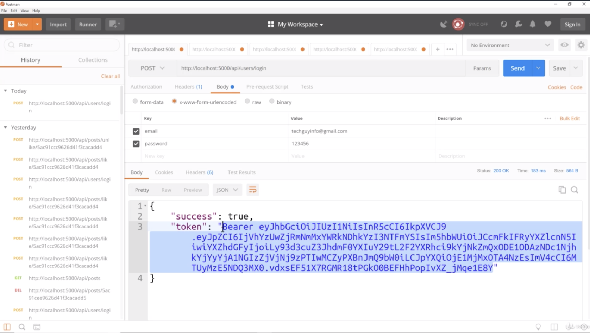

- let's log in as Brad, grab the token

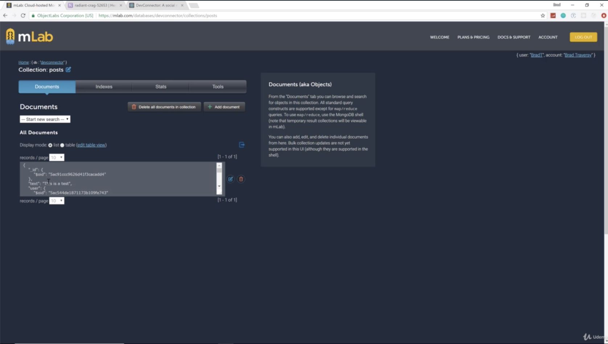

- we have only one post and \_id is ended with "d4" let's use this \_id


- create new tab.

- Authorization on Header

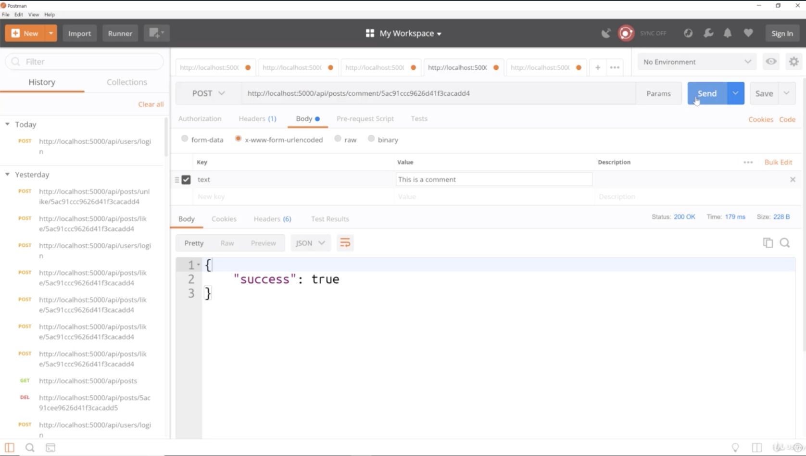

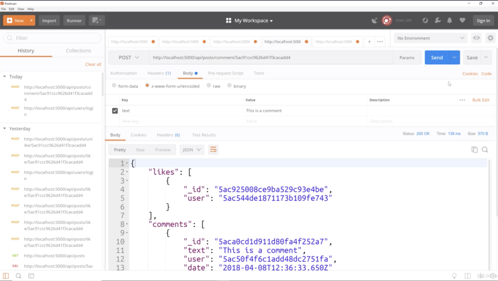

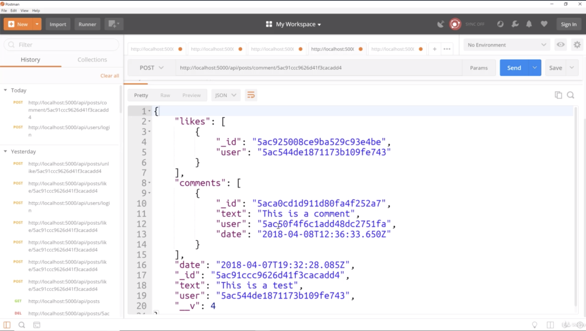

- go to body, what we really need is comment. 

- so, it gives us the post back and take a look at the comments, has an object with an ID and this is a comment automatically has the user and the date

- when we build our front end application, the comment it will also have the name and the avatar along with it

but the text is all that's actually required from the server

-----------------------------------------------------------

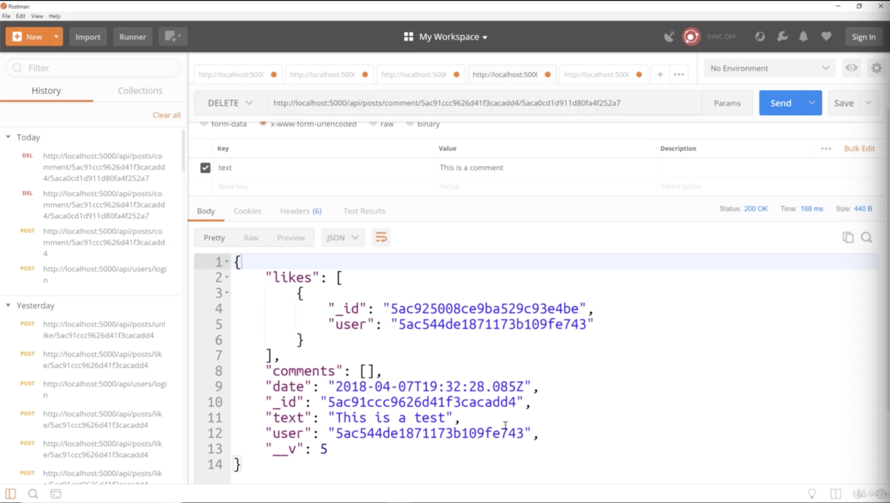

- now the comments are now the empty because we deleted that comment

```js
//routes/api/posts.js

const express = require('express');
const router = express.Router();
const mongoose = require('mongoose');
const passport = require('passport');

/**Post model */
const Post = require('../../models/Post');
/**Profile model */
const Profile = require('../../models/Profile');

/**Validation */
const validatePostInput = require('../../validation/post');
/**===================================================================== */

/**you don't need to say '/api/posts/test' 
 * because we already did in server.js 'app.use('/api/posts', posts);'
*/

/**res.json() is similar to res.send()
 * res.json() will automatically serve a status of 200 which means everything is OK
*/

/** @route             GET api/posts/test*/
/** @desc(description) Test posts route */
/** @access            Public */
router.get('/test', (req, res) => res.json({msg: "Posts Works"}));

/** @route             GET api/posts*/
/** @desc(description) Get posts */
/** @access            Public */
router.get('/', (req, res) => {
    Post.find()
    .sort({ date: -1 })
    .then(posts => res.json(posts))
    .catch(err => res.status(404).json({ nopostsfound: 'No posts found' }));
});

/** @route             GET api/posts/:id*/
/** @desc(description) Get posts by id */
/** @access            Public */
router.get('/:id', (req, res) => {
    Post.findById(req.params.id)
    .then(post => res.json(post))
    .catch(err => res.status(404).json({ nopostfound: 'No post found with that ID' }));
});

/**-------------------------------------------------------------------- */

/** @route             POST api/posts*/
/** @desc              Create post */
/** @access            Private */

router.post('/', 
    passport.authenticate('jwt', { session: false }), 
    (req, res) => {
    /**initialize erros, isValid */

    const { errors, isValid } = validatePostInput(req.body);

    /**Check Validation */
    if(!isValid){
        /**If any errors, send 400 with errors object */
        return res.status(400).json(errors);
    }

    const newPost = new Post({
        /**even though it's comming from the body
         * the way that we are gonna do it and react is
         * we are gonna pull the name in the Avatar and the user from the user state
         * when the user is logged in,
         * redux is basically gonna keep that users information in the state
         * throughout the entire application as long as they are logged in
         * and we have access to it whenever we want
         * so when they submit a post, we are gonna pull it from redux,
         * they are not gonna type in their name and re-upload their avatar or anything like that
         */
        text: req.body.text,
        name: req.body.name,
        avatar: req.body.avatar,
        user: req.user.id
    });

    newPost.save().then(post => res.json(post));
});

/** @route             POST api/posts/like/:id*/
/** @desc              Like post*/
/** @access            Private */

router.post('/like/:id', passport.authenticate('jwt', { session: false }), (req, res) => {
    /**this is the deleting which is owned by only user */
    Profile.findOne({ user: req.user.id })
    .then(profile => {
        Post.findById(req.params.id)
        .then(post => {
            /**we need to check to see if the user has already liked this post */
            /**
             * what this means is that the user has already liked it
             * because it's already there his ID already in this array(post.likes)
             */
            if(post.likes.filter(like => like.user.toString() === req.user.id).length > 0){
                return res.status(400).json( {alreadyliked: 'User already liked this post'} );
            }

            /**Add user Id to likes array */
            post.likes.unshift({ user: req.user.id });

            post.save().then(post => res.json(post));
        }).catch(err => res.status(404).json({ postnotfound: 'No post found' }));
    })
});

/** @route             POST api/posts/unlike/:id*/
/** @desc              unlike post*/
/** @access            Private */

router.post('/unlike/:id', passport.authenticate('jwt', { session: false }), (req, res) => {
    /**this is the deleting which is owned by only user */
    Profile.findOne({ user: req.user.id })
    .then(profile => {
        Post.findById(req.params.id)
        .then(post => {
            /** ' === 0 ' means if it equals zero then that means they are not there 
             * if they are not there, then we wanna basically say an error that says you have not yet liked this post
            */
            if(post.likes.filter(like => like.user.toString() === req.user.id).length === 0){
                return res.status(400).json( {notliked: 'you have not yet liked this post'} );
            }

            /*Get remove index */
            const removeIndex = post.likes
                .map(item => item.user.toString())
                .indexOf(req.user.id)

            /** Splice out of array 
             * wa want to remove 1 from removeIndex
            */
            post.likes.splice(removeIndex, 1);

            /** Save */
            post.save().then(post => res.json(post))

            post.save().then(post => res.json(post));
        }).catch(err => res.status(404).json({ postnotfound: 'No post found' }));
    })
});

/** @route             POST api/posts/comment/:id*/
/** @desc              Add comment to post*/
/** @access            Private */
router.post('/comment/:id', 
    passport.authenticate('jwt', { session: false }), 
    (req, res) => {

    /** all we really need to validate here is the text
     * because it has the same fields as a post
     * so we don't even have to worry about doing that part
     * so we will go ahead and copy what we did up here
     */
    const { errors, isValid } = validatePostInput(req.body);

    /**Check Validation */
    if(!isValid){
        /**If any errors, send 400 with errors object */
        return res.status(400).json(errors);
    }

    Post.findById(req.params.id)
        .then(post => {
            const newComment = {
                text: req.body.text,
                name: req.body.name,
                avatar: req.body.avatar,
                user: req.user.id
            };

            /**Add to comments array */
            post.comments.unshift(newComment);

            /**Save */
            post.save().then(post => res.json(post))
        })
        .catch(err => res.status(404).json({ postnotfound: 'No post found' }));
})

/**------------------------------------------------------------------------------------------------ */

/** @route             DELETE api/posts/:id*/
/** @desc              Delete post*/
/** @access            Private */

router.delete('/:id', passport.authenticate('jwt', { session: false }), (req, res) => {
    /**this is the deleting which is owned by only user */
    Profile.findOne({ user: req.user.id })
    .then(profile => {
        Post.findById(req.params.id)
        .then(post => {
            /**Check for post owner */
            /**'post' has a user field but we want to compare this 
             * this is gonna be looked at as a string
            */
            if(post.user.toString() !== req.user.id){
                /**401 is authorization status or an unauthorized status */
                return res.status(401).json({ notauthorized: 'User not authorized' });
            }

            /**Delete */
            post.remove().then(() => res.json({ success: true }));
        }).catch(err => res.status(404).json({ postnotfound: 'No post found' }));
    })
});

/** @route             DELETE api/posts/comment/:id/:comment_id*/
/** @desc              Remove comment from post*/
/** @access            Private */
router.delete('/comment/:id/:comment_id', 
    passport.authenticate('jwt', { session: false }), 
    (req, res) => {
    Post.findById(req.params.id)
        .then(post => {
            /**Check to see if comment exists */
            if(post.comments.filter(comment => comment._id.toString() === req.params.comment_id).length === 0){
                return res.status(404).json({ commentnotexist: 'Comment does not exist' });
            }
            /**Get remove index */
            const removeIndex = post.comments
                .map(item => item._id.toString())
                /**that will give us the correct comment to remove */
                .indexOf(req.params.comment_id);
            /**Splice comment out of array */
            post.comments.splice(removeIndex, 1);

            post.save().then(post => res.json(post));
        })
        .catch(err => res.status(404).json({ postnotfound: 'No post found' }));
})


module.exports = router;
```