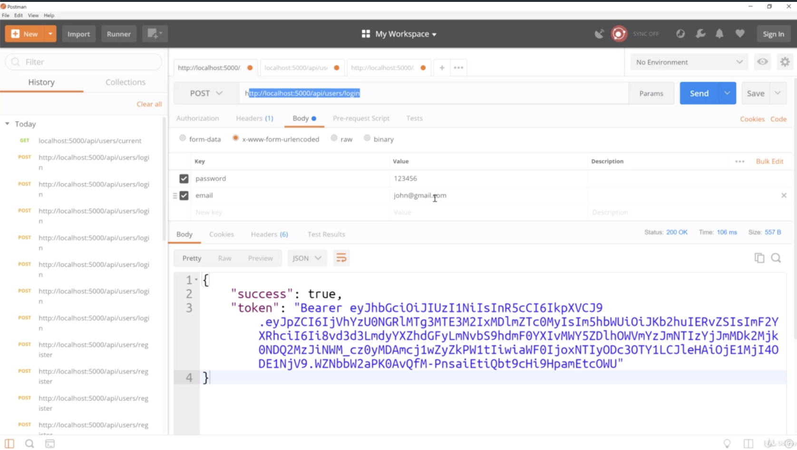
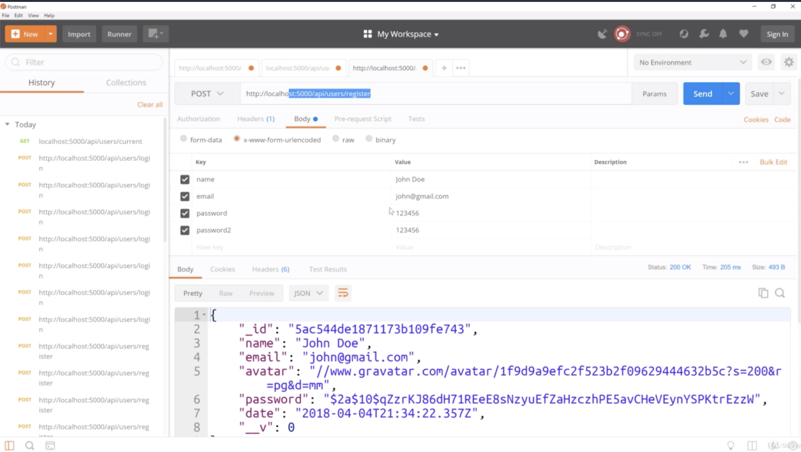
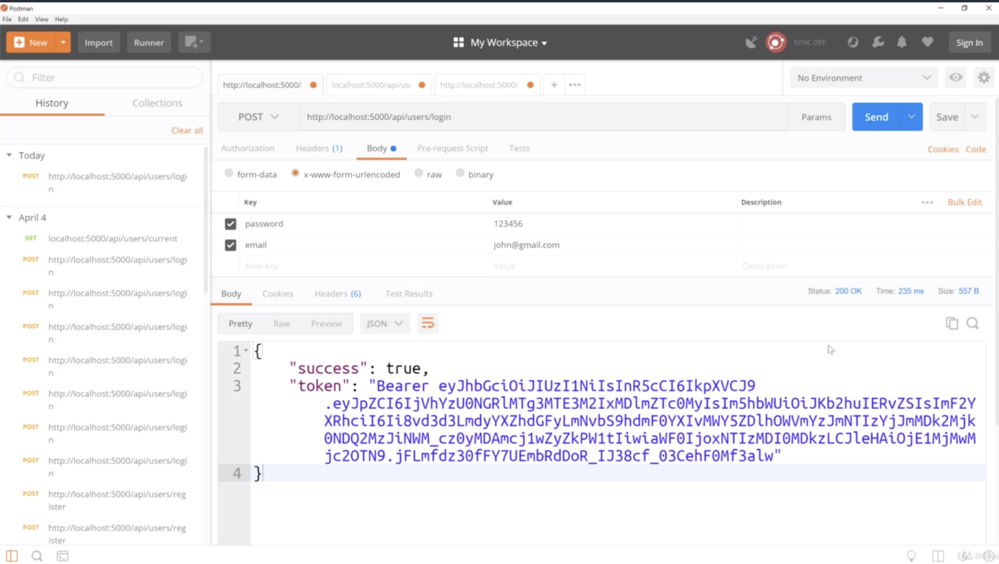
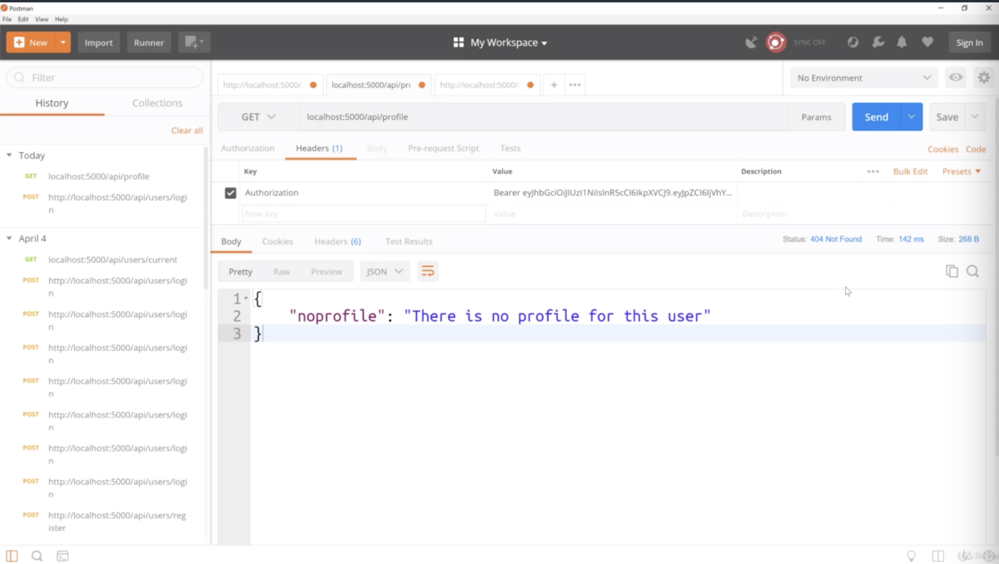

- chapter 18
1. update
- profile.js(route/api folder)

2. 

- if you don't have this tab, put in "http://localhost:5000/api/users/login"
- and then you can login someone that you registered

if you don't have user, then you go to "http://localhost:5000/api/users/register"
and then fill out name, email, password, password2

- picture 1 is already expired. So we click send and get a new token

- and then grab that new token then go to "localhost:5000/api/profile"
- now this is what exactly we should be getting because we have not set up a profile 
- the way this app is gonna works is once you register, it will take you to your dashboard, but you are not gonna have profile yet
- what it will do is if you don't have a profile, if it gets this response which is 404,  
you are then gonna see a button or paragraph that says "you don't have a profile and then a button that says 'Create Profile'" 
Then it will take you to the form
