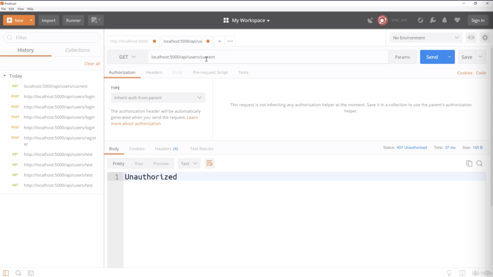
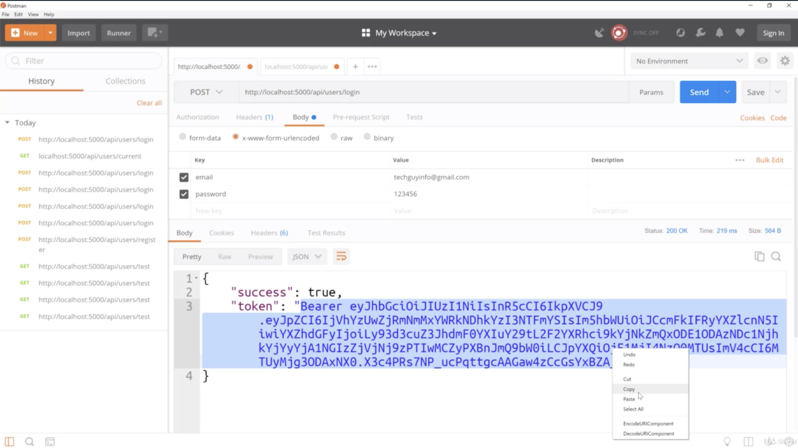
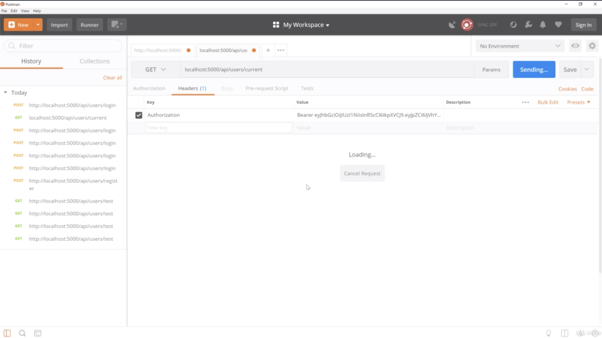
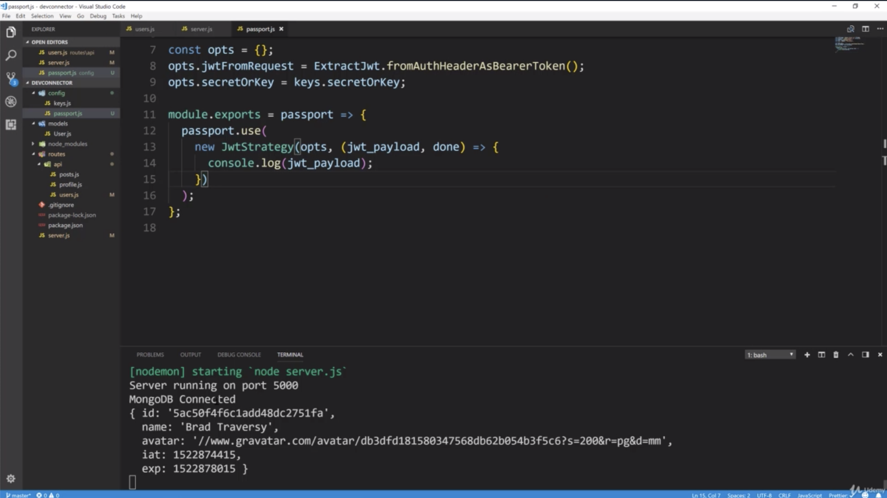
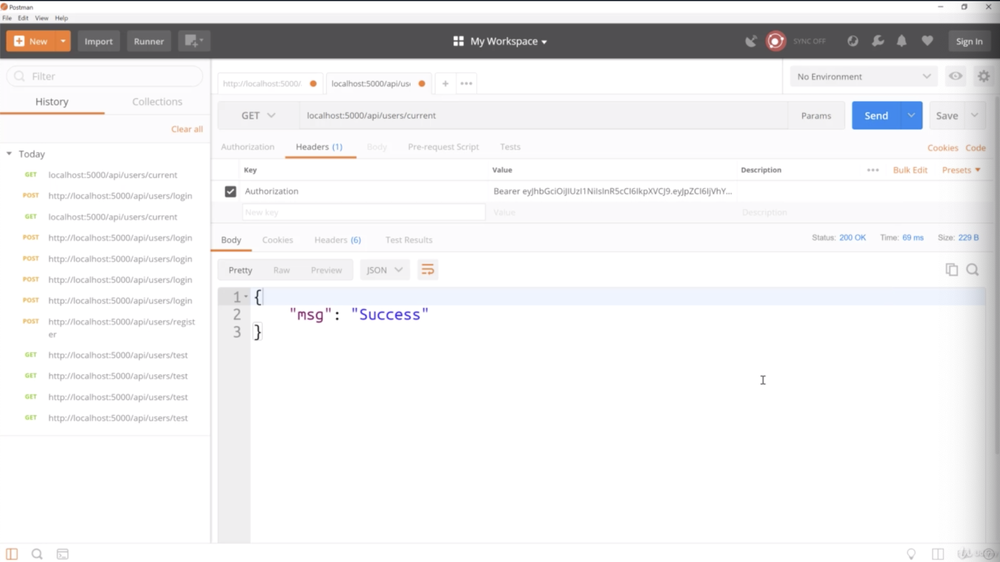
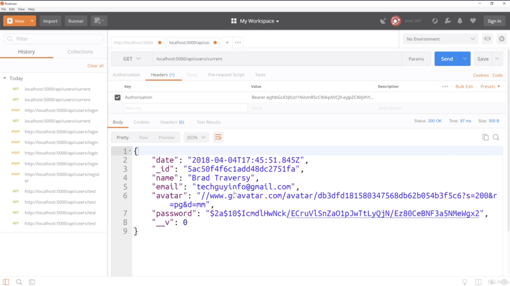
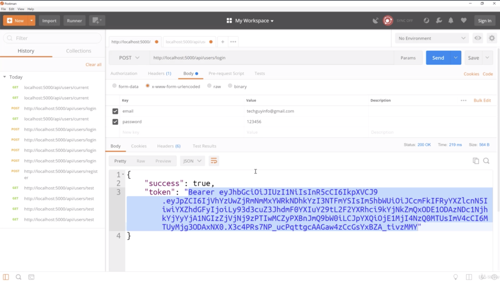
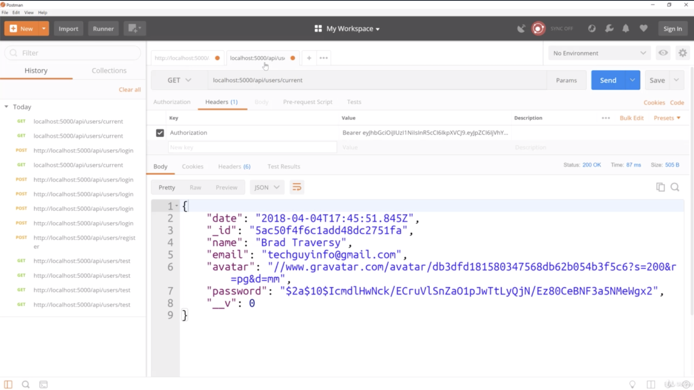
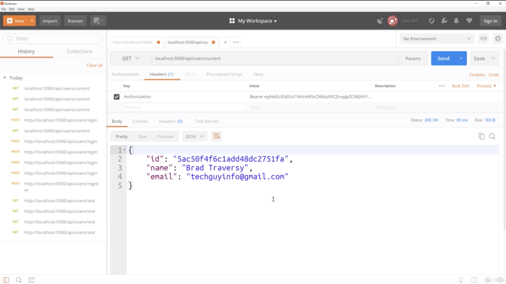

2.

- that's perfect because we didn't send a token to access private route 
this is private, it's unauthorized without the token

- this is the valid login. that's why i got this.

- we will go back to where we are trying to access a protected route
- Notice that we are logging the payload from the token which has the ID the name the avatar 
and then it also adds on the expiration and this is the issued at time and this is the expiration
- So this is working perfectly
- you can see we are getting the payload from the token

- after doing passport.js, then it works well it says "success"

- the way we can access the user from that route instead of sending success if we wanna send the user 
the user is now in req.user

- we logged in with this tab and we got the token for this user

- then we tried to access a protected row. we first did it without the token you it was unauthorized 
then we added the correct token. and now it's responding with the user
- if this is out like "unauthorized", then re-send picture 7 "http://localhost:5000/api/users/login"
- now i'm not gonna keep this as our response because we don't wanna send like the password even though it's a hash 
we don't wanna send this back 

