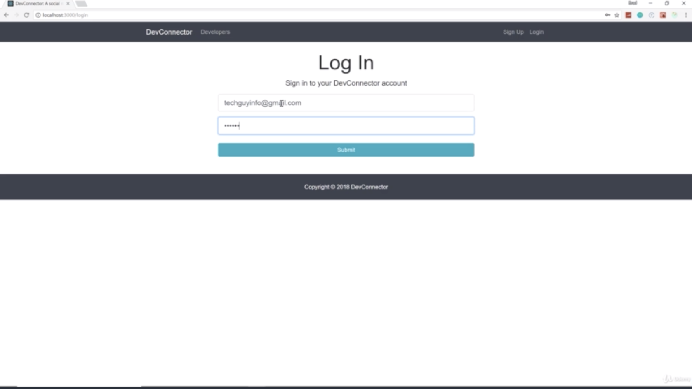
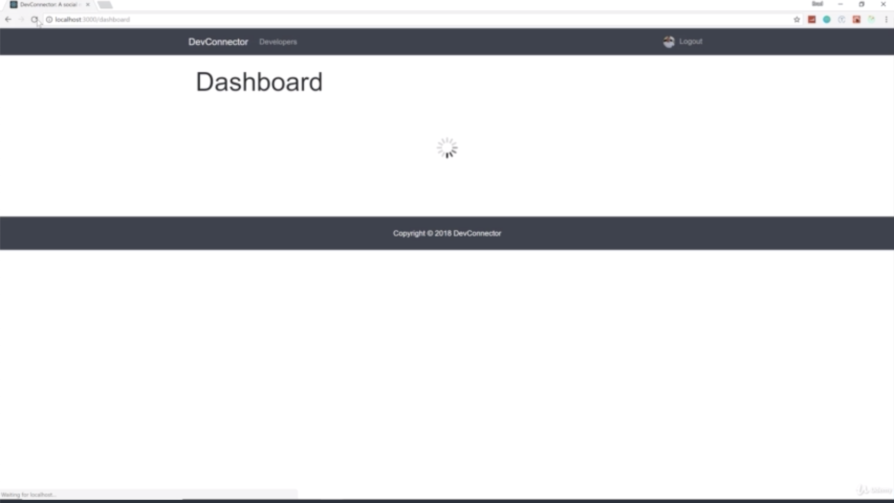
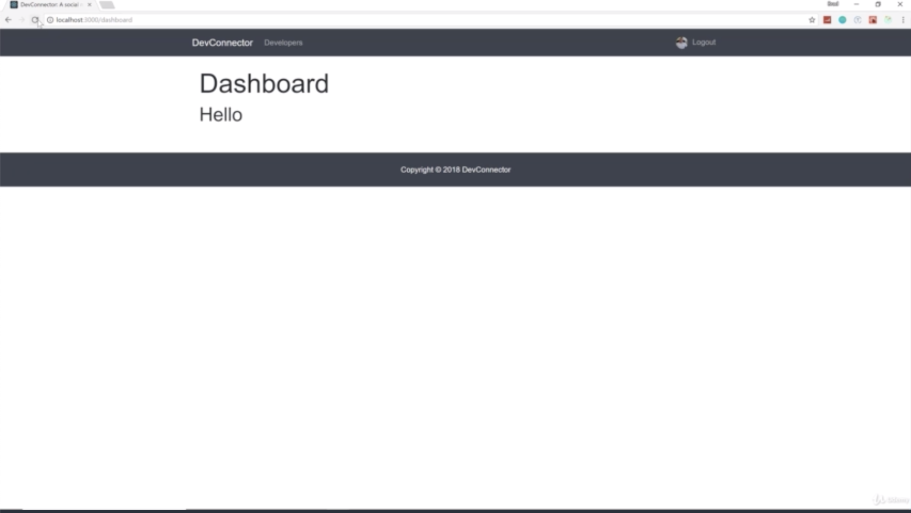
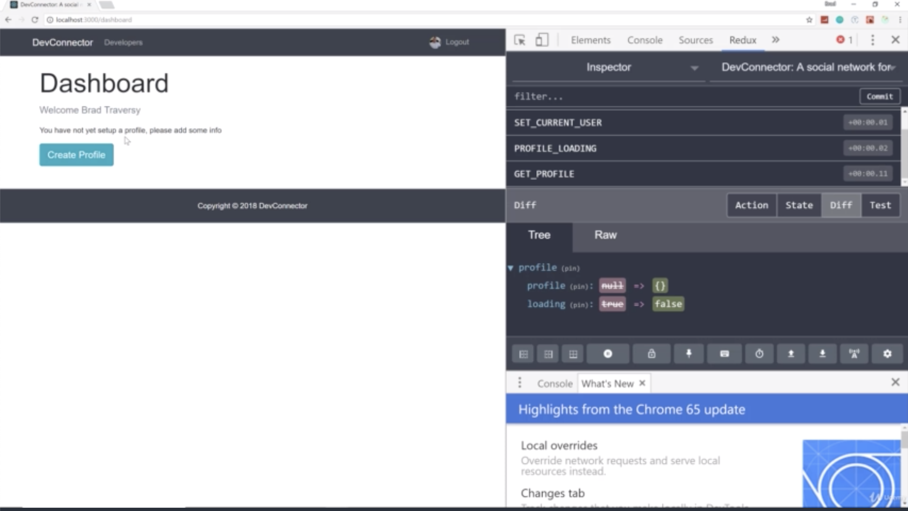
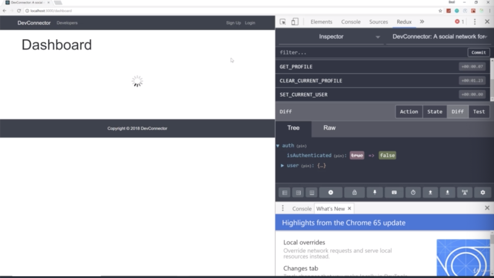

- chapter 47
1. update
- Dashboard.js(components/dashboard folder)
- spinner.gif(components/common folder)
- Spinner.js(components/common folder)

2.

- we log in and get Hello. 
- when we reload, it flash a few seconds seen 'Loading...' because initially when before it gets called, it calls loading.
- we are also checking to see if it's null. so if it's loading, it's gonna just output loading for now.
- instead of saying Loading..., i wanna have a spinner which is the GIF image and we are gonna create a spinner component  

- you can see that spinner and after that, also see Hello

- this is how we want this to work

- you can see the spinner when i reload

- if you logout, then spinner keep spinning because it's looking for a profile which is null.
- we need to set up a private route because we don't want this to happen
