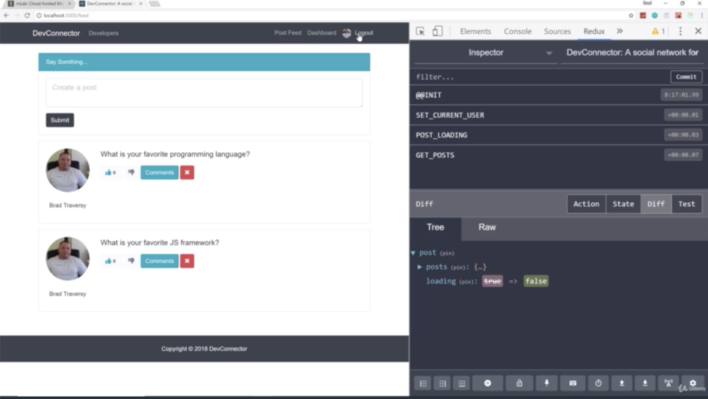
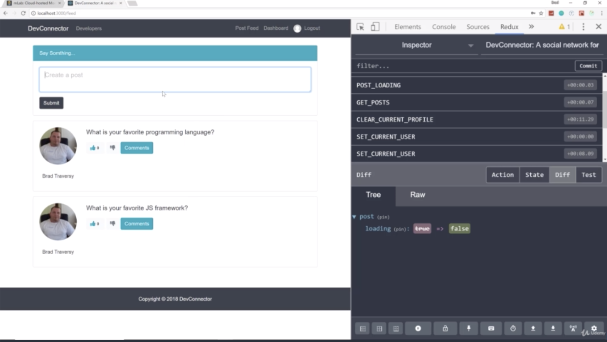
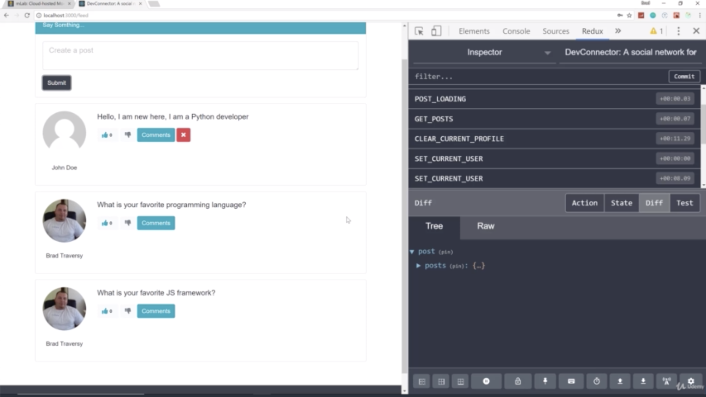
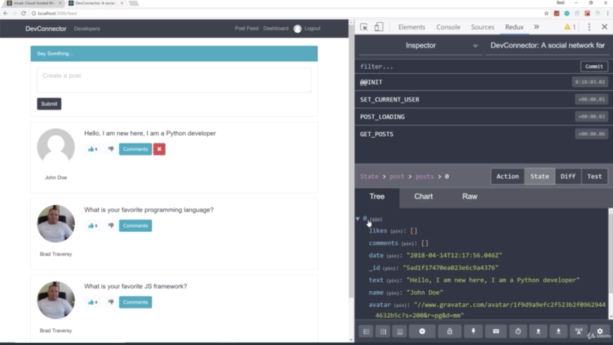

- chapter 70
1. update
- PostItem.js(components/posts folder)

2.

- when login with user who write comment, then we can see delete button
- but when login with user who doesn't write comment, then we can see no delete button

- it gets added to our post right away
- and if reload, it's still there

- we have no likes because there's no likes in likes array in redux(empty array)
