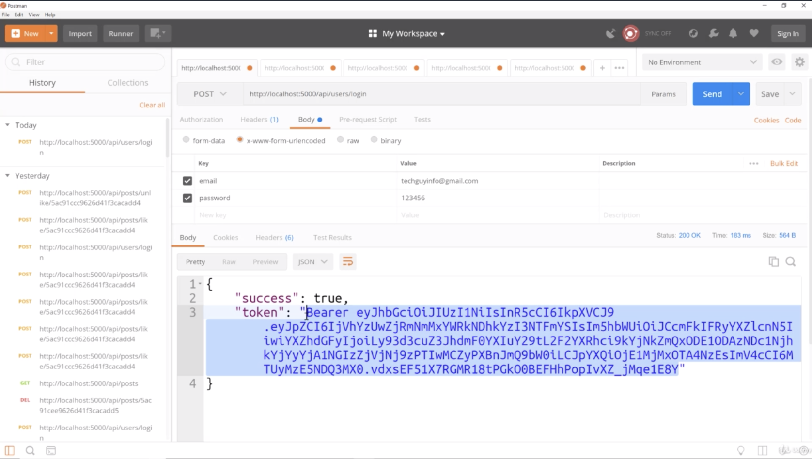
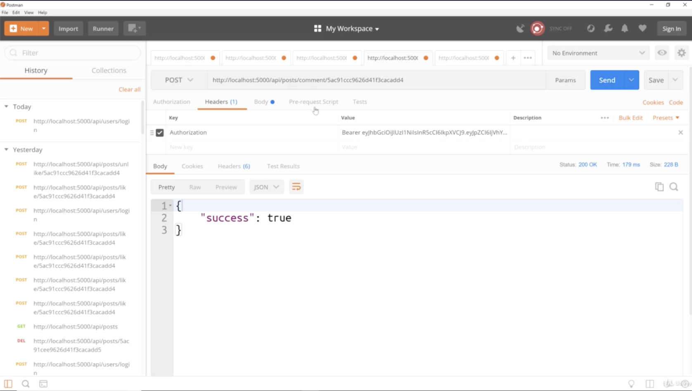
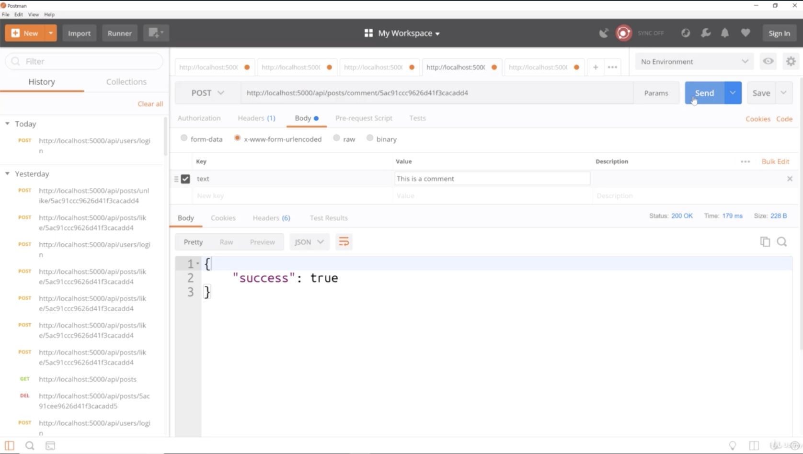
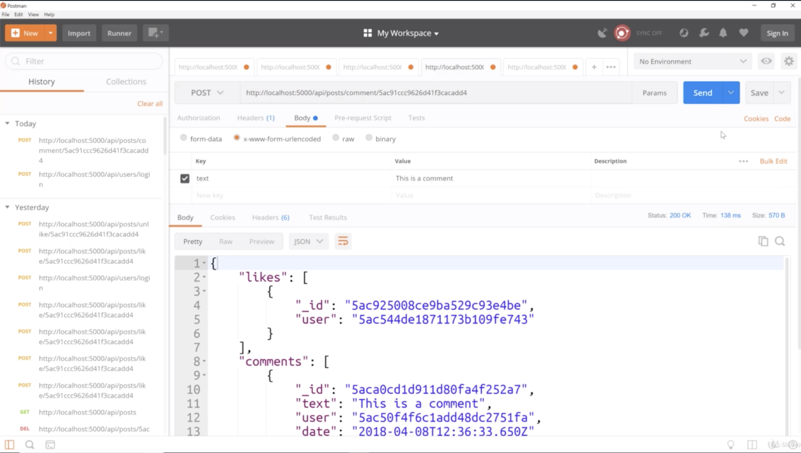
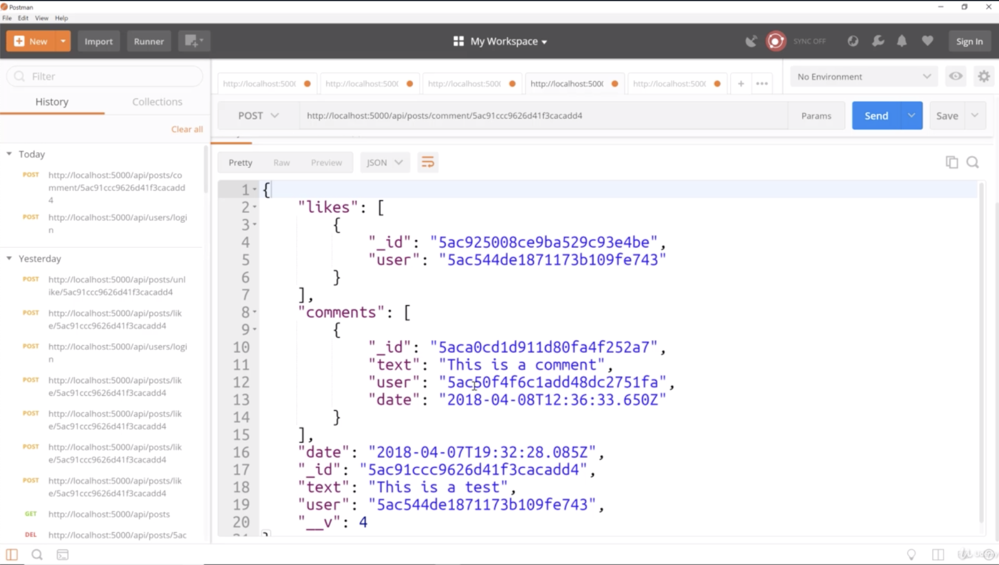
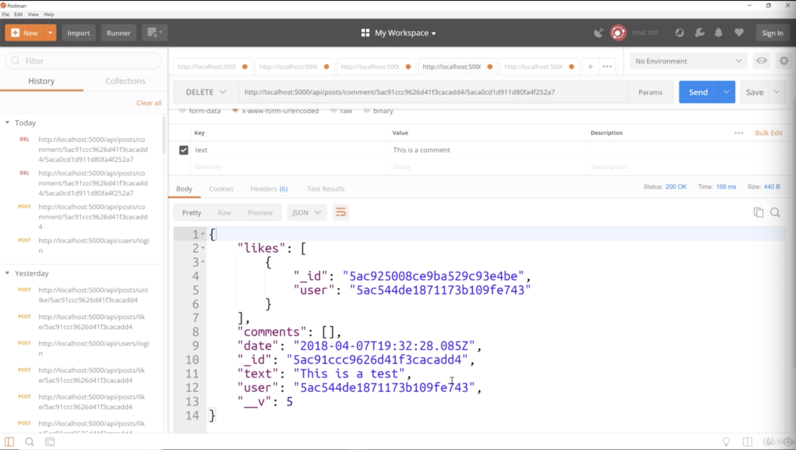

- chapter 28
1. update
- posts.js(routes/api folder)

2.
**you need to be care about what user or id you are logging in. this cause errors in postman

- let's log in as Brad, grab the token

- we have only one post and _id is ended with "d4" let's use this _id

- create new tab.
- Authorization on Header

- go to body, what we really need is comment. 
- so, it gives us the post back and take a look at the comments, has an object with an ID and this is a comment automatically has the user and the date
- when we build our front end application, the comment it will also have the name and the avatar along with it 
but the text is all that's actually required from the server
 -----------------------------------------------------------

- now the comments are now the empty because we deleted that comment
