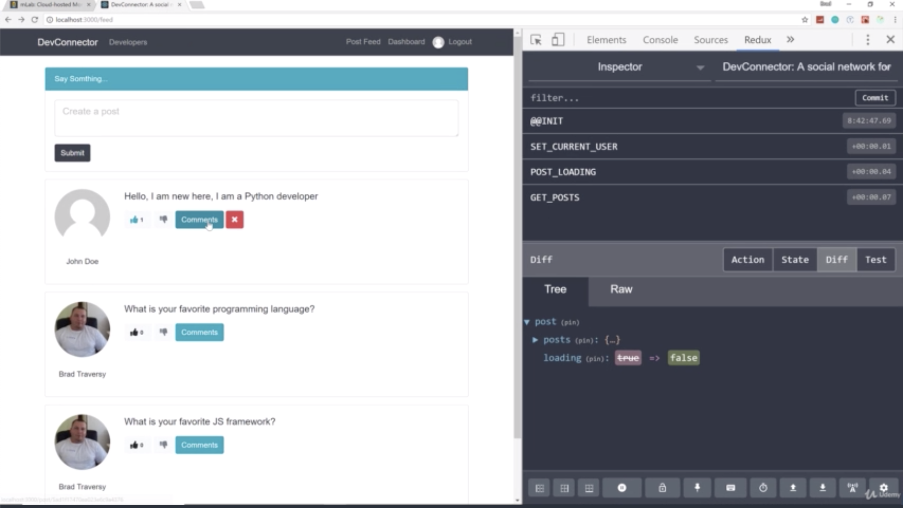
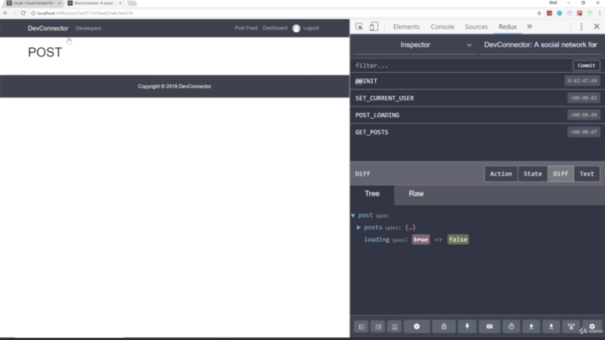
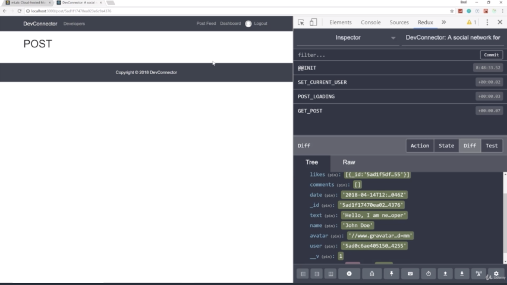
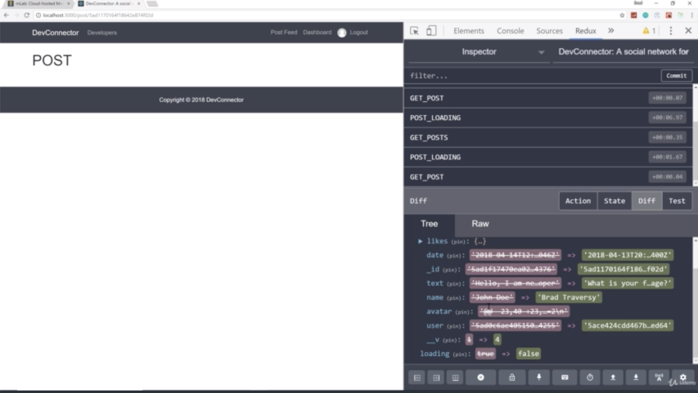
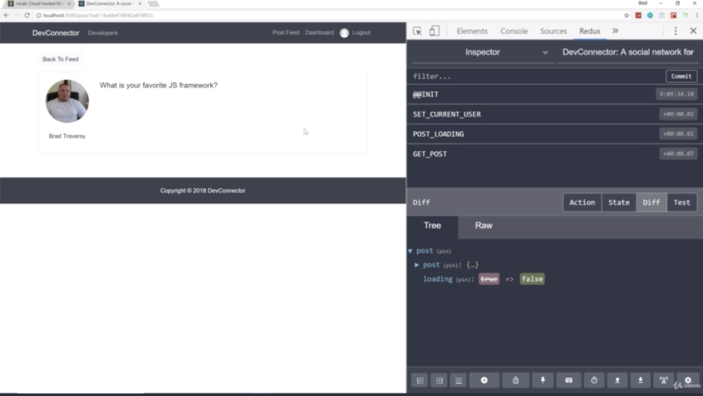

- chapter 72
1. update
- Post.js(components/post folder)
- App.js
- postActions.js(actions folder)
- postReducer.js(reducers folder)
- PostItem.js(components/posts folder)

2.

- when we click on the comments button, it takes us to the actual Post component

- if you look in post, we have the post

- if we go to another one, we can see that it's changed from the last one to the new one

- now it's showing the post item and you can see the actinos are not showing. when we go to single post they're not
