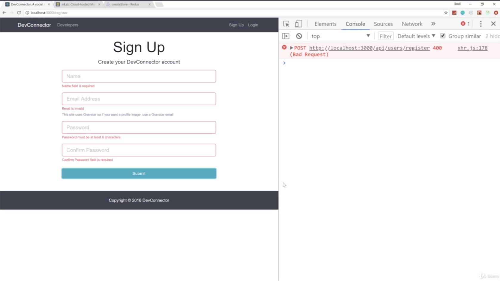
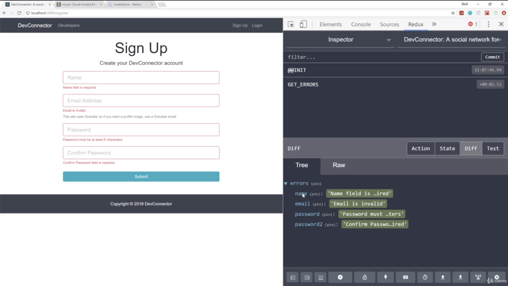
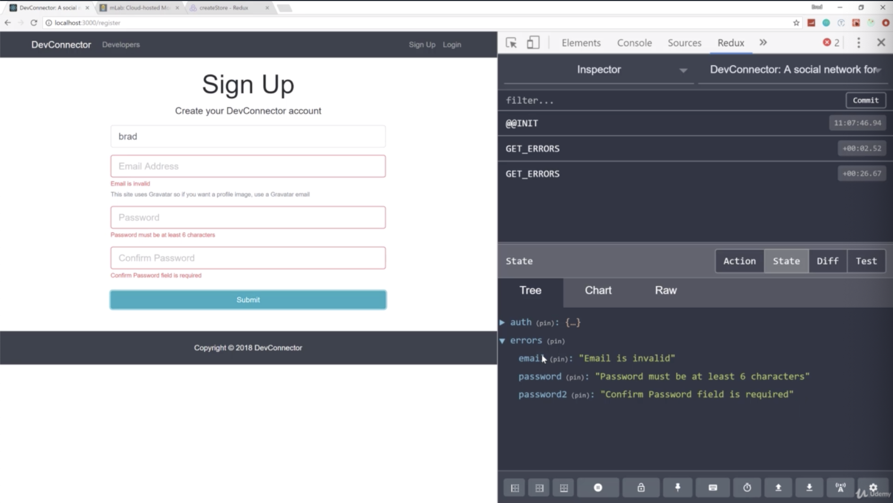
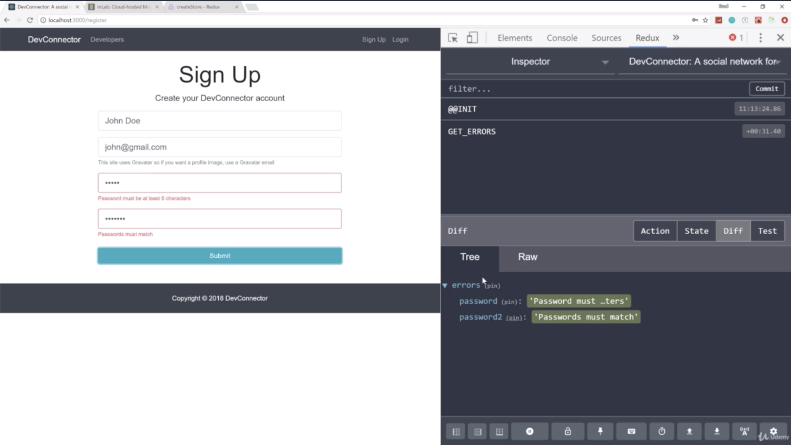
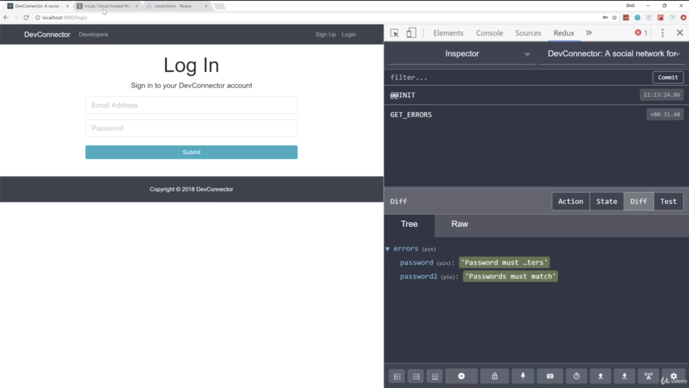

- chapter 41
1. update
- authActions.js(actions folder)
- Register.js(components/auth folder)
- types.js (actions folder)
- authReducer.js(reducers folder)
- errorReducer.js(reducers folder)
- index.js(reducers folder)

2.

- if we don't fill, the form doesn't work
- look at the redux, the errors are actually in redux instead of just stored in our component

- but when we fill name field, the name error has gone away
- you can see 'GET_ERRORS' the action.type is called everytime i submit this

- go to mLab, get rid of any users we have if there are any apps

- let's go back and register. let's try not to match the passwords. Errors are working you can see the error state gets filled

- if passwords is matched, then now go to mLab, we can register a user and it's all happening through our redux action
