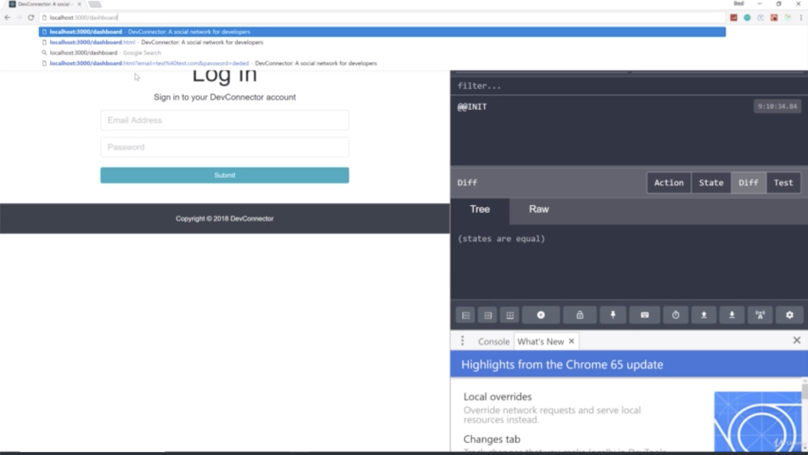
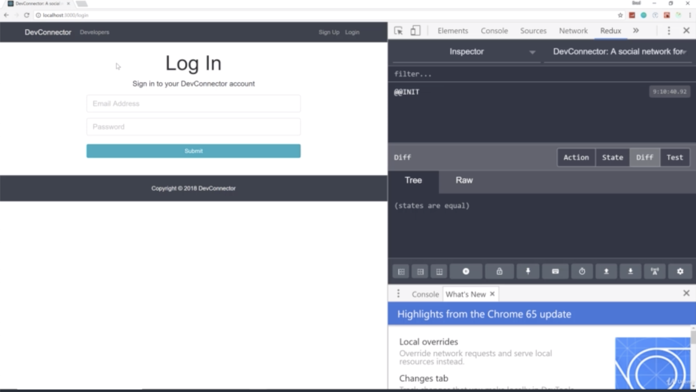
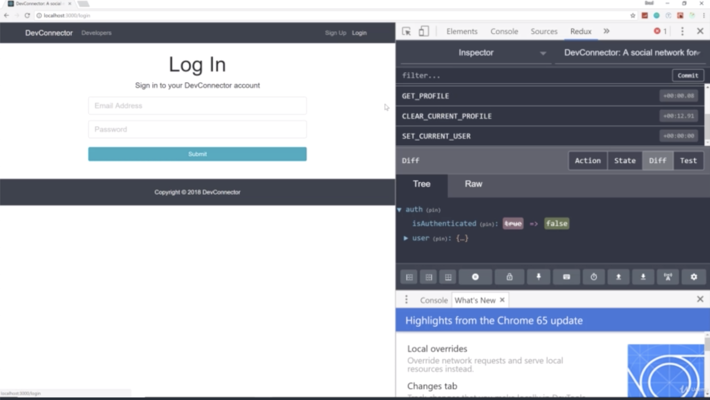

- chapter 48
1. update
- PrivateRoute.js(components/common folder)
- App.js

2.

- if we go '/dashboard' and it brings us back to login which is what we want

- if we logout, go automatically to Login
- that's what the 'Switch' allows us to do. it allows us to redirect when we log out
- if we don't put that in, it's just gonna stay on that page
