2.
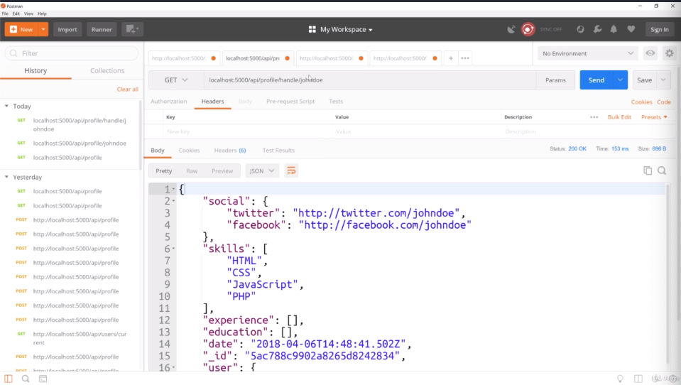
- we don't have key and we don't care whether key is expired or not because in "localhost:5000/api/profile/johndoe", we allow everyone to see the profile
- and now we have a public API route to get a profile by the handle
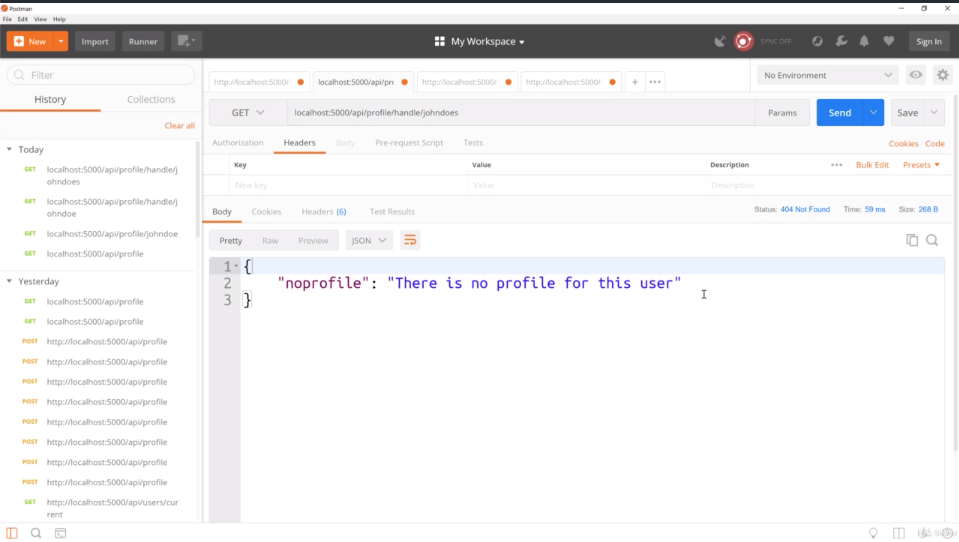
- if i put something that doesn't exist like johndoes, we get "There is no profile for this user"
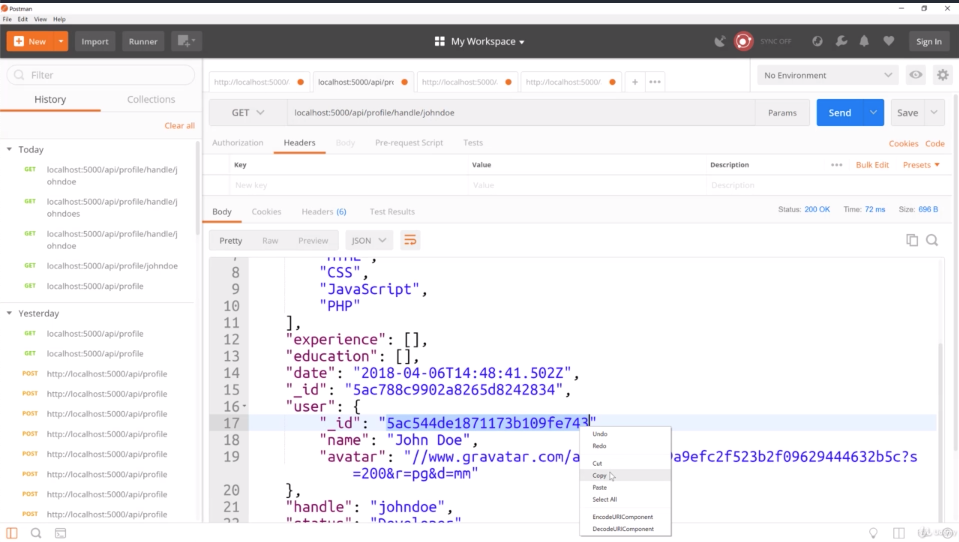
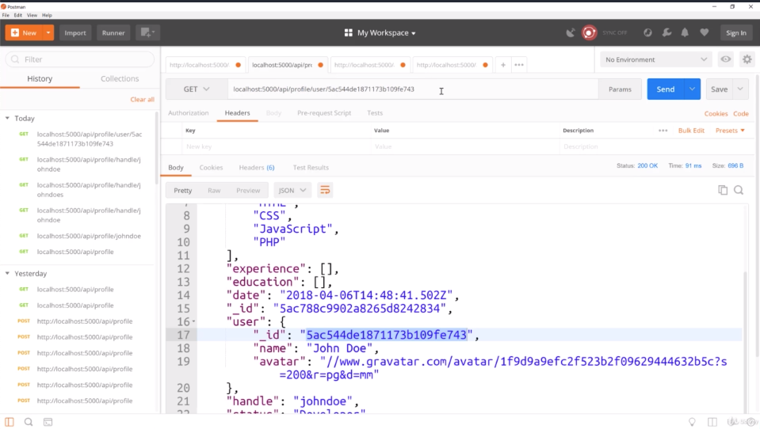
- we should be able to also get the profile by user_id
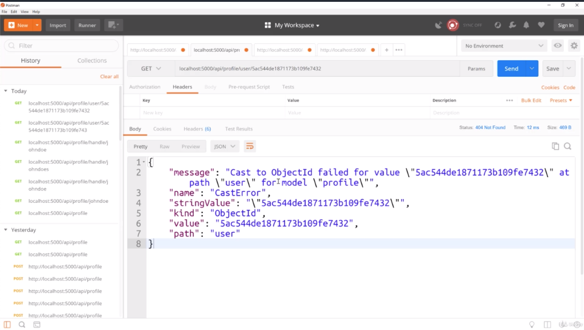
- if i add wrong things, then we get errors coming from the mongoose error
- i will just leave this as the error. we could put our custom error
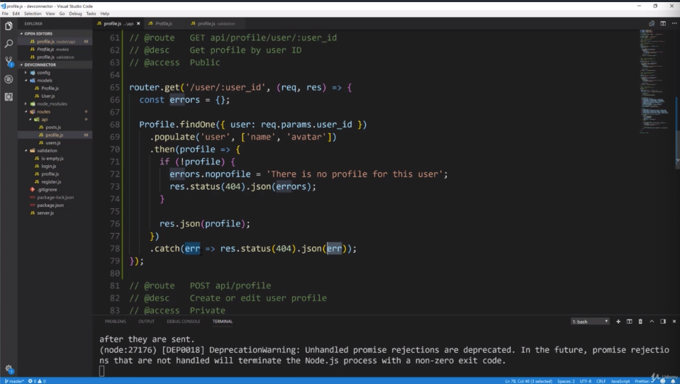
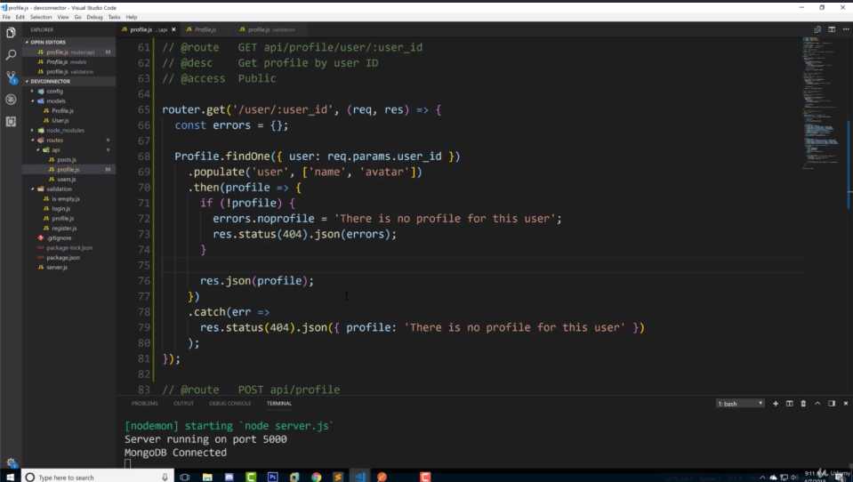
- mongoose error is coming from this 'err'.
- so what we could do is change 'err' like picture 7
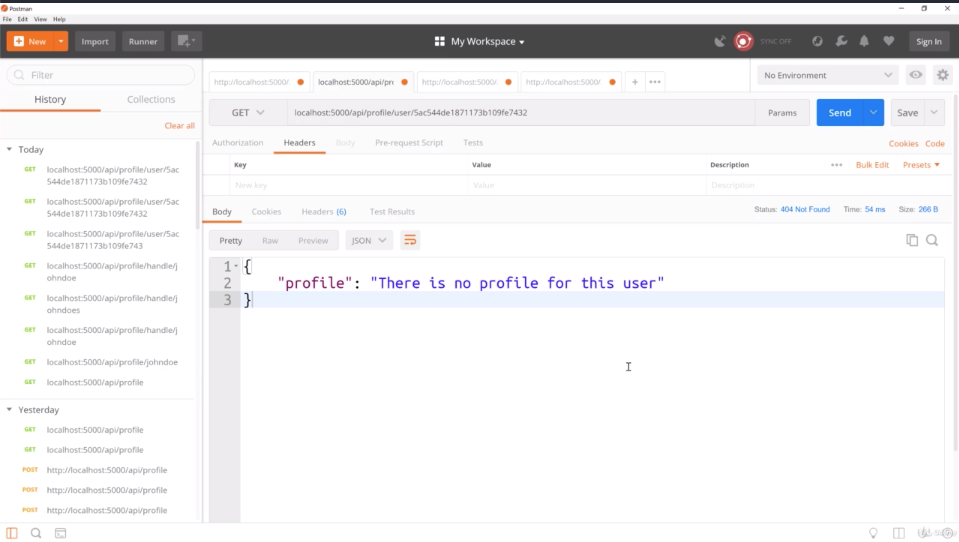
- the result is here
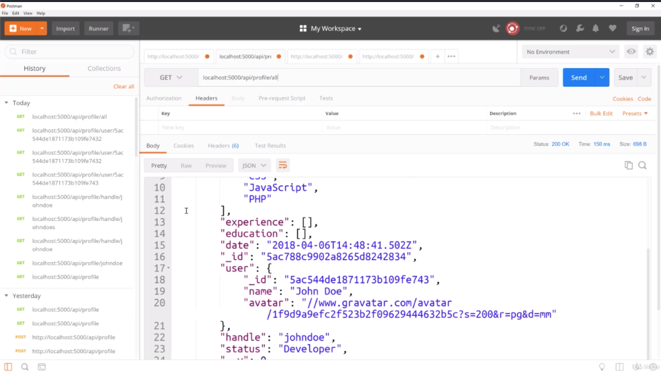
- now we have only have 1 profile. So if we want we do have 2 users, we have the Brad user, then we can create profile for him
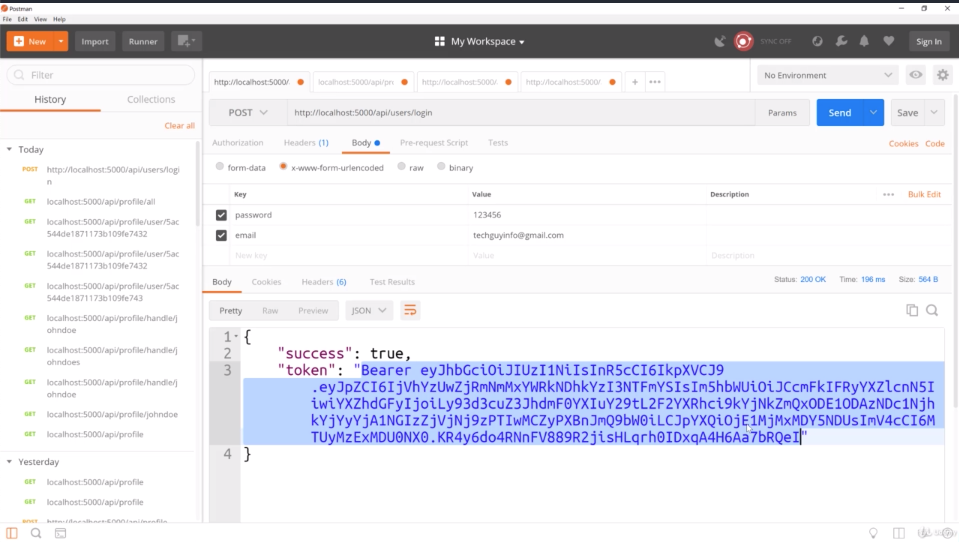
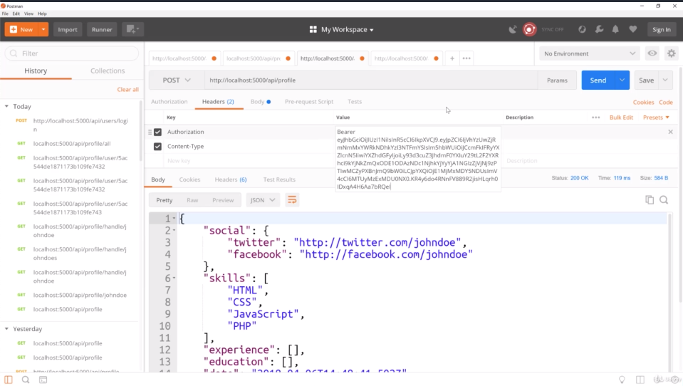
- we change old token to new token 
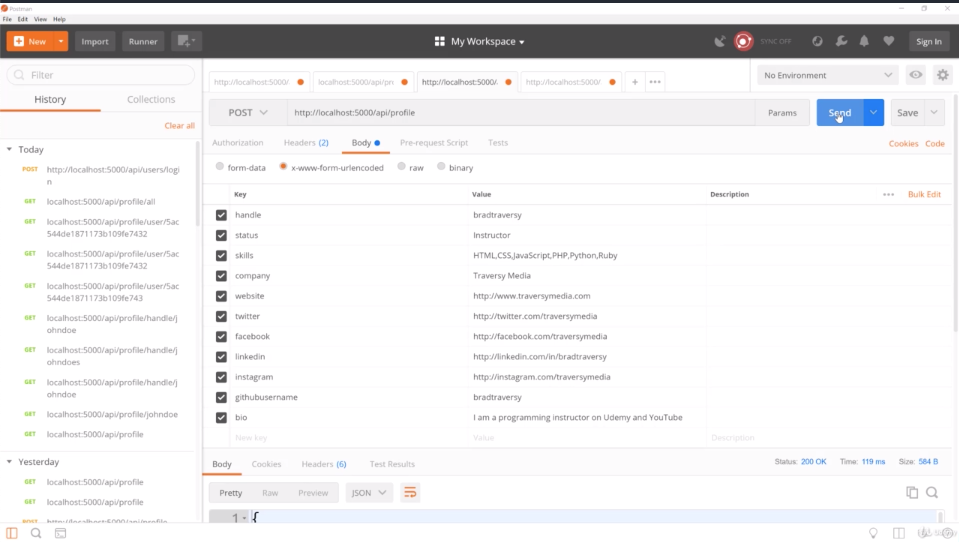
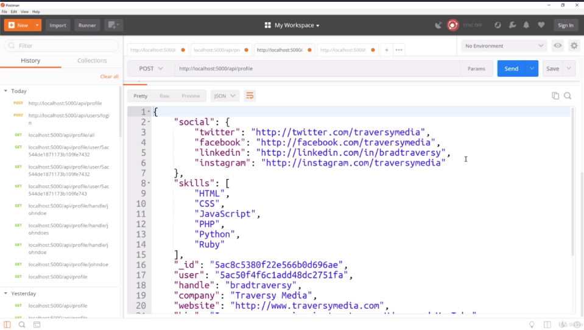
- and add more things. and you can see it includes everything i added including all the social object, skill, bio
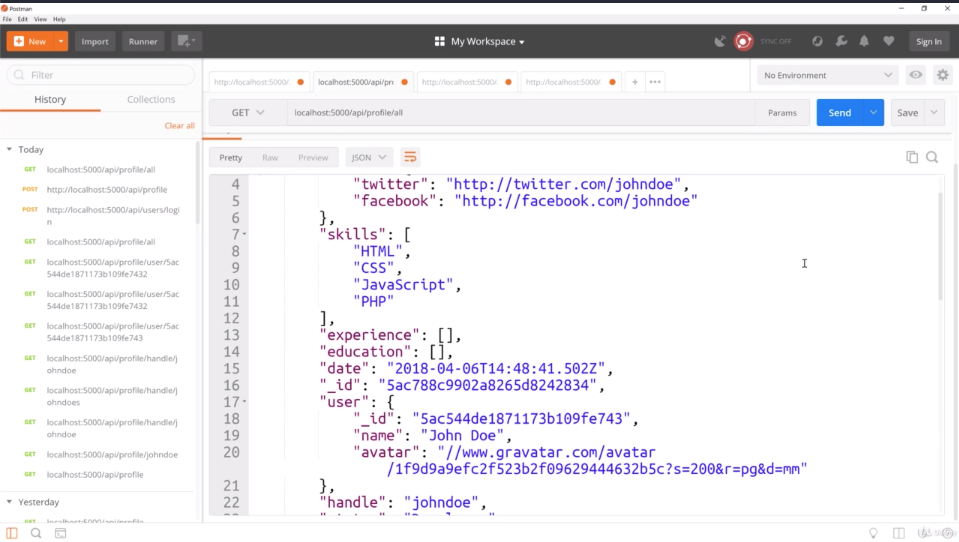
- now we have 2 profile
