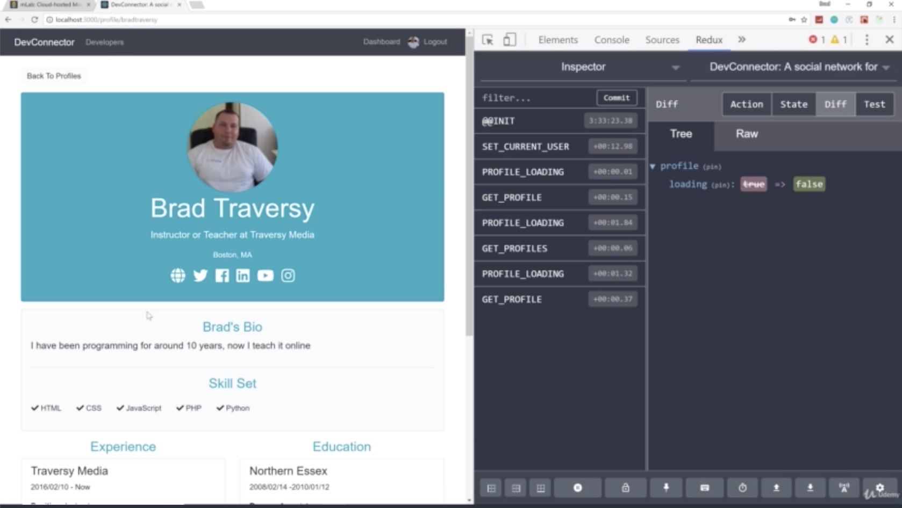
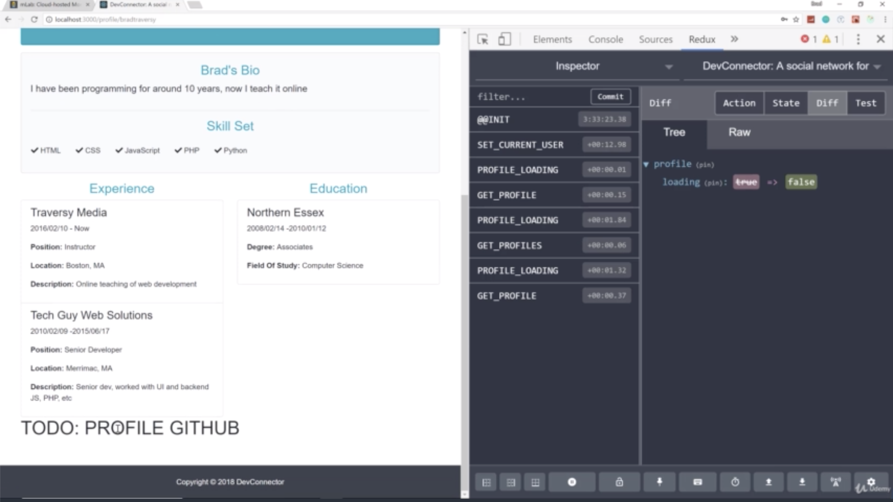
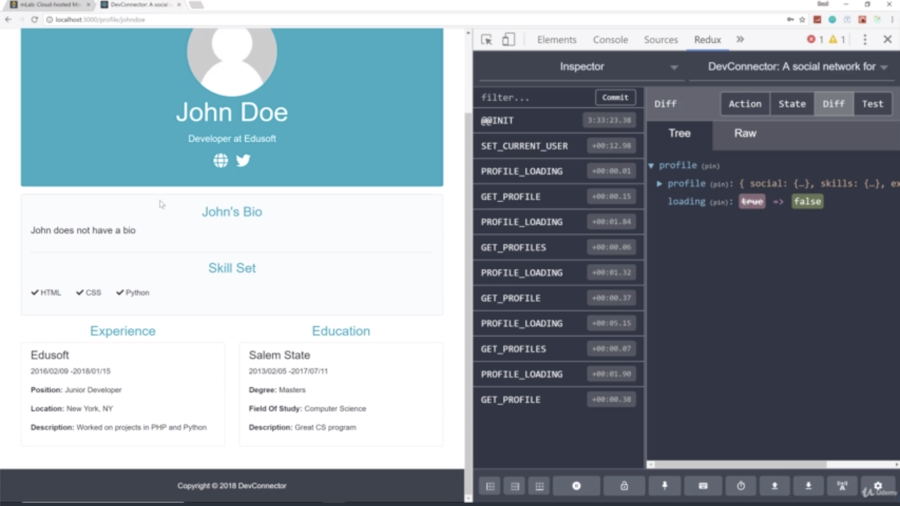
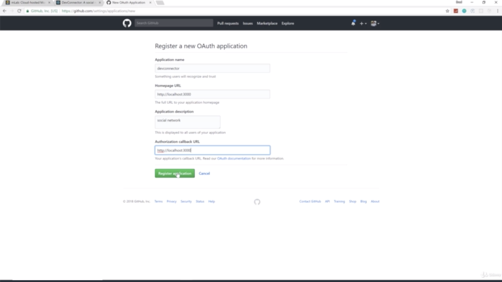
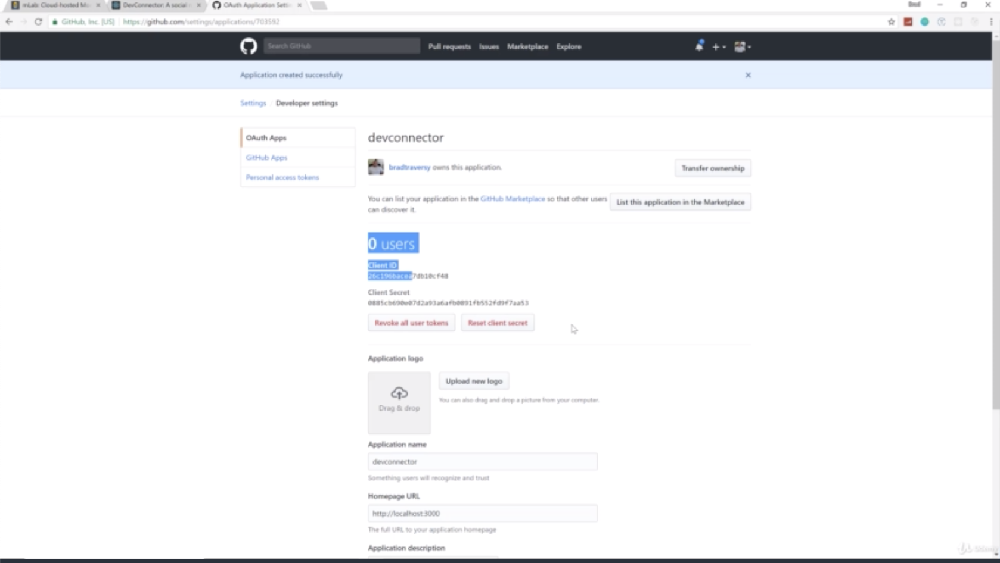
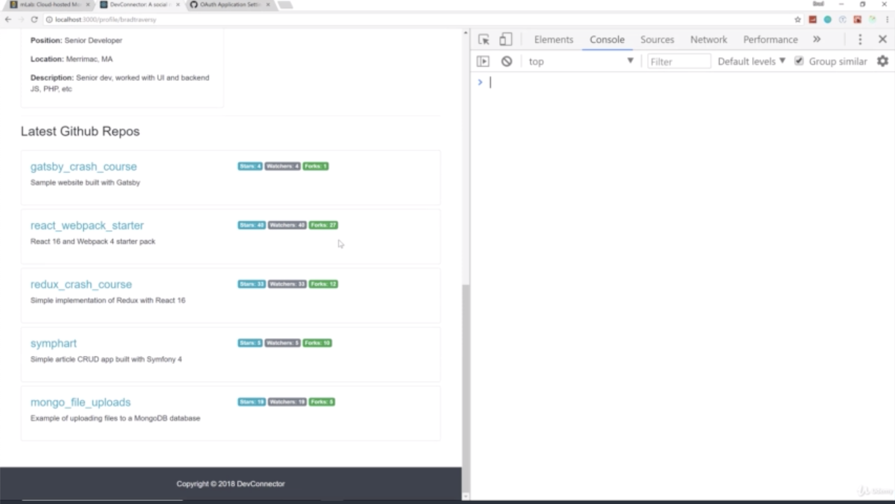
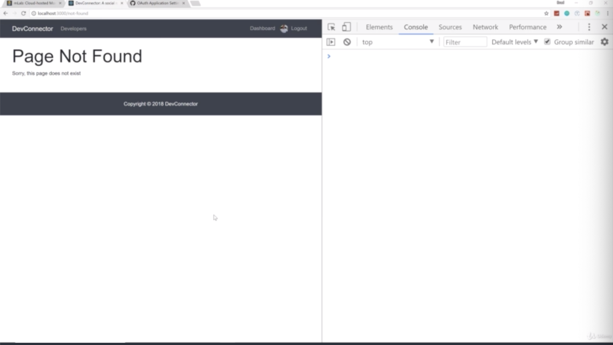
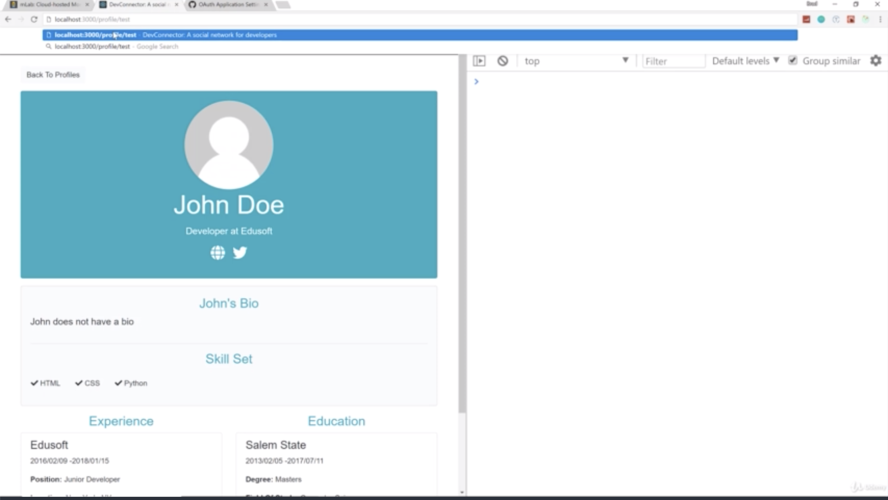
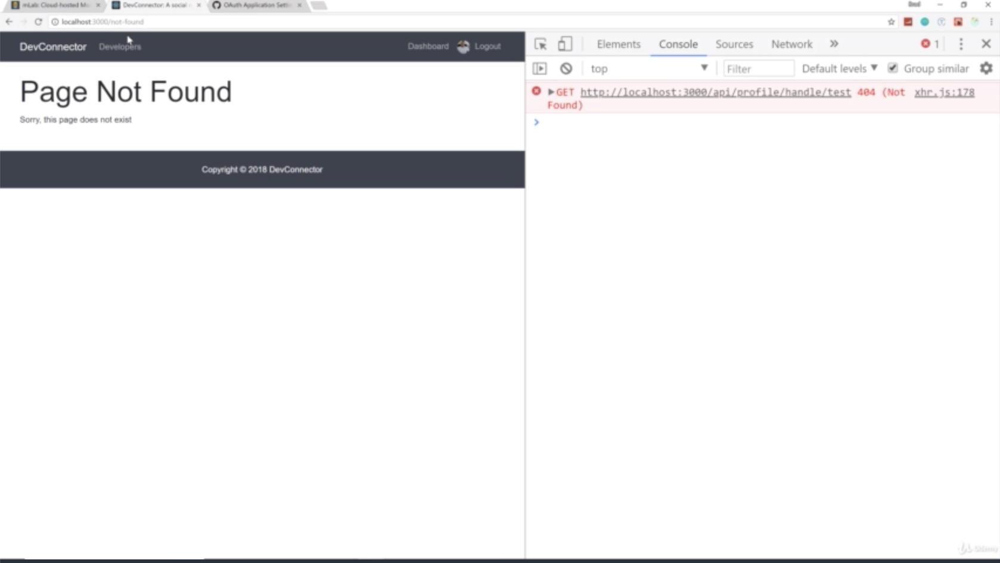

- chapter 66
1. update
- Profile.js(components/profile folder)
- ProfileGithub.js(components/profile folder)
- ProfileAbout.js(components/profile folder)
- NotFound.js(components/not-found folder)
- App.js

2.

- Brad has githubuser but john doe has no github user because johndoe has no githubuser
- so what we wanna do is hit the github API

- through github register Application, you have a client id and a client secret

 -----------------------------------------------------------

