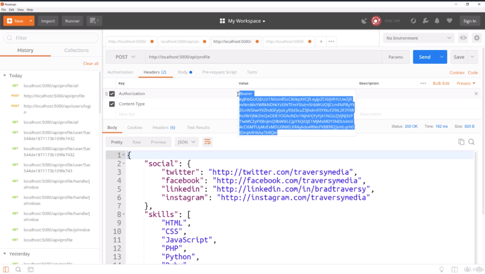
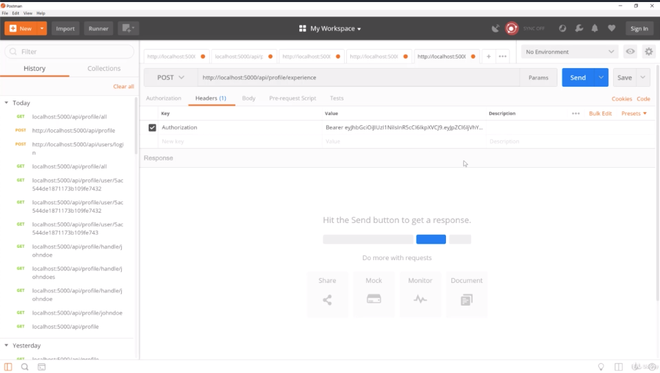
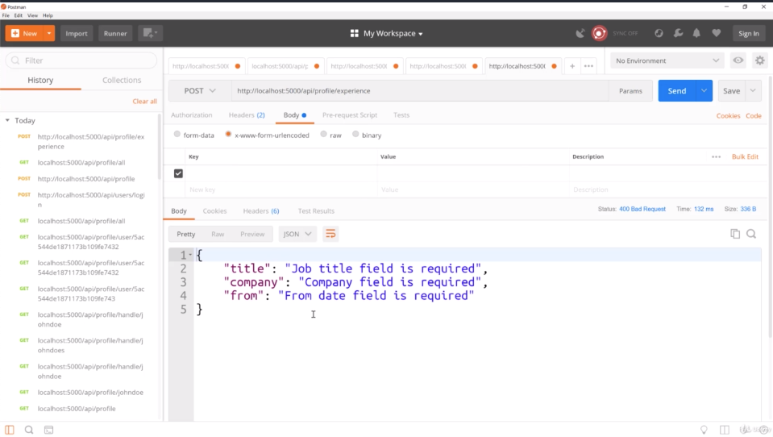
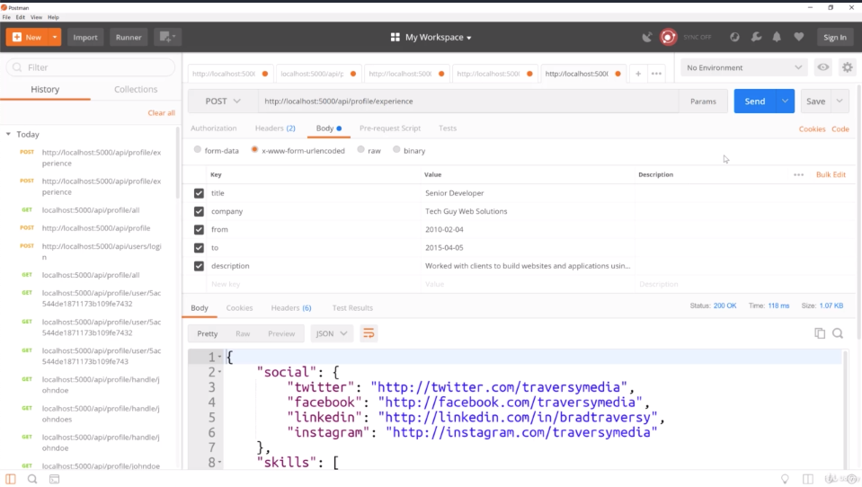
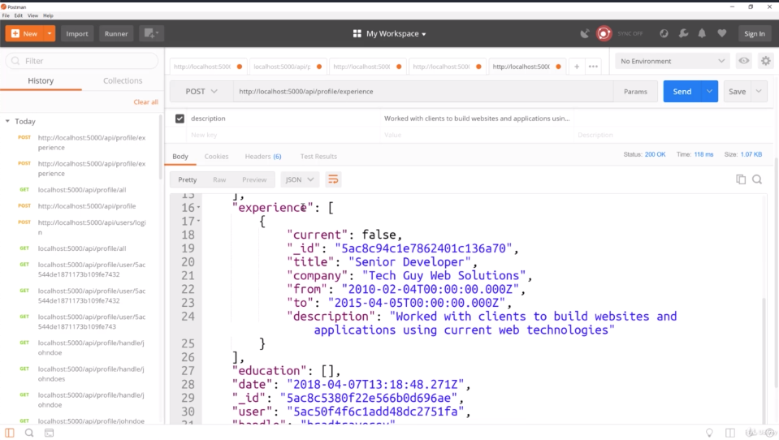
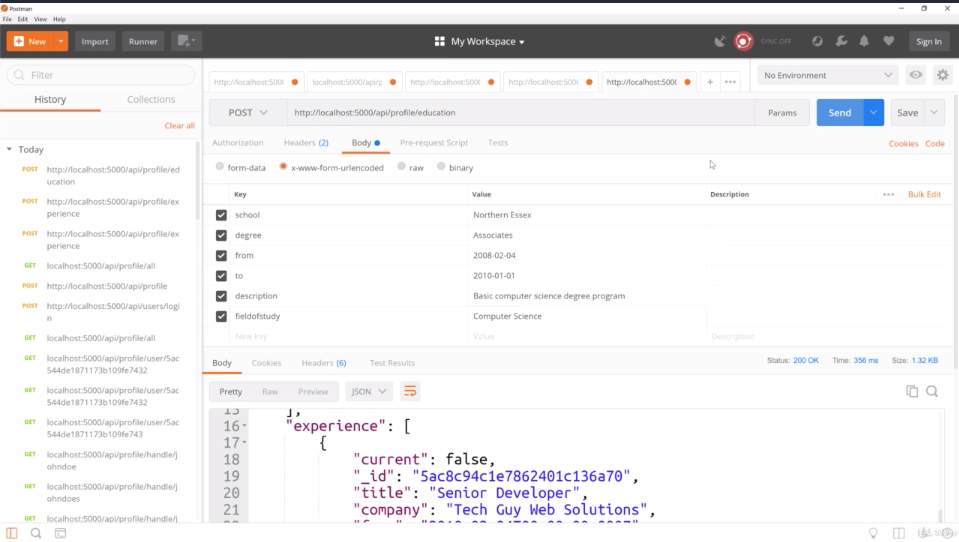
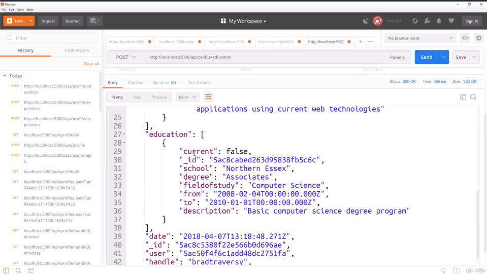

2.

- we grab the authorization header and take token then we will go to new tab for "locahost:5000/api/profile/experience"

- and for the form-urlencoded of body, we get errors and these errors will show up in the front end when we buld our react application

- it gives us our profile back and check that out in the experience array. current is false because we didn't set it current
- each experience has its own user_id
 -----------------------------------------------------------------------

