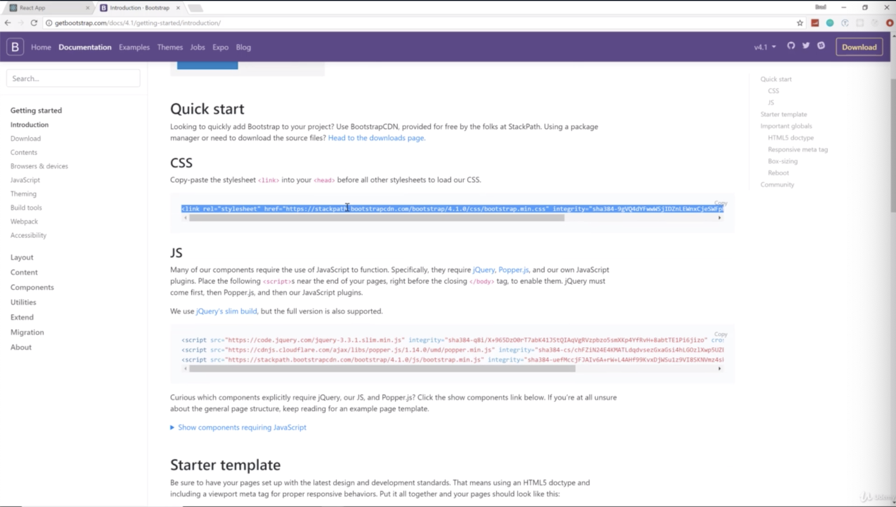
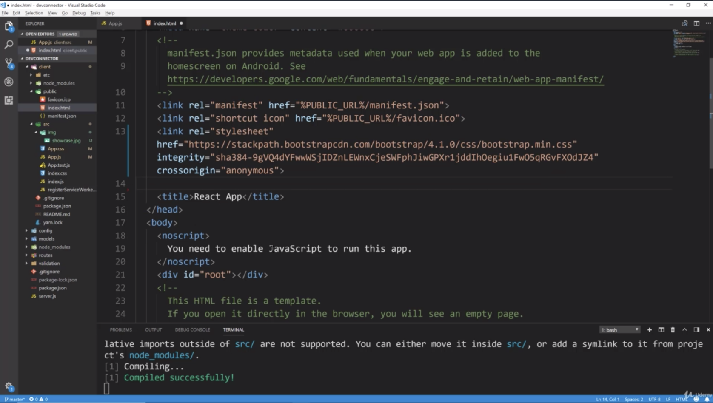
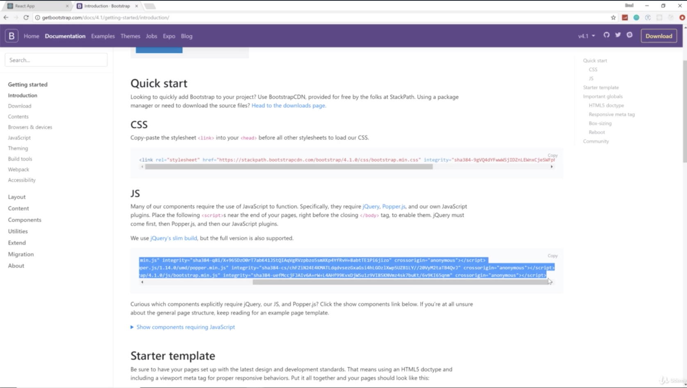
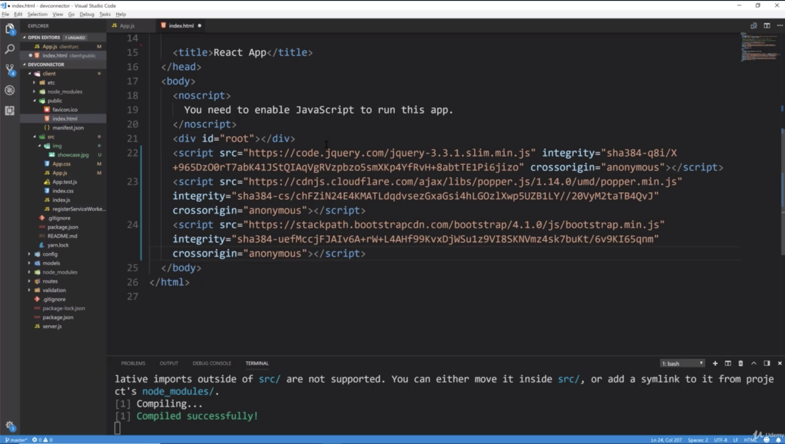
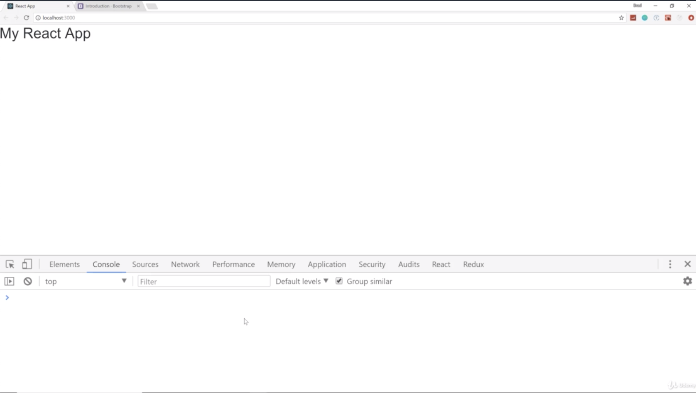
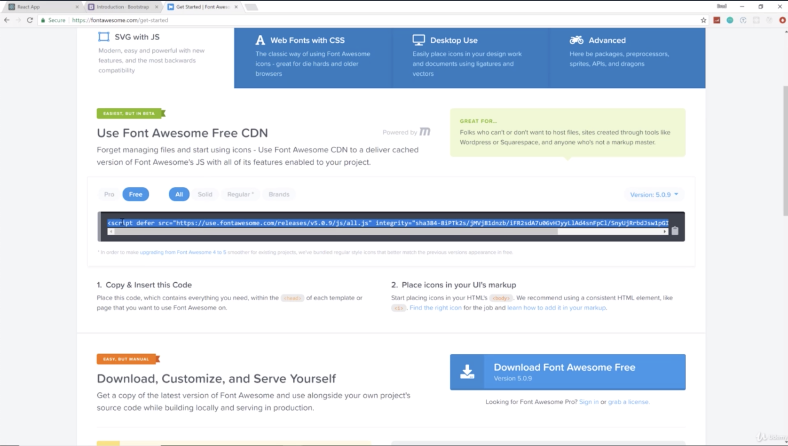
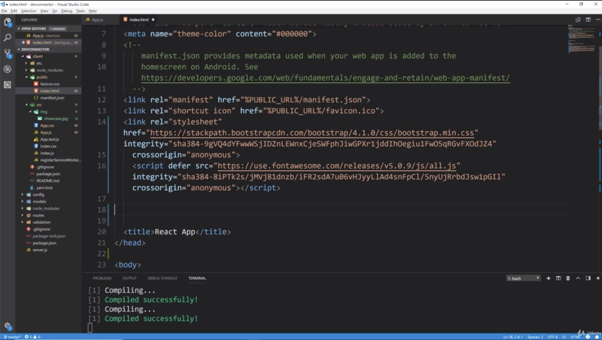
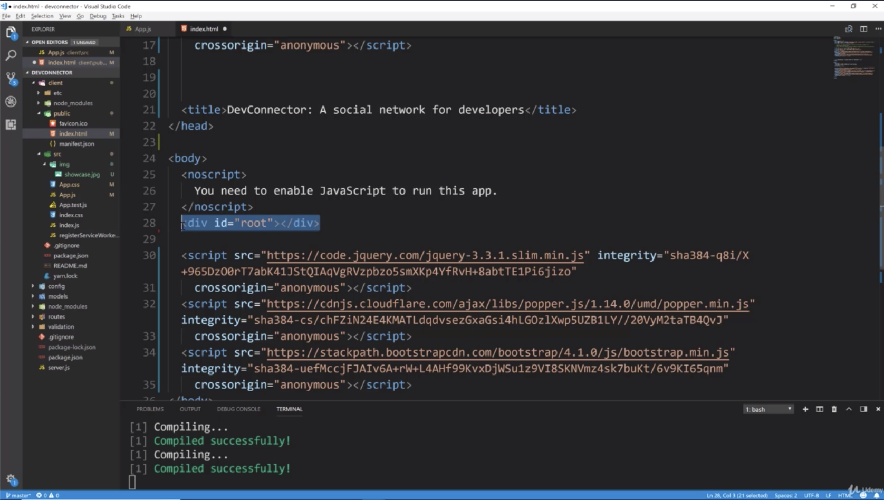
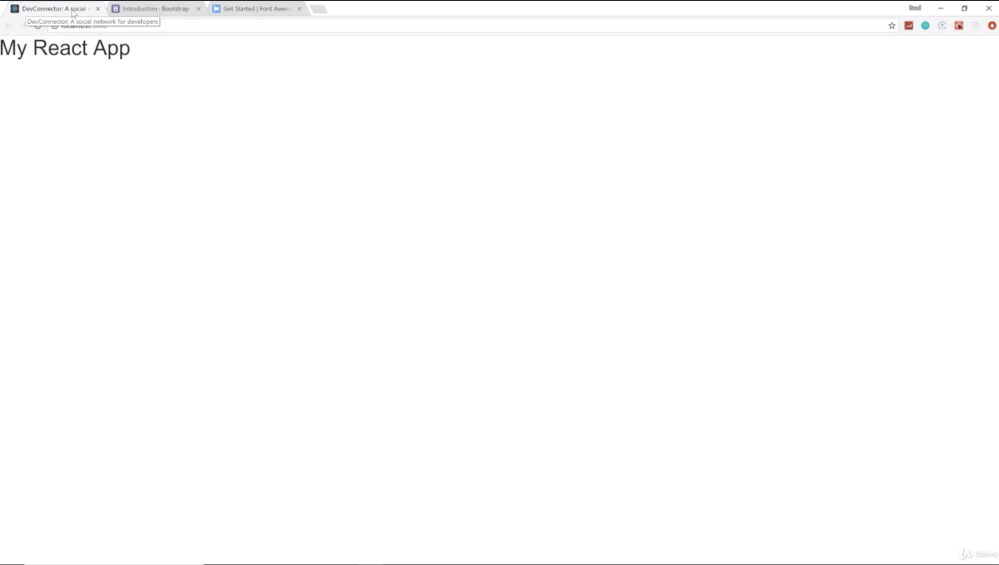

- chapter 31
1. update
- App.js
- App.css(grab that outside from devconnecter_theme/style.css)
- showcase.jpg(img folder)
- index.html(public folder)
2. delete
- logo.svg

2.

- grab CSS. it looks like it's version 4.1.0 but i don't believe there's any breaking changes and we are not using any javascript widgets or anything like that 
so we should be fine

- we also need the javascript dependencies. So we need these 3 script tags

- you can now tell that bootstraps enabled because of the font, font-size, margins. so bootstraps now enabled.
- there's no errors saying that it can't access any of the files or anything like that in the console

- we also use Font Awesome CDN so you can use bg icons

- everything else is gonna come through react which comes through 

 
Chrome : we recommand to install React Dev tool, Redux Dev tool
