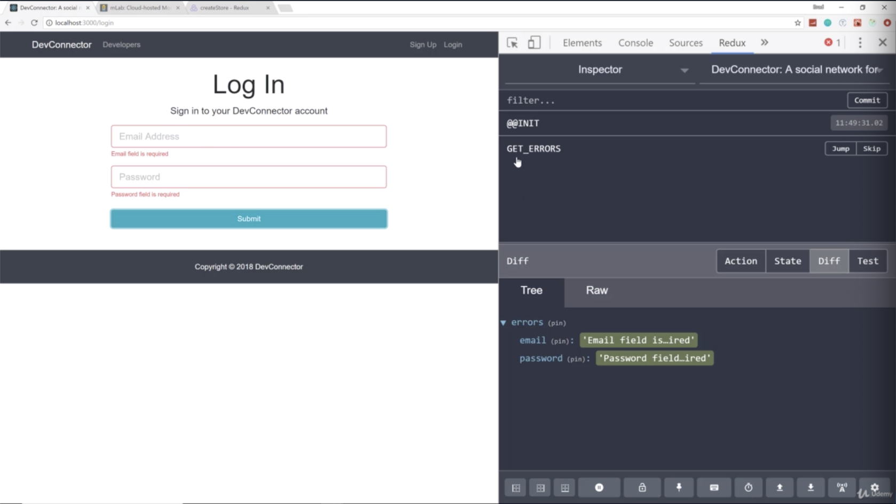
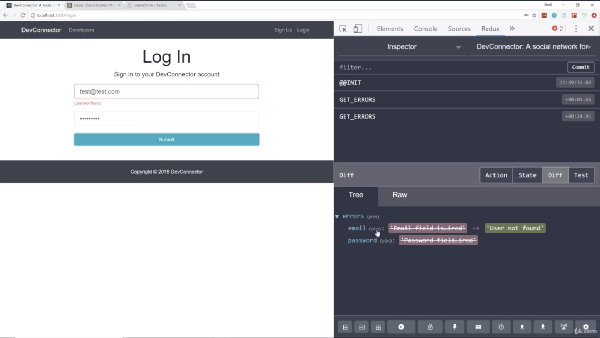
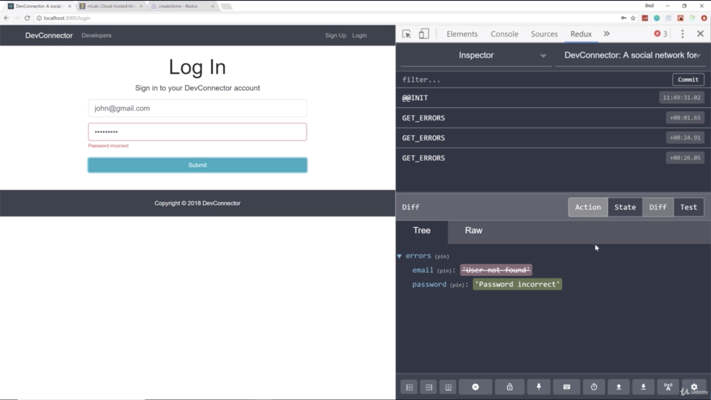
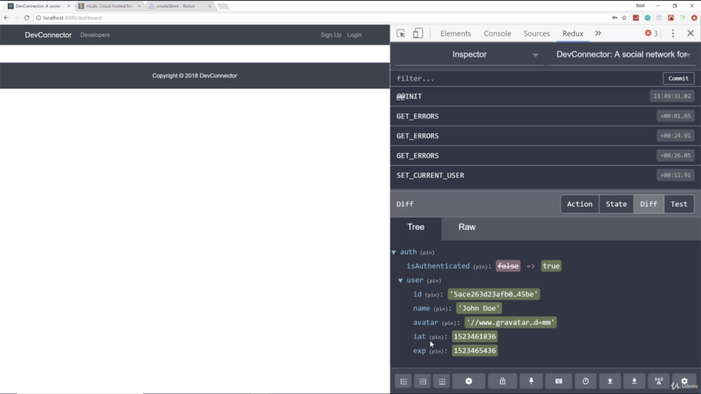
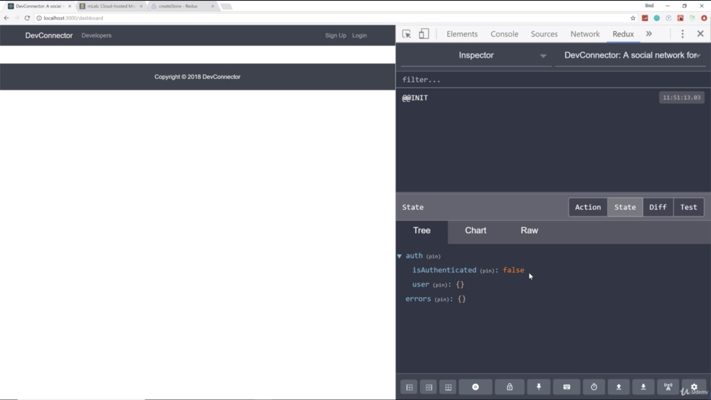
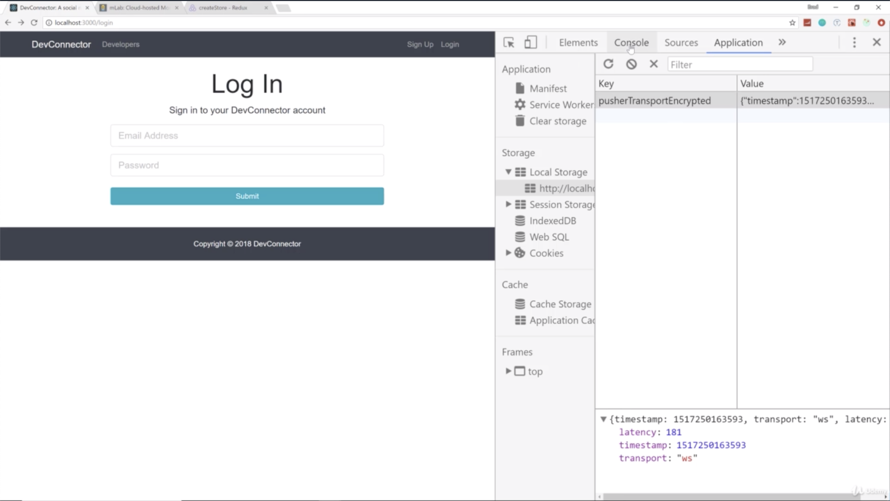
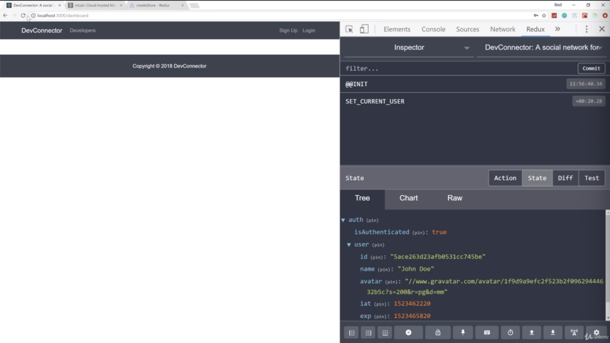
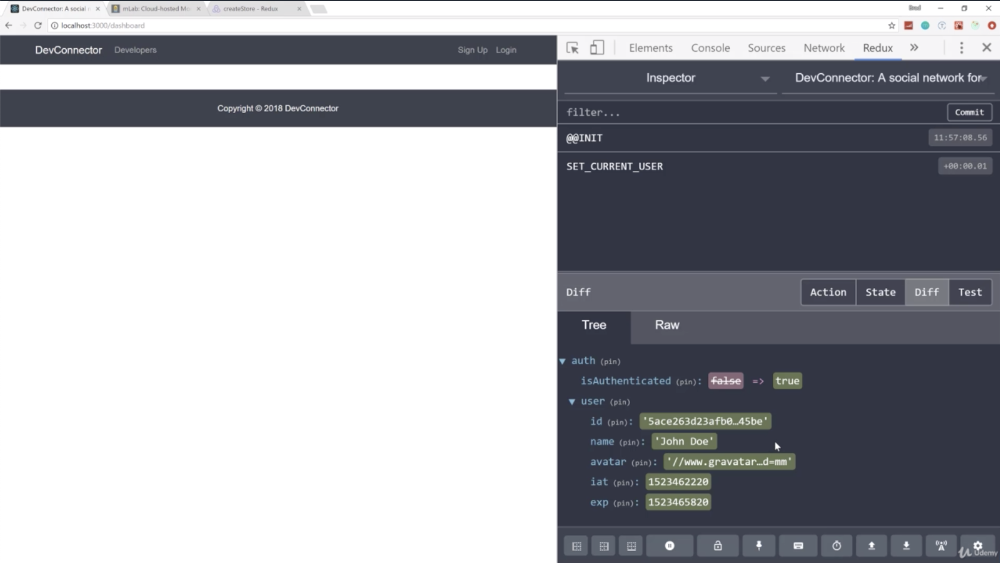

- chapter 44
1. update
- Login.js(components/auth)
- App.js

2.

- if we fill correct email, incorrect password, then you can see that the state of the errors has changed. 'Email field is ...ired' is no longer there. now we just have users not found as our email error

- if we fill incorrect email, correct password

- correct password, email then we got redirected to the dashboard which doesn't exist that's fine
- and look at the user, it has the user's id, name, avatar, exp, iat
- so now we are logged in any requests we make will have that authorization header

- but we have an issue and that is that if the page is reloaded, then all goes away
- so if i reload the page, and we take a look at our state, 'isAuthenticated' is false
- so we need add some logics to App.js of client

- we go to local storage, JWT token is stored in local storage. 

- so what will do is to remove JWT token now. and go to App.js of client and bring in that jwt-decode

- once we login, it calls the login action. it's gonna store the token in local storage and it's gonna set the user

- now when we reload, you can see "isAuthenticated" is still true, we still have the user

