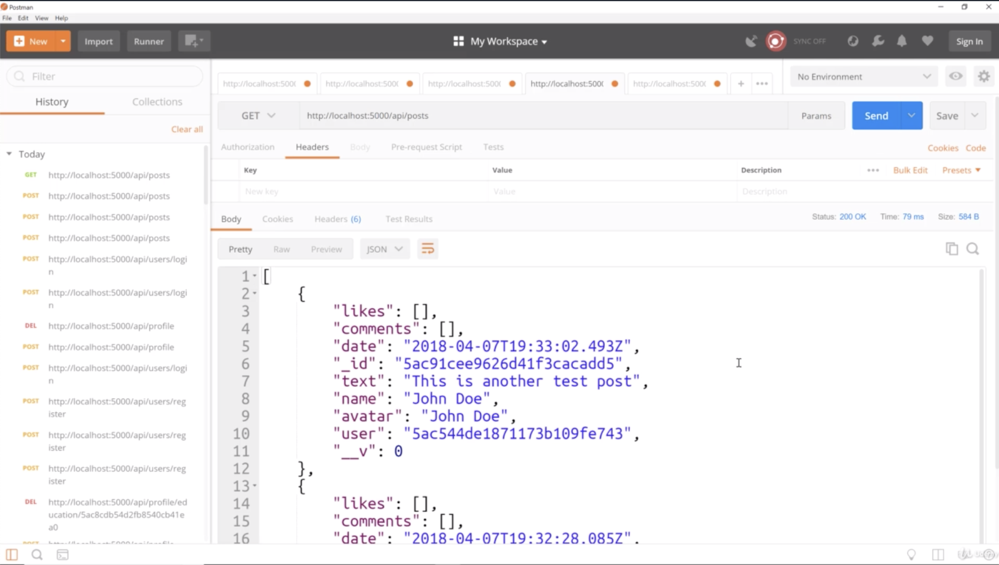
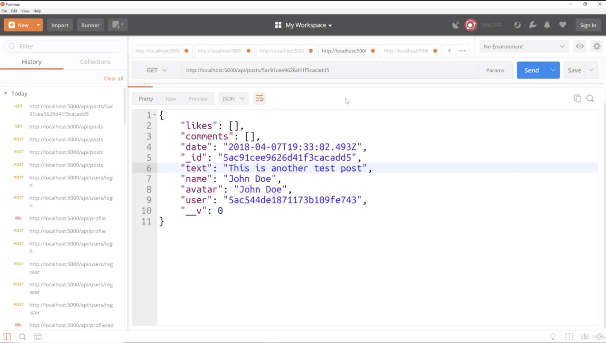
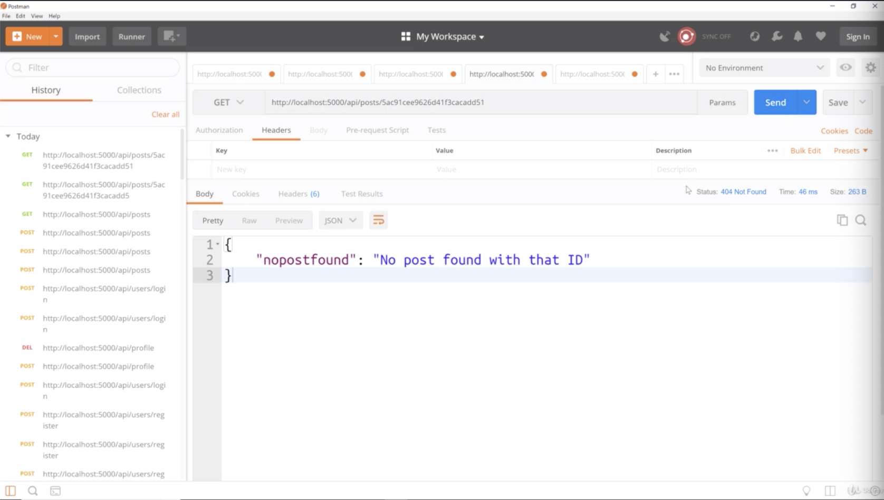
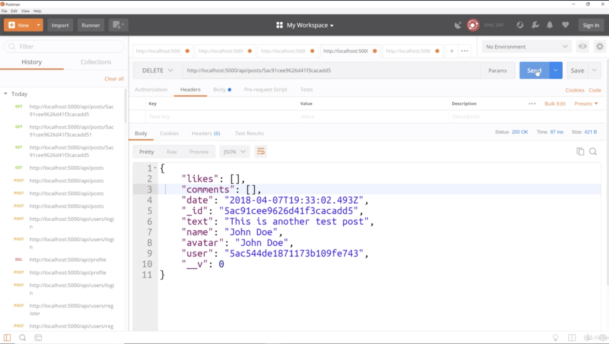
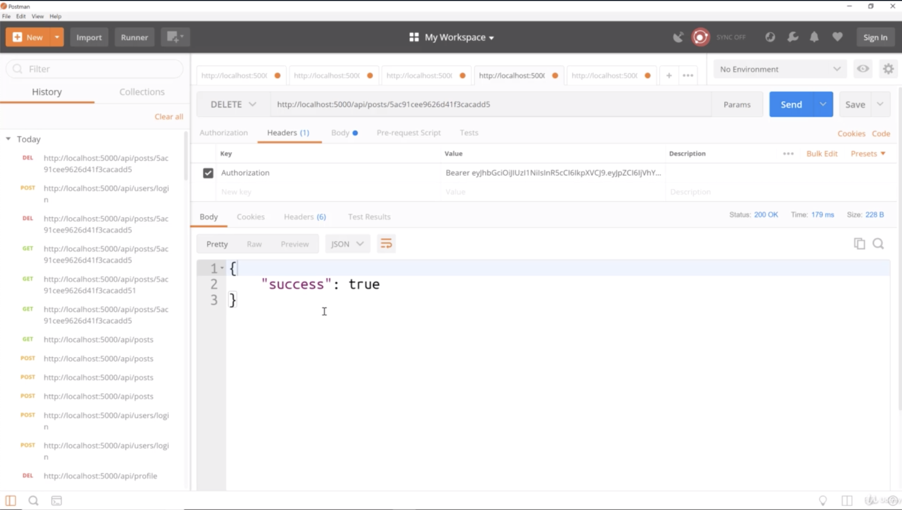

2.

- we get an array of our 2 posts. so that works

- if i copy _id and past like "http://localhost:5000/api/posts/5c4d4febd84cd80af21e9604", then you can see as above

- if you type in _id which doesn't exists like "http://localhost:5000/api/posts/5c4d4febd84cd80af21e9604s", then you can see as above

- that means that hopefully the post was deleted
