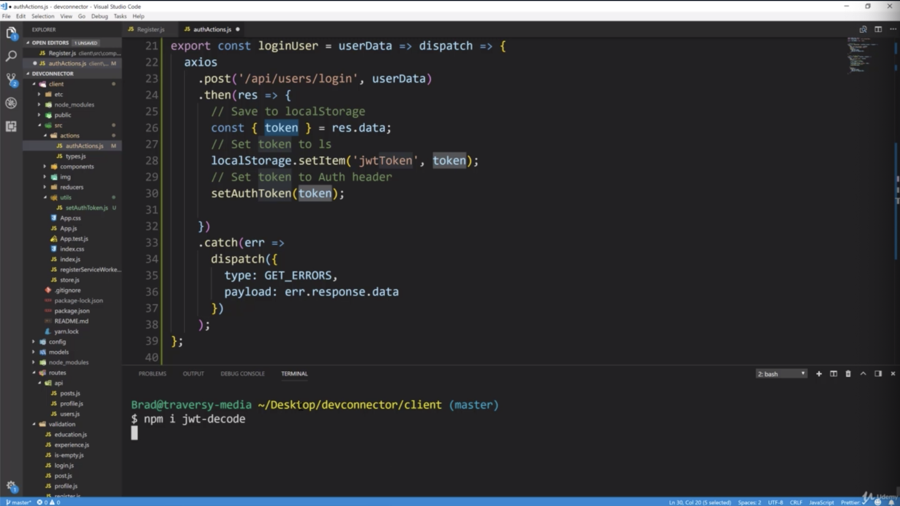

- chapter 43
1. update
- authActions.js(actions folder)
- setAuthToken.js(utils folder)
- types.js(actions folder)
- is-empty(client/src/validation folder)

2.

- 'token' has user information. so to decode this, we have to use a module called 'jwt-decode'
