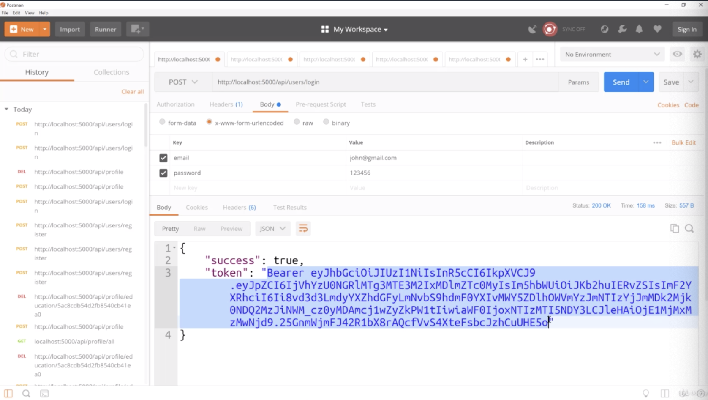
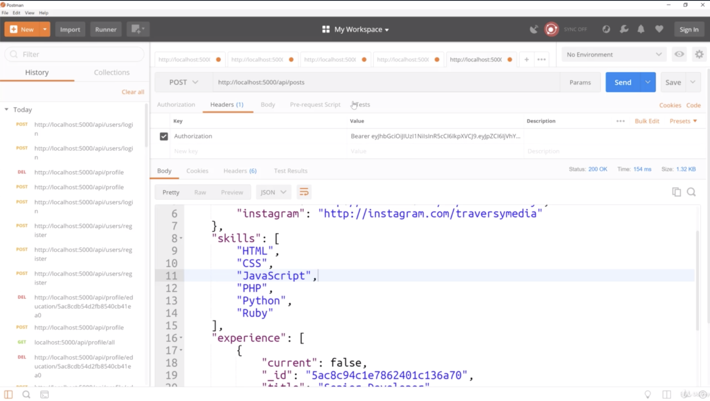
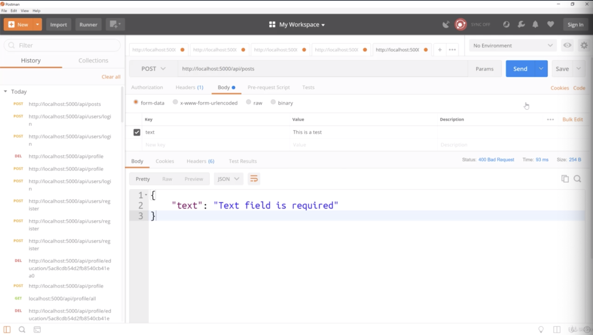
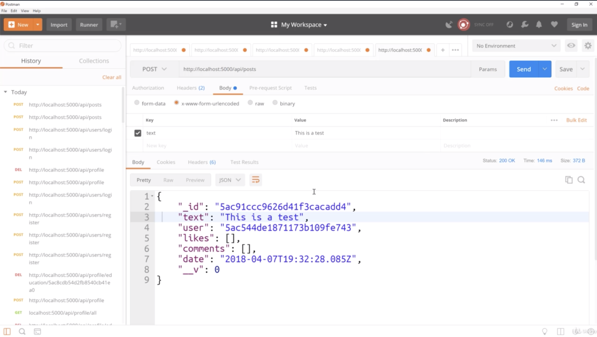
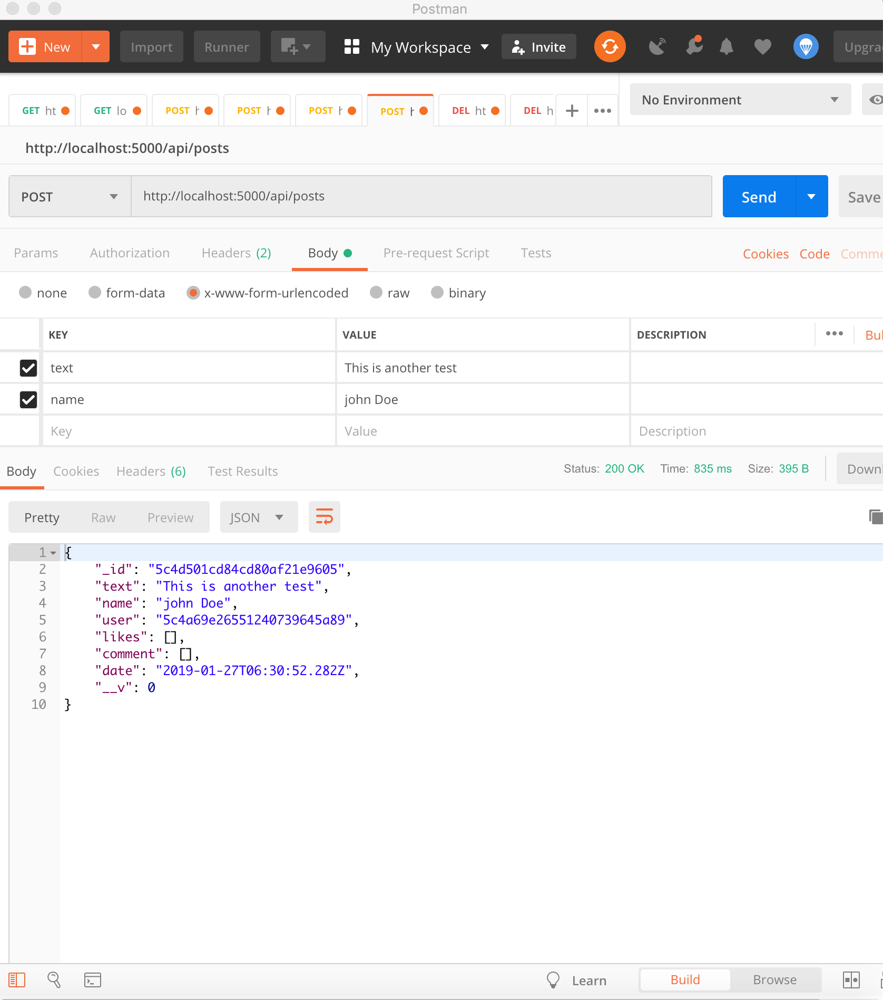

2.

- past token would be expired. So get the new token like this.

- once we get into our react application here, obviously we are not gonna have to manually add the token and stuff 
we are gonna get it, it's gonna get stored in local storage and it will just sit there, it will be used as long as we are logged in

- we don't want this form-data, we want the stuff like picture 4

- it gets results
- we didn't add the avatar or name or anything like that. that's gonna come through our react application

- but if we wanted to add another one, we can add it
