2.
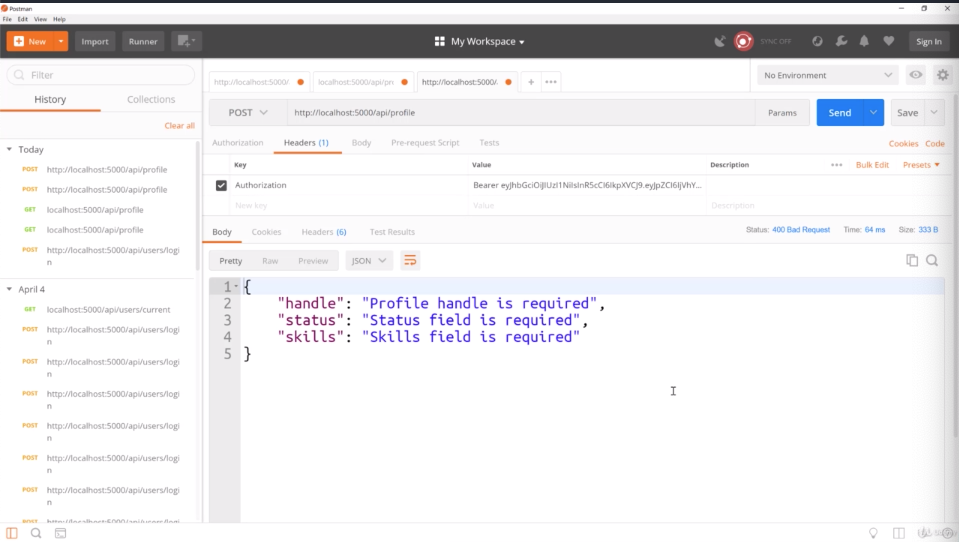
- that's the route to actually create a profile or update a profile
- this is happening because of that validation file we created
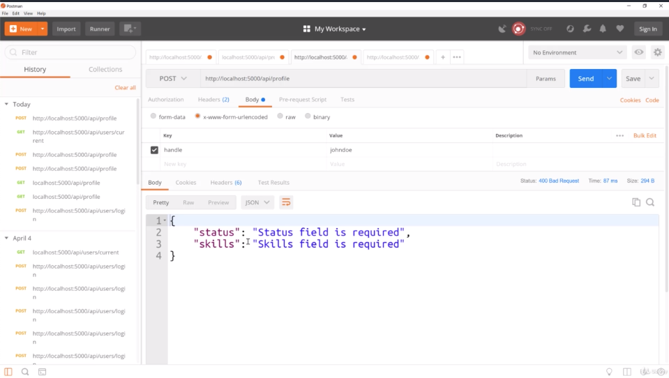
- we could just get the status and skills is required
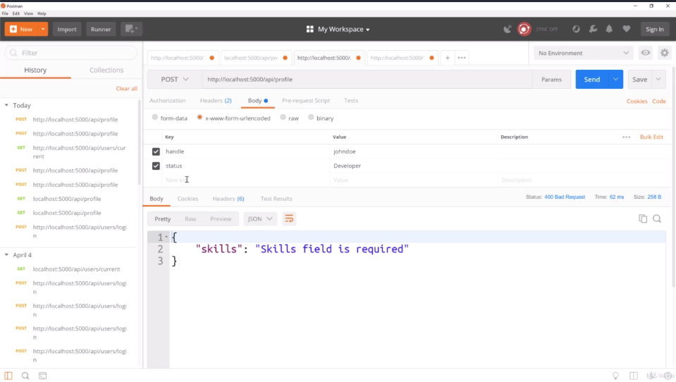
- we get that
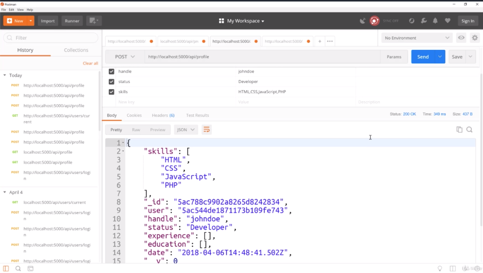
- we get profile back
- the stuff that we didn't include like bio, website, company is not here. it's not gonna be blank, it's not gonna be here 
which is what we want because those are not required
- skills is now an array because of that logic that we added
- this same route, we can actually update our profile with. So i can just go ahead and add to this route
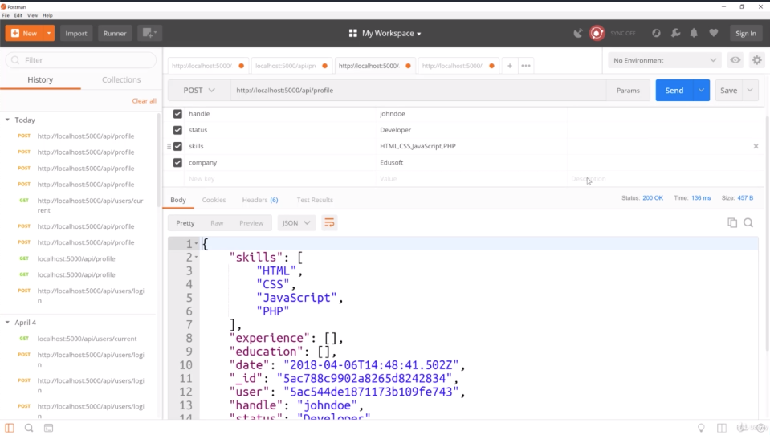
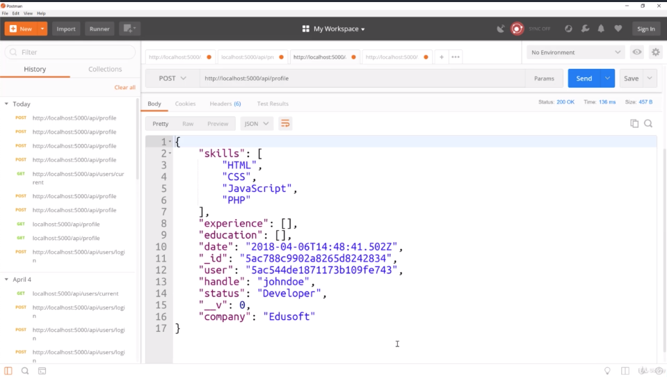
- we get company "Edusoft"
- So we can use this to create profiles and update if i wanted to add
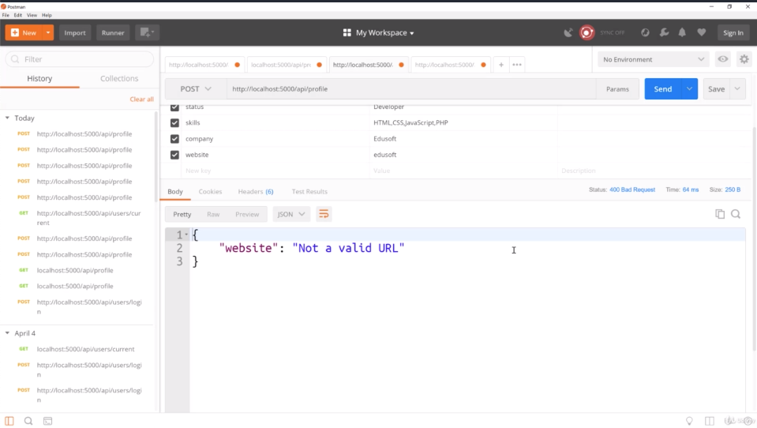
- this is where the error should come in if this isn't URL
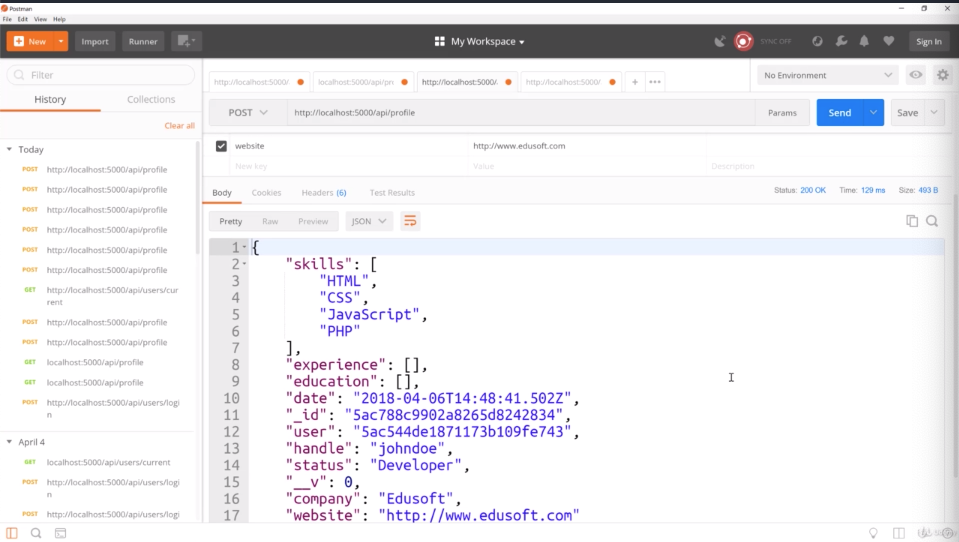
- there's no error if it is URL
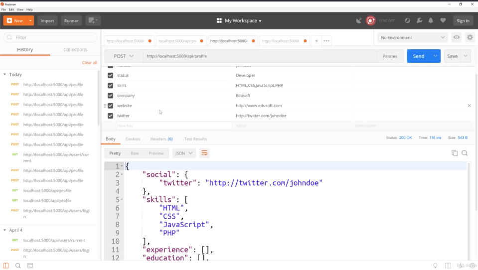
- it gets added to the social object
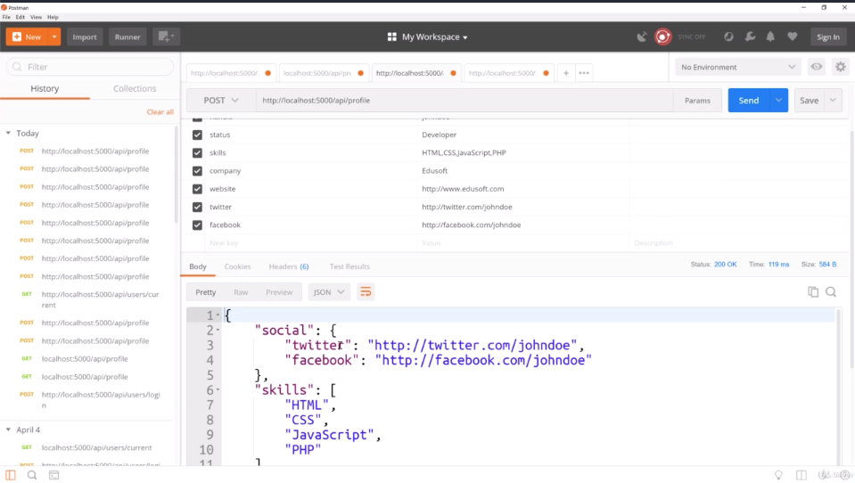
- facebook also put into the social object because that's how we constructed it in our model
 ------------------------------------------------------------------------------------------
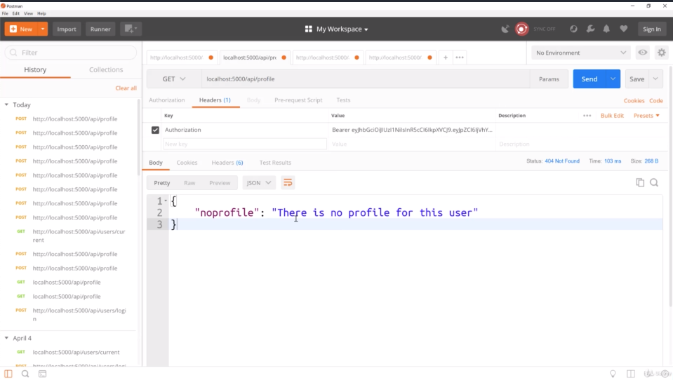
- if we have a checking to get our profile data because before we didn't have one 
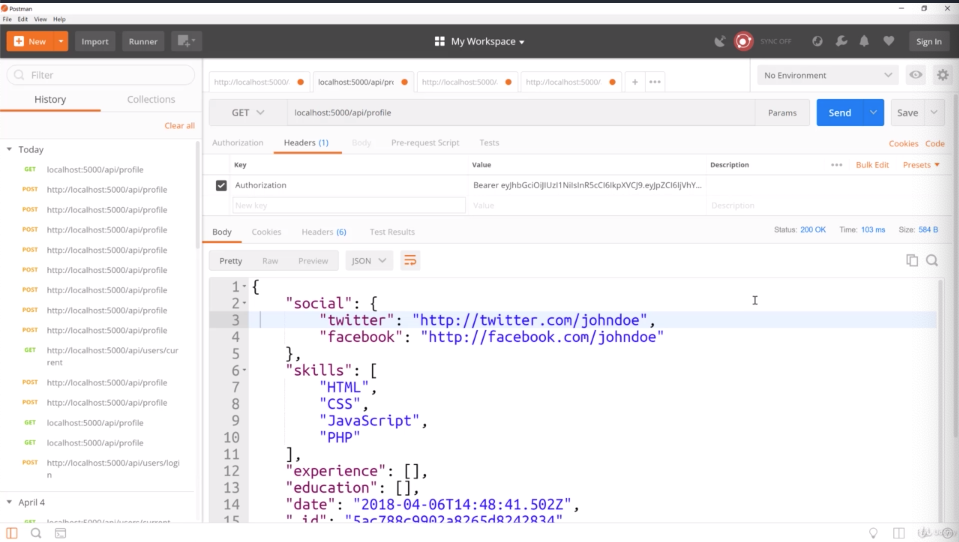
- if we send, we can get our profile

- if you wanna look at MongoDB, we have 2 collections now users and profiles
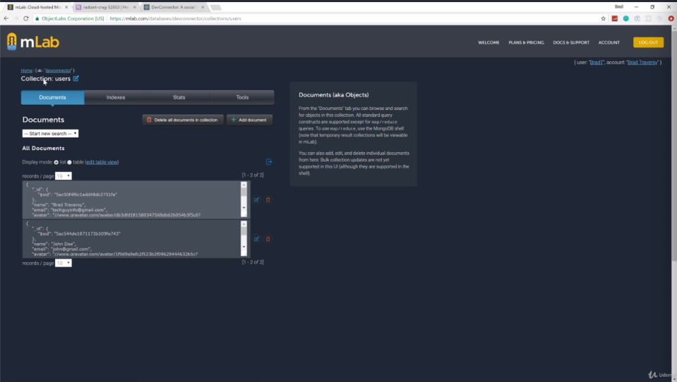
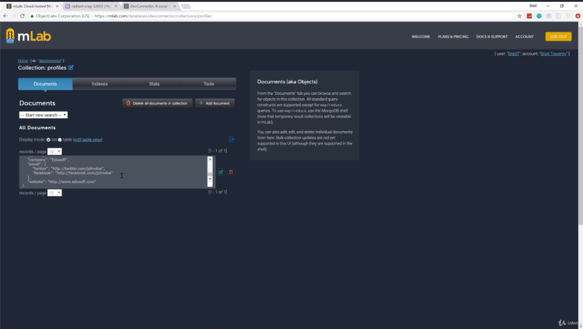
- now there' 2 users Brad and John Doe. we didn't create a profile for Brad so Brad doesn't have a profile 
so if we look in profiles there's only one document of John Doe
 ------------------------------------------------------------------------------------------
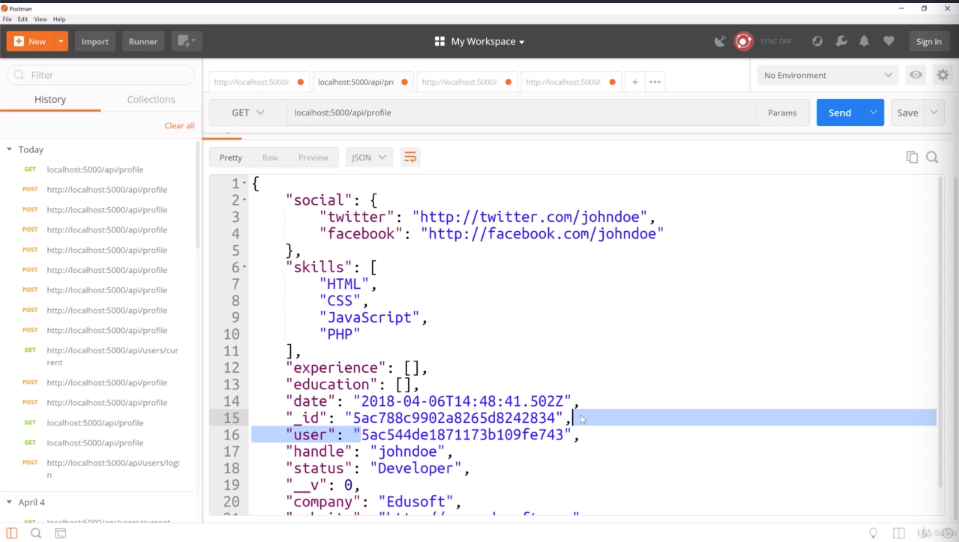
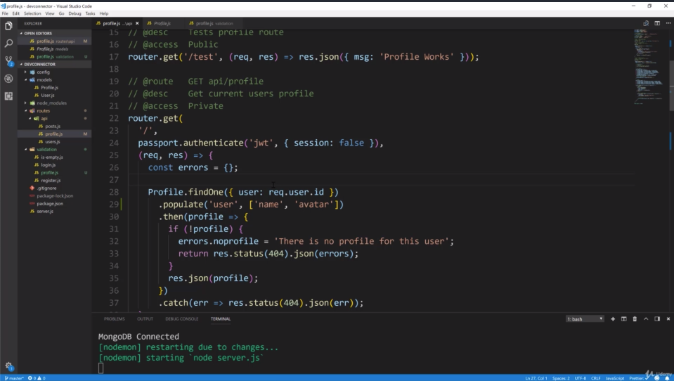
- we don't have avatar and you don't see the name or the e-mail. actually we don't want the e-mail to show on the profile because these are gonna be public. but we do want the avatar in the name
- so what we have to do is go to get route and findOne and use populate() method
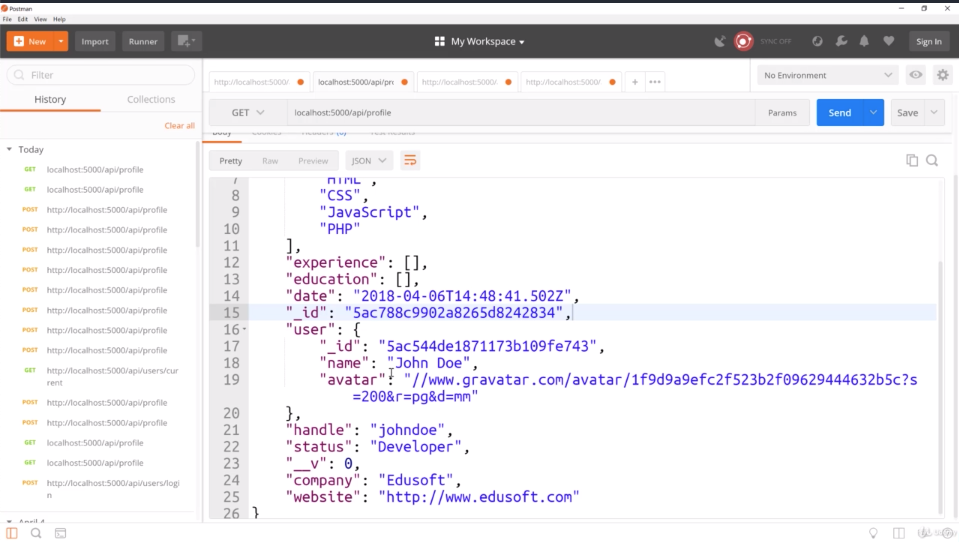
- if we re-fetch our profile, then we have name and avatar
