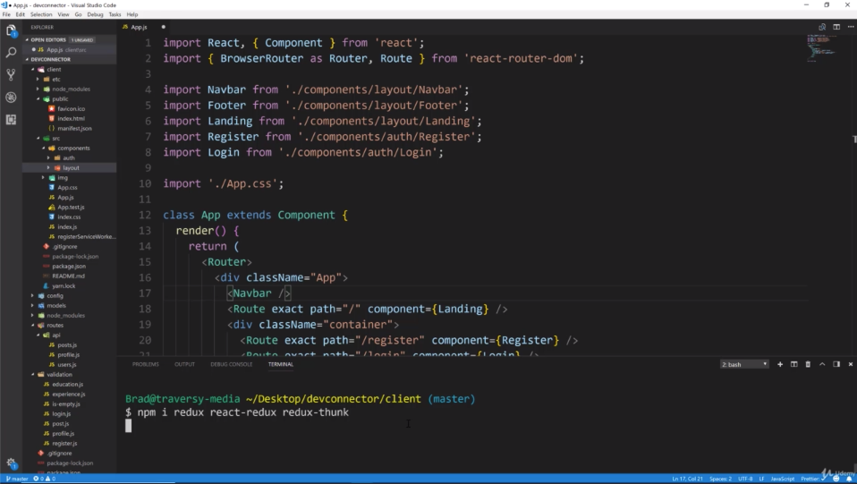
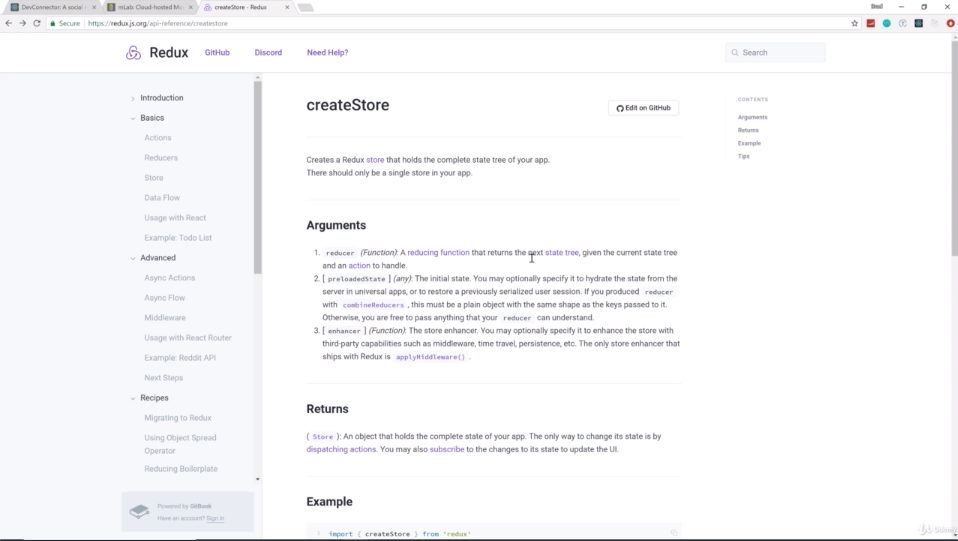
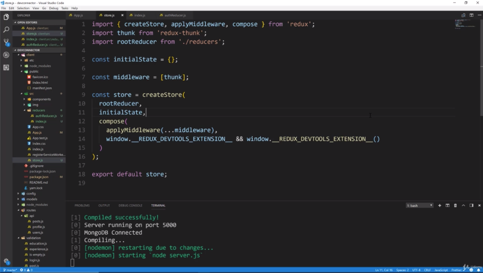
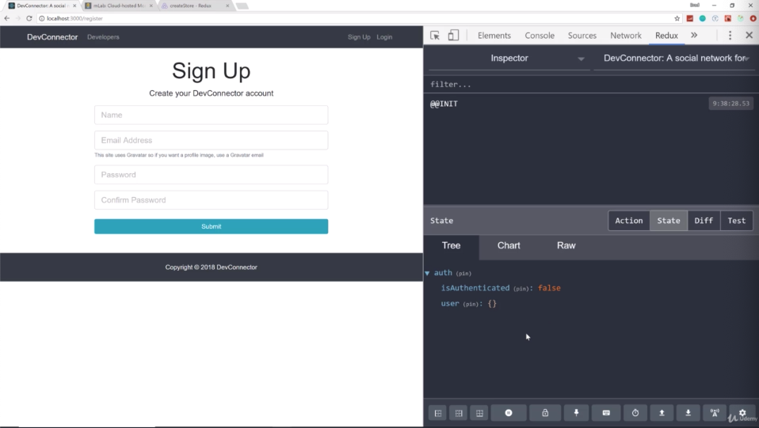
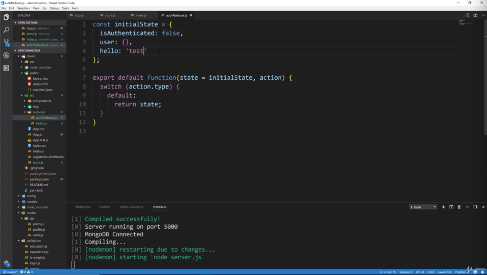

- chapter 40
1. update
- App.js
- store.js
- index.js(reducers folder)
- authReducer.js(reducers folder)

2.

- "redux" is obviously the redux state management system. now you can use redux outside of react as well. 
it's not necessarily for react, it just works really well with react because we have the awesome "react-redux" library which kind of glues everything together.
- "redux-thunk" is actually a piece of middleware that we are gonna use when we make AJAX request, we wanna wait for that request 
and then dispatch to our reducer and redux-thunk allows us to do that

- createStore takes 3 paraments
- we are gonna have multiple reducers. we will have an auth reducer for authentication, profile reducer, post reducer, error reducer 
you wanna combine these together. So there's actually a method called combineReducers where we can pass in all of our sub-reducers 
so we wanna pass in the rootReducer which is gonna basically contain all of our sub-reducer into "createStore"
- "preloadedState" : any initial state that you wanna add
- "enhancer" : this is where we apply our middleware, we are gonna apply our redux chrome extension here as well

- it works through linking between VSCode and redux chrome extension through picture 3. 
- we have not implemented any logic to change this or log in or to do any of that yet,  
but we now know that redux is set up and we have a authReducer which doesn't yet have not any cases for our switch except for the default which just returns the initial state

- if i were to add something else to the initial state, then we have "hello: 'test'" in redux chrome extension
