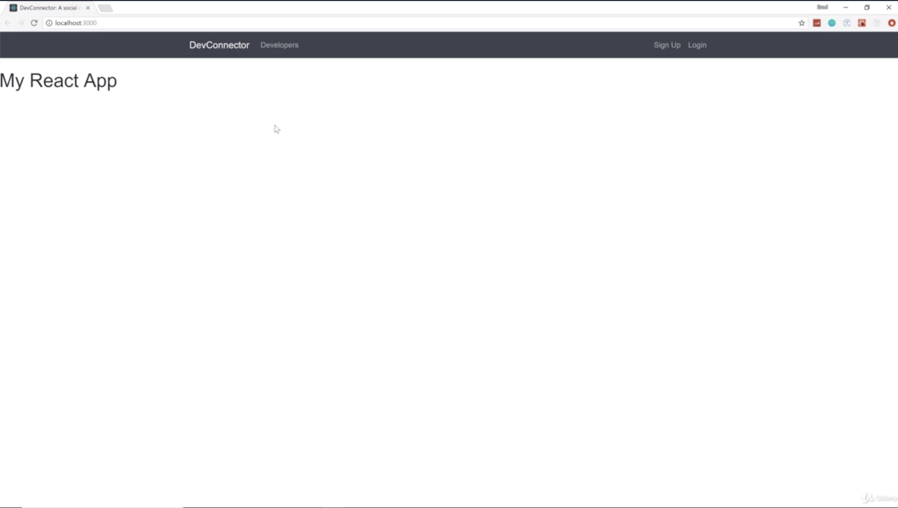
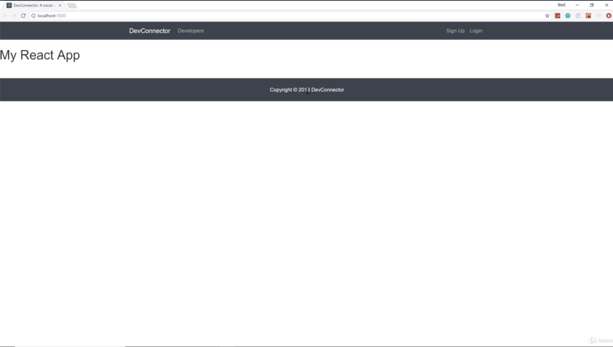
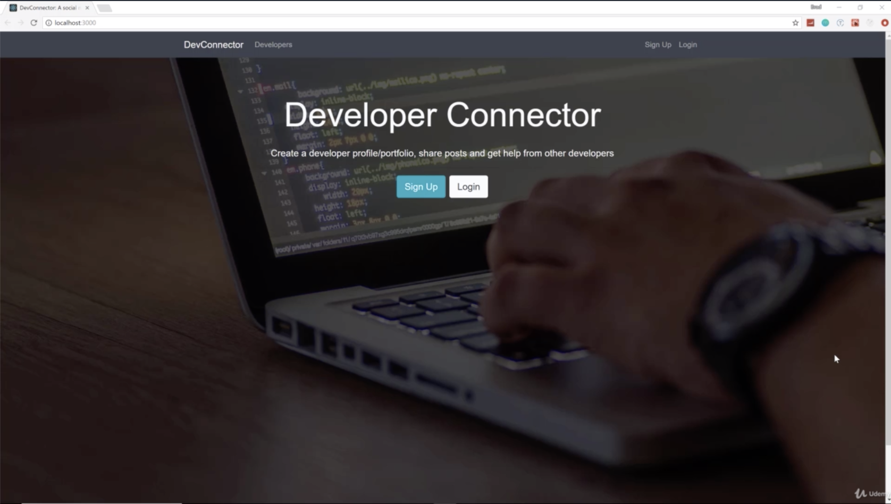

- chapter 31
1. update
- Navbar.js(from outside landing.html in devconnector_theme )
- Footer.js
- Landing.js(from outside landing.html in devconnector_theme )
- App.js

2.

 --------------------------------------------------------------------------------------------------------

mongoose error
Dario Daniel · 2달 전
(node:13356) DeprecationWarning: current URL string parser is deprecated, and will be removed in a future version. To use the new parser, pass option { useNewUrlParser: true } to MongoClient.connect.

ML
Michael · 2달 전
change your mongo db connection to:

.connect(db, {useNewUrlParser: true})
Justin Lee
Justin · 한 달 전
1. Go to server.js

2. Change .connect() to connect(db, {useNewUrlParser: true})

 --------------------------------------------------------------------------------------------------------

as below, nodemon error may occur sometimes or no errors. it's time by time 
so if you get error about nodemon which says address already in use :::5000, then press enter again
 
 
 
<code>
Compiling...
[0] [nodemon] restarting due to changes...
[0] [nodemon] starting `node server.js`
[1] Compiled successfully!
[0] (node:7332) DeprecationWarning: current URL string parser is deprecated, and will be removed in a future version. To use the new parser, pass option { useNewUrlParser: true } to MongoClient.connect.
[0] events.js:167
[0]       throw er; // Unhandled 'error' event
[0]       ^
[0]
[0] Error: listen EADDRINUSE: address already in use :::5000
[0]     at Server.setupListenHandle [as _listen2] (net.js:1290:14)
[0]     at listenInCluster (net.js:1338:12)
[0]     at Server.listen (net.js:1425:7)
[0]     at Function.listen (/Users/kiwonkim/Desktop/dev-connector/dev-connector/node_modules/express/lib/application.js:618:24)
[0]     at Object.<anonymous> (/Users/kiwonkim/Desktop/dev-connector/dev-connector/server.js:56:5)
[0]     at Module._compile (internal/modules/cjs/loader.js:689:30)
[0]     at Object.Module._extensions..js (internal/modules/cjs/loader.js:700:10)
[0]     at Module.load (internal/modules/cjs/loader.js:599:32)
[0]     at tryModuleLoad (internal/modules/cjs/loader.js:538:12)
[0]     at Function.Module._load (internal/modules/cjs/loader.js:530:3)
[0]     at Function.Module.runMain (internal/modules/cjs/loader.js:742:12)
[0]     at startup (internal/bootstrap/node.js:283:19)
[0]     at bootstrapNodeJSCore (internal/bootstrap/node.js:743:3)
[0] Emitted 'error' event at:
[0]     at emitErrorNT (net.js:1317:8)
[0]     at process._tickCallback (internal/process/next_tick.js:63:19)
[0]     at Function.Module.runMain (internal/modules/cjs/loader.js:745:11)
[0]     at startup (internal/bootstrap/node.js:283:19)
[0]     at bootstrapNodeJSCore (internal/bootstrap/node.js:743:3)
[0] [nodemon] app crashed - waiting for file changes before starting...
[1] Compiling...
[0] [nodemon] restarting due to changes...
[0] [nodemon] starting `node server.js`
[1] Compiled successfully!
[0] (node:7338) DeprecationWarning: current URL string parser is deprecated, and will be removed in a future version. To use the new parser, pass option { useNewUrlParser: true } to MongoClient.connect.
[0] events.js:167
[0]       throw er; // Unhandled 'error' event
[0]       ^
[0]
[0] Error: listen EADDRINUSE: address already in use :::5000
[0]     at Server.setupListenHandle [as _listen2] (net.js:1290:14)
[0]     at listenInCluster (net.js:1338:12)
[0]     at Server.listen (net.js:1425:7)
[0]     at Function.listen (/Users/kiwonkim/Desktop/dev-connector/dev-connector/node_modules/express/lib/application.js:618:24)
[0]     at Object.<anonymous> (/Users/kiwonkim/Desktop/dev-connector/dev-connector/server.js:56:5)
[0]     at Module._compile (internal/modules/cjs/loader.js:689:30)
[0]     at Object.Module._extensions..js (internal/modules/cjs/loader.js:700:10)
[0]     at Module.load (internal/modules/cjs/loader.js:599:32)
[0]     at tryModuleLoad (internal/modules/cjs/loader.js:538:12)
[0]     at Function.Module._load (internal/modules/cjs/loader.js:530:3)
[0]     at Function.Module.runMain (internal/modules/cjs/loader.js:742:12)
[0]     at startup (internal/bootstrap/node.js:283:19)
[0]     at bootstrapNodeJSCore (internal/bootstrap/node.js:743:3)
[0] Emitted 'error' event at:
[0]     at emitErrorNT (net.js:1317:8)
[0]     at process._tickCallback (internal/process/next_tick.js:63:19)
[0]     at Function.Module.runMain (internal/modules/cjs/loader.js:745:11)
[0]     at startup (internal/bootstrap/node.js:283:19)
[0]     at bootstrapNodeJSCore (internal/bootstrap/node.js:743:3)
[0] [nodemon] app crashed - waiting for file changes before starting...
[1] Compiling...
[0] [nodemon] restarting due to changes...
[0] [nodemon] starting `node server.js`
[1] Compiled successfully!
[0] (node:7348) DeprecationWarning: current URL string parser is deprecated, and will be removed in a future version. To use the new parser, pass option { useNewUrlParser: true } to MongoClient.connect.
[0] Server running on port 5000
[0] MongoDB Connected
</code>
