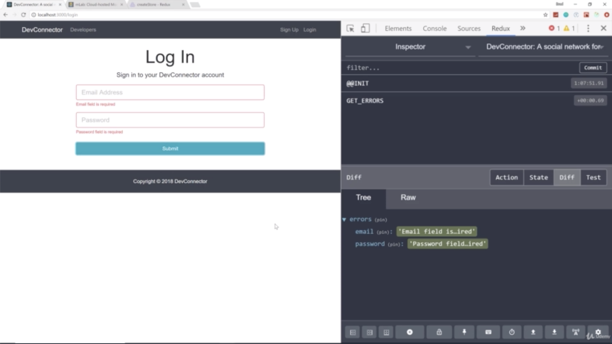
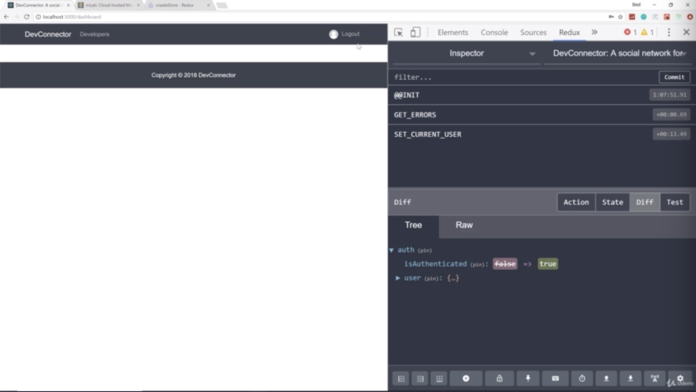
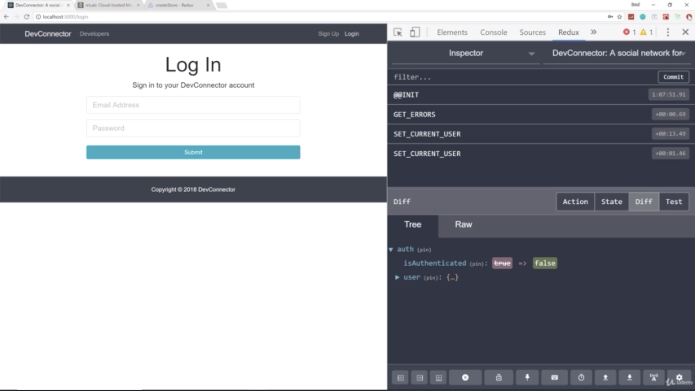
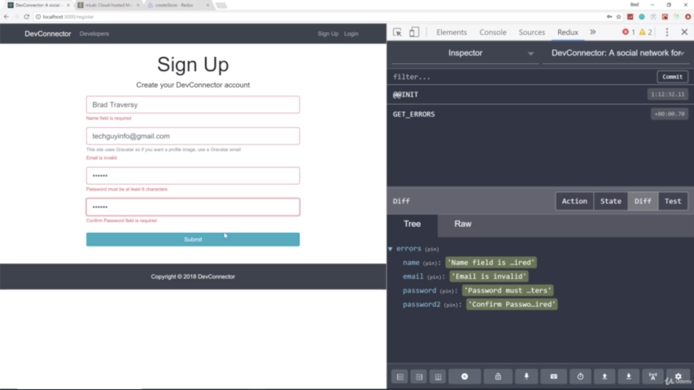
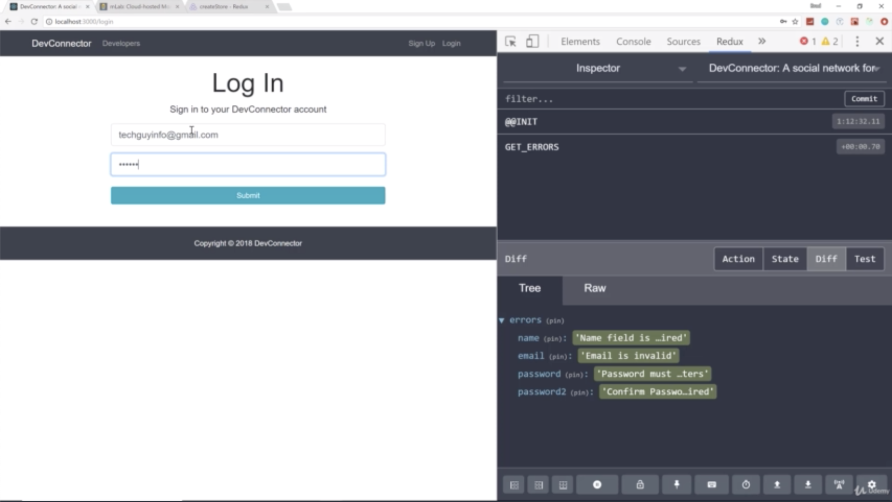

- chapter 46
1. update
- textFieldGroup.js(components/common folder)
- Login.js(components/auth folder)
- Register.js(components/auth folder)

2.

- we can see the errors are still working

- if we login, it still works and log out back

- the errors work good

- we register this, and go automatically Login page. then you can see my little Gravatar up here
