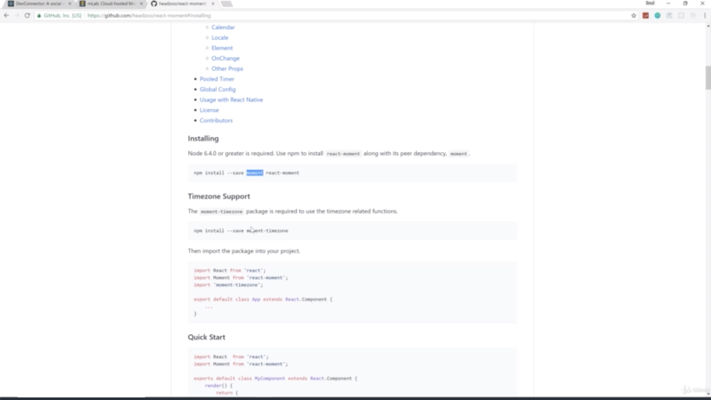
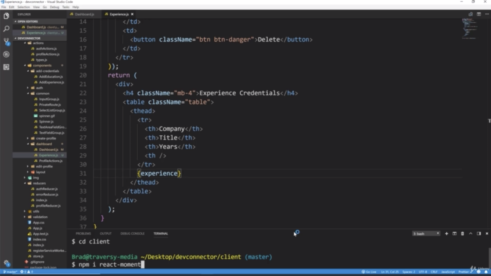
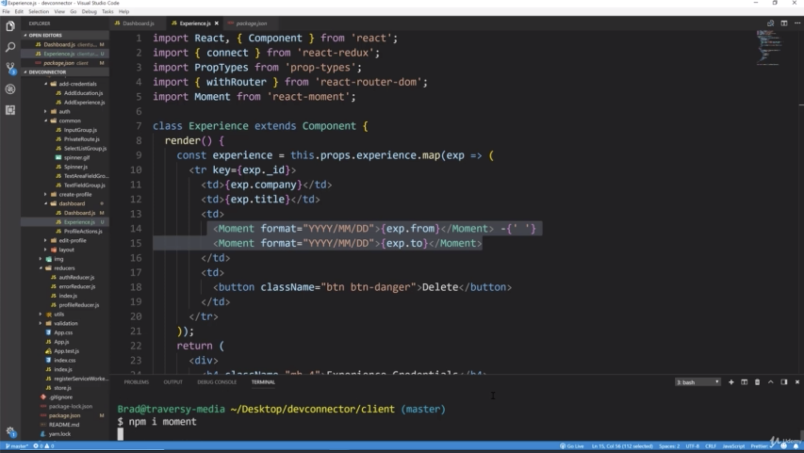
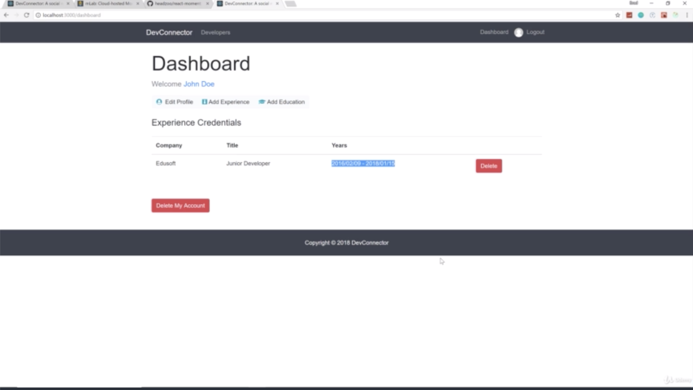
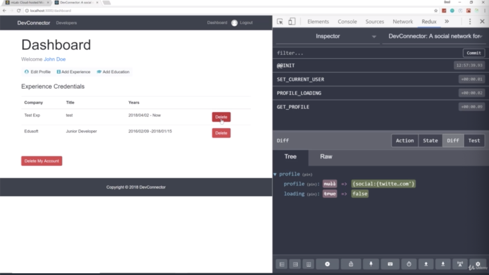
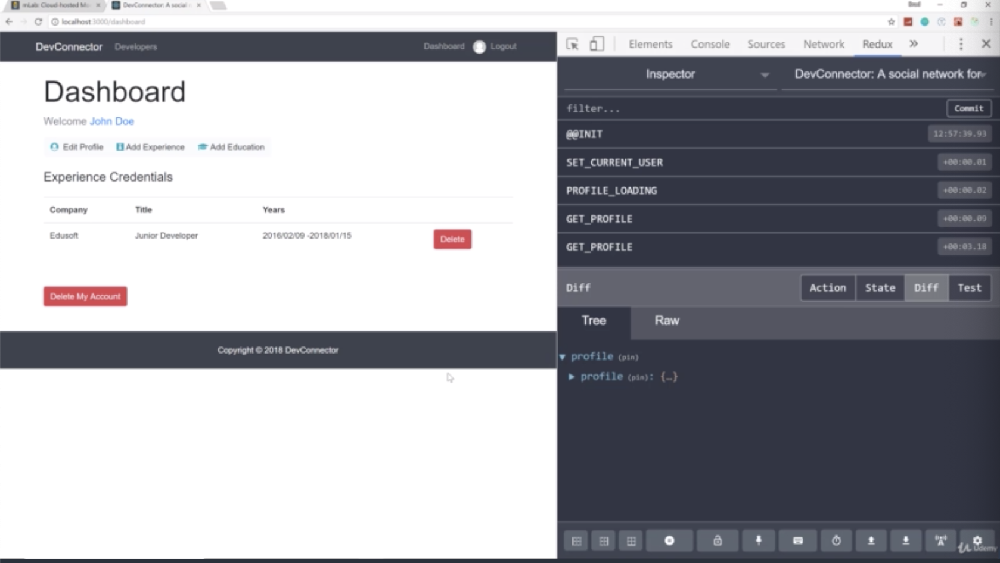
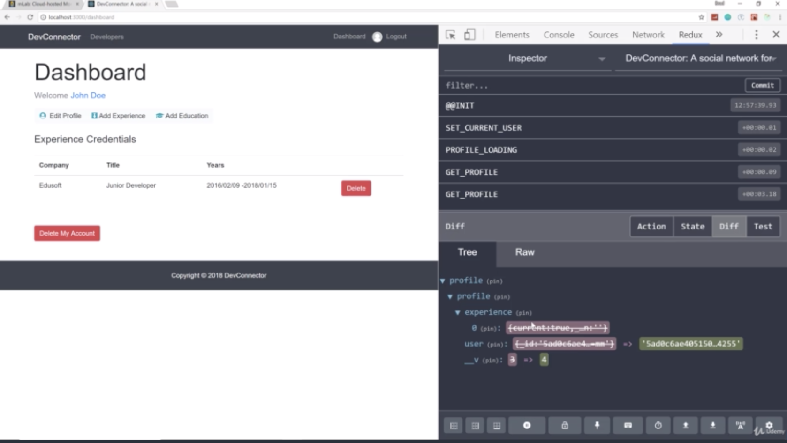

- chapter 59
1. update
- Dashboard.js(components/dashboard folder)
- Experience.js(components/dashboard folder)
- profileActions.js(actions folder)

2.

- you should be 'npm install --save moment react-moment'. 

- we got our profile back because we called GET_PROFILE type and it no longer include that experience
- you can see that the diff includes getting rid of that experience
