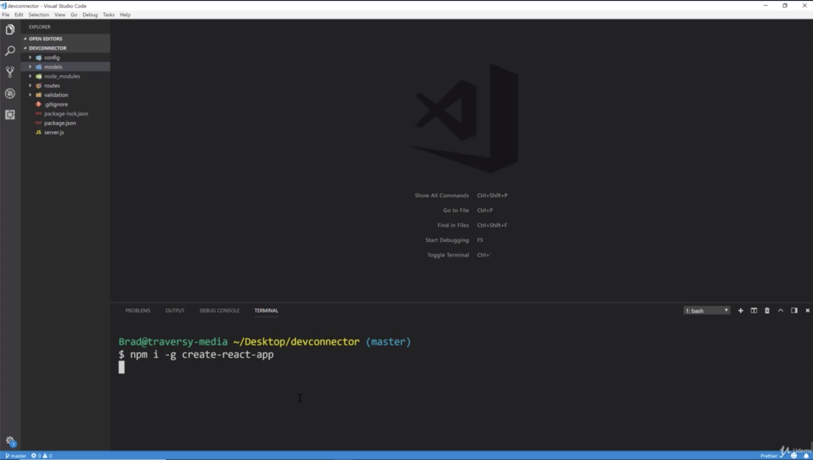
- -g is very important because create-react-app is something that you want to install globally so that you can use it wherever you want 
and you can generate an application or a boiler plate. that will be installed globally on your machine
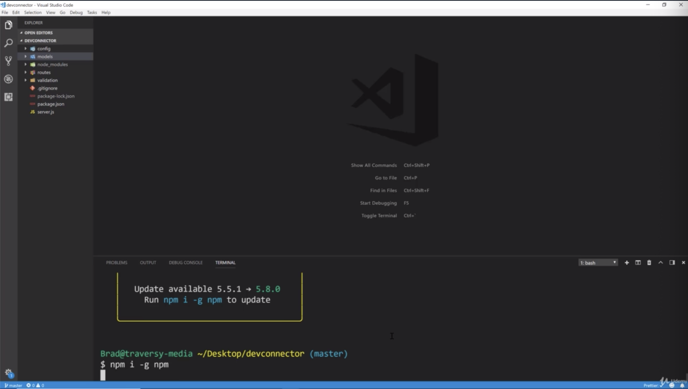
- that will update you to the latest version
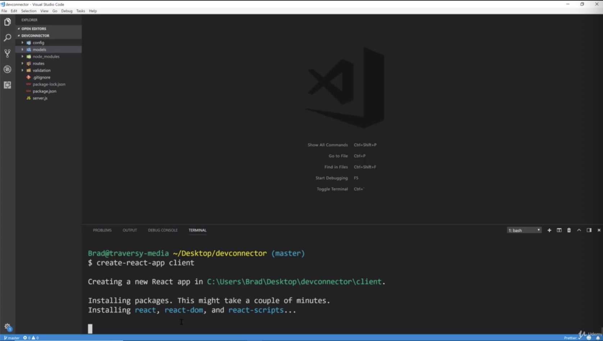
- now what we want to do is to make sure that you're in your devconnector folder.
- we wanna generate a client which is gonna our react application
- so create-react-app in client folder. so remember React is completely separate from your backend.
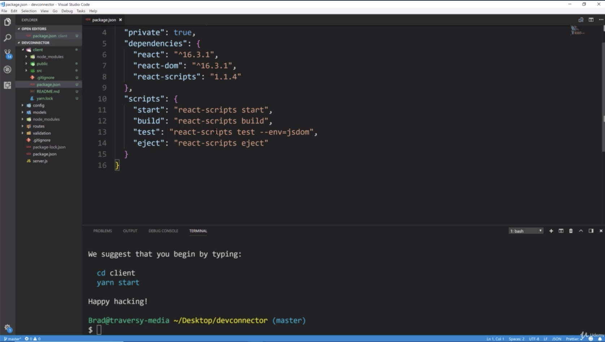
- these all comes with "react-script start" to start dev server, build so that we can build out our site, our static assets when we are ready to deploy testing stuff like that
- one thing we wanna add is proxy value. the reason is that when we make a request to our backend through react, we are gonna be using axios. 
we don't want like "http://localhost:5000/api/profile" we want to just be able to do like this "api/profile"
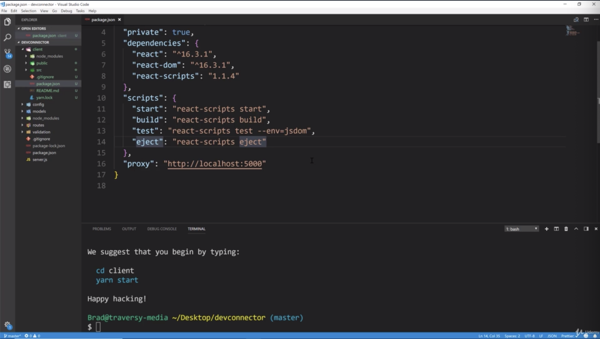
- so what we need to do is add proxy value to our backend URL which is "http://localhost:5000". So that we don't have to include "http://localhost:5000" within our request to our backend
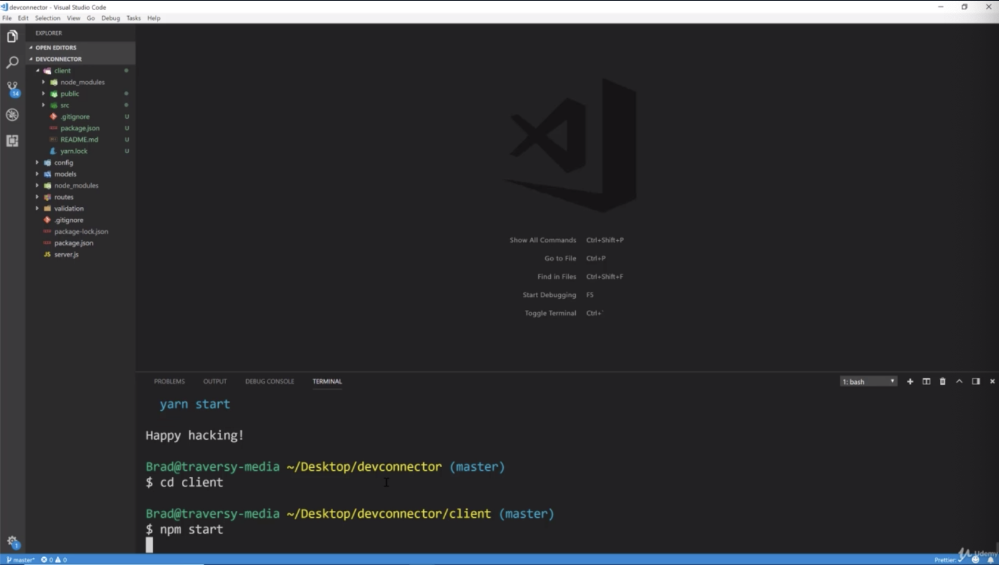
- "npm run server" will run on port 5000. however it runs on port 3000 which coms with the dev server that runs on port 3000 
- and we could cd into our client folder like "cd client"
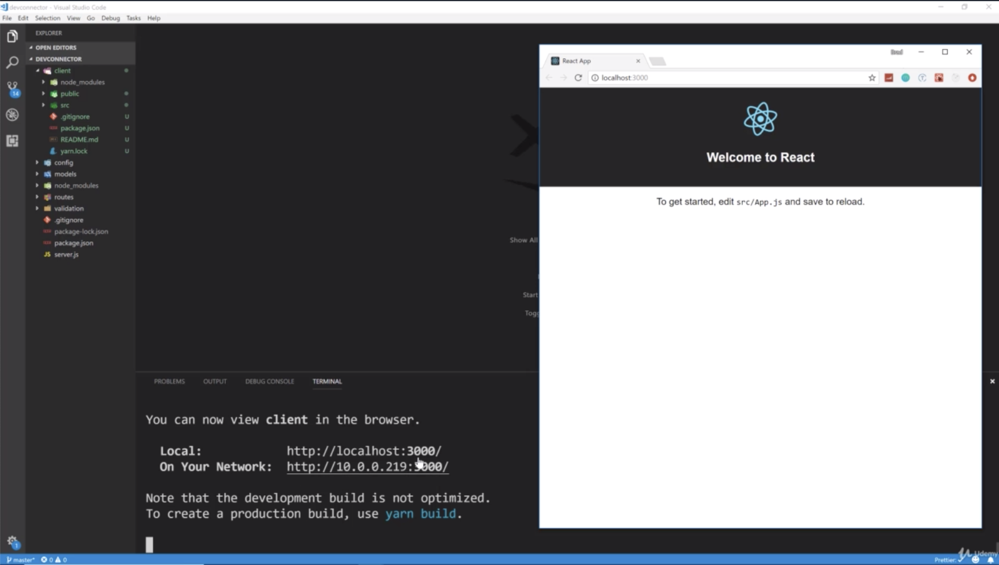
- so we have our react application running now. we could go ahead and start up our backend by opening a new terminal and doing "npm run server" that would open that would started on 5000
- and then we could kind of start to create our application and make requests to our backend
- but i don't wanna have to open up 2 different terminals and run 2 different certain dev servers with different command
- so we are gonna use something called "concurrently" which will allow us to run multiple commands at once. so we can just do for instance npm run dev from within the devconnector route instead of going into the client.
and that will run both
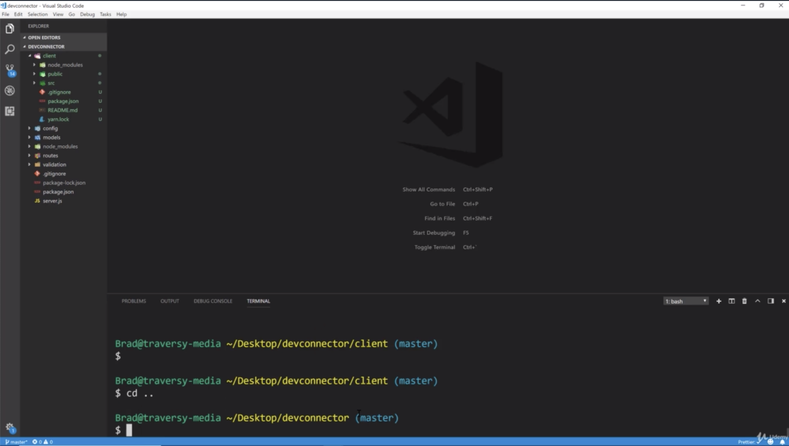
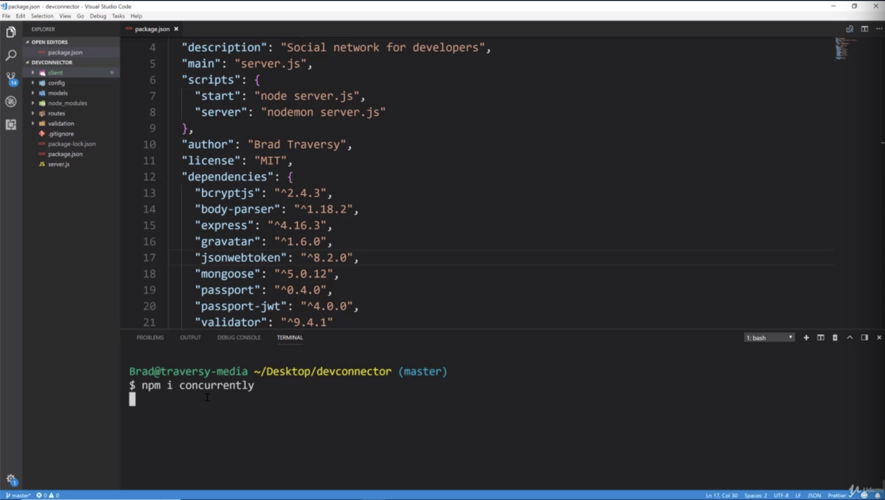
- open your package.json file of backend not client
- "concurrently" is a very small module. it just allows us to run a script and have multiple commands
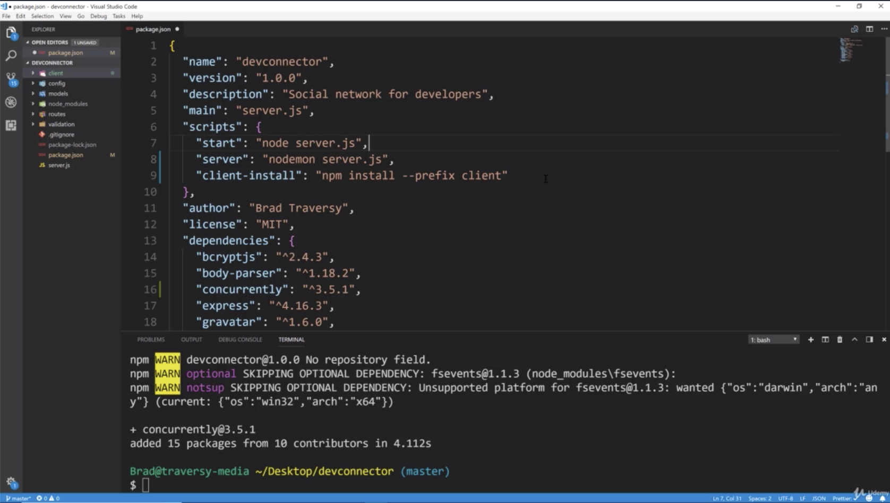
- we are gonna add some extra scripts. we have our main start script
- this will be used in production. this is what we use for development using nodemon. that's what we have been using so that it constantly watches and updates
- but now what we wanna do is add a "client-install" script because if we push this to github, you are not gonna push node_modules folder from the server or the node_modules from the client.
- so you gonna wanna run npm install in the server just like you would with any node app that you clone or you pull from github and you are also gonna wanna run npm install on the client
- now i wanna save them from having to cd into the client and run npm install. so we are simply gonna put a client-install script 
and we can do "client-install": "npm install --prefix client" which means it will go into the client folder first and then run npm install. this is just a convenience thing for people if you have this on github. so that they can just run npm run client install
and it will install all of the react dependencies just like if they run npm install the node dependencies
- we wanna be able to run just the client if we want. i'm actually gonna move this client install up to the top here.
- that is the first thing they would run before starting.
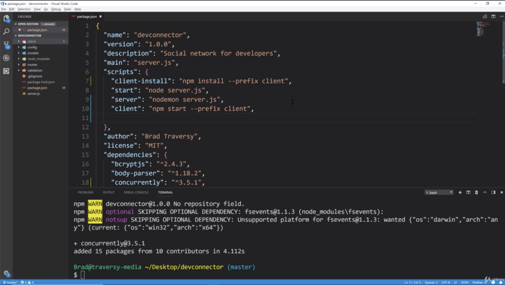
- "client" will be just to run the client. now it's very rare that this will run this but i want them to have the option.
- "client": "npm start --prefix client"
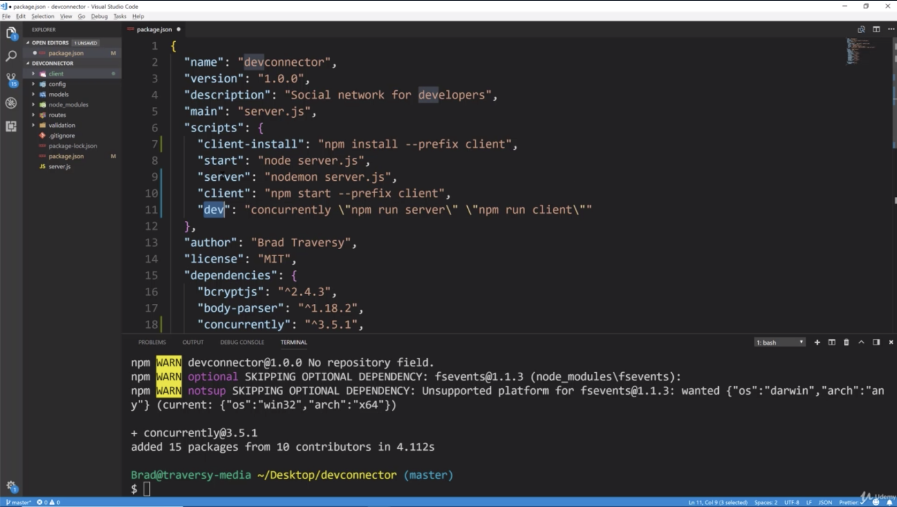
- the last one we are gonna do is the most important which is our "dev" command. this is gonna run both our server and our react dev server
- this is where we use concurrently. we need to escape. we are gonna do \"npm run server\" remember that's what we have been using to run our backend server
and \"npm run client\"
- what is going on is when we do npm run dev, it gonna run both of these "server", "client" in 1 command
- that should be all we have to do for now later on when we are ready to push to Heroku we are gonna set up a Heroku build command 
so that it builds our static assets on their server instead of doing it locally and then pushing it
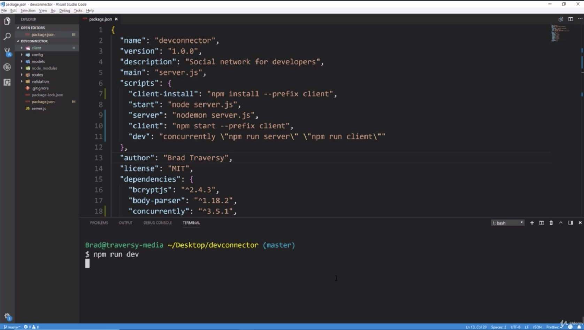
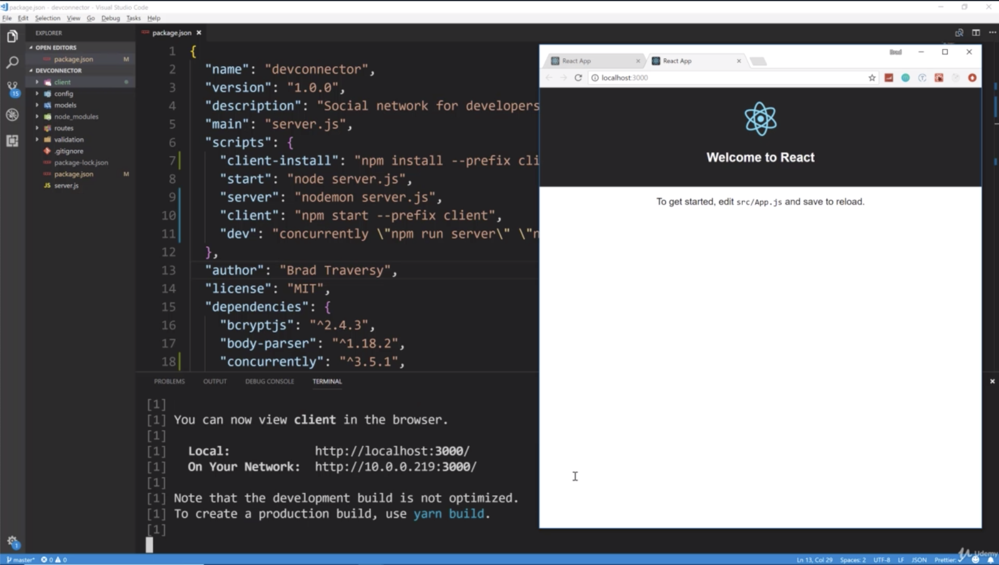
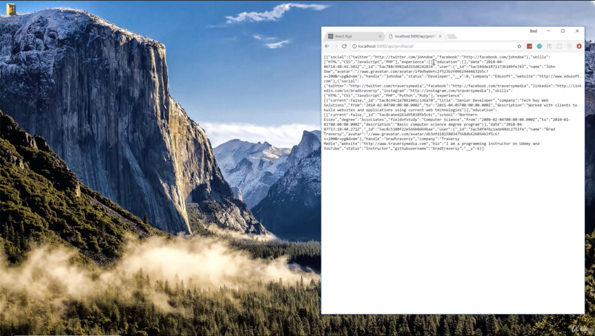
- you can see that it's actually serving our data for MongoDB through our backend
