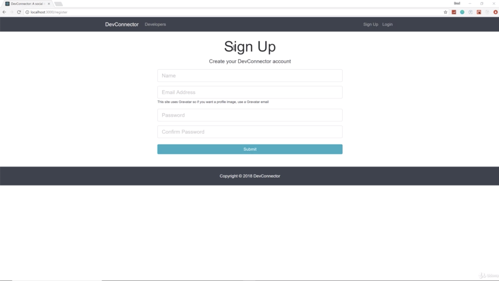
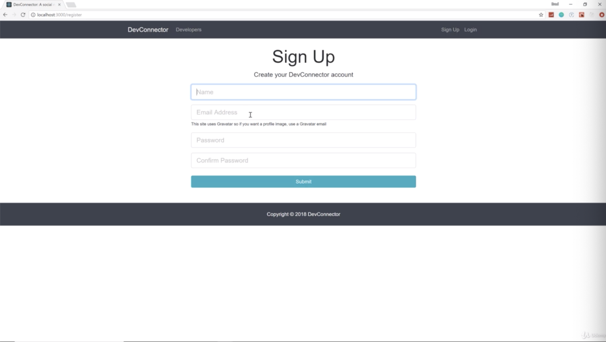
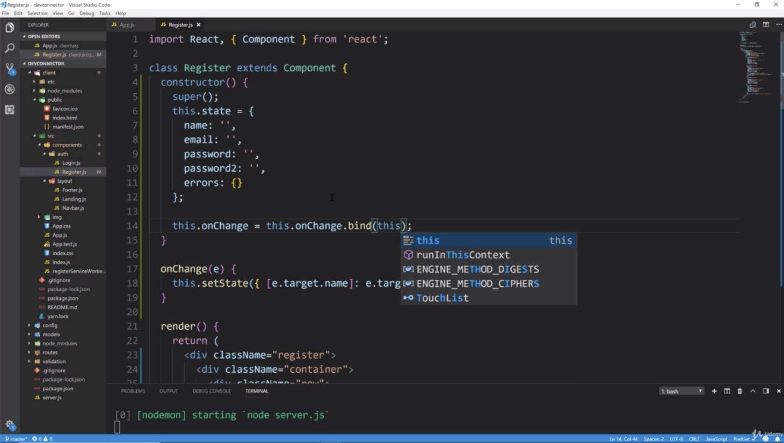
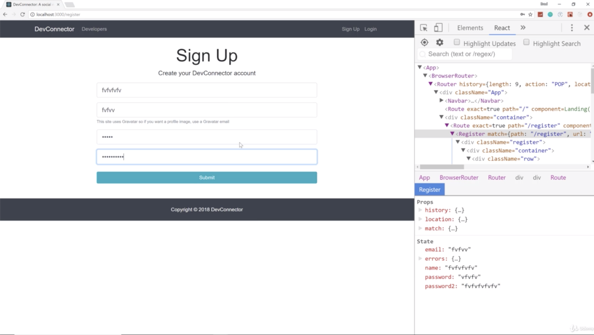
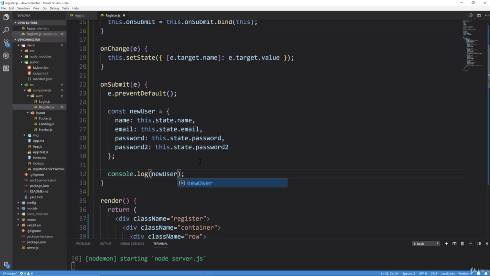
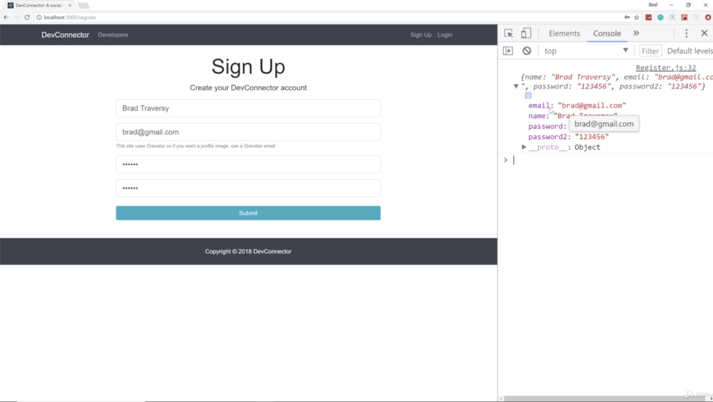

- chapter 34
1. update
- Register.js(components/auth folder) (from outside of devconnector_theme/register.html)

2.

- Register form is like this

- if i try to type in fields, i cannot type in anything because these have the value of those state values. 
we have to actually assign a change event to each input. change means when we start typing that's a change event

- after fixing onChange like "this.onChange = this.onChange.bind(this);", we can type in the fields
- and if you go see React tap of console on Chrome, then you can see, everytime we fill out fields, console also is filled with what we type in.

- so now we are seeing whatever i type in. it's in the state, it's getting put into that object once we push onSubmit 
and then it's just console loggin
