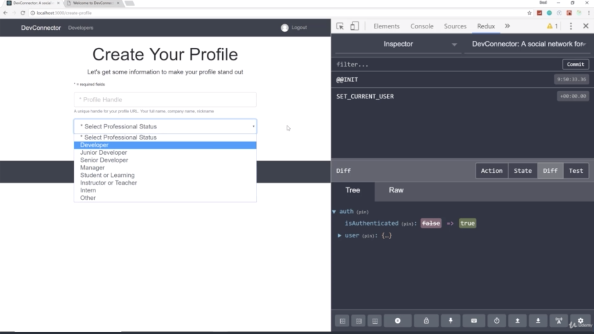
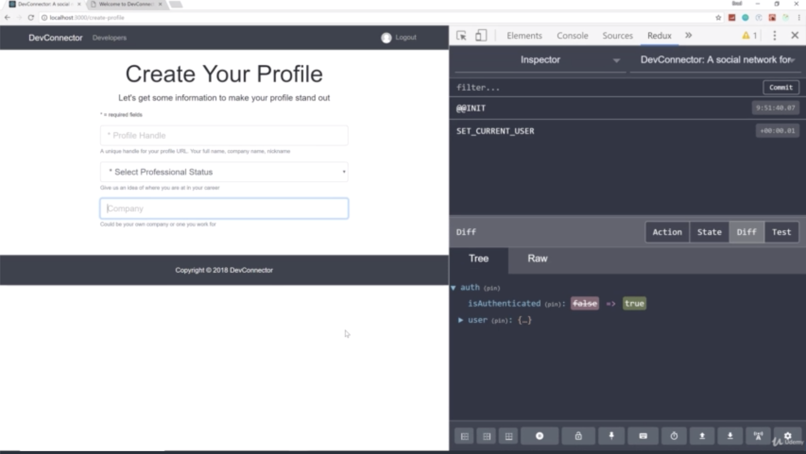
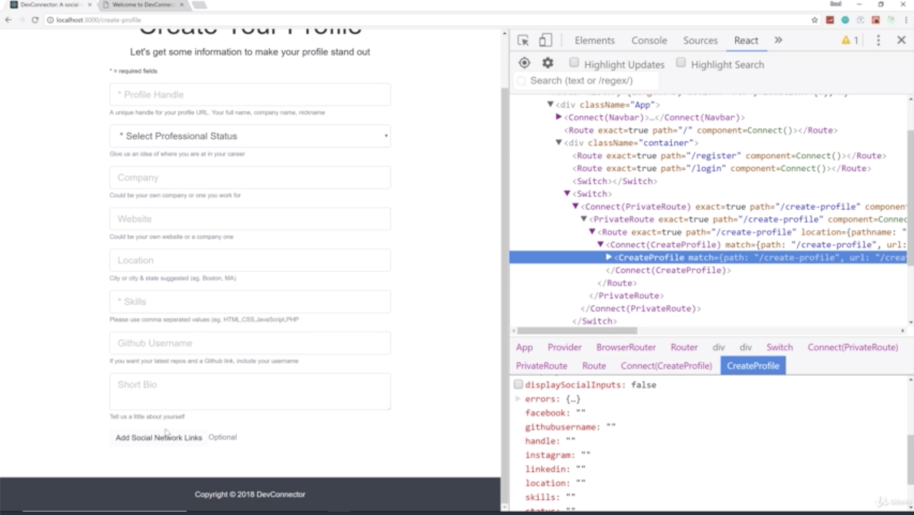
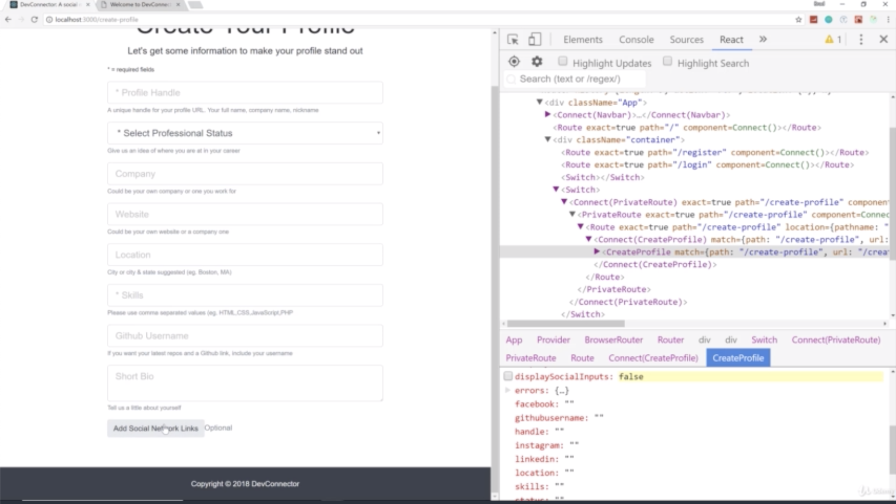
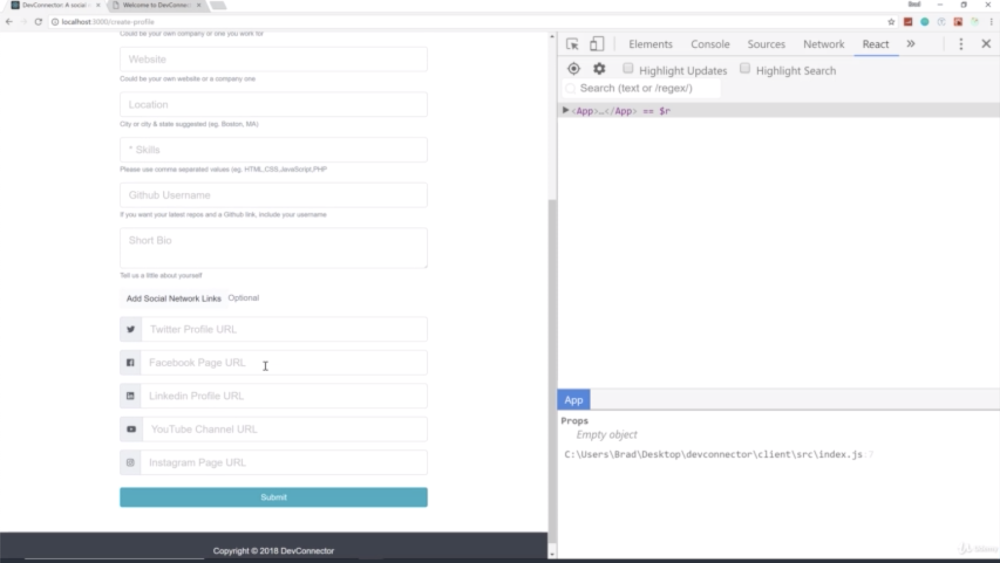

- chapter 52
1. update
- CreateProfile.js(components/create-profile folder)

2.

- We make Profile Handle and options

- there's a company field now for the rest of these

- if you look at the state, we can see displaySocialInputs false. If i click 'Add Social Network Links', 
then you can see changes to true by click and again click that, then it goes back to false 
so this is actually toggling the state which is exactly what it should be doing

- there's no links shown here because by default, this displaySocialLinks is false. if i click this, displaySocialLinks changes to true, then it's dlsplaying them 
if i click it again, it should go back to false and it hides them again.
