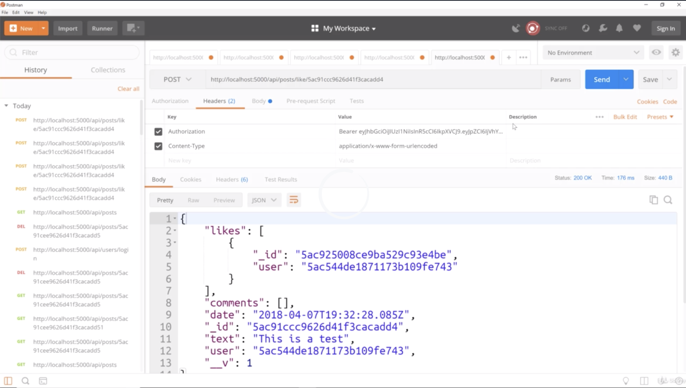
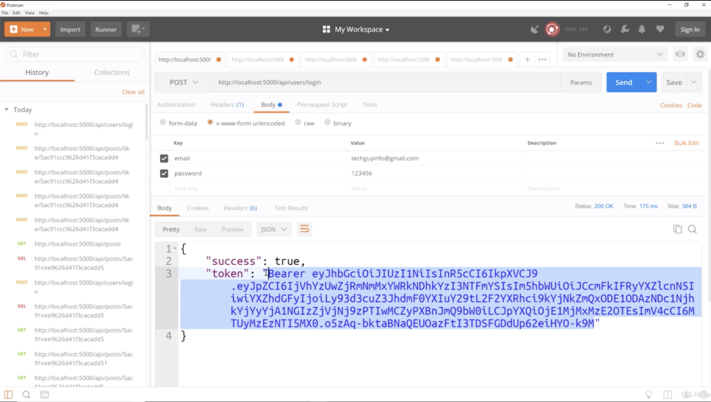
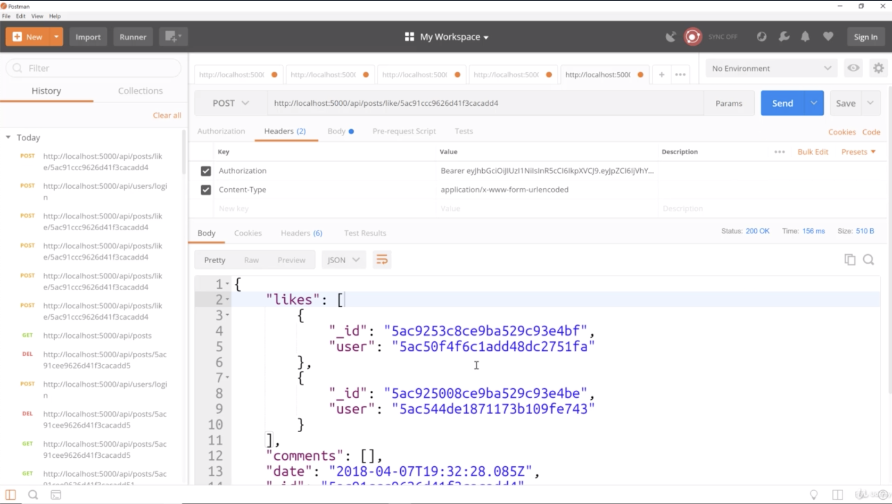
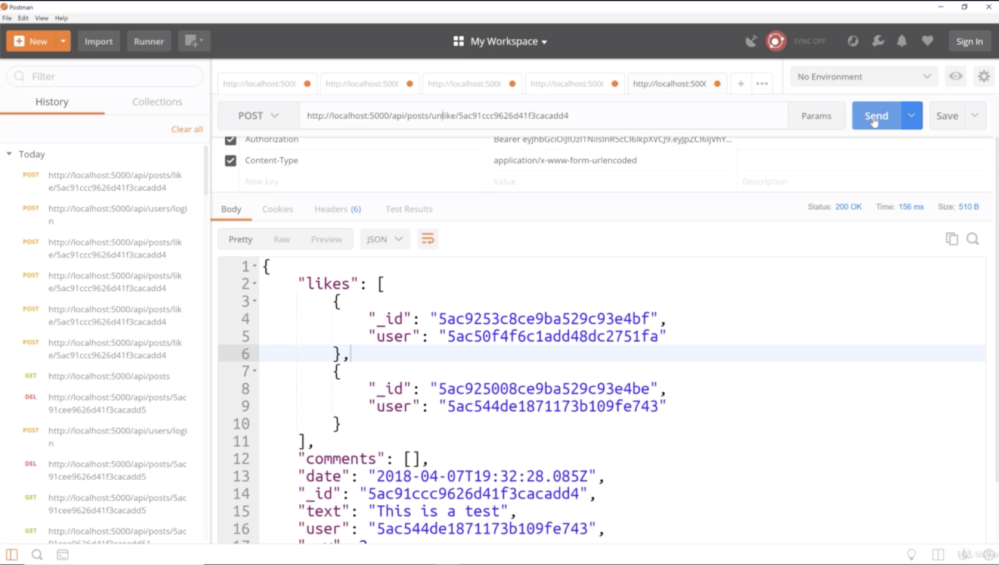
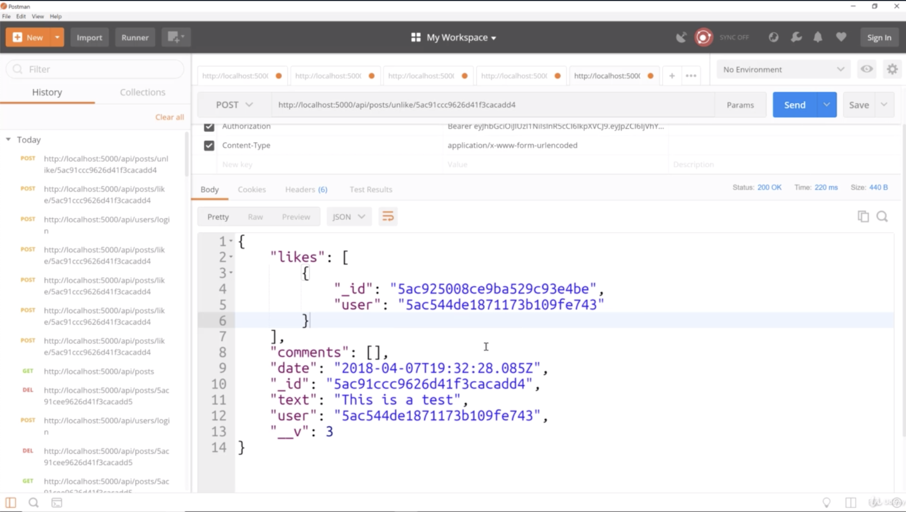

- chapter 27
1. update
- posts.js(routes/api folder)

2.

- we have likes array, we have an object with an ID each like will have its own ID and also has the user id
- the user's id which in this case is the creator of the post which is john doe's id and he just liked his own post

- if we like other user like Brad, new login and grab the new token
- and go to like route, change the token and we send

- you can see there's another like and the user is different. the user is brad's user or the techguyinfo
- So this post now has 2 likes which is pretty cool
 -------------------------------------------------------------------------------------------

- now you can see that Brad's like has been removed
