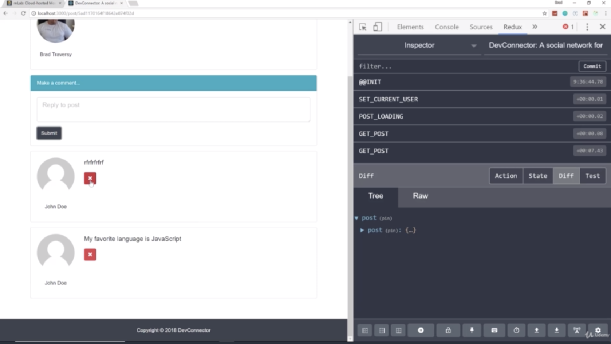
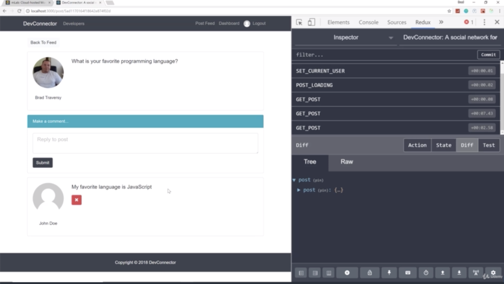
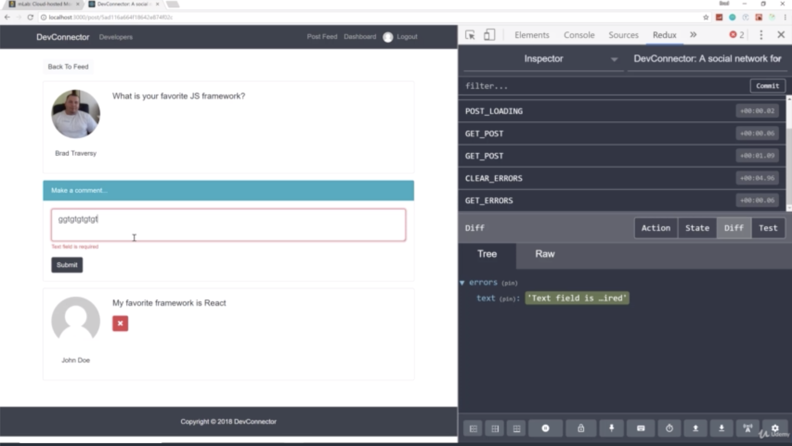
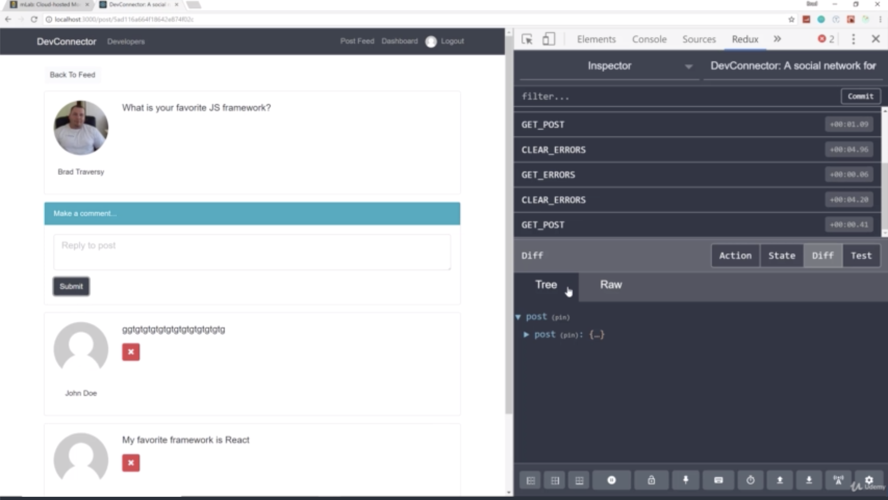

- chapter 74
1. update
- CommentFeed.js(components/post folder)
- CommentItem.js(components/post folder)
- Post.js(components/post folder)
- postActions.js(actions folder)
- types.js(actions folder)
- errorReducer.js(reducers folder)

2.

- if i submit, all the errors goes away
- any time you see that happends where the errors are still there, just go ahead and dispatch clearErrors before you make your request 
