- chapter 38
1. update
- Register.js(components/auth folder)

2.
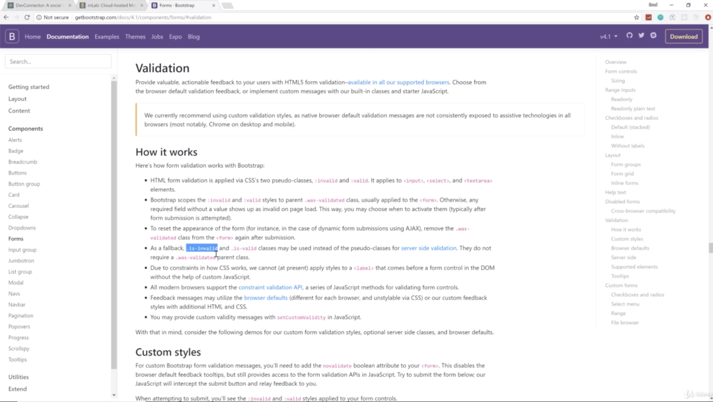
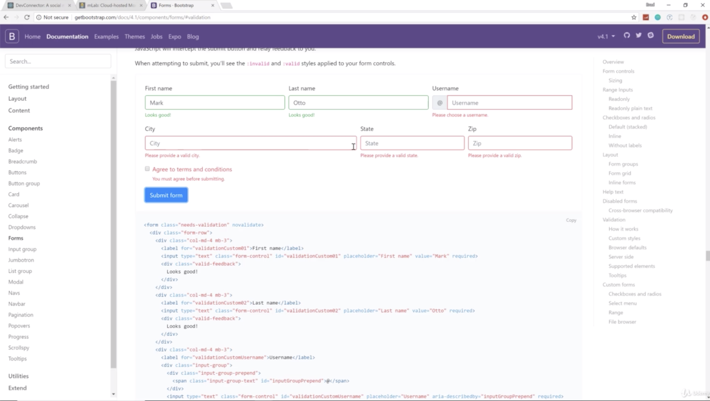
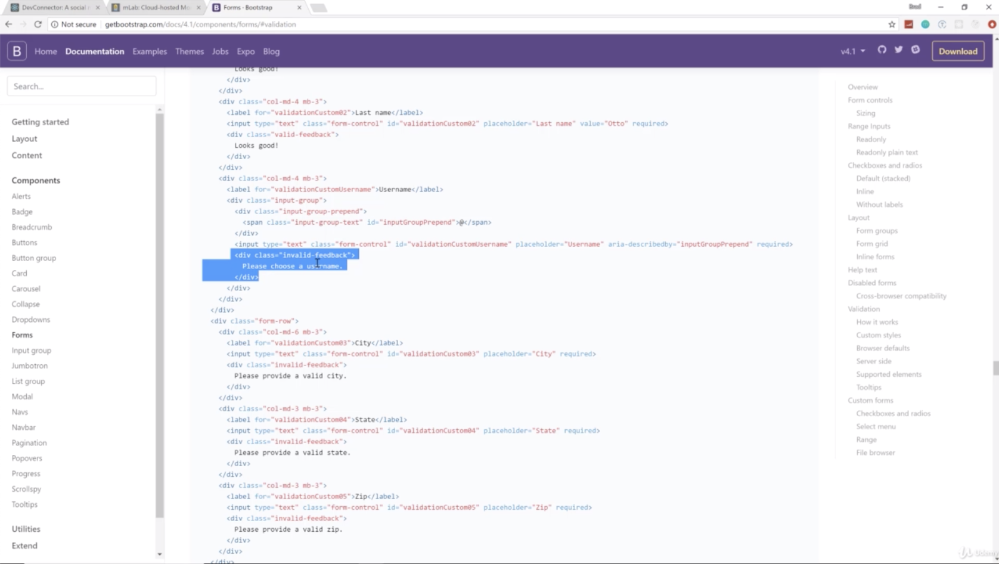
- basically you want to check error, and if you want that field to have an error, then you want it to have a class of isInvalid like picture 1 
input should have class
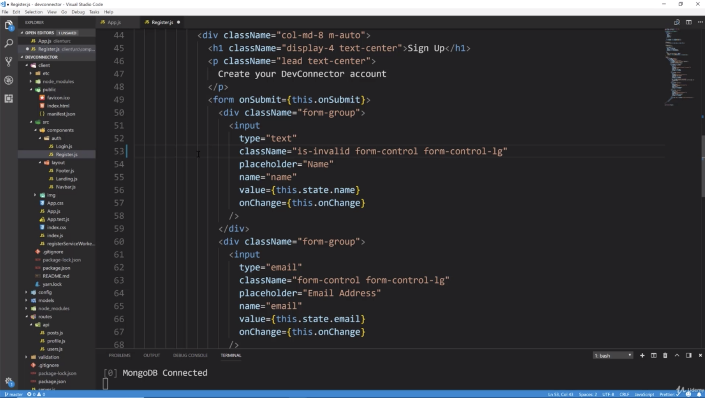
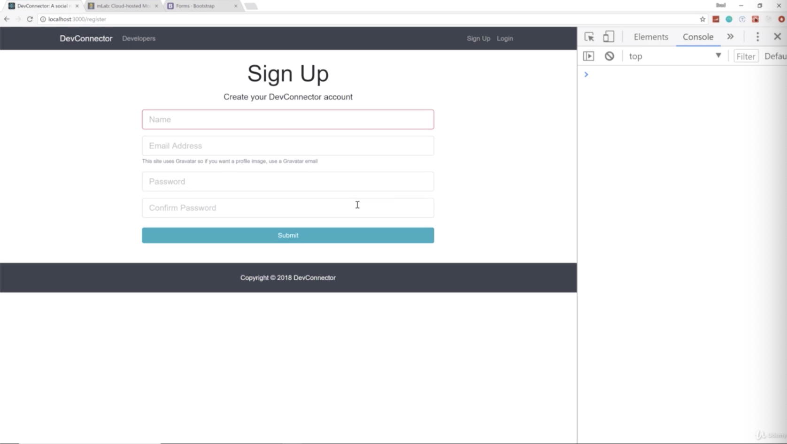
- like picture 2, red outline is made if you type in "is-invalid" in your class. 
- and error message text underneath comes from a div with "invalid-feedback" as a class 
now this doesn't show by default, it only shows if you have isInvalid as a class on your input
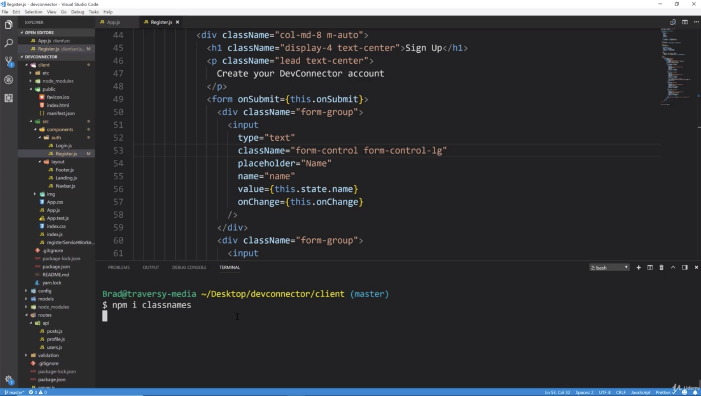
- the react doesn't have anything by default to do that.
- so we have to install a package called "classnames" which allow us to have conditional class names
- at install, you make sure the terminal is in the client folder.
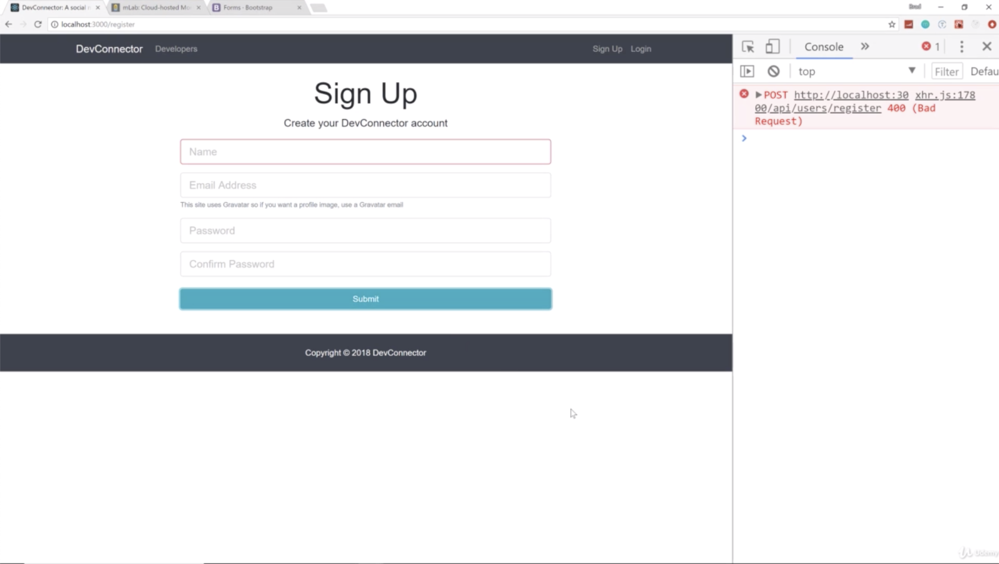
- if i submit without name, then we can see it's red
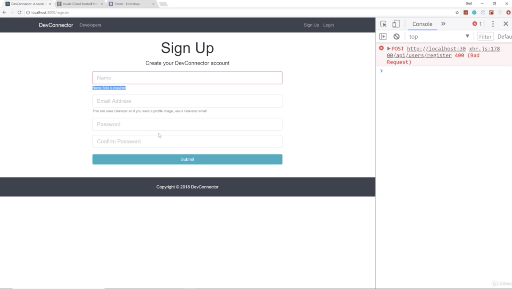
- this message is coming from our backend and is displayed on our frontend because we sent that along with the 400 response
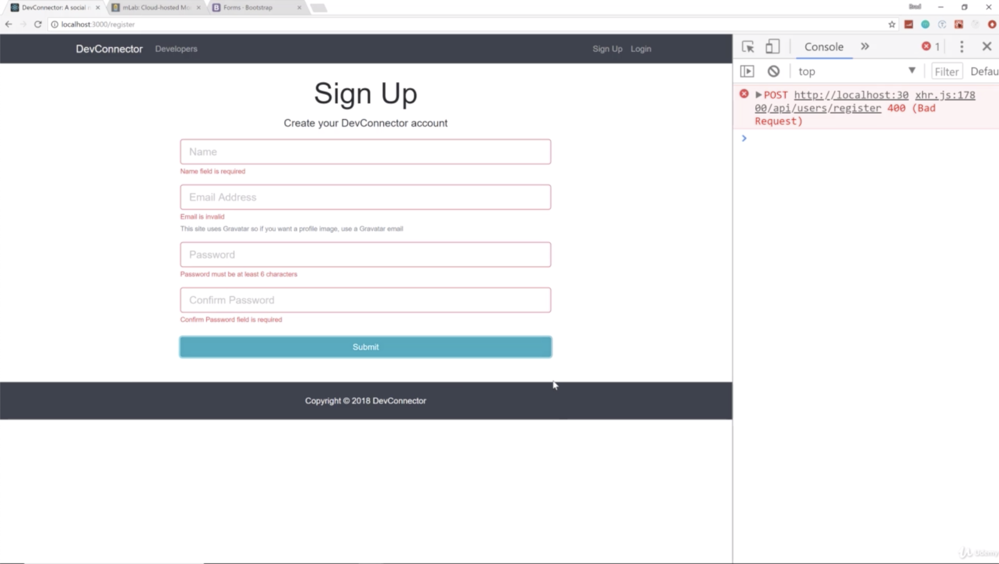
- if i submit without filling fields, then we get all of our errors
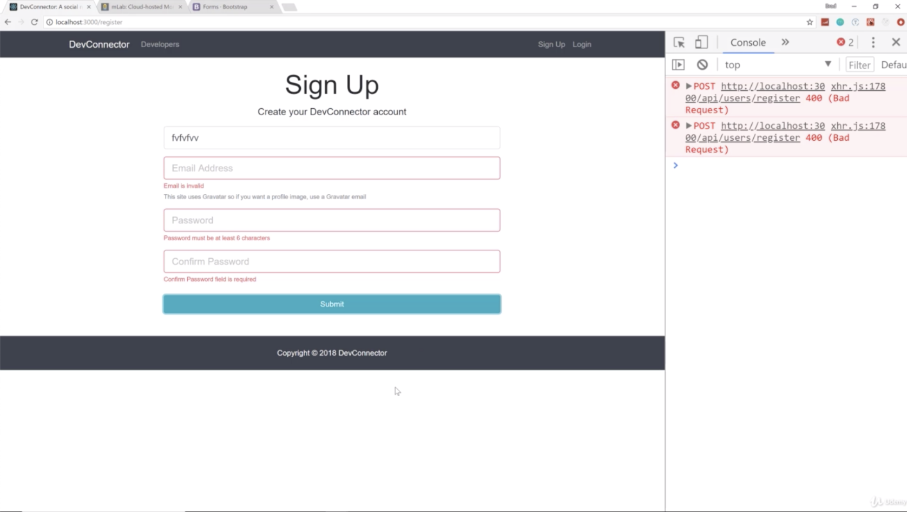
- if i submit only filling name, then error of name is gone
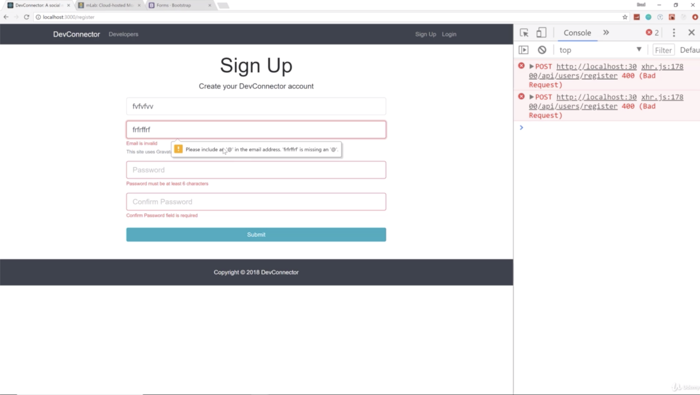
- if i put in an e-mail, it doesn't an actual email, we are gonna get the HTML5 error message of email here
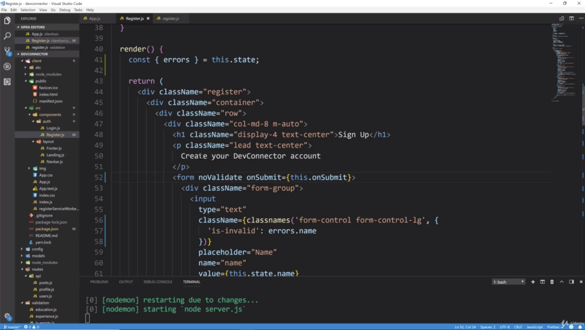
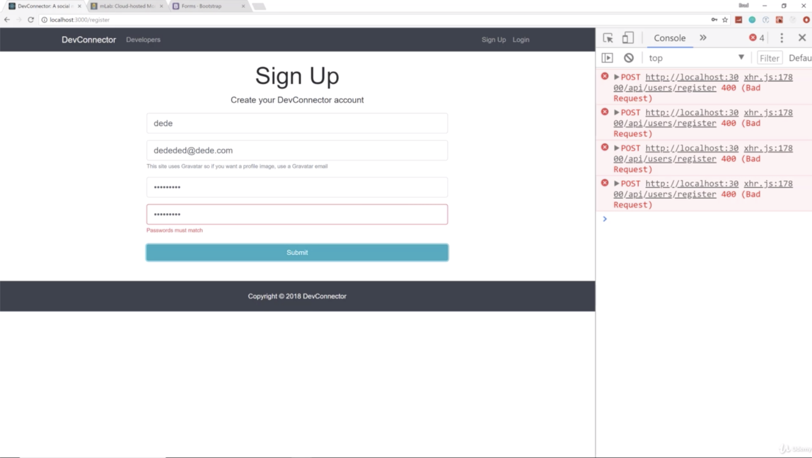
- if we don't want HTML5 error message of email, we can do like picture 12 "noValidate" on the <form> tag

- so error checking works perfectly
