- chapter 37
1. update
- Register.js(components/auth folder)

2.
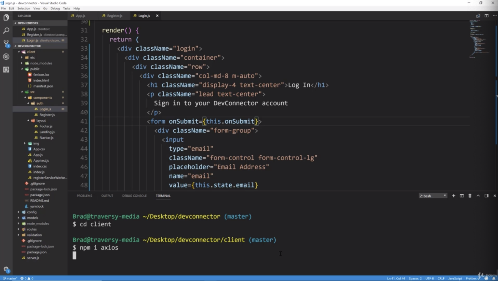
- we need to install axios to client not the backend
- we could use fetch API but fetch API can't do something that axios can do which talks later.
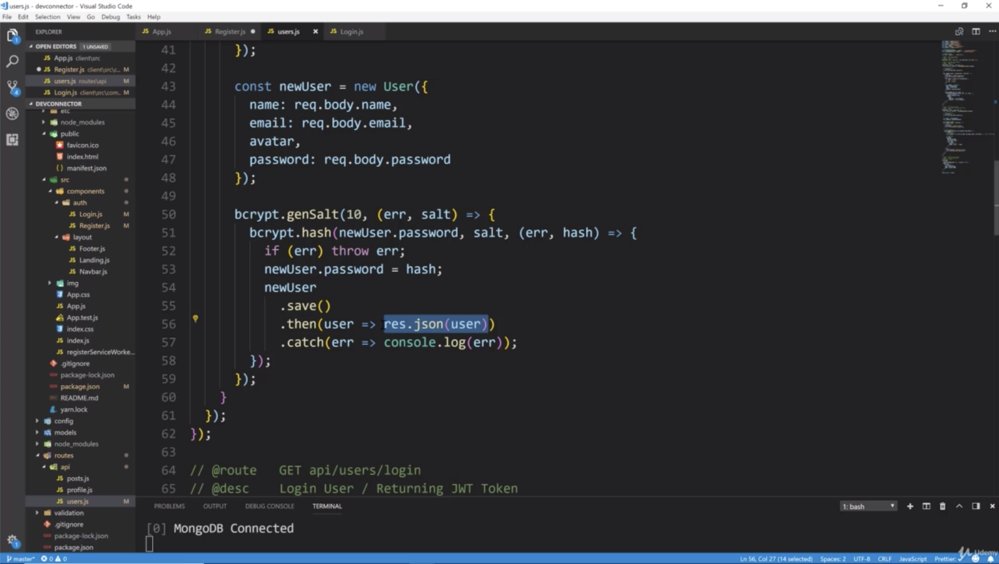
- "res.data" will give us the actual data. because remember when we register a user, gives us user back and we can check that real quick
  if we go to our routes and our backend users
<code><pre>
           .save()
           .then(user => res.json(user))
           .catch(err => console.log(err));
</pre></code>
once it saves everything, checks out it's gonna save 
and it's gonna respond with the user 
and if something goes wrong, there's an error, it's gonna respond with the error
- notice we don't have to do the localhost:5000 because we put that proxy value in our package.json
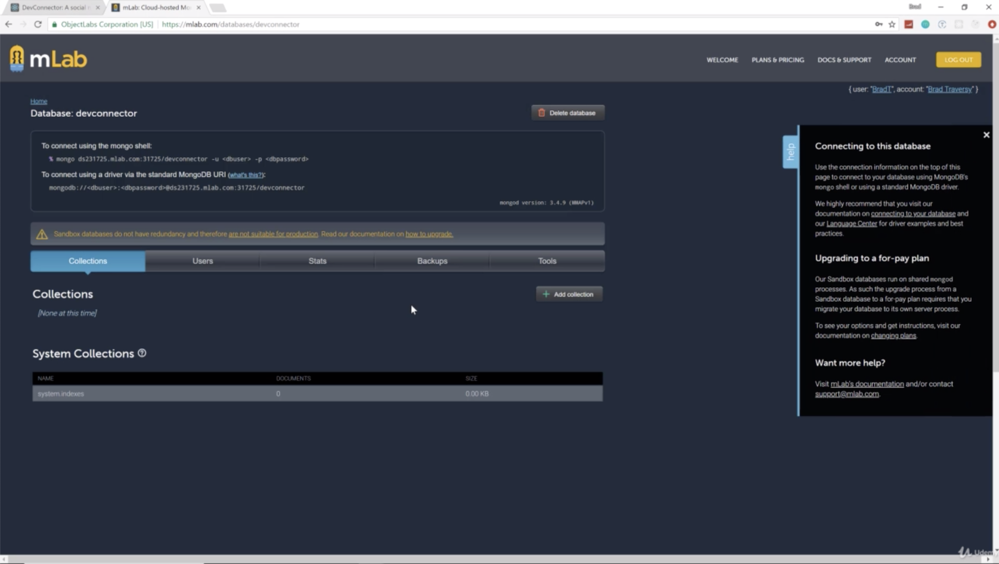
- go to mLab, and delete what we have. So nothing in database
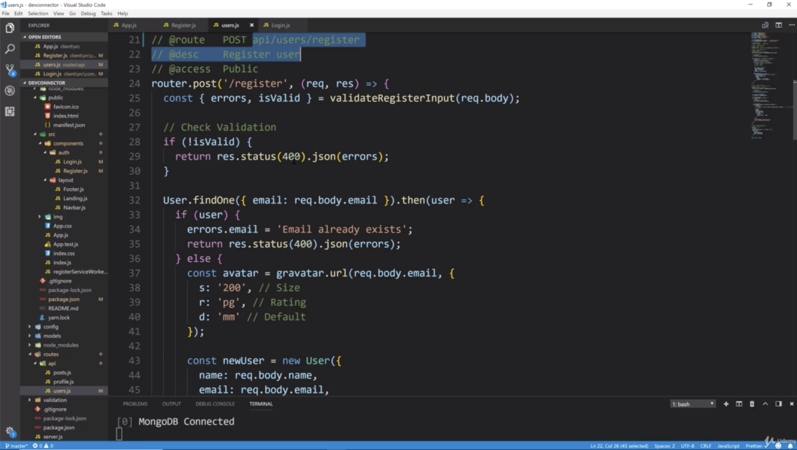
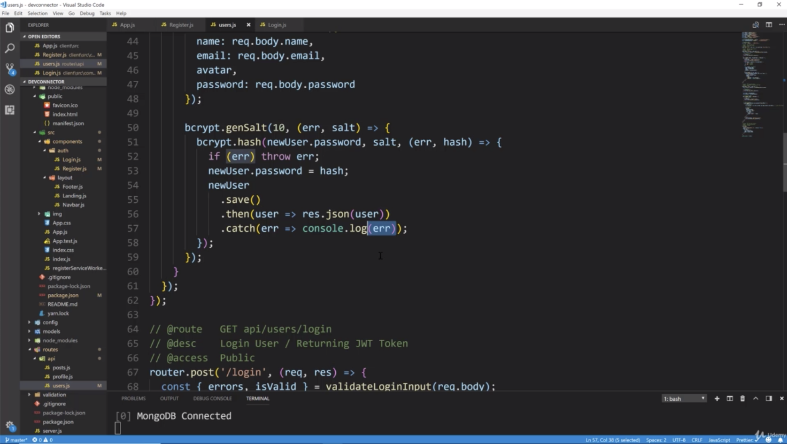
- back to our register form and reiterate what is supposed to happen here
- back to users.js(routes/api folder), when we hit our API endpoint which is api/users/register, it's gonna check for error 
for instance, if we don't fill out the name field which is required because that's what we set in our validation. we should get back a 400 error. 
and then ultimately it should actually send back those errors. if an email already exists, we should get sent a 400 error
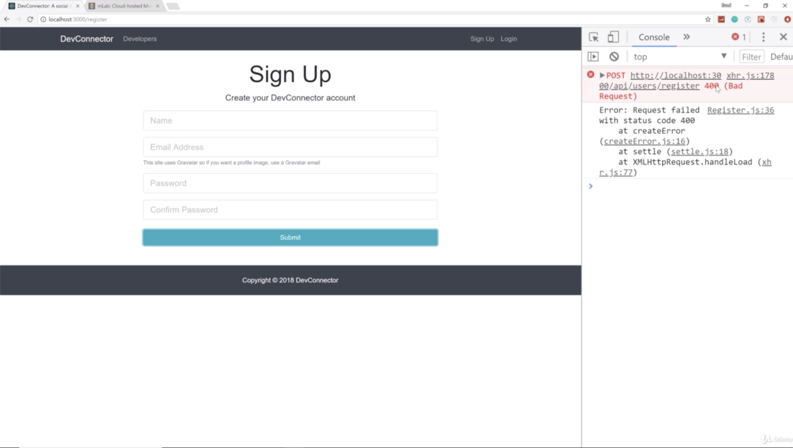
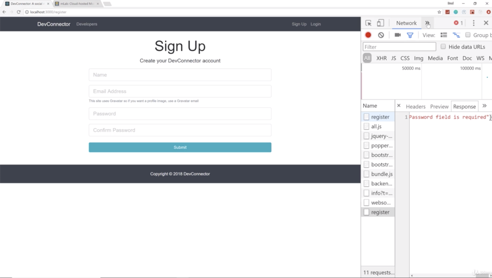
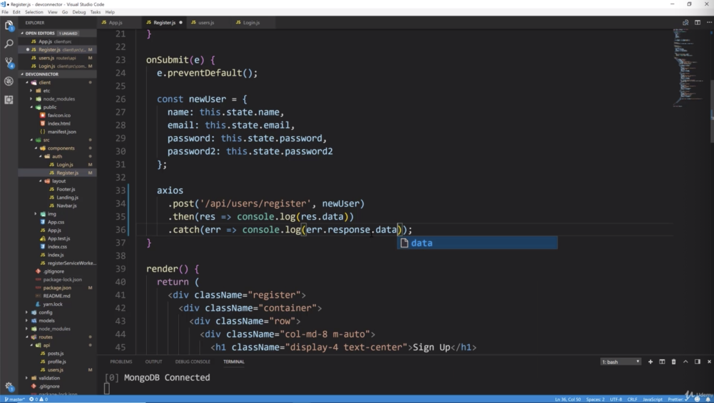
- let's go ahead and try to submit the form and have it give us an error
- if we want to console log those errors instead of seeing this, then we can just say like picture 8 "err.response.data". that will give us the actual object that we are sending back
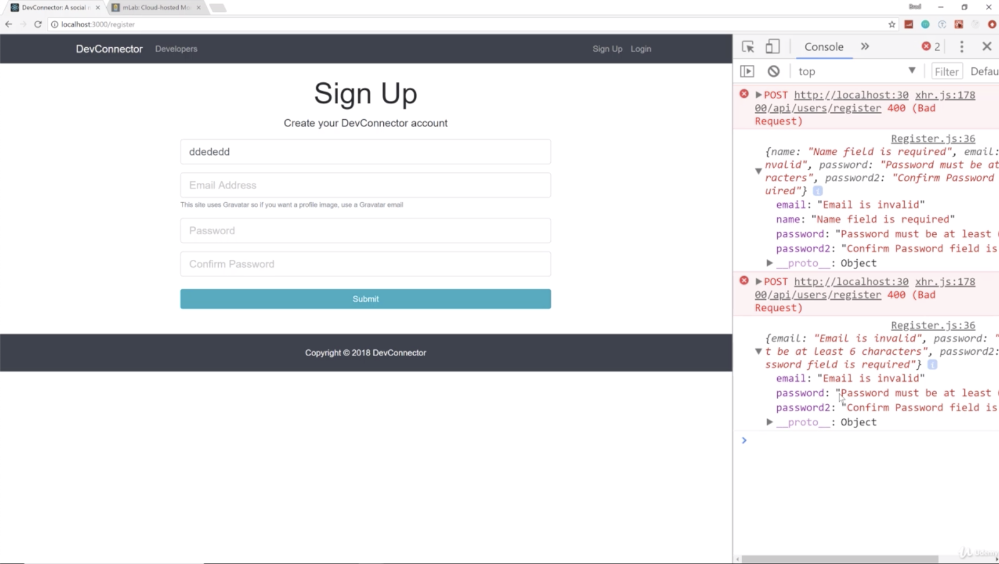
- you can see that now that once name field is filled, the name error is no longer seen
- so as long as this doesn't pass obviously, it's not gonna actually create a user
- now ultimately we are gonna want these errors to display in our form under each field. we can do that before we get into redux to have it set up
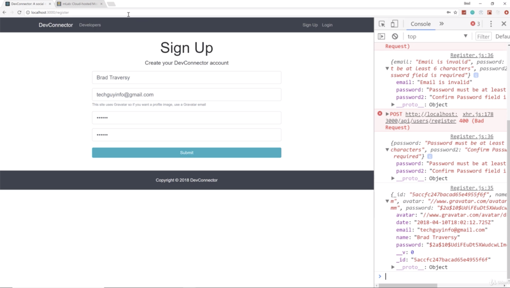
- after submit, there's the user if we look at it, it has the name and the password was hashed all that stuffs etc
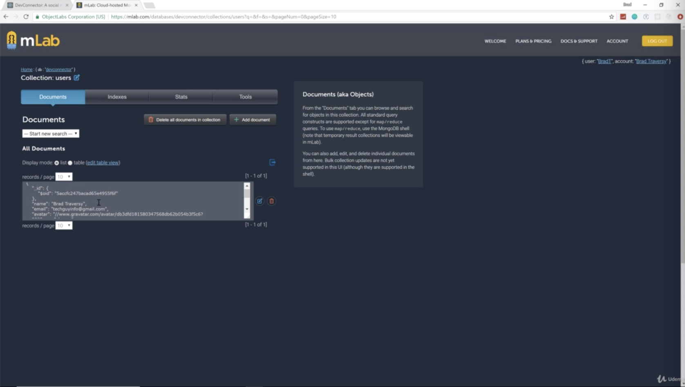
- in mLab, we successfully register to user from react the frontend
