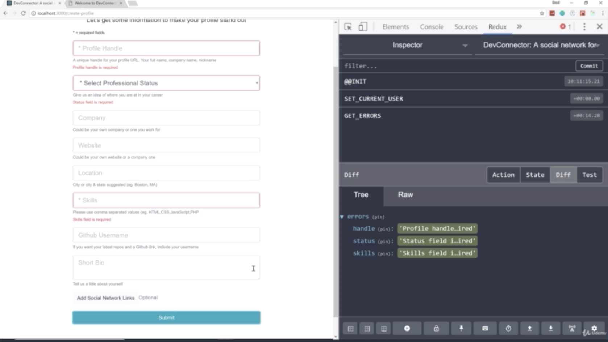
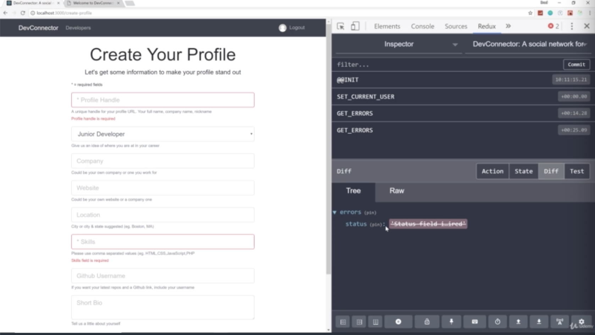
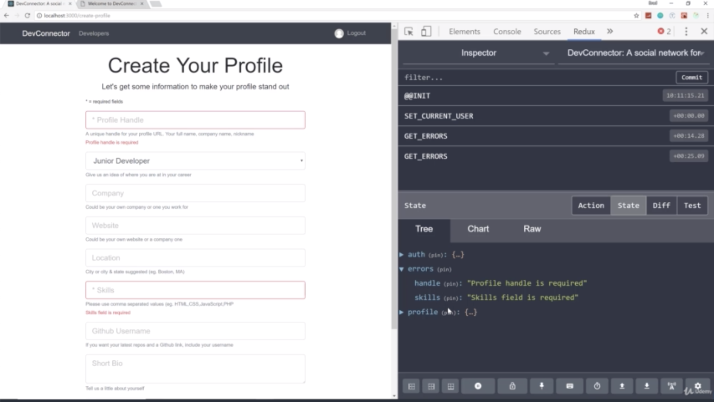
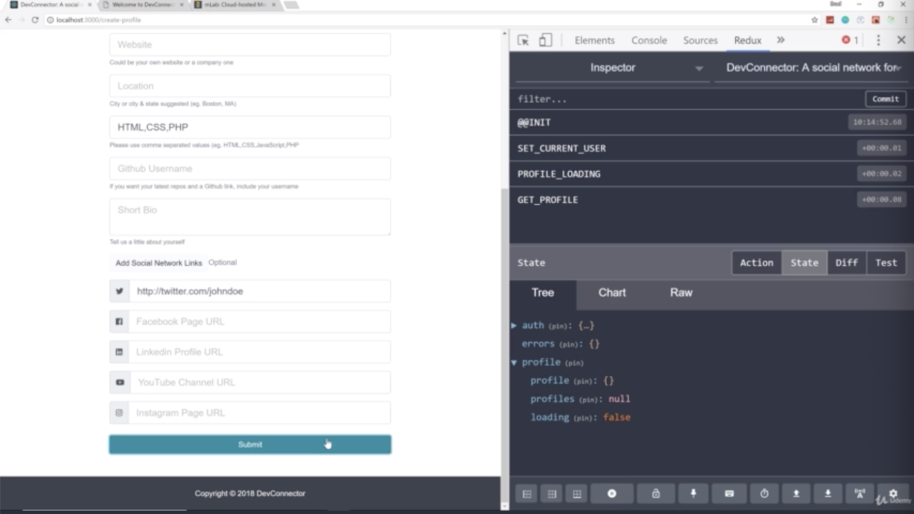
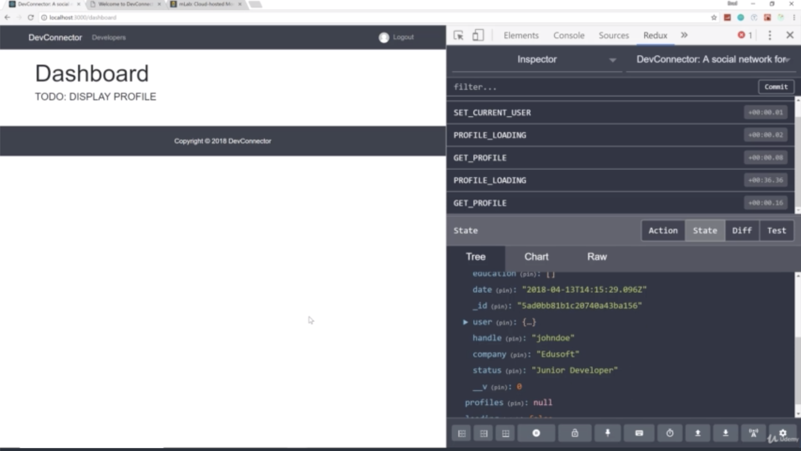

- chapter 53
1. update
- profileActions.js(actions folder)
- CreateProfile.js(components/create-profile folder)

2.

- what's happening is it's hitting our backend and it's hitting the validation file we created in the backend 
and it's giving us those errors backend and then we are displaying them through our inputs

- if i were to select something, and resubmit and then that error goes away

- you can see the only difference between the last request is that now status in no longer there
- but we still have those 2 other errors

- if we click submit, then we have that profile filled exactly what we want
