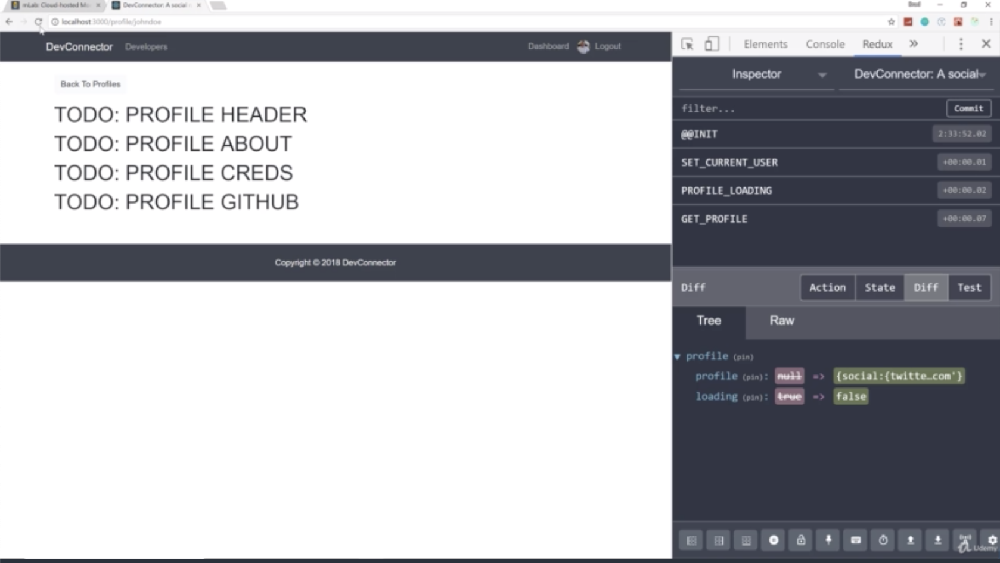
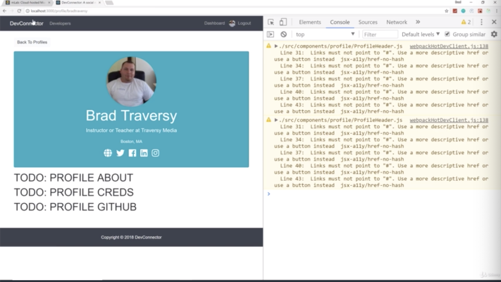
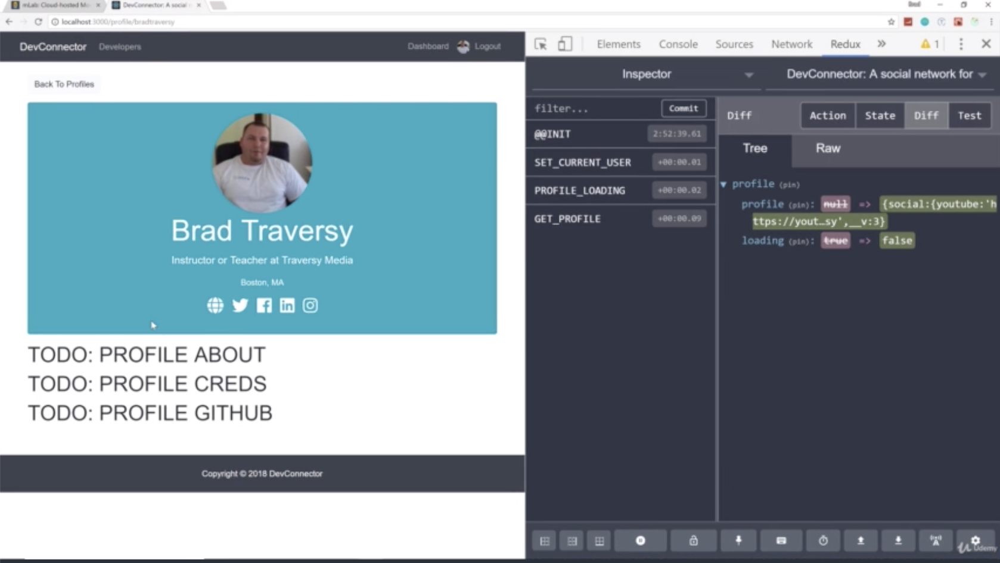
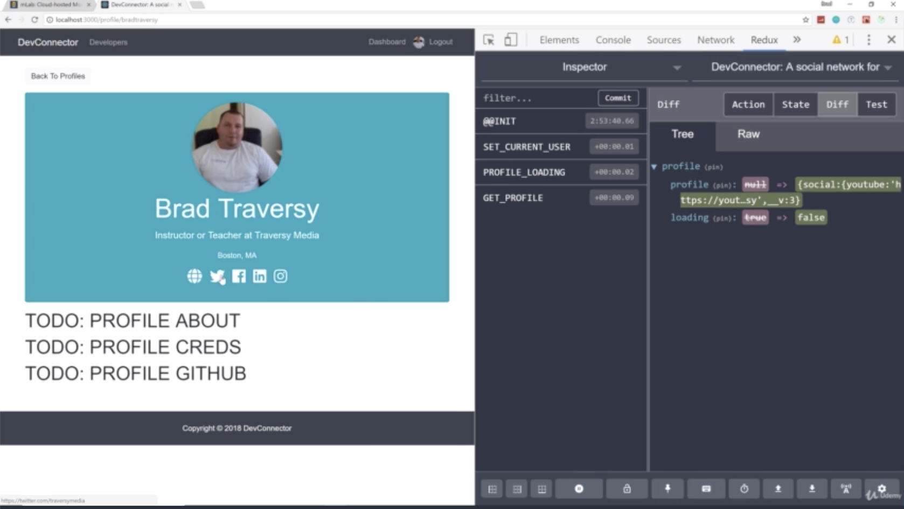
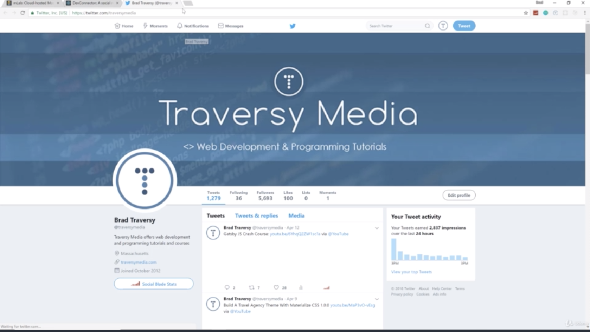
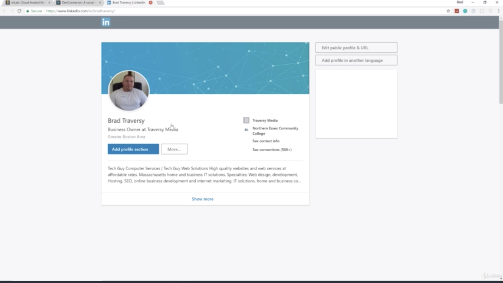

- chapter 64
1. update
- Profile.js(components/profile folder)
- ProfileHeader.js(components/profile folder)

2.

- if you go click website, then you can direct to website like picture 3

- twitter

- and you also can see linkedin, youtube, instagram all the stuff
