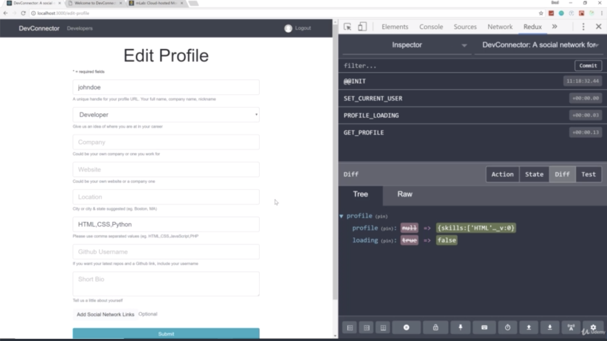
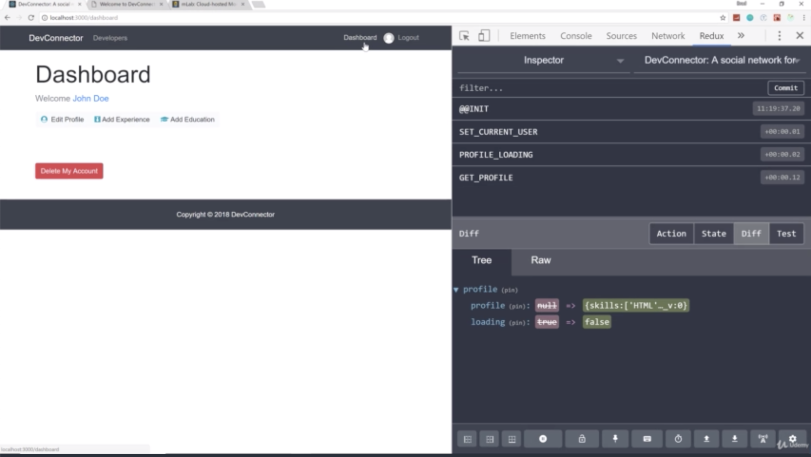
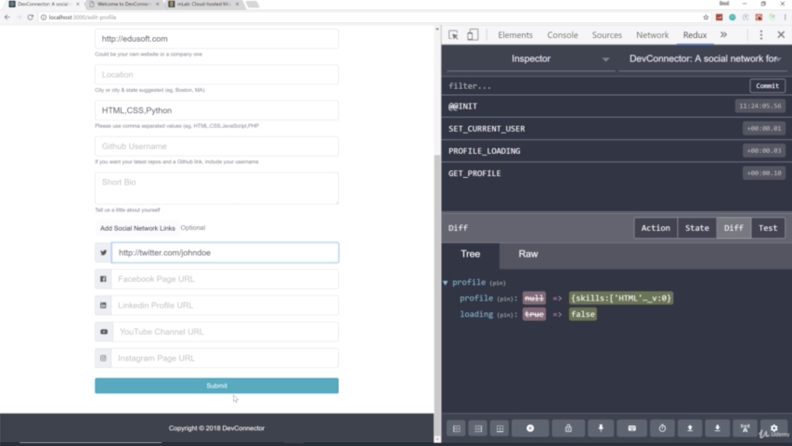
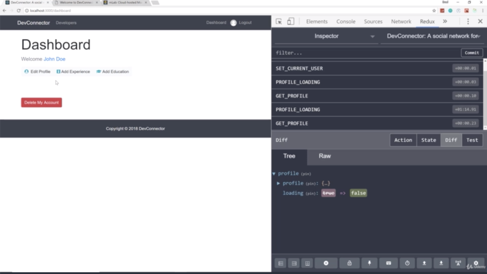
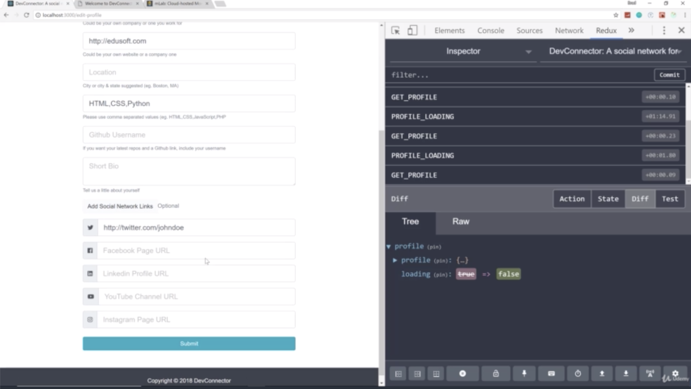

- chapter 55
1. update
- EditProfile.js(components/edit-profile folder)
- App.js
- Navbar.js(components/layout folder)

2.

- if you look at the everything that we have filled in for john doe is now there which is just basically just the required fields that's always filled in

- we now can see the dashboard link
- and if we go to edit profile, we can now go back to the dashboard and you see the spinner. that's because it's fetching the current profile

- after submitting, then if we go back to edit profile, you can see that those fields updated
