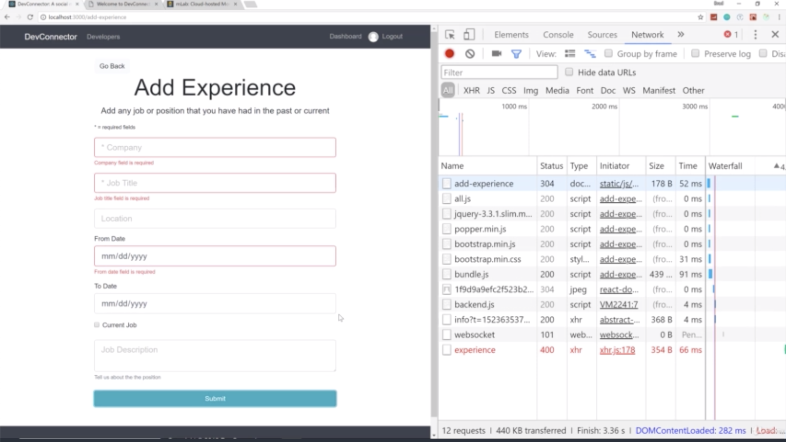
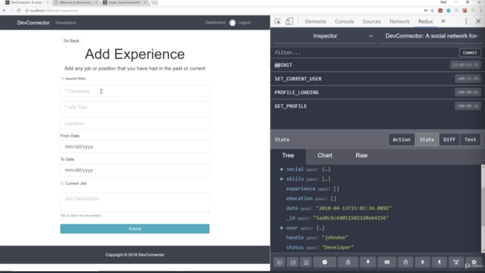
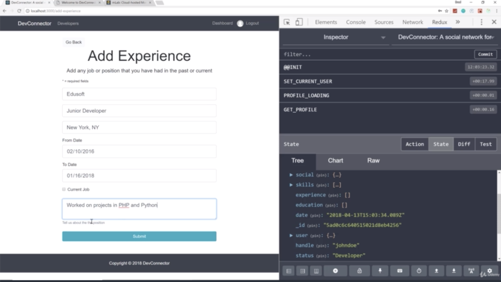
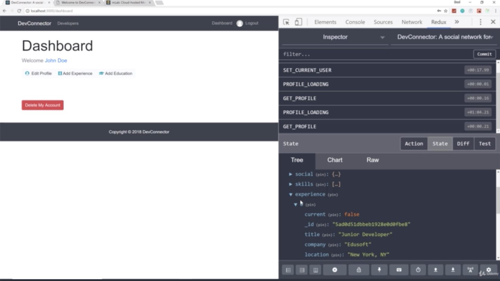

- chapter 57
1. update
- AddExperience.js(components/add-credentials folder)
- profileActions.js(actions folder)

2.

- you can see all the stuff is added

- and if you go mLab to double-check, then you can see all stuff is there

