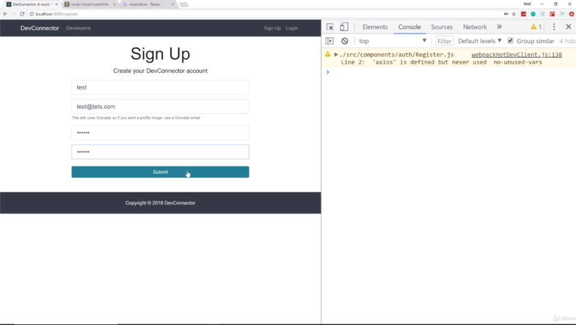
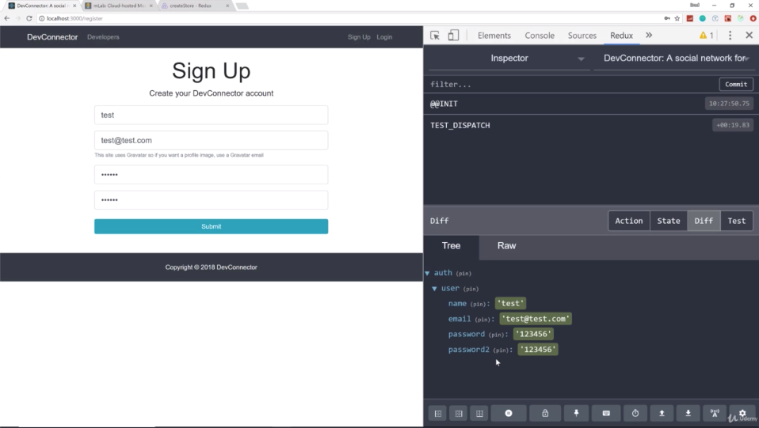
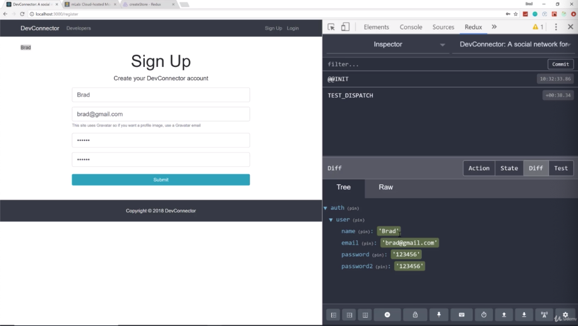

- chapter 41
1. update
- authActions.js(actions folder)
- types.js(actions folder)
- authReducer.js(reducers folder)
- Register.js(auth folder)

2.

- after submit, we can see user is filled
- look at the "Diff", when i submit, under "Diff", it has the difference in the state which is the newUser being added
- he is not being registered because we are not doing anything to do with axios yet. this is for showing you how this workflow works 
and you can see it called 'TEST_DISPATCH' because that is what we called
- now you are not always gonna wanna dispatch something to the reducer 
when we make our actual axios call on success. 
all i wanna do is once the user registered on the backend, then they just wanna redirect to the login page 
but if there's an errors, in the catch of axios request. that's what i wanna dispatch something called getErrors which is not gonna part of authReducer but the errorReducer which is seperate

- as soon as i submit, it's gonna call register user in the action, it's gonna dispatch to our reducer 
and then it's gonna fill the user objejct 
and then remember we mapped that auth state to a property in this component and we are gonna test for the user if there is a user, it should output the name
