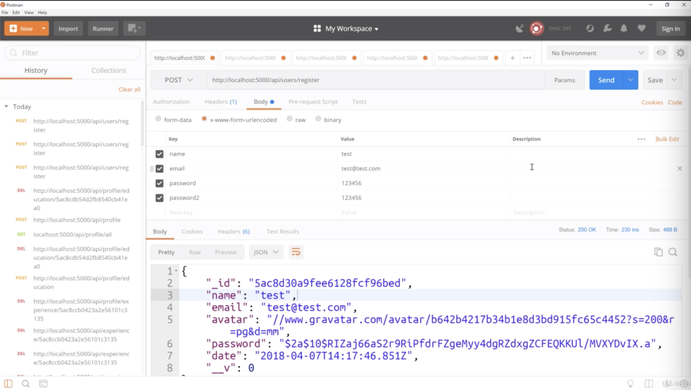

- chapter 23
1. update
- profile.js(routes/api folder)

2.

- grab id of profile/experience and copy and paste that in picture 3

- as you can see, now the test is gone
 ------------------------------------------------------------------

- as the /profile/experience, we do copy id of profile/education and paste that like picture 4

- now the test is gone
 ------------------------------------------------------------------

- we register new email 'test'
- and now we wanna add a profile for this user so we gonna have to log in to get the token

- we get the token and we wanna go to API profile

- fill out authorization and Body then we get result

- in mongoDB, we have Brad, johndoe, test user
- so we want to delete the test user which should delete the user and the profile. 
we can see we have his profile 

- so we want what we want to do is make sure we are logged in as the test user
- and we gonna make DELETE request to that API profile and that should delete both
- so we get "'success': true"

- The profile of test is now gone and users now only get 2 users
- this is now deleting this entire account the profile and the user
