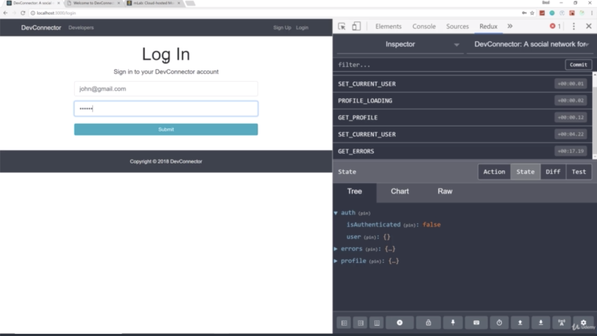

- chapter 54
1. update
- Dashboard.js(components/dashboard folder)
- ProfileActions.js(components/dashboard folder)
- profileActions.js(actions folder)

2.

- login and we see 'welcome john doe' and we can see '/dashboard'

- now we have  buttons. these route of buttons and these components don't exist yet but we at least we have that part of our dashboard done

- let's reload and let's click delete Account. then bring us back to login
- and then the auth is now false and the user is not empty

- if i try to login with john@gmail.com, user not found
- go to mLab, there's no profile and Brad is the only user

- recreate the user named johndoe
- and login and the profile won't be there. so when we login, you will see we have to recreate the profile

