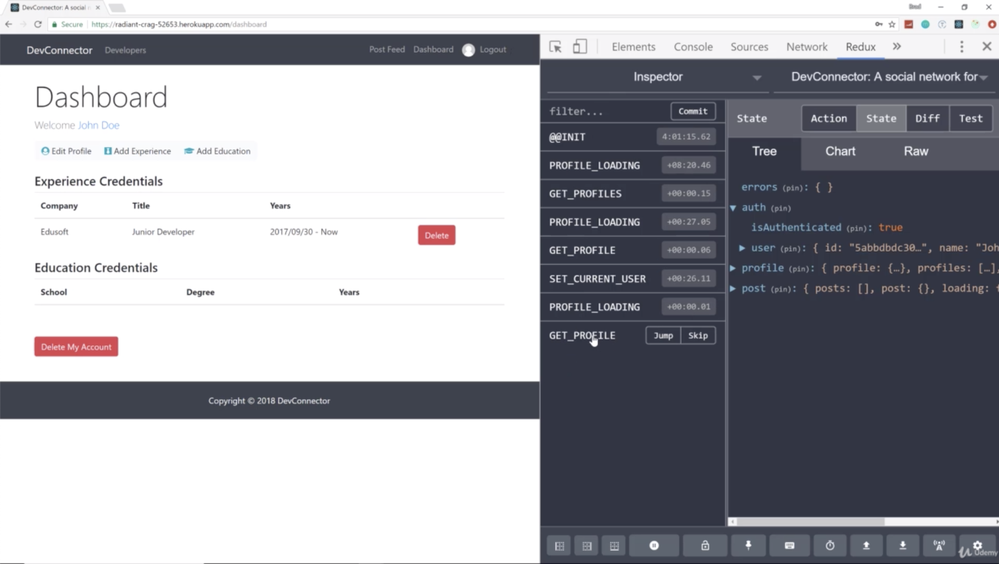

- the component is basically a piece of your UI can be whatever 
for instance, our registration form actually had its own state and had component-level state. that state is only available within that component. 
remember each input had its own state value, errors in the state. you can't access that from anywhere else 
that's where redux comes in is when you need application level state.  
you need to share data between components. and that's basically the purpose of redux
- instead of passing things from component to component which gets very very tedious and confusing and in a large application it's just not the right way to do things  
with redux, you get a single source of truth that you can dispatch to all of your components. so you can send your thing to any component you want
 ---------------------------------------------------------------------------------------
- UI = react application
- for instance, in register, we had onSubmit and did axios request from there. but we don't wanna do that. 
we wanna put that into action. so from our component, we will be able to map redux actions using properties like "this.props.registerUser" something like that which will be stored in an action creator file which will just be a list of functions 
- once the functions is called, that will make the fetch request or axios request. then we get the data from our backend and it depends what we wanna do with that data 
if we wanna send that along to the reducer, then we will do that. so we get the user back, we send it to the reducer and then we can implement that into our state
- state is stored in your store in redux. in redux, you have 1 store and that's it
- reducer can reduce our state to whatever we like. you can't really change your state or mutate it. you basically copy of it and you can add what you want it 
and then it gets sent back down
 ---------------------------------------------------------------------------------------

- we have 4 pieces to have reducer for each of these
- this is basically gonna be our state for this application

- "isAuthenticated : false" means we are not logged in 
- "users" is blank because we are not logged in

- "profile" and "profiles" is null because we don't need for this page 
- "loading" is just meaning like if we are making an AJAX request, this will turn to true. 
once we get the response, this will turn to false. the way we can have like a little spinner if it's actually fetching data

- "posts" is empty because we are not showing any posts here we don't need it
- "post" object
- "loading" 

- if i go to developers, this is a list of profiles. so look at the profile state
- profiles is plural, the array has 2 guy's in it with all data
- this component needed this piece of state. so redux sent it to it

- if we wanna see a single profile, notice how this is no array
- so if i click on view profile, you can see how the loading turned to true for a second. that's when it was fetching the data. and now it's back to false

- we now have the sigle profile data inside here

- when we login, the gmail will work, and we log in and notice below of the "filter"
- those are all the actions that are being called
- the profile is filled with the logged in user because we are on the dashboard. that's what i requested for this component

- "isAuthenticated" is true and "user" holds the logged in user

- the experience is come from the "profile" state

- "Diff" show us the difference in state between requests or like if i go to posts, now you see that it shows the difference in the state before i went to post

- "State" shows the entire things
- and you can see "GET_POST" that was just called
- these below "filter" just example of action types which basically just constants
