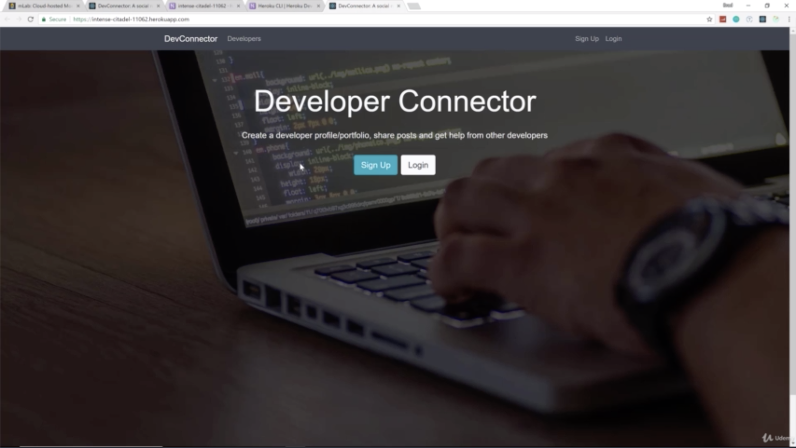

- chapter 77
1. update
- build folder in client(deleted)
- package-lock.json
- server.js
- package.json(on backend)

2.

- it compiles out our front-end react application into folder called 'build' and looking build folder, what it's doing is it's creating static assets where we could just take our front-end application and deploy it very easily
- but this is not frontend application but full stack application and we have a complete node server that we have to deal with
- inside index.html in build folder, this is the basically the entry file for our front-end application
- we have been doing is we have our express server running 5000 on localhost, create-react-app server running 3000. now on the server, we are not gonna have that frontend create-react-app server. 
so we need to use the index.html in build folder. so we have to point to this from our server.js

- if you look in the client folder, in .gitignore in the build folder, build folder is included 
it is not really meant for you to do that. so what we gonna do is build out our assets on our server on Heroku
so that we can push and then we will have a script that will automatically run and build out these files. so i can delete build folder

- and go to package.json on our server not in client, we are gonna create a script to do this. 
- "heroku-postbuild" is gonna build after we push and
- "NPM_CONFIG_PRODUCTION=false"why we need this is because if we don't do this, then it's not gonna run our dev dependencies and our dev dependencies include webpack and all that and we are talking about our react application and that stuff needs to run
- it's just for this command, it's not gonna stay not in production it's once this is done
- "npm install --prefix client" is needed because we wanna run it inside the client folder
- "&& npm run build --prefix client" this gonna run in the server folder or in the root folder
- that is our post build script

- we don't have our dev server our react web server on our heroku server. so we need to point to the build folder which we deleted and we need to point to the install the index.html and in our server.js that's what we are doing right here
- we are not gonna run npm run build before every single heroku push because we want it to build on the server and that with this command 'heroku-postbuild' why we set to false is because to run our dev dependencies in the client in order to build everything out

- everything now is loaded on our local repository.

- once we have it committed, we wanna push heroku. make sure you ran that git remote command that we did in the last video because that's gonna connect to that repository to that remote application
- not onlt is gonna push to heroku but also gonna run that build script

- after that, we can go to our URL or 'heroku open' on your terminal

- we are getting our data that meaning that our database is connected. it's looking at our environment variables and getting the mongoDB URI

- if you wanna create domain for this, you can go to your heroku and go setting and go to 'Add Domain'
- buy you will notice that 'please verify your account in order to add a domain you have to add credit card', you are not gonna be charged but you do have to add the card 
and then what happens then is it will just give you some DNS values to go put in your wherever you registered the domain and then it will connect it and then you will have your domain and your application

- if you look at our activity, you can see what we have done here our deployment stuff like that, you can connect to github

- if you wanna make this a production app where you want people to actually use it you would probably want to choose more than just a free account just to get more speed or more space or whatever.
- with free account, if no one is actually viewing the application the server kind of winds down and then when you visit the app again, it has to spin back up and it takes a couple of seconds so it can seem a little slow to start off stuff like that

 
