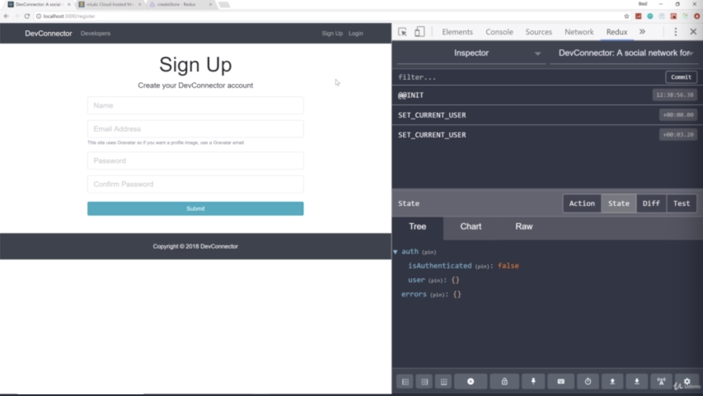
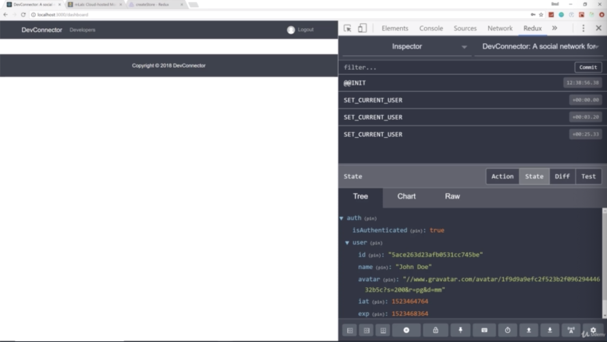
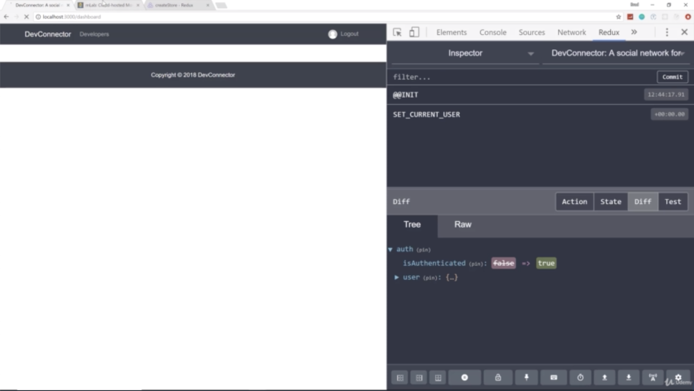

- chapter 45
1. update
- authActions.js(actions folder)
- Navbar.js(components/layout folder)
- App.js (client colder)
- Login.js(components/auth folder)
- Register.js(components/auth folder)
- Landing.js(components/layout folder)

2.

- we have our logout here because we are actually still logged in

- if i click logout, you can see 'SET_CURRENT_USER' and remember it passed in that empty object which is then turned 'isAuthenticated' to false and get rid of all the user data

- this is the diff. if we look at the state, we go back to the default state

- if we try to log in, as soon as we login, the navbar changes to a logo.
- it set the current user and the user is now in the auth state

- if i go to '/login' being logging in, then go automatically '/dashboard'

- if we are logged in, we don't need to go to landing page
- so if i click DevConnector banner being login, then it push to '/dashboard'
