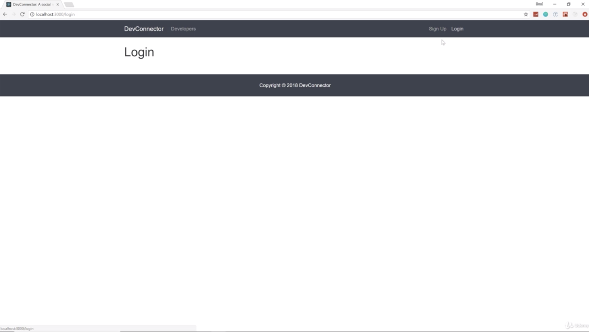

- chapter 32
1. update
- App.js
- Login.js(components/auth folder)
- Register.js(components/auth folder)
- Navbar.js (components/layout folder)
- Landing.js(components/layout folder)

2.

- don't install react-router on your server side which is devconnector. So we want cd into the client
- it used to be just react-router but now with NPM version 4 so react-router-dom
- and check to make sure your react-router-dom is installed at package.json
- and go to devconnector folder and npm run dev like picture 3

- if i go to /test, then it's gonna show nothing. that's the default

- if i go to /login, there it is

- if i go to /register, there it is

- if i click "Sign up", then see Register

- if i click "Login", then see Login

- if i click "Developers", then see nothing because we don't have this route set up yet

- The logo "DevConnector" will take us to the landing page the homepage
- also Signup, Login button on the homepage, it should work as i clik Sign Up and Login button on the right side of the top
