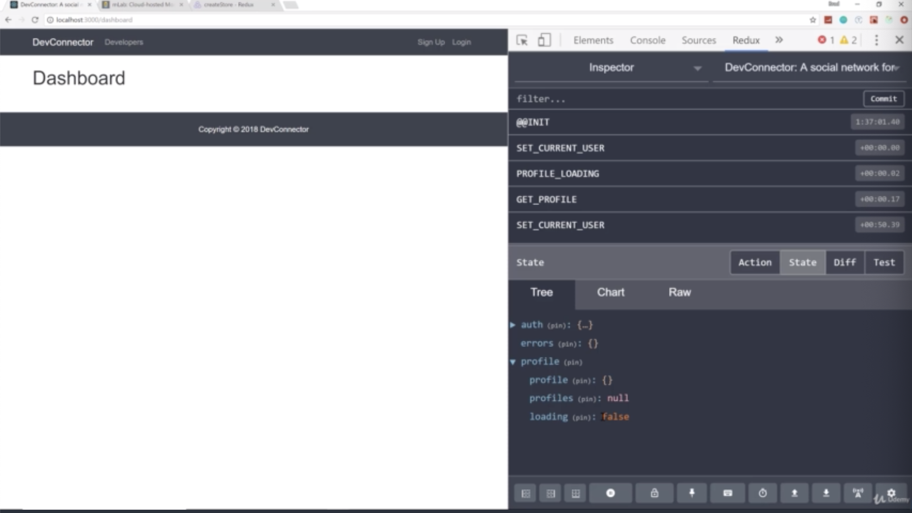

- chapter 46
1. update
- profileReducer.js(reducers folder)
- index.js(reducers folder)
- profileActions.js(actions folder)
- dashboard.js(components/dashboard folder)
- App.js
- Register.js(components/auth folder)
- Login.js(components/auth folder)
- Navbar.js(components/layout folder)

2.

- if we look at the our state, you can see all the initial stuff

- if we log in, so profile is an empty object which is exactly what it should be. because our user that we are logged in as,
has not created a profile yet, but go to "state", notice it's not null. it's empty

- and when we logout, the 'profile' should be go back to null. so what we will do is creating action

- if we login, look at the 'profile' which is the empty object we want

- when we log out, 'profile' should be null. it rans CLEAR_CURRENT_PROFILE and it also SET_CURRENT_USER to nothing
