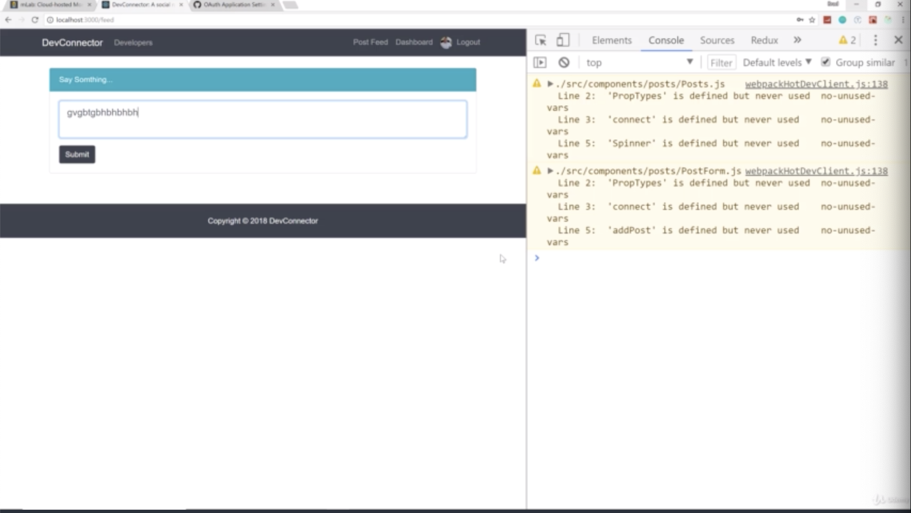

- chapter 68
1. update
- Posts.js(components/posts folder)
- PostForm.js(components/posts folder)
- App.js
- Navbar.js(components/layout folder)
- postReducer.js(components/reducers folder)

2.

- once we submit, posts which is empty now will go to the backend and get added to the database and then it will fire off that addpost action.type and then this should get filled with the new post 
and then later on, we can immediately display it down

- when submit, looking at the posts in redux of chrome, now we have object, it has an idea, it has a text of "what is your favorite JS Framework?" and have other things

- when you check database, it's actually just check the database, we should have post collection and post
