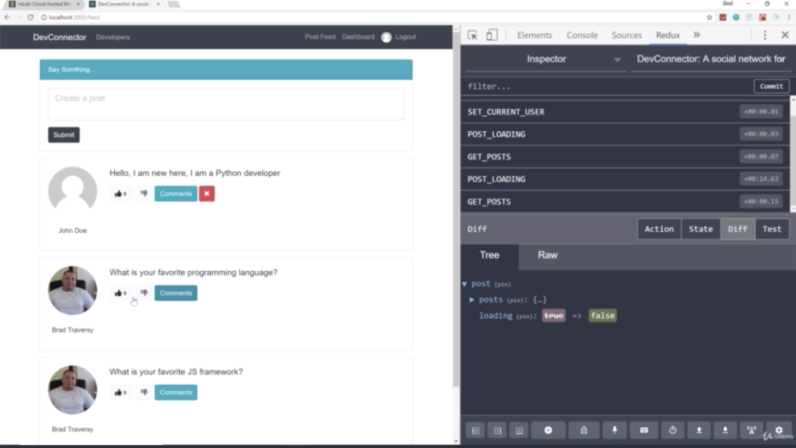

- chapter 71
1. update
- postActions.js(actions folder)
- postReducer.js(components/reducers folder)
- PostItem.js(components/posts folder)

2.

- if i reload, it's still gone

- if click like, then change to be green, if not, there's no change
