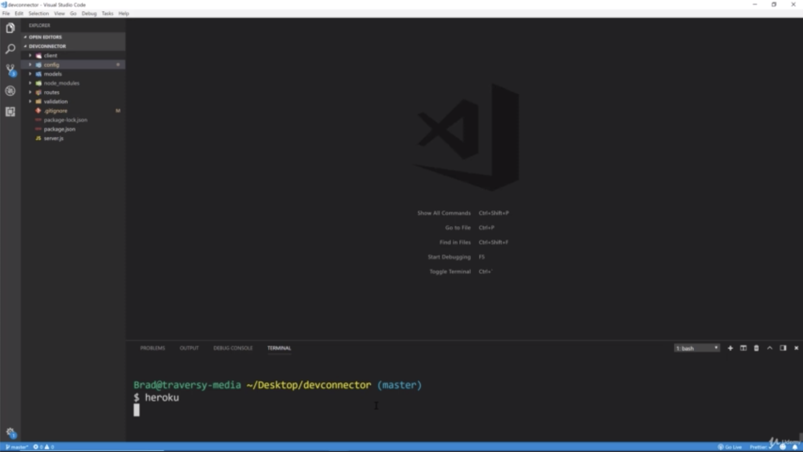
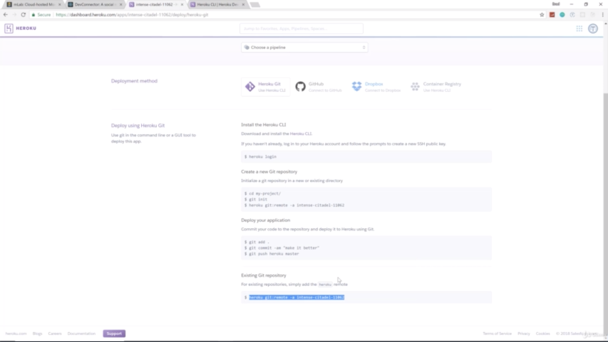

- we need to actually log in to Heroku through our terminal. it's gonna be same log in that you use to sign up with
- what we have done is we have created an app in Heroku and you can see that it gives us this weired looking like 'https://intense-citadel-11062.herokuapp.com/'
  yours is gonna be different than this

- this is our new application on top.

- this shows us our latest activity.

- Config Vars is where we need to put our environment variables by keys_prod.js file in config folder
- we need 'MONGO_URI' part. paste and put that as a key
- and i'm gonna use the same database we have been using. so i'm gonna grab this mongoDB URI
- next i'm gonna copy 'SECRET_OR_KEY' which is the 'secretOrKey: 'secret'' in keys_dev.js file in config folder
- if you don't add these, it's not gonna work once you push to Heroku because it's not gonna be able to find these keys

- the next thing is get the remote command. in deploy tab, you can see '$ heroku git:remote -a vast-springs-24754'. this is gonna add the this remote repository or this application as your source for when you push
- copy that and into your terminal and run it. 

